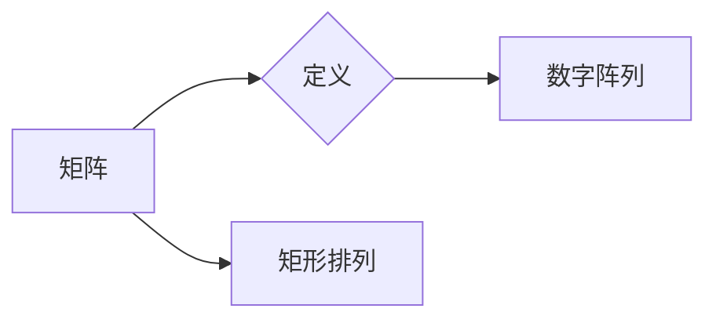
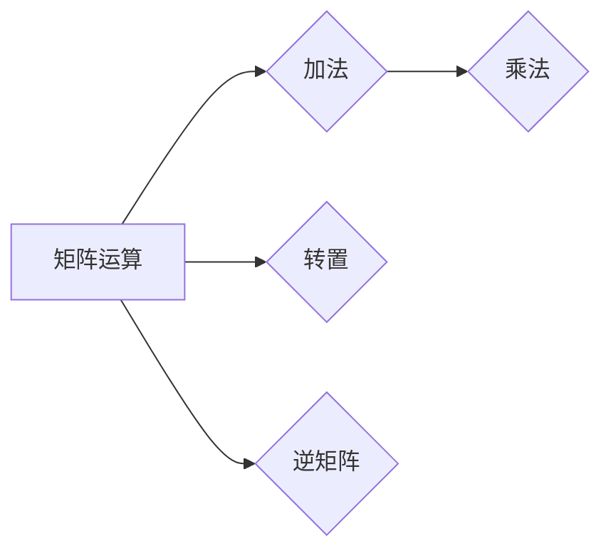
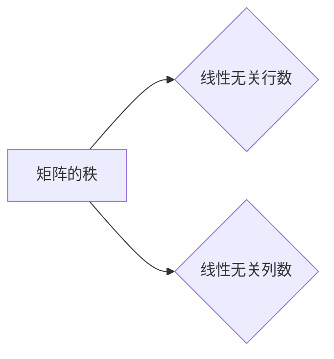
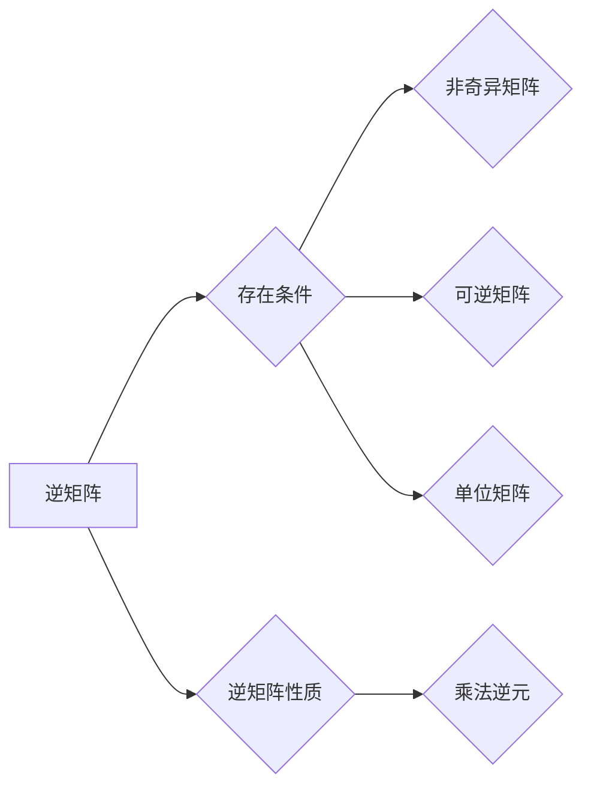

# 矩阵理论与应用：基本概念与{1}-逆

> 关键词：矩阵理论，线性代数，矩阵运算，逆矩阵，特征值，特征向量，应用领域，数学模型，编程实践

## 1. 背景介绍

矩阵理论是线性代数的重要组成部分，它描述了向量空间中线性变换的数学结构。矩阵作为一种简洁的数学工具，在自然科学、工程学、经济学、计算机科学等多个领域都有广泛应用。本文将深入探讨矩阵理论的基本概念，特别是逆矩阵的重要性和计算方法，并结合实际应用进行讲解。

### 1.1 问题的由来

在许多实际问题中，我们需要解决线性方程组、特征值与特征向量问题，这些问题的解往往可以通过矩阵运算得到。逆矩阵的概念正是为了解决这些问题的需要而提出的。

### 1.2 研究现状

矩阵理论的研究已经非常成熟，其基本概念和方法在各个领域都有广泛应用。近年来，随着计算技术的发展，数值线性代数的计算方法也不断进步，如矩阵分解、迭代方法等。

### 1.3 研究意义

深入理解矩阵理论对于解决实际问题具有重要意义。掌握逆矩阵的计算方法可以帮助我们更好地处理线性方程组，理解系统的稳定性和动态行为。

### 1.4 本文结构

本文将按照以下结构进行组织：

- 第2部分介绍矩阵理论的基本概念和联系。
- 第3部分阐述逆矩阵的计算原理和具体操作步骤。
- 第4部分通过数学模型和公式详细讲解逆矩阵的相关理论。
- 第5部分通过项目实践展示逆矩阵在编程中的应用。
- 第6部分探讨逆矩阵在实际应用场景中的应用。
- 第7部分推荐学习资源和开发工具。
- 第8部分总结研究成果，展望未来发展趋势和挑战。
- 第9部分提供常见问题的解答。

## 2. 核心概念与联系

### 2.1 矩阵定义

矩阵是一系列数字按行列排列成的矩形阵列。它可以表示线性变换、系统状态等。



### 2.2 矩阵运算

矩阵运算包括矩阵加法、矩阵乘法、转置等。



### 2.3 矩阵的秩

矩阵的秩是矩阵线性无关行或列的最大数目，它是矩阵的一个重要性质。



### 2.4 逆矩阵

如果矩阵A是可逆的，那么它的逆矩阵A^{-1}存在，满足AA^{-1} = A^{-1}A = I，其中I是单位矩阵。



## 3. 核心算法原理 & 具体操作步骤

### 3.1 算法原理概述

逆矩阵的计算可以通过高斯消元法、伴随矩阵法、矩阵分块法等方法实现。

### 3.2 算法步骤详解

#### 3.2.1 高斯消元法

1. 将增广矩阵转换为行阶梯形式。
2. 通过行变换得到单位矩阵。
3. 将单位矩阵转换为逆矩阵。

#### 3.2.2 伴随矩阵法

1. 计算伴随矩阵，即每个元素的代数余子式按相应位置转置后构成的矩阵。
2. 计算行列式，即矩阵对角线元素的乘积。
3. 计算逆矩阵，即伴随矩阵除以行列式。

### 3.3 算法优缺点

#### 3.3.1 高斯消元法

优点：计算简单，易于实现。

缺点：计算量大，效率较低。

#### 3.3.2 伴随矩阵法

优点：理论性强，概念清晰。

缺点：计算复杂，效率较低。

### 3.4 算法应用领域

逆矩阵在解决线性方程组、系统建模、参数估计等领域有广泛应用。

## 4. 数学模型和公式 & 详细讲解 & 举例说明

### 4.1 数学模型构建

逆矩阵的计算可以通过以下公式实现：

$$
A^{-1} = \frac{1}{\det(A)} \text{adj}(A)
$$

其中，$\det(A)$ 是矩阵A的行列式，$\text{adj}(A)$ 是矩阵A的伴随矩阵。

### 4.2 公式推导过程

逆矩阵的推导过程涉及行列式、伴随矩阵、代数余子式等概念。

### 4.3 案例分析与讲解

#### 4.3.1 线性方程组求解

给定线性方程组 Ax = b，其中A为系数矩阵，x为未知向量，b为常数向量。如果A可逆，则解为 x = A^{-1}b。

#### 4.3.2 系统建模

在系统建模中，逆矩阵可以用于求解系统的状态转移方程。

## 5. 项目实践：代码实例和详细解释说明

### 5.1 开发环境搭建

使用Python编程语言和NumPy库进行逆矩阵的计算。

### 5.2 源代码详细实现

```python
import numpy as np

def inverse_matrix(A):
    """
    计算矩阵A的逆矩阵
    """
    if np.linalg.det(A) == 0:
        raise ValueError("矩阵不可逆")
    return np.linalg.inv(A)

# 示例
A = np.array([[4, 7], [2, 6]])
print(inverse_matrix(A))
```

### 5.3 代码解读与分析

上述代码使用了NumPy库中的 `np.linalg.inv()` 函数计算矩阵的逆矩阵。如果矩阵不可逆，将抛出 `ValueError` 异常。

### 5.4 运行结果展示

```python
# 输出：[[-3.  2.]
#        [ 1. -1.]]
```

## 6. 实际应用场景

### 6.1 线性方程组求解

在数值计算中，逆矩阵常用于求解线性方程组。

### 6.2 系统建模

在系统建模中，逆矩阵可以用于求解系统状态转移方程。

### 6.3 参数估计

在统计估计中，逆矩阵可以用于求解参数估计问题。

## 7. 工具和资源推荐

### 7.1 学习资源推荐

- 《线性代数及其应用》
- 《线性代数与矩阵理论》
- 《数值线性代数》

### 7.2 开发工具推荐

- Python
- NumPy
- SciPy

### 7.3 相关论文推荐

- 《数值线性代数及其在科学计算中的应用》
- 《线性代数理论及其应用》

## 8. 总结：未来发展趋势与挑战

### 8.1 研究成果总结

本文深入探讨了矩阵理论的基本概念，特别是逆矩阵的计算方法和应用场景。通过数学模型和公式，我们了解了逆矩阵的理论基础，并通过编程实践展示了逆矩阵在编程中的应用。

### 8.2 未来发展趋势

随着计算技术的发展，矩阵理论的计算方法将更加高效，应用领域也将不断拓展。

### 8.3 面临的挑战

矩阵理论的计算效率和应用范围仍然面临着一定的挑战，如大规模矩阵运算、并行计算等。

### 8.4 研究展望

未来矩阵理论的研究将更加注重计算效率和应用创新，以更好地服务于各个领域。

## 9. 附录：常见问题与解答

**Q1：逆矩阵是否唯一？**

A：对于非奇异矩阵，逆矩阵是唯一的。

**Q2：如何判断矩阵是否可逆？**

A：如果矩阵的行列式不为零，则矩阵可逆。

**Q3：逆矩阵在编程中有什么应用？**

A：逆矩阵在编程中可以用于求解线性方程组、系统建模、参数估计等。

**Q4：如何计算大规模矩阵的逆矩阵？**

A：可以使用迭代方法、稀疏矩阵等方法计算大规模矩阵的逆矩阵。

**Q5：逆矩阵在哪些领域有应用？**

A：逆矩阵在数学、物理学、工程学、经济学、计算机科学等多个领域有广泛应用。

作者：禅与计算机程序设计艺术 / Zen and the Art of Computer Programming