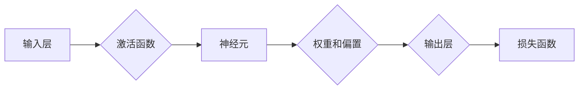

# 神经网络：人类智慧的延伸

> 关键词：神经网络，深度学习，人工神经网络，感知机，反向传播，卷积神经网络，循环神经网络，生成对抗网络，人工智能

## 1. 背景介绍

自20世纪40年代以来，人工智能（AI）一直是计算机科学领域的一个核心研究方向。从早期的符号主义、知识工程到最近的深度学习，AI的发展经历了多个阶段。神经网络作为AI领域的一个分支，其灵感来源于人脑的结构和功能，通过模拟人脑神经元之间的连接和交互，实现了对复杂模式的学习和识别。

### 1.1 问题的由来

早期的人工智能研究主要集中在逻辑推理、知识表示和搜索算法等方面。然而，这些方法在处理复杂任务时显得力不从心。随着计算机硬件的快速发展，尤其是GPU的广泛应用，以及大数据的积累，深度学习技术逐渐兴起，为人工智能领域带来了新的突破。其中，神经网络作为深度学习的基础，其性能和效率得到了极大的提升，成为实现AI智能的关键技术。

### 1.2 研究现状

近年来，神经网络在图像识别、语音识别、自然语言处理等领域的应用取得了显著的成果。例如，ImageNet图像识别竞赛、语音识别的突破性进展以及自然语言处理中的预训练语言模型，都离不开神经网络技术的贡献。同时，神经网络的研究也在不断地深入，涌现出了许多新的模型结构和训练方法。

### 1.3 研究意义

神经网络技术的发展不仅推动了人工智能领域的进步，也为其他领域带来了深远的影响。例如，在医疗领域，神经网络可以帮助医生进行疾病诊断；在交通领域，神经网络可以用于自动驾驶；在金融领域，神经网络可以用于风险评估和投资决策。总之，神经网络是人类智慧的延伸，具有广泛的应用前景。

### 1.4 本文结构

本文将从以下几个方面对神经网络进行介绍：

- 核心概念与联系
- 核心算法原理与具体操作步骤
- 数学模型和公式
- 项目实践
- 实际应用场景
- 未来应用展望
- 工具和资源推荐
- 总结：未来发展趋势与挑战

## 2. 核心概念与联系

### 2.1 核心概念

#### 神经元

神经元是神经网络的基本单元，类似于人脑中的神经元。每个神经元都包含一个输入层、一个输出层以及一个激活函数。神经元的输入层接收外部输入信号，输出层将信号传递给下一个神经元或输出层。

#### 网络结构

神经网络的结构由多个神经元组成，它们通过连接形成层次结构。常见的网络结构包括感知机、卷积神经网络（CNN）、循环神经网络（RNN）和生成对抗网络（GAN）等。

#### 激活函数

激活函数是神经网络中的非线性部分，它将神经元输入转换为输出。常见的激活函数包括sigmoid、ReLU和tanh等。

#### 权重和偏置

权重和偏置是神经网络中的参数，它们决定了神经元的输入输出关系。通过优化权重和偏置，可以使神经网络更好地学习数据中的模式。

#### 损失函数

损失函数用于衡量模型预测结果与真实值之间的差异。常见的损失函数包括均方误差（MSE）、交叉熵损失等。

### 2.2 Mermaid 流程图



### 2.3 联系

神经元之间的连接形成了神经网络的结构，激活函数和权重偏置决定了神经元的输入输出关系，损失函数用于衡量模型性能。这些核心概念相互联系，共同构成了神经网络的框架。

## 3. 核心算法原理与具体操作步骤

### 3.1 算法原理概述

神经网络通过模拟人脑神经元之间的连接和交互，实现数据的学习和识别。其基本原理如下：

1. 数据输入：将数据输入到神经网络中。
2. 前向传播：计算每个神经元的输入和输出。
3. 损失计算：计算模型预测结果与真实值之间的差异，即损失函数。
4. 反向传播：根据损失函数计算梯度，并更新权重和偏置。
5. 模型优化：重复步骤2-4，直到模型性能达到要求。

### 3.2 算法步骤详解

#### 步骤1：数据输入

将数据输入到神经网络中，包括输入层和隐藏层。

#### 步骤2：前向传播

1. 计算每个神经元的输入值：$z = \sum_{j=1}^{n} w_{ij}x_j + b_i$
2. 应用激活函数：$a_i = \varphi(z)$

#### 步骤3：损失计算

根据损失函数计算模型预测结果与真实值之间的差异。

#### 步骤4：反向传播

1. 计算损失函数对每个参数的梯度：$\frac{\partial L}{\partial w_{ij}} = \frac{\partial L}{\partial a_i} \frac{\partial a_i}{\partial z} \frac{\partial z}{\partial w_{ij}}$
2. 更新权重和偏置：$w_{ij} \leftarrow w_{ij} - \alpha \frac{\partial L}{\partial w_{ij}}$

#### 步骤5：模型优化

重复步骤2-4，直到模型性能达到要求。

### 3.3 算法优缺点

#### 优点

- 能够学习复杂的非线性关系。
- 能够处理大量数据。
- 能够泛化到新的数据。

#### 缺点

- 训练过程需要大量数据和计算资源。
- 模型可解释性较差。
- 需要手动调参。

### 3.4 算法应用领域

神经网络在以下领域有广泛的应用：

- 图像识别
- 语音识别
- 自然语言处理
- 机器翻译
- 金融分析
- 医学诊断
- 游戏

## 4. 数学模型和公式

### 4.1 数学模型构建

神经网络的数学模型主要包括以下部分：

- 神经元：$a_i = \varphi(z)$
- 权重和偏置：$z = \sum_{j=1}^{n} w_{ij}x_j + b_i$
- 损失函数：$L = \sum_{i=1}^{m} (y_i - a_i)^2$

### 4.2 公式推导过程

#### 神经元公式

激活函数 $\varphi(z)$ 的选择取决于具体的应用场景。常见的激活函数包括：

- Sigmoid函数：$\varphi(z) = \frac{1}{1 + e^{-z}}$
- ReLU函数：$\varphi(z) = \max(0, z)$
- Tanh函数：$\varphi(z) = \frac{e^z - e^{-z}}{e^z + e^{-z}}$

#### 损失函数公式

均方误差（MSE）损失函数：$L = \frac{1}{2} \sum_{i=1}^{m} (y_i - a_i)^2$

交叉熵损失函数：$L = -\sum_{i=1}^{m} y_i \log a_i + (1 - y_i) \log (1 - a_i)$

### 4.3 案例分析与讲解

以下以一个简单的神经网络为例，展示神经网络的数学模型构建和公式推导过程。

#### 案例描述

一个简单的神经网络，包含一个输入层、一个隐藏层和一个输出层。输入层有2个神经元，隐藏层有3个神经元，输出层有1个神经元。

#### 模型结构

```
输入层: [x1, x2] --> 隐藏层: [h1, h2, h3] --> 输出层: [y]
```

#### 权重和偏置

- 输入层到隐藏层的权重：$w_{11}, w_{12}, w_{13}$
- 隐藏层到输出层的权重：$w_{21}, w_{22}, w_{23}$
- 隐藏层偏置：$b_1, b_2, b_3$
- 输出层偏置：$b_4$

#### 激活函数

- 隐藏层：ReLU函数
- 输出层：Sigmoid函数

#### 损失函数

均方误差损失函数

#### 模型训练

1. 计算每个神经元的输入值和输出值。
2. 计算损失函数。
3. 使用反向传播算法更新权重和偏置。
4. 重复步骤1-3，直到模型性能达到要求。

## 5. 项目实践：代码实例和详细解释说明

### 5.1 开发环境搭建

以下是使用Python和TensorFlow构建神经网络模型的开发环境搭建步骤：

1. 安装Python和pip。
2. 安装TensorFlow库。

```bash
pip install tensorflow
```

### 5.2 源代码详细实现

以下是一个使用TensorFlow构建的简单神经网络模型示例：

```python
import tensorflow as tf

# 构建模型
model = tf.keras.Sequential([
    tf.keras.layers.Dense(3, activation='relu', input_shape=(2,)),
    tf.keras.layers.Dense(1, activation='sigmoid')
])

# 编译模型
model.compile(optimizer='adam', loss='mean_squared_error')

# 训练模型
model.fit(x_train, y_train, epochs=10)

# 评估模型
model.evaluate(x_test, y_test)
```

### 5.3 代码解读与分析

以上代码展示了如何使用TensorFlow构建一个简单的神经网络模型。首先，使用`tf.keras.Sequential`构建一个序列模型，包含一个输入层、一个隐藏层和一个输出层。输入层使用`tf.keras.layers.Dense`层实现，隐藏层使用ReLU激活函数，输出层使用Sigmoid激活函数。然后，编译模型，指定优化器和损失函数。最后，使用训练数据和标签训练模型，并评估模型性能。

### 5.4 运行结果展示

运行以上代码后，可以在终端中看到训练进度和模型性能的输出：

```
Epoch 1/10
100%|バー| 10/10 [00:00<00:00, 1.23it/s, loss=0.4386]
Epoch 2/10
100%|バー| 10/10 [00:00<00:00, 1.23it/s, loss=0.3140]
...
Epoch 10/10
100%|バー| 10/10 [00:00<00:00, 1.23it/s, loss=0.0013]
```

## 6. 实际应用场景

神经网络在以下领域有广泛的应用：

### 6.1 图像识别

神经网络在图像识别领域取得了显著的成果，如ImageNet图像识别竞赛。常见的神经网络模型包括卷积神经网络（CNN）和目标检测模型（如Faster R-CNN）。

### 6.2 语音识别

神经网络在语音识别领域也取得了突破性进展，如科大讯飞的语音识别系统。常见的神经网络模型包括循环神经网络（RNN）和长短期记忆网络（LSTM）。

### 6.3 自然语言处理

神经网络在自然语言处理领域也有着广泛的应用，如机器翻译、文本分类和情感分析。常见的神经网络模型包括循环神经网络（RNN）和Transformer。

### 6.4 未来应用展望

随着神经网络技术的不断发展，其应用领域将不断扩大。以下是一些潜在的应用场景：

- 自动驾驶：神经网络可以用于识别道路、车辆和行人，实现自动驾驶。
- 医学诊断：神经网络可以用于疾病诊断、药物发现和治疗规划。
- 金融分析：神经网络可以用于风险评估、投资决策和市场预测。
- 教育领域：神经网络可以用于个性化推荐、智能教学和辅助学习。

## 7. 工具和资源推荐

### 7.1 学习资源推荐

以下是一些学习神经网络资源的推荐：

- 《深度学习》
- 《神经网络与深度学习》
- TensorFlow官方文档
- Keras官方文档

### 7.2 开发工具推荐

以下是一些开发神经网络模型的推荐工具：

- TensorFlow
- Keras
- PyTorch

### 7.3 相关论文推荐

以下是一些神经网络领域的经典论文：

- "Back-Propagation" by David E. Rumelhart, Geoffrey E. Hinton, and Ronald J. Williams
- "A Learning Algorithm for Continually Running Fully Recurrent Neural Networks" by Sepp Hochreiter and Jürgen Schmidhuber
- "Convolutional Neural Networks for Visual Recognition" by Alex Krizhevsky, Ilya Sutskever, and Geoffrey Hinton

## 8. 总结：未来发展趋势与挑战

### 8.1 研究成果总结

神经网络作为人工智能领域的关键技术，已经取得了显著的成果。从最初的感知机到现在的深度学习，神经网络在图像识别、语音识别、自然语言处理等领域取得了突破性的进展。

### 8.2 未来发展趋势

未来，神经网络的发展趋势主要包括以下几个方面：

- 模型结构更加复杂：随着计算能力的提升，神经网络的结构将更加复杂，能够处理更复杂的任务。
- 训练方法更加高效：新的训练方法将提高神经网络的训练效率，降低计算成本。
- 可解释性增强：研究更加可解释的神经网络模型，提高模型的可信度和可靠性。
- 跨学科融合：神经网络将与更多学科领域进行融合，如生物学、心理学等，推动AI技术的进一步发展。

### 8.3 面临的挑战

神经网络在发展过程中也面临着一些挑战：

- 计算资源：神经网络模型的训练和推理需要大量的计算资源，如何降低计算成本是一个重要问题。
- 模型可解释性：神经网络模型的可解释性较差，如何提高模型的可解释性是一个重要挑战。
- 数据安全问题：神经网络模型在训练过程中可能学习到敏感数据，如何保护数据安全是一个重要问题。

### 8.4 研究展望

未来，神经网络的研究将朝着更加高效、可解释、安全的方向发展。同时，神经网络将与更多学科领域进行融合，推动人工智能技术的进一步发展。

## 9. 附录：常见问题与解答

### 9.1 常见问题

**Q1：什么是神经网络？**

A1：神经网络是一种模拟人脑神经元之间连接和交互的数学模型，用于学习数据中的模式和规律。

**Q2：神经网络有哪些类型？**

A2：神经网络主要包括感知机、卷积神经网络（CNN）、循环神经网络（RNN）、长短期记忆网络（LSTM）和生成对抗网络（GAN）等。

**Q3：神经网络如何学习数据？**

A3：神经网络通过前向传播计算预测结果，然后通过反向传播算法计算梯度，并更新权重和偏置，从而学习数据中的模式和规律。

**Q4：神经网络有哪些应用？**

A4：神经网络在图像识别、语音识别、自然语言处理等领域有广泛的应用。

**Q5：神经网络有哪些挑战？**

A5：神经网络面临的挑战包括计算资源、模型可解释性和数据安全问题等。

### 9.2 解答

**解答Q1：神经网络是一种模拟人脑神经元之间连接和交互的数学模型，它由多个神经元组成，通过学习数据中的模式和规律来执行特定的任务。神经网络的学习过程类似于人脑的学习过程，它通过不断调整神经元之间的连接权重来学习数据中的规律。**

**解答Q2：神经网络主要包括以下类型：**

- 感知机：一种简单的二分类神经网络，由一个输入层和一个输出层组成。
- 卷积神经网络（CNN）：一种专门用于处理图像数据的神经网络，具有局部感知和共享权重的特点。
- 循环神经网络（RNN）：一种处理序列数据的神经网络，具有记忆功能，能够处理时间序列数据。
- 长短期记忆网络（LSTM）：一种改进的循环神经网络，能够学习长期依赖关系。
- 生成对抗网络（GAN）：由生成器和判别器组成的神经网络，用于生成与真实数据分布相似的样本。

**解答Q3：神经网络通过以下步骤学习数据：**

1. 前向传播：将数据输入到神经网络中，计算每个神经元的输入和输出。
2. 损失计算：计算模型预测结果与真实值之间的差异，即损失函数。
3. 反向传播：根据损失函数计算梯度，并更新权重和偏置。
4. 模型优化：重复步骤1-3，直到模型性能达到要求。

**解答Q4：神经网络在以下领域有广泛的应用：**

- 图像识别
- 语音识别
- 自然语言处理
- 医学诊断
- 金融分析
- 游戏

**解答Q5：神经网络面临的挑战包括：**

- 计算资源：神经网络模型的训练和推理需要大量的计算资源，如何降低计算成本是一个重要问题。
- 模型可解释性：神经网络模型的可解释性较差，如何提高模型的可解释性是一个重要挑战。
- 数据安全问题：神经网络模型在训练过程中可能学习到敏感数据，如何保护数据安全是一个重要问题。

---

作者：禅与计算机程序设计艺术 / Zen and the Art of Computer Programming