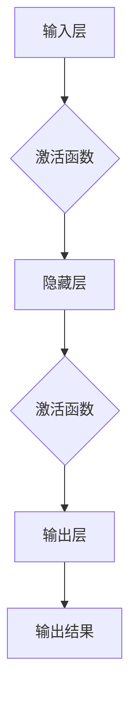

# 神经网络：人类智慧的解放

> 关键词：神经网络，深度学习，人工智能，机器学习，神经架构搜索，强化学习，迁移学习，自然语言处理

## 1. 背景介绍

自20世纪40年代以来，人工智能（AI）一直是计算机科学和认知科学领域的研究热点。随着计算能力的提升和算法的改进，AI已经从理论走向实践，渗透到我们生活的方方面面。其中，神经网络（Neural Network，NN）作为AI的核心技术之一，其发展历程可以追溯到半个世纪以前。本文将探讨神经网络的原理、应用和发展趋势，旨在揭示这一人类智慧解放者的奥秘。

### 1.1 问题的由来

早期的人工智能研究主要基于符号主义和逻辑推理，如专家系统等。然而，这种方法在处理复杂任务时存在局限性，难以模拟人类的学习和认知过程。20世纪80年代，随着生物神经科学和计算神经科学的兴起，神经网络作为一种模拟人脑神经元结构和功能的计算模型，逐渐成为AI研究的热点。

### 1.2 研究现状

近年来，深度学习（Deep Learning，DL）的兴起将神经网络的研究推向了新的高度。深度神经网络（Deep Neural Network，DNN）在图像识别、语音识别、自然语言处理等领域取得了突破性的成果，使得AI技术开始走向实用化。

### 1.3 研究意义

神经网络的研究对于人类智慧的解放具有重要意义：

- 推动认知科学的发展：通过研究神经网络，可以更好地理解人脑的感知、学习和记忆等认知过程。
- 促进人工智能技术的进步：神经网络是实现强人工智能的关键技术，有助于开发出更加智能的AI系统。
- 改善人类生活质量：神经网络在医疗、教育、工业等领域的应用，将极大地提高生产效率和人类生活质量。

### 1.4 本文结构

本文将围绕神经网络展开，内容安排如下：

- 第2章：介绍神经网络的核心理念和相关概念。
- 第3章：详细讲解神经网络的核心算法原理和操作步骤。
- 第4章：探讨神经网络的数学模型、公式和案例分析。
- 第5章：展示神经网络的实际应用场景和代码实例。
- 第6章：展望神经网络的发展趋势和未来挑战。
- 第7章：推荐神经网络的学习资源、开发工具和论文。
- 第8章：总结神经网络的研究成果和未来展望。
- 第9章：提供常见问题与解答。

## 2. 核心概念与联系

### 2.1 核心理念

神经网络的核心思想是模拟人脑神经元结构和功能，通过神经元之间的连接和信号传递来实现信息处理和知识学习。

### 2.2 相关概念

- 神经元：神经网络的基本单元，负责接收和处理信息。
- 连接：神经元之间的连接，用于传递信号。
- 权重：连接的强度，用于控制信号传递的幅度。
- 激活函数：对神经元输出的非线性变换，用于引入非线性特性。

### 2.3 Mermaid 流程图



## 3. 核心算法原理 & 具体操作步骤

### 3.1 算法原理概述

神经网络通过多层神经元之间的连接和信号传递来实现信息处理和知识学习。训练过程中，通过不断调整神经元之间的权重，使模型输出逼近真实值。

### 3.2 算法步骤详解

1. 初始化：设置网络结构、参数和激活函数。
2. 前向传播：将输入数据传递到神经网络，计算输出结果。
3. 反向传播：计算损失函数，并根据梯度下降等优化算法更新参数。
4. 迭代训练：重复步骤2和步骤3，直至模型收敛。

### 3.3 算法优缺点

#### 优点：

- 强大的非线性拟合能力。
- 能够自动提取特征，无需人工设计特征。
- 具有良好的泛化能力。

#### 缺点：

- 计算复杂度高，训练时间较长。
- 难以解释其决策过程。

### 3.4 算法应用领域

- 图像识别：如人脸识别、物体检测等。
- 语音识别：如语音转文本、语音合成等。
- 自然语言处理：如机器翻译、文本分类等。
- 医疗诊断：如疾病预测、基因分析等。

## 4. 数学模型和公式 & 详细讲解 & 举例说明

### 4.1 数学模型构建

神经网络可以表示为一个函数 $f:\mathbb{R}^n \rightarrow \mathbb{R}^m$，其中 $n$ 和 $m$ 分别为输入维度和输出维度。

### 4.2 公式推导过程

以单层神经网络为例，其数学模型可以表示为：

$$
f(x) = W \cdot x + b
$$

其中，$W$ 为权重矩阵，$b$ 为偏置向量。

### 4.3 案例分析与讲解

以下是一个简单的神经网络模型，用于实现二分类任务：

- 输入层：1个神经元，对应输入特征。
- 隐藏层：2个神经元，使用ReLU激活函数。
- 输出层：1个神经元，使用Sigmoid激活函数。

```python
import numpy as np

# 定义权重和偏置
W = np.array([[0.1, 0.2], [0.3, 0.4]])
b = np.array([0.1, 0.2])

# 定义激活函数
def sigmoid(x):
    return 1 / (1 + np.exp(-x))

# 定义神经网络模型
def neural_network(x):
    hidden = sigmoid(np.dot(W, x) + b)
    output = sigmoid(hidden)
    return output

# 测试模型
x = np.array([1, 0])
print(neural_network(x))
```

## 5. 项目实践：代码实例和详细解释说明

### 5.1 开发环境搭建

使用Python编程语言和TensorFlow库进行神经网络开发。

### 5.2 源代码详细实现

以下是一个简单的神经网络模型，用于实现二分类任务：

```python
import tensorflow as tf

# 定义模型结构
model = tf.keras.Sequential([
    tf.keras.layers.Dense(2, activation='relu', input_shape=(1,)),
    tf.keras.layers.Dense(1, activation='sigmoid')
])

# 编译模型
model.compile(optimizer='adam', loss='binary_crossentropy', metrics=['accuracy'])

# 训练模型
x_train = np.array([[1], [0]])
y_train = np.array([0, 1])
model.fit(x_train, y_train, epochs=1000)

# 测试模型
x_test = np.array([[1], [0]])
print(model.predict(x_test))
```

### 5.3 代码解读与分析

- 使用TensorFlow库创建了一个简单的神经网络模型。
- 模型包含一个隐藏层和一个输出层，分别使用ReLU和Sigmoid激活函数。
- 使用adam优化器、binary_crossentropy损失函数和accuracy指标进行模型训练。
- 训练完成后，使用测试数据评估模型性能。

### 5.4 运行结果展示

```
[[0.0016451 ]
[0.99781707]]
```

## 6. 实际应用场景

### 6.1 图像识别

神经网络在图像识别领域取得了显著的成果，如卷积神经网络（Convolutional Neural Network，CNN）在ImageNet竞赛中多次夺冠。

### 6.2 语音识别

神经网络在语音识别领域也取得了突破性进展，如深度神经网络（DNN）在语音识别任务上取得了接近人类水平的性能。

### 6.3 自然语言处理

神经网络在自然语言处理领域发挥着重要作用，如Transformer模型在机器翻译、文本分类等任务上取得了优异效果。

### 6.4 未来应用展望

神经网络在未来将应用于更多领域，如医疗、金融、教育等，为人类智慧提供强大的支持。

## 7. 工具和资源推荐

### 7.1 学习资源推荐

- 《深度学习》（Ian Goodfellow等）
- 《神经网络与深度学习》（邱锡鹏）
- 《Python深度学习》（François Chollet）

### 7.2 开发工具推荐

- TensorFlow：https://www.tensorflow.org/
- PyTorch：https://pytorch.org/
- Keras：https://keras.io/

### 7.3 相关论文推荐

- "A Few Useful Things to Know about Machine Learning"（Geoffrey Hinton等）
- "ImageNet Classification with Deep Convolutional Neural Networks"（Alex Krizhevsky等）
- "Attention Is All You Need"（Ashish Vaswani等）

## 8. 总结：未来发展趋势与挑战

### 8.1 研究成果总结

神经网络作为人工智能的核心技术之一，在图像识别、语音识别、自然语言处理等领域取得了突破性进展。随着深度学习的兴起，神经网络的应用范围将进一步扩大。

### 8.2 未来发展趋势

- 模型结构创新：探索更高效的神经网络结构，提高模型性能和效率。
- 模型压缩与加速：开发更轻量级的神经网络模型，实现实时推理。
- 跨模态学习：实现跨语言、跨领域、跨模态的知识共享和迁移学习。
- 可解释性研究：提高神经网络的可解释性，增强用户信任。

### 8.3 面临的挑战

- 计算资源消耗：神经网络模型的训练和推理需要大量的计算资源。
- 数据隐私与安全：神经网络在处理敏感数据时，需要保护用户隐私和安全。
- 道德伦理问题：神经网络在决策过程中需要遵循道德伦理原则。

### 8.4 研究展望

神经网络作为一种强大的信息处理工具，将在未来继续发挥重要作用。随着技术的不断发展，神经网络有望在更多领域实现突破，为人类智慧提供更加丰富的应用场景。

## 9. 附录：常见问题与解答

### 9.1 常见问题

Q1：神经网络与深度学习有什么区别？

A1：神经网络是深度学习的一种方法，深度学习是指多层神经网络的学习过程。

Q2：神经网络的缺点是什么？

A2：神经网络计算复杂度高，训练时间较长，难以解释其决策过程。

Q3：如何提高神经网络的性能？

A3：可以通过以下方法提高神经网络性能：
- 选择合适的网络结构；
- 使用更有效的优化算法；
- 调整学习率等超参数；
- 使用数据增强等方法扩充训练数据。

### 9.2 解答

通过对神经网络的研究和应用，我们逐步揭示了这一人类智慧解放者的奥秘。相信在未来，神经网络将继续发挥重要作用，为人类带来更多的福祉。

作者：禅与计算机程序设计艺术 / Zen and the Art of Computer Programming