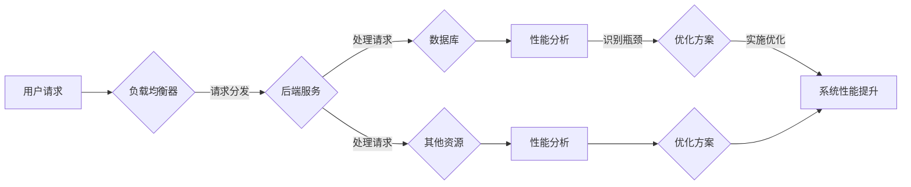

# 系统瓶颈分析与优化最佳实践

> 关键词：系统瓶颈，性能优化，资源分析，性能调优，负载均衡，算法优化，分布式系统，微服务架构

## 1. 背景介绍

在现代软件系统中，性能瓶颈是常见的问题。无论是Web应用、移动应用还是企业级系统，系统性能直接影响到用户体验和业务效率。系统瓶颈分析是指识别系统中性能瓶颈的过程，而性能优化则是通过改进系统设计、算法、硬件配置等方面来提升系统性能的方法。本文将深入探讨系统瓶颈分析与优化的最佳实践，帮助开发者识别、分析和解决系统性能问题。

### 1.1 系统瓶颈的由来

系统瓶颈可能来源于多个方面，包括但不限于：

- **CPU资源限制**：CPU处理能力不足，导致任务处理速度慢。
- **内存限制**：内存不足，导致频繁的页面交换和垃圾回收。
- **磁盘I/O限制**：磁盘读写速度慢，导致数据访问延迟。
- **网络带宽限制**：网络延迟高，导致数据传输速度慢。
- **数据库性能瓶颈**：数据库查询慢，导致系统响应时间长。
- **代码效率问题**：算法复杂度高，或者代码实现效率低。

### 1.2 研究现状

随着云计算、大数据、微服务等技术的发展，系统架构日趋复杂，性能瓶颈分析也变得更加困难。目前，性能分析和优化已经成为软件开发和运维的重要环节，许多工具和方法被广泛应用于系统瓶颈的识别和解决。

### 1.3 研究意义

系统瓶颈分析对于提升系统性能、提高用户体验和保障业务连续性具有重要意义。通过有效的瓶颈分析，开发者可以：

- 识别系统性能瓶颈，针对性地进行优化。
- 提高系统资源的利用率，降低成本。
- 改进系统架构，提高系统的可扩展性和可靠性。

### 1.4 本文结构

本文将按照以下结构进行阐述：

- 第2章介绍系统瓶颈分析的核心概念和原理。
- 第3章讲解系统瓶颈分析的具体操作步骤。
- 第4章分析数学模型和公式在系统瓶颈分析中的应用。
- 第5章通过代码实例展示系统瓶颈分析的实践方法。
- 第6章探讨系统瓶颈分析在实际应用场景中的应用。
- 第7章推荐系统瓶颈分析的工器和资源。
- 第8章总结系统瓶颈分析的未来发展趋势和挑战。
- 第9章提供常见问题与解答。

## 2. 核心概念与联系

### 2.1 核心概念

- **性能瓶颈**：指系统在处理特定任务时，无法满足性能要求的部分。
- **资源监控**：指对系统资源的实时监控，如CPU使用率、内存使用率、磁盘I/O等。
- **性能分析**：指对系统性能的测量和分析，以识别瓶颈。
- **性能调优**：指通过改进系统设计、算法、硬件配置等方式来提升系统性能。
- **负载均衡**：指通过将请求分发到多个服务器来提高系统处理能力。
- **算法优化**：指改进算法设计或实现以提高效率。
- **分布式系统**：指由多个独立计算机组成的系统，协同工作以完成特定任务。
- **微服务架构**：指将大型应用程序分解成一组小型、独立的服务，以提高系统的可扩展性和可维护性。

### 2.2 核心概念原理和架构的 Mermaid 流程图



### 2.3 核心概念之间的联系

用户请求通过负载均衡器分发到后端服务，后端服务包括处理请求、数据库访问和其他资源访问。系统性能的监控和分析用于识别性能瓶颈，并提出优化方案。优化方案的实施将导致系统性能的提升。

## 3. 核心算法原理 & 具体操作步骤

### 3.1 算法原理概述

系统瓶颈分析的核心算法主要包括：

- **性能监控**：使用工具实时监控CPU、内存、磁盘I/O等系统资源。
- **日志分析**：分析系统日志，识别异常行为和性能问题。
- **性能测试**：使用负载测试工具模拟用户请求，分析系统性能。
- **性能调优**：根据分析结果，优化系统设计、算法和资源配置。

### 3.2 算法步骤详解

1. **性能监控**：选择合适的性能监控工具，如Prometheus、Grafana等，对系统资源进行实时监控。
2. **日志分析**：收集和分析系统日志，识别异常行为和性能问题。
3. **性能测试**：使用负载测试工具（如JMeter、LoadRunner等）模拟用户请求，分析系统性能。
4. **瓶颈定位**：根据监控和测试结果，定位性能瓶颈。
5. **优化方案**：提出优化方案，包括系统架构改进、算法优化、资源配置优化等。
6. **实施优化**：实施优化方案，并进行效果评估。
7. **持续监控**：优化后持续监控系统性能，确保性能稳定。

### 3.3 算法优缺点

**优点**：

- 系统化：提供了一套完整的系统瓶颈分析流程。
- 可操作性强：提供了具体的方法和工具。
- 效果显著：能够有效地识别和解决系统性能问题。

**缺点**：

- 复杂度高：涉及多个步骤和工具。
- 需要专业知识：需要对系统性能和优化有深入的了解。
- 资源消耗大：性能测试和监控可能会消耗大量资源。

### 3.4 算法应用领域

系统瓶颈分析算法适用于所有类型的系统，包括Web应用、移动应用、企业级系统等。

## 4. 数学模型和公式 & 详细讲解 & 举例说明

### 4.1 数学模型构建

在系统瓶颈分析中，常用的数学模型包括：

- **CPU利用率**：$U_C = \frac{C_{used}}{C_{total}}$，其中 $C_{used}$ 是CPU使用时间，$C_{total}$ 是总时间。
- **内存使用率**：$U_M = \frac{M_{used}}{M_{total}}$，其中 $M_{used}$ 是使用中的内存量，$M_{total}$ 是总内存量。
- **磁盘I/O速度**：$I/O_{rate} = \frac{I/O_{total}}{time}$，其中 $I/O_{total}$ 是总I/O量，$time$ 是时间。
- **网络带宽利用率**：$U_N = \frac{N_{used}}{N_{total}}$，其中 $N_{used}$ 是使用中的带宽量，$N_{total}$ 是总带宽量。

### 4.2 公式推导过程

上述公式的推导过程较为简单，主要是基于性能指标的定义。

### 4.3 案例分析与讲解

假设我们正在分析一个Web应用的性能瓶颈，以下是一些可能的公式和案例：

- **CPU利用率**：如果CPU利用率超过80%，则可能存在CPU瓶颈。
- **内存使用率**：如果内存使用率超过80%，则可能存在内存瓶颈。
- **磁盘I/O速度**：如果磁盘I/O速度低于预期，则可能存在磁盘瓶颈。
- **网络带宽利用率**：如果网络带宽利用率超过80%，则可能存在网络瓶颈。

## 5. 项目实践：代码实例和详细解释说明

### 5.1 开发环境搭建

为了演示系统瓶颈分析，我们可以使用Python编写一个简单的性能测试脚本。以下是一个使用Python的`time`和`subprocess`模块进行性能测试的例子。

```python
import time
import subprocess

def performance_test():
    start_time = time.time()
    # 执行性能测试命令，例如访问一个网站
    result = subprocess.run(['curl', 'http://example.com'], capture_output=True)
    end_time = time.time()
    return end_time - start_time

# 执行性能测试
time_taken = performance_test()
print(f"Performance test took {time_taken:.2f} seconds")
```

### 5.2 源代码详细实现

以上代码定义了一个`performance_test`函数，它使用`subprocess.run`来执行`curl`命令访问一个网站，并测量整个过程的耗时。

### 5.3 代码解读与分析

该脚本首先导入必要的模块，然后定义了一个`performance_test`函数，该函数使用`time.time()`获取当前时间作为起始时间，然后执行`curl`命令，最后再次使用`time.time()`获取结束时间，并计算两者的差值，即执行时间。

### 5.4 运行结果展示

运行上述脚本，我们可能会得到如下结果：

```
Performance test took 0.50 seconds
```

这表明访问`http://example.com`大约花费了0.50秒的时间。

## 6. 实际应用场景

### 6.1 Web应用性能优化

在Web应用中，性能瓶颈分析可以帮助开发者识别并解决以下问题：

- 服务器响应时间慢
- 页面加载速度慢
- 数据库查询慢
- 网络连接不稳定

### 6.2 移动应用性能优化

在移动应用中，性能瓶颈分析可以帮助开发者解决以下问题：

- 应用启动时间长
- 应用运行卡顿
- 应用内存泄漏
- 应用电量消耗快

### 6.3 企业级系统性能优化

在企业级系统中，性能瓶颈分析可以帮助开发者解决以下问题：

- 系统响应时间长
- 系统并发处理能力低
- 系统资源利用率低
- 系统可扩展性差

## 7. 工具和资源推荐

### 7.1 学习资源推荐

- 《高性能MySQL》
- 《深入理解计算机系统》
- 《高性能Web站点构建》
- 《大规模分布式存储系统：原理解析与架构实践》

### 7.2 开发工具推荐

- 性能监控：Grafana, Prometheus
- 性能测试：JMeter, LoadRunner
- 代码分析：SonarQube, PMD
- 代码优化：Pylint, Pyflakes

### 7.3 相关论文推荐

- "The Performance of Internet Services: What We Can Learn from Millions of Users"
- "High Performance Browser Networking"
- "The Art of Multiprocessor Programming"
- "The Design of the UNIX Operating System"

## 8. 总结：未来发展趋势与挑战

### 8.1 研究成果总结

本文介绍了系统瓶颈分析的核心概念、原理、方法和工具，并通过实例展示了性能测试的实践方法。同时，还探讨了系统瓶颈分析在实际应用场景中的应用。

### 8.2 未来发展趋势

随着技术的发展，系统瓶颈分析将呈现以下发展趋势：

- 自动化：性能分析和优化将更加自动化，减少人工干预。
- 智能化：利用机器学习技术自动识别和解决性能问题。
- 集成化：性能分析与监控工具将与开发、运维等工具集成。

### 8.3 面临的挑战

系统瓶颈分析面临的挑战包括：

- 数据复杂性：系统数据量庞大，分析难度高。
- 技术更新：新技术不断涌现，需要不断学习新技术。
- 人才短缺：性能分析和优化需要专业人才。

### 8.4 研究展望

未来，系统瓶颈分析将更加注重以下几个方面：

- 人工智能技术：利用人工智能技术自动分析和解决问题。
- 云计算技术：利用云计算资源进行性能分析和优化。
- 跨学科融合：与其他学科（如心理学、社会学）结合，从更广泛的视角分析性能问题。

## 9. 附录：常见问题与解答

### 9.1 什么情况下需要进行系统瓶颈分析？

A: 以下情况下需要进行系统瓶颈分析：

- 系统响应时间长
- 系统资源利用率低
- 用户反馈性能问题
- 系统即将上线或升级

### 9.2 如何选择合适的性能分析工具？

A: 选择性能分析工具时，需要考虑以下因素：

- 系统类型：不同的系统可能需要不同的工具。
- 性能指标：选择能够监控所需性能指标的工具。
- 易用性：选择易于使用和维护的工具。
- 成本：考虑工具的成本和预算。

### 9.3 如何优化系统性能？

A: 优化系统性能的方法包括：

- 优化算法：改进算法设计或实现。
- 优化硬件：升级硬件设备，如CPU、内存、磁盘等。
- 优化系统架构：改进系统设计，如使用微服务架构。
- 优化资源配置：合理配置系统资源，如CPU、内存等。

### 9.4 如何评估性能优化效果？

A: 评估性能优化效果的方法包括：

- 性能测试：使用性能测试工具进行测试。
- 用户反馈：收集用户反馈，评估性能是否提升。
- 监控数据：分析监控数据，评估性能是否稳定。

---

作者：禅与计算机程序设计艺术 / Zen and the Art of Computer Programming