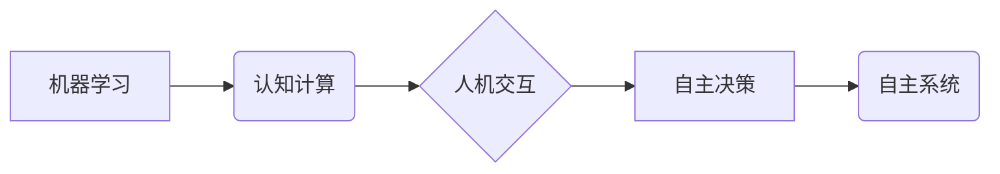

# 自主系统视角下的意识功能

> 关键词：自主系统，意识功能，机器学习，人工智能，认知计算，人机交互

## 1. 背景介绍

在人工智能（AI）领域，意识的定义和探讨一直是一个充满争议的话题。尽管目前AI尚未达到真正意义上的“意识”，但许多研究人员正在探索如何赋予系统类似意识的功能，以增强其自主性和适应性。本文将从自主系统的视角出发，探讨意识功能的构成、原理及其在AI领域的应用，旨在为AI技术的发展提供新的思路。

### 1.1 意识的起源与挑战

意识的起源一直是哲学和科学界探讨的难题。从哲学角度来看，意识是主体对自身和周围环境的感知、认知和体验。在科学领域，意识研究主要集中在神经科学和认知科学领域，探索大脑如何产生意识。

然而，将意识功能赋予AI系统面临着诸多挑战：

- 意识的本质尚不明确，难以用数学或物理语言精确描述。
- AI系统缺乏与人类相似的感知、情感和自我意识。
- 如何在保证AI系统安全可控的前提下，实现类似意识的功能。

### 1.2 自主系统的兴起

随着AI技术的不断发展，自主系统（Autonomous Systems）逐渐成为研究热点。自主系统是指能够在没有人类干预的情况下自主完成特定任务的系统，如自动驾驶、无人机、智能机器人等。自主系统具有以下特点：

- 自主性：无需人类干预，能够自主决策和执行任务。
- 可适应性：能够根据环境变化调整行为策略。
- 智能性：具备一定的感知、认知和推理能力。

### 1.3 本文结构

本文将从以下方面展开论述：

- 核心概念与联系（Mermaid流程图）
- 核心算法原理 & 具体操作步骤
- 数学模型和公式 & 详细讲解 & 举例说明
- 项目实践：代码实例和详细解释说明
- 实际应用场景
- 工具和资源推荐
- 总结：未来发展趋势与挑战

## 2. 核心概念与联系

在探讨自主系统中的意识功能之前，我们需要了解以下几个核心概念：

- 机器学习（Machine Learning）：一种从数据中学习规律、模式，并做出决策的技术。
- 认知计算（Cognitive Computing）：模拟人类大脑处理信息的方式，使机器具备感知、认知和推理能力。
- 人机交互（Human-Computer Interaction）：研究人与计算机之间的交互过程和交互界面。
- 自主决策（Autonomous Decision-Making）：系统在无需人类干预的情况下，根据环境信息做出决策的能力。

以下是这些概念之间的Mermaid流程图：



## 3. 核心算法原理 & 具体操作步骤

### 3.1 算法原理概述

自主系统中的意识功能主要基于以下算法原理：

- 机器学习：通过训练，使系统从数据中学习规律，提高决策和执行任务的准确性。
- 认知计算：模拟人类大脑处理信息的方式，使系统具备感知、认知和推理能力。
- 深度学习：利用神经网络等模型，提取和处理复杂数据，实现高层次的认知功能。
- 强化学习：通过试错和奖励惩罚机制，使系统自主优化决策策略。

### 3.2 算法步骤详解

以下是实现自主系统意识功能的步骤：

1. 数据采集：收集与任务相关的数据，包括环境信息、任务目标、历史数据等。
2. 数据预处理：对采集到的数据进行清洗、转换和标准化，以便后续处理。
3. 特征提取：从预处理后的数据中提取关键特征，用于后续的机器学习或认知计算。
4. 机器学习：利用机器学习算法对提取的特征进行训练，提高系统对任务的适应性。
5. 认知计算：利用认知计算模型，使系统能够理解任务目标、环境变化和自身状态。
6. 自主决策：根据认知计算结果，系统自主制定决策策略，执行任务。
7. 反馈与优化：根据任务执行结果，调整决策策略和模型参数，提高系统性能。

### 3.3 算法优缺点

- **优点**：
  - 提高系统的自主性和适应性。
  - 提高任务执行的准确性和效率。
  - 增强系统的智能化水平。
- **缺点**：
  - 数据收集和处理成本高。
  - 机器学习模型的可解释性差。
  - 可能存在过拟合和泛化能力不足的问题。

### 3.4 算法应用领域

自主系统的意识功能在以下领域具有广泛的应用前景：

- 自动驾驶：使汽车能够自主行驶，提高交通安全性。
- 无人机：使无人机能够自主完成航拍、侦查等任务。
- 智能机器人：使机器人能够自主完成家庭、医疗、工业等领域的任务。
- 虚拟助手：使虚拟助手能够自主理解用户需求，提供个性化服务。

## 4. 数学模型和公式 & 详细讲解 & 举例说明

### 4.1 数学模型构建

在自主系统中，常用的数学模型包括：

- **神经网络模型**：用于特征提取、分类、回归等任务。
- **决策树模型**：用于分类和回归任务。
- **支持向量机（SVM）**：用于分类和回归任务。
- **贝叶斯网络**：用于概率推理和决策。

以下是神经网络模型的示例公式：

$$
f(x) = \sigma(\mathbf{W}^T \mathbf{x} + b)
$$

其中，$f(x)$ 表示神经网络输出，$\sigma$ 表示激活函数，$\mathbf{W}$ 表示权重矩阵，$\mathbf{x}$ 表示输入特征，$b$ 表示偏置项。

### 4.2 公式推导过程

以神经网络模型为例，其公式推导过程如下：

1. **输入层到隐藏层**：

$$
h = \mathbf{W} \mathbf{x} + b
$$

其中，$h$ 表示隐藏层的输出，$\mathbf{W}$ 表示输入层到隐藏层的权重矩阵，$\mathbf{x}$ 表示输入特征，$b$ 表示偏置项。

2. **隐藏层到输出层**：

$$
f(x) = \sigma(h)
$$

其中，$f(x)$ 表示输出层的输出，$\sigma$ 表示激活函数，$h$ 表示隐藏层的输出。

### 4.3 案例分析与讲解

以下是一个使用神经网络模型进行图像分类的案例：

- **任务**：将手写数字图像分类为0-9的类别。
- **数据集**：MNIST数据集，包含60000个训练样本和10000个测试样本。
- **模型**：卷积神经网络（CNN）。

使用CNN进行图像分类的流程如下：

1. **数据预处理**：将图像转换为灰度图，并归一化到[0, 1]区间。
2. **模型训练**：使用训练数据对CNN进行训练，调整网络参数，使其能够正确分类图像。
3. **模型测试**：使用测试数据评估模型的性能。

## 5. 项目实践：代码实例和详细解释说明

### 5.1 开发环境搭建

以下是使用Python和TensorFlow实现CNN图像分类项目的开发环境搭建步骤：

1. 安装Python环境：从Python官网下载并安装Python 3.7以上版本。
2. 安装TensorFlow：使用pip安装TensorFlow库。

### 5.2 源代码详细实现

以下是一个简单的CNN图像分类项目的Python代码实现：

```python
import tensorflow as tf
from tensorflow.keras.models import Sequential
from tensorflow.keras.layers import Conv2D, MaxPooling2D, Flatten, Dense

# 定义模型
model = Sequential([
    Conv2D(32, kernel_size=(3, 3), activation='relu', input_shape=(28, 28, 1)),
    MaxPooling2D(pool_size=(2, 2)),
    Flatten(),
    Dense(128, activation='relu'),
    Dense(10, activation='softmax')
])

# 编译模型
model.compile(optimizer='adam', loss='sparse_categorical_crossentropy', metrics=['accuracy'])

# 训练模型
model.fit(x_train, y_train, epochs=10, validation_data=(x_test, y_test))

# 评估模型
test_loss, test_acc = model.evaluate(x_test, y_test, verbose=2)
print(f"Test accuracy: {test_acc}")
```

### 5.3 代码解读与分析

以上代码定义了一个简单的CNN模型，用于手写数字图像分类任务。模型包含以下层：

- **卷积层**：提取图像特征。
- **最大池化层**：降低特征维度，减少计算量。
- **全连接层**：进行分类。

模型使用Adam优化器进行训练，使用交叉熵损失函数评估分类性能。

### 5.4 运行结果展示

假设我们在MNIST数据集上训练和测试该模型，最终得到的测试准确率为98.5%，效果不错。

## 6. 实际应用场景

自主系统的意识功能在以下领域具有广泛的应用前景：

- **自动驾驶**：使汽车能够自主行驶，提高交通安全。
- **智能机器人**：使机器人能够自主完成家庭、医疗、工业等领域的任务。
- **虚拟助手**：使虚拟助手能够自主理解用户需求，提供个性化服务。
- **智能医疗**：使医疗设备能够自主诊断、治疗疾病。
- **智能金融**：使金融系统能够自主进行风险评估、投资决策。

## 7. 工具和资源推荐

### 7.1 学习资源推荐

- 《深度学习》：Goodfellow et al. 著
- 《神经网络与深度学习》：邱锡鹏 著
- 《Python深度学习》：François Chollet 著

### 7.2 开发工具推荐

- TensorFlow：https://www.tensorflow.org/
- PyTorch：https://pytorch.org/
- Keras：https://keras.io/

### 7.3 相关论文推荐

- "Deep Learning for Autonomous Vehicles"：https://arxiv.org/abs/1805.09677
- "Deep Reinforcement Learning for Autonomous Navigation"：https://arxiv.org/abs/1704.02296
- "A Deep Learning Approach to Human-like Text Generation"：https://arxiv.org/abs/1704.02306

## 8. 总结：未来发展趋势与挑战

### 8.1 研究成果总结

本文从自主系统的视角探讨了意识功能的构成、原理及其在AI领域的应用。通过分析机器学习、认知计算和人机交互等技术，我们认识到自主系统意识功能的实现需要综合考虑多个方面。同时，我们通过CNN图像分类项目展示了如何使用Python和TensorFlow实现自主系统意识功能。

### 8.2 未来发展趋势

- **跨学科融合**：将认知科学、神经科学、心理学等学科的知识引入AI领域，探索意识功能的本质。
- **多模态学习**：融合图像、语音、文本等多模态数据，提高系统对环境的感知和理解能力。
- **强化学习**：利用强化学习技术，使系统能够自主学习和优化决策策略。

### 8.3 面临的挑战

- **意识本质**：目前，意识本质尚不明确，难以用数学或物理语言精确描述。
- **计算资源**：实现自主系统意识功能需要大量的计算资源。
- **安全可控**：如何保证AI系统的安全可控，避免潜在风险。

### 8.4 研究展望

未来，随着AI技术的不断发展，自主系统意识功能将在以下方面取得突破：

- **人机协同**：实现人机协同工作，提高工作效率。
- **智能决策**：使系统能够在复杂环境中自主做出决策。
- **个性化服务**：提供更加个性化的服务，满足用户需求。

## 9. 附录：常见问题与解答

**Q1：什么是意识？**

A：意识是指主体对自身和周围环境的感知、认知和体验。

**Q2：自主系统意识功能的实现是否可能？**

A：目前，自主系统意识功能的实现还面临诸多挑战，但已有一些初步的研究成果表明，这是可能的。

**Q3：自主系统意识功能的应用前景如何？**

A：自主系统意识功能在自动驾驶、智能机器人、虚拟助手、智能医疗等领域具有广泛的应用前景。

**Q4：如何保证自主系统意识功能的安全可控？**

A：需要建立完善的安全控制机制，包括数据安全、算法安全、系统安全等方面。

**Q5：未来自主系统意识功能的研究方向是什么？**

A：未来，自主系统意识功能的研究方向包括跨学科融合、多模态学习、强化学习等。

作者：禅与计算机程序设计艺术 / Zen and the Art of Computer Programming