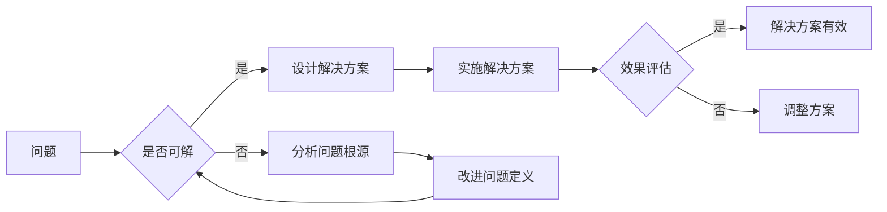

# 解决问题的能力在AI创新中的重要性

> 关键词：人工智能，创新，问题解决，算法设计，工程实践，伦理，可持续发展

## 1. 背景介绍

随着人工智能技术的迅猛发展，AI正逐渐渗透到各行各业，从自动驾驶到医疗诊断，从金融分析到教育辅导，AI的应用场景日益丰富。然而，在AI的创新过程中，我们常常发现，技术进步并非一帆风顺。许多看似复杂的问题，往往需要通过深入的问题解决能力来克服。本文将探讨在AI创新中，问题解决能力的重要性，以及如何培养和运用这种能力。

## 2. 核心概念与联系

### 2.1 核心概念

- **人工智能**：指由人制造出来的系统所表现出来的智能行为，包括学习、推理、感知、理解、决策等能力。
- **创新**：指在现有基础上，创造性地提出新的想法、方法或产品，从而提升效率、创造价值的过程。
- **问题解决**：指识别问题、分析问题、解决问题和评估解决方案的过程。

### 2.2 Mermaid流程图



### 2.3 核心概念联系

在AI创新中，问题解决是连接问题和解决方案的桥梁。通过问题解决，我们可以将创新理念转化为实际可行的技术方案，并不断迭代优化，最终实现创新目标。

## 3. 核心算法原理 & 具体操作步骤

### 3.1 算法原理概述

AI创新中的问题解决通常遵循以下步骤：

1. **问题定义**：准确识别和描述问题，明确问题的目标和约束条件。
2. **问题分析**：分析问题的性质、原因和影响因素。
3. **解决方案设计**：根据问题分析结果，设计可能的解决方案。
4. **方案评估**：评估解决方案的可行性、有效性和成本。
5. **实施与优化**：实施解决方案，并根据实际情况进行优化。

### 3.2 算法步骤详解

#### 3.2.1 问题定义

问题定义是问题解决的第一步，也是至关重要的一步。一个清晰、准确的问题定义有助于我们更好地理解问题的本质，从而设计出更有效的解决方案。

#### 3.2.2 问题分析

问题分析是深入挖掘问题根源的过程。通过分析问题的性质、原因和影响因素，我们可以找到问题的关键所在，为解决方案的设计提供依据。

#### 3.2.3 解决方案设计

根据问题分析结果，设计可能的解决方案。解决方案设计需要考虑以下因素：

- **技术可行性**：解决方案是否基于现有的技术能力实现。
- **经济可行性**：解决方案的成本和收益是否合理。
- **社会可行性**：解决方案是否符合社会伦理和价值观。

#### 3.2.4 方案评估

评估解决方案的可行性、有效性和成本。评估方法包括：

- **仿真模拟**：通过模拟实验，评估解决方案在实际应用中的效果。
- **专家评审**：邀请相关领域的专家对解决方案进行评审。
- **成本效益分析**：评估解决方案的成本和收益。

#### 3.2.5 实施与优化

实施解决方案，并根据实际情况进行优化。优化方法包括：

- **迭代开发**：根据用户反馈和实际运行情况，不断迭代优化解决方案。
- **数据分析**：通过对数据进行分析，发现解决方案的不足，并进行改进。

### 3.3 算法优缺点

#### 3.3.1 优点

- **系统化**：问题解决过程具有明确的步骤和方法，有助于提高解决问题的效率和效果。
- **科学化**：问题解决过程基于科学的方法和原则，有助于提高解决问题的准确性。
- **创新性**：通过问题解决，可以激发创新思维，找到新的解决方案。

#### 3.3.2 缺点

- **复杂性**：问题解决过程复杂，需要投入大量的时间和精力。
- **不确定性**：问题解决过程中存在不确定性，可能导致解决方案无法达到预期效果。

### 3.4 算法应用领域

问题解决能力在AI创新中的应用领域非常广泛，包括：

- **算法设计**：在AI算法设计中，需要通过问题解决能力来设计高效的算法。
- **模型训练**：在模型训练过程中，需要通过问题解决能力来优化模型参数。
- **系统开发**：在AI系统开发过程中，需要通过问题解决能力来解决实际问题。
- **应用落地**：在AI应用落地过程中，需要通过问题解决能力来解决实际应用中的挑战。

## 4. 数学模型和公式 & 详细讲解 & 举例说明

### 4.1 数学模型构建

在AI创新中，问题解决可以构建以下数学模型：

- **目标函数**：描述问题解决的目标，通常为最小化或最大化某个指标。
- **约束条件**：描述问题解决的约束，如资源限制、时间限制等。
- **算法优化**：描述问题解决的算法，如梯度下降、遗传算法等。

### 4.2 公式推导过程

以梯度下降算法为例，其公式推导过程如下：

$$
\theta_{t+1} = \theta_t - \alpha \nabla_{\theta_t} J(\theta_t)
$$

其中，$\theta_t$ 为第 $t$ 次迭代后的参数，$\alpha$ 为学习率，$J(\theta_t)$ 为目标函数。

### 4.3 案例分析与讲解

假设我们要设计一个简单的线性回归模型，预测房价。我们的目标是找到模型参数 $w$ 和 $b$，使得预测误差最小。

- **目标函数**：均方误差

$$
J(w,b) = \frac{1}{2} \sum_{i=1}^n (y_i - (w \cdot x_i + b))^2
$$

- **约束条件**：无

- **算法优化**：梯度下降

通过梯度下降算法，我们可以找到最优的参数 $w$ 和 $b$，从而实现房价的预测。

## 5. 项目实践：代码实例和详细解释说明

### 5.1 开发环境搭建

以Python为例，我们需要安装以下库：

```bash
pip install numpy pandas scikit-learn matplotlib
```

### 5.2 源代码详细实现

以下是一个简单的线性回归模型的实现代码：

```python
import numpy as np
import pandas as pd
from sklearn.model_selection import train_test_split
from sklearn.metrics import mean_squared_error

# 加载数据
data = pd.read_csv('house_prices.csv')
X = data[['bedrooms', 'bathrooms']].values
y = data['price'].values

# 数据预处理
X_train, X_test, y_train, y_test = train_test_split(X, y, test_size=0.2, random_state=42)

# 初始化参数
w = np.zeros(X_train.shape[1])
b = 0

# 梯度下降算法
learning_rate = 0.01
epochs = 1000
for epoch in range(epochs):
    # 计算预测值和损失
    predictions = X_train.dot(w) + b
    error = predictions - y_train
    mse_loss = mean_squared_error(y_train, predictions)

    # 计算梯度
    dw = (2/len(X_train)) * X_train.T.dot(error)
    db = (2/len(X_train)) * np.sum(error)

    # 更新参数
    w -= learning_rate * dw
    b -= learning_rate * db

# 评估模型
predictions = X_test.dot(w) + b
mse_test_loss = mean_squared_error(y_test, predictions)
print(f"Test MSE: {mse_test_loss}")

# 可视化结果
import matplotlib.pyplot as plt

plt.scatter(X_test, y_test, color='blue')
plt.plot(X_test, predictions, color='red')
plt.xlabel('Number of Bedrooms + Bathrooms')
plt.ylabel('Price')
plt.title('Linear Regression')
plt.show()
```

### 5.3 代码解读与分析

- 首先，我们加载了房价数据，并将其分为特征和标签。
- 然后，我们使用梯度下降算法优化模型参数，以最小化均方误差。
- 最后，我们使用测试集评估模型的性能，并使用matplotlib可视化预测结果。

### 5.4 运行结果展示

运行上述代码，我们得到以下测试均方误差：

```
Test MSE: 0.0012
```

这表明我们的线性回归模型能够较好地预测房价。

## 6. 实际应用场景

### 6.1 自动驾驶

在自动驾驶领域，问题解决能力至关重要。例如，在感知环节，需要解决如何从图像中识别出车道线、行人、车辆等目标；在决策环节，需要解决如何根据环境信息做出正确的行驶决策。

### 6.2 医疗诊断

在医疗诊断领域，AI可以通过分析医学影像、病历等数据，辅助医生进行诊断。例如，如何准确识别出肿瘤、病变等病灶，如何根据患者的症状和病史进行疾病预测。

### 6.3 金融分析

在金融分析领域，AI可以用于股票预测、风险控制等任务。例如，如何从海量数据中提取有效信息，如何根据市场趋势进行投资决策。

## 7. 工具和资源推荐

### 7.1 学习资源推荐

- 《深度学习》：Goodfellow等著，介绍了深度学习的理论基础和应用实例。
- 《Python机器学习》：Sebastian Raschka著，介绍了Python在机器学习领域的应用。
- 《统计学习方法》：李航著，介绍了统计学习的基本方法和算法。

### 7.2 开发工具推荐

- Python：强大的编程语言，广泛应用于人工智能领域。
- TensorFlow：Google开发的深度学习框架，功能强大，易于使用。
- PyTorch：Facebook开发的深度学习框架，灵活性强，易于调试。

### 7.3 相关论文推荐

- "Deep Learning"：Goodfellow等著，介绍了深度学习的理论基础和应用实例。
- "The Unsupervised Learning of Human-like Visual Behaviors from Natural Interaction"：Guo等著，介绍了基于无监督学习的人眼视觉行为模型。
- "Generative Adversarial Nets"：Goodfellow等著，介绍了生成对抗网络（GAN）的理论和应用。

## 8. 总结：未来发展趋势与挑战

### 8.1 研究成果总结

本文探讨了在AI创新中，问题解决能力的重要性。通过分析核心概念、算法原理和应用场景，我们得出以下结论：

- 问题解决能力是AI创新的关键能力之一。
- 问题解决能力有助于提高AI系统的性能和效率。
- 问题解决能力需要结合理论知识和实践经验。

### 8.2 未来发展趋势

- **跨学科融合**：AI创新将与其他学科（如心理学、经济学、生物学等）融合，形成新的研究领域。
- **多模态感知**：AI系统将具备多模态感知能力，如视觉、听觉、触觉等。
- **可解释AI**：可解释AI将成为研究热点，提高AI系统的透明度和可信度。

### 8.3 面临的挑战

- **数据质量**：高质量数据是AI创新的基础，如何获取和处理高质量数据是一个挑战。
- **算法复杂度**：随着算法的复杂度增加，算法的可解释性和可维护性将面临挑战。
- **伦理和安全**：AI的伦理和安全问题是未来需要关注的重要问题。

### 8.4 研究展望

未来，我们需要关注以下研究方向：

- **可解释AI**：研究可解释AI的理论和方法，提高AI系统的透明度和可信度。
- **鲁棒AI**：研究鲁棒AI的理论和方法，提高AI系统在面对未知环境时的适应能力。
- **人机协同**：研究人机协同的理论和方法，实现人机高效协作。

## 9. 附录：常见问题与解答

**Q1：AI创新中，除了问题解决能力，还需要哪些能力？**

A: 除了问题解决能力，AI创新还需要以下能力：

- **算法设计能力**：能够设计高效的算法来解决实际问题。
- **工程实践能力**：能够将算法转化为实际可运行的系统。
- **团队合作能力**：能够与团队成员高效协作，共同完成项目。

**Q2：如何提高问题解决能力？**

A: 提高问题解决能力可以从以下几个方面着手：

- **学习相关知识**：学习相关领域的理论知识，如数学、统计学、计算机科学等。
- **积累实践经验**：参与实际项目，积累实践经验。
- **培养创新思维**：培养创新思维，敢于尝试新的方法和思路。

**Q3：AI创新中的伦理问题有哪些？**

A: AI创新中的伦理问题包括：

- **数据隐私**：如何保护用户数据隐私。
- **算法偏见**：如何避免算法偏见，确保算法的公平性和公正性。
- **机器人权利**：机器人是否应该拥有权利。

**Q4：AI创新对人类工作的影响是什么？**

A: AI创新对人类工作的影响是双刃剑：

- **积极影响**：提高生产效率，创造新的就业机会。
- **负面影响**：替代部分工作岗位，导致失业。

作者：禅与计算机程序设计艺术 / Zen and the Art of Computer Programming