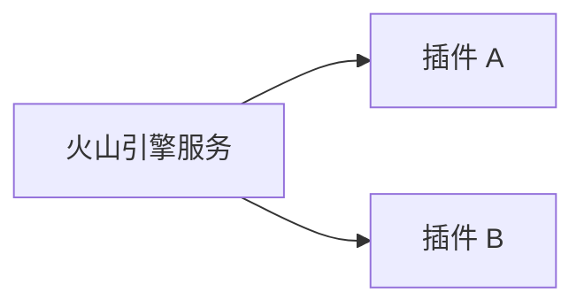

## 火山引擎的插件与工具平台

> 关键词：火山引擎、插件平台、工具平台、云计算、API、扩展性、可定制性、开发者生态

## 1. 背景介绍

在当今以云计算为核心的数字经济时代，企业和开发者对灵活、可扩展、可定制的云服务需求日益增长。火山引擎作为阿里云的创新型云计算平台，致力于为开发者提供丰富的云服务和工具，帮助他们快速构建和部署高质量的应用。为了更好地满足开发者多元化的需求，火山引擎推出了插件与工具平台，这是一个开放、灵活、可扩展的平台，旨在为开发者提供丰富的插件和工具，帮助他们扩展火山引擎服务的功能，提升开发效率，并构建更具创新性的应用。

## 2. 核心概念与联系

### 2.1 插件与工具平台概述

火山引擎的插件与工具平台是一个基于云原生架构的开放平台，它提供了一套完整的插件开发和管理体系，以及丰富的工具和资源，帮助开发者轻松构建、发布和管理自己的插件。

### 2.2 平台架构

火山引擎的插件与工具平台采用分层架构，主要包含以下几个关键层：

* **基础层：** 提供基础的云服务和API，例如存储、计算、网络等，为插件提供运行环境和数据支撑。
* **插件层：** 插件是平台的核心组成部分，它们是独立的、可复用的软件模块，可以扩展火山引擎服务的功能，例如添加新的功能、集成第三方服务、自定义数据处理逻辑等。
* **工具层：** 提供一系列工具，帮助开发者开发、测试、部署和管理插件，例如插件开发工具、测试框架、部署工具、监控工具等。
* **管理层：** 提供插件的发布、管理、版本控制和安全认证等功能，确保插件的质量和安全性。

**Mermaid 流程图**


### 2.3 核心概念

* **插件：** 独立、可复用的软件模块，可以扩展火山引擎服务的功能。
* **API：** 应用编程接口，插件通过API与火山引擎服务进行交互。
* **开发者生态：** 指围绕火山引擎插件与工具平台构建的开发者社区，包括开发者、技术专家、合作伙伴等。

## 3. 核心算法原理 & 具体操作步骤

### 3.1 算法原理概述

火山引擎的插件与工具平台的核心算法原理基于微服务架构和容器化技术。微服务架构将系统分解成多个独立的服务，每个服务负责特定的功能，并通过轻量级的API进行通信。容器化技术将每个服务打包成容器，方便部署和管理。

### 3.2 算法步骤详解

1. **插件开发：** 开发者使用平台提供的开发工具和API，开发自己的插件。
2. **插件测试：** 开发者使用平台提供的测试框架，对插件进行测试，确保其功能正确和稳定。
3. **插件发布：** 开发者将测试通过的插件发布到平台的插件仓库。
4. **插件管理：** 平台提供插件的版本管理、安全认证、监控和日志管理等功能。
5. **插件部署：** 开发者可以根据需要，将插件部署到不同的火山引擎服务中。
6. **插件调用：** 开发者可以通过API调用插件，实现扩展功能。

### 3.3 算法优缺点

**优点：**

* **可扩展性：** 通过插件机制，可以轻松扩展火山引擎服务的功能。
* **可定制性：** 开发者可以根据自己的需求，定制自己的插件。
* **易维护：** 微服务架构和容器化技术，使得插件的开发、部署和管理更加方便。
* **高可用性：** 微服务架构和容器化技术，使得插件更加可靠和稳定。

**缺点：**

* **开发复杂度：** 开发插件需要对火山引擎服务和API有一定的了解。
* **安全风险：** 插件的安全性需要得到保证，否则可能会带来安全风险。

### 3.4 算法应用领域

火山引擎的插件与工具平台可以应用于各种场景，例如：

* **数据处理：** 开发数据清洗、数据转换、数据分析等插件。
* **业务逻辑扩展：** 开发自定义业务逻辑插件，例如订单处理、用户管理等。
* **第三方服务集成：** 开发与第三方服务的集成插件，例如支付、短信等。
* **自动化运维：** 开发自动化运维插件，例如监控、告警、日志管理等。

## 4. 数学模型和公式 & 详细讲解 & 举例说明

### 4.1 数学模型构建

火山引擎的插件与工具平台可以抽象为一个图模型，其中：

* **节点：** 代表火山引擎服务、插件和工具。
* **边：** 代表服务之间的依赖关系、插件与服务的调用关系和工具与服务的交互关系。

这个图模型可以帮助我们理解平台的整体结构和功能，并进行性能分析和优化。

### 4.2 公式推导过程

基于图模型，我们可以推导出一些公式来衡量平台的性能和效率，例如：

* **插件调用次数：** $N = \sum_{i=1}^{m} C_i$，其中 $N$ 为插件调用次数， $m$ 为插件数量， $C_i$ 为第 $i$ 个插件的调用次数。
* **平均响应时间：** $T = \frac{\sum_{i=1}^{n} R_i}{n}$，其中 $T$ 为平均响应时间， $n$ 为请求次数， $R_i$ 为第 $i$ 个请求的响应时间。

### 4.3 案例分析与讲解

假设我们有一个火山引擎服务，它需要调用两个插件来完成业务逻辑。

* 插件 A：负责数据清洗。
* 插件 B：负责数据分析。

我们可以使用图模型来表示这个场景：



通过分析图模型，我们可以发现：

* 火山引擎服务依赖于插件 A 和插件 B。
* 插件 A 和插件 B 之间没有直接依赖关系。

我们可以使用公式来衡量这个场景的性能：

* 插件调用次数：$N = 2$
* 平均响应时间：需要根据实际情况进行计算。

## 5. 项目实践：代码实例和详细解释说明

### 5.1 开发环境搭建

为了开发火山引擎的插件，需要搭建以下开发环境：

* **云服务器：** 选择阿里云的云服务器作为开发环境。
* **开发工具：** 使用 IDE 或者文本编辑器进行代码开发。
* **SDK：** 下载火山引擎的 SDK，用于与火山引擎服务进行交互。

### 5.2 源代码详细实现

以下是一个简单的火山引擎插件的代码示例，它可以将文本数据转换为大写：

```python
from volcano_engine_sdk import VolcanoEngineClient

# 创建 VolcanoEngineClient 对象
client = VolcanoEngineClient()

# 定义插件函数
def to_uppercase(text):
    return text.upper()

# 注册插件函数
client.register_plugin("to_uppercase", to_uppercase)

# 调用插件函数
result = client.call_plugin("to_uppercase", "hello world")

# 打印结果
print(result)  # 输出：HELLO WORLD
```

### 5.3 代码解读与分析

* **导入 SDK：** 首先导入火山引擎的 SDK。
* **创建客户端：** 创建 VolcanoEngineClient 对象，用于与火山引擎服务进行交互。
* **定义插件函数：** 定义一个名为 `to_uppercase` 的函数，它接受文本数据作为输入，并返回转换为大写的文本数据。
* **注册插件函数：** 使用 `client.register_plugin()` 方法注册插件函数，并指定插件函数的名称和函数引用。
* **调用插件函数：** 使用 `client.call_plugin()` 方法调用注册的插件函数，并传入需要处理的文本数据。
* **打印结果：** 打印插件函数的返回值。

### 5.4 运行结果展示

运行以上代码，将会输出：

```
HELLO WORLD
```

## 6. 实际应用场景

火山引擎的插件与工具平台可以应用于各种实际场景，例如：

* **电商平台：** 开发插件实现商品推荐、个性化营销、订单处理等功能。
* **金融平台：** 开发插件实现风险控制、欺诈检测、数据分析等功能。
* **游戏平台：** 开发插件实现游戏逻辑、用户行为分析、游戏数据统计等功能。
* **教育平台：** 开发插件实现在线考试、知识问答、个性化学习等功能。

### 6.4 未来应用展望

随着云计算技术的不断发展，火山引擎的插件与工具平台将迎来更加广泛的应用场景。未来，我们将看到更多创新性的插件和工具涌现，帮助开发者构建更加智能、高效、可扩展的应用。

## 7. 工具和资源推荐

### 7.1 学习资源推荐

* **火山引擎官方文档：** https://www.volcanoengine.com/docs/
* **火山引擎开发者社区：** https://developer.volcanoengine.com/

### 7.2 开发工具推荐

* **Visual Studio Code：** https://code.visualstudio.com/
* **IntelliJ IDEA：** https://www.jetbrains.com/idea/

### 7.3 相关论文推荐

* **Microservices: Architectural Style and Patterns:** https://martinfowler.com/articles/microservices.html
* **Containerization: Docker and Kubernetes:** https://kubernetes.io/docs/home/

## 8. 总结：未来发展趋势与挑战

### 8.1 研究成果总结

火山引擎的插件与工具平台是一个开放、灵活、可扩展的平台，它为开发者提供了丰富的插件和工具，帮助他们构建更加创新性的应用。

### 8.2 未来发展趋势

未来，火山引擎的插件与工具平台将朝着以下几个方向发展：

* **更丰富的插件生态：** 鼓励更多开发者开发插件，丰富平台的插件生态。
* **更强大的工具支持：** 提供更强大的开发工具和测试框架，帮助开发者更高效地开发插件。
* **更智能的插件管理：** 提供更智能的插件管理功能，例如自动更新、安全认证、性能监控等。
* **更广泛的应用场景：** 推广插件与工具平台的应用，覆盖更多行业和场景。

### 8.3 面临的挑战

火山引擎的插件与工具平台也面临一些挑战：

* **插件安全：** 确保插件的安全性，防止恶意插件的攻击。
* **插件兼容性：** 确保不同版本的插件能够兼容，避免版本冲突。
* **插件性能：** 优化插件的性能，确保插件能够高效地运行。
* **开发者生态建设：** 吸引更多开发者加入平台，构建更加活跃的开发者社区。

### 8.4 研究展望

我们将继续致力于火山引擎的插件与工具平台的研发和推广，努力解决平台面临的挑战，为开发者提供更加优质的服务，推动云计算技术的创新发展。

## 9. 附录：常见问题与解答

### 9.1 如何发布插件？

开发者可以通过火山引擎的插件管理平台发布插件。

### 9.2 如何调用插件？

开发者可以通过火山引擎的 API 调用注册的插件。

### 9.3 插件的安全问题如何解决？

火山引擎的插件与工具平台提供了一套完善的安全机制，例如插件的沙盒运行、安全认证、权限控制等，以确保插件的安全性。


作者：禅与计算机程序设计艺术 / Zen and the Art of Computer Programming 
