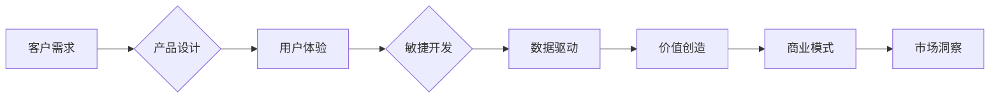

## 生意场上的智慧：站在客户立场

> 关键词：客户需求、产品设计、用户体验、敏捷开发、迭代优化、数据驱动、价值创造、商业模式、市场洞察

### 1. 背景介绍

在瞬息万变的商业环境中，企业要想立于不败之地，必须始终牢记“站在客户立场”的原则。这不仅仅是一种口号，更是一种深入骨髓的经营理念。 

科技的飞速发展为企业提供了前所未有的机遇，但也带来了前所未有的挑战。新兴技术如云计算、大数据、人工智能等不断涌现，为企业提供了强大的工具，但同时也加剧了市场竞争的激烈程度。在这种情况下，企业需要更加敏锐地洞察客户需求，快速响应市场变化，不断迭代优化产品和服务，才能在激烈的竞争中脱颖而出。

### 2. 核心概念与联系

**2.1 客户需求**

客户需求是企业一切经营活动的出发点和落脚点。了解客户的需求，才能开发出真正有价值的产品和服务。

**2.2 产品设计**

产品设计是将客户需求转化为现实产品和服务的桥梁。优秀的产品设计不仅要满足客户的功能需求，更要注重用户体验，创造出简洁、易用、美观的界面和交互体验。

**2.3 用户体验**

用户体验 (UX) 是用户与产品交互过程中所感受到的整体感受。良好的用户体验可以提升客户满意度，增强品牌忠诚度，最终促进企业发展。

**2.4 敏捷开发**

敏捷开发是一种迭代式的软件开发方法，强调快速响应客户需求，不断改进产品。它通过短周期迭代开发，及时收集客户反馈，并根据反馈进行产品调整，确保产品始终满足客户需求。

**2.5 数据驱动**

数据驱动是指利用数据分析和洞察来指导企业决策。通过收集和分析客户行为数据、市场趋势数据等，企业可以更准确地了解客户需求，优化产品设计，提高运营效率。

**2.6 价值创造**

价值创造是企业的核心目标。企业通过提供有价值的产品和服务，满足客户需求，并获得相应的回报。

**2.7 商业模式**

商业模式是指企业如何创造、传递和捕捉价值的模式。不同的商业模式对应不同的价值创造方式和盈利模式。

**2.8 市场洞察**

市场洞察是指对市场趋势、竞争对手、客户需求等进行深入分析，以获得对市场环境的全面了解。

**2.9 流程图**



### 3. 核心算法原理 & 具体操作步骤

**3.1 算法原理概述**

在本文中，我们主要探讨的是一种基于数据驱动的客户需求分析算法。该算法利用机器学习技术，从海量客户数据中挖掘出潜在的需求，并将其转化为可操作的商业 insights。

**3.2 算法步骤详解**

1. **数据收集:** 收集来自各种渠道的客户数据，例如用户行为数据、产品评价数据、社交媒体数据等。
2. **数据预处理:** 对收集到的数据进行清洗、转换和格式化，以确保数据质量和算法的有效运行。
3. **特征提取:** 从客户数据中提取具有代表性的特征，例如用户年龄、性别、购买历史、浏览记录等。
4. **模型训练:** 利用机器学习算法，例如聚类算法、分类算法、回归算法等，对提取的特征进行训练，建立客户需求预测模型。
5. **需求预测:** 将新客户数据输入到训练好的模型中，预测其潜在的需求。
6. **需求分析:** 对预测出的客户需求进行分析和解读，并将其转化为可操作的商业 insights。

**3.3 算法优缺点**

**优点:**

* 数据驱动，能够更准确地预测客户需求。
* 能够处理海量数据，发现隐藏的需求。
* 能够不断迭代优化，随着数据积累而提高预测精度。

**缺点:**

* 需要大量的客户数据作为训练样本。
* 模型训练需要一定的技术门槛。
* 预测结果可能存在一定的误差。

**3.4 算法应用领域**

* **产品开发:** 帮助企业了解客户需求，开发出更符合市场需求的产品。
* **市场营销:** 帮助企业精准定位目标客户，制定有效的营销策略。
* **客户服务:** 帮助企业预判客户问题，提供更及时有效的服务。

### 4. 数学模型和公式 & 详细讲解 & 举例说明

**4.1 数学模型构建**

我们使用一个简单的线性回归模型来预测客户对某产品的购买意愿。

假设：

* $x_1$ 为客户的年龄
* $x_2$ 为客户的收入
* $y$ 为客户对产品的购买意愿

模型公式：

$$y = \beta_0 + \beta_1 x_1 + \beta_2 x_2 + \epsilon$$

其中：

* $\beta_0$ 为截距项
* $\beta_1$ 和 $\beta_2$ 为回归系数，分别表示年龄和收入对购买意愿的影响
* $\epsilon$ 为随机误差项

**4.2 公式推导过程**

通过最小二乘法，我们可以求解出模型参数 $\beta_0$, $\beta_1$, $\beta_2$，使得模型预测值与实际值之间的误差最小。

**4.3 案例分析与讲解**

假设我们收集了100个客户的数据，并使用线性回归模型进行训练。训练结果显示，$\beta_1 = 0.05$，$\beta_2 = 0.02$。这意味着，客户年龄每增加1岁，购买意愿增加0.05，客户收入每增加1元，购买意愿增加0.02。

### 5. 项目实践：代码实例和详细解释说明

**5.1 开发环境搭建**

* Python 3.x
* Jupyter Notebook
* scikit-learn

**5.2 源代码详细实现**

```python
import pandas as pd
from sklearn.linear_model import LinearRegression

# 加载数据
data = pd.read_csv('customer_data.csv')

# 提取特征和目标变量
X = data[['age', 'income']]
y = data['purchase_intention']

# 创建线性回归模型
model = LinearRegression()

# 训练模型
model.fit(X, y)

# 获取模型参数
intercept = model.intercept_
coef_age = model.coef_[0]
coef_income = model.coef_[1]

# 打印模型参数
print(f'Intercept: {intercept}')
print(f'Coefficient of age: {coef_age}')
print(f'Coefficient of income: {coef_income}')
```

**5.3 代码解读与分析**

* 首先，我们使用 pandas 库加载客户数据。
* 然后，我们提取年龄和收入作为特征，购买意愿作为目标变量。
* 接着，我们创建线性回归模型，并使用 fit() 方法训练模型。
* 最后，我们获取模型参数，并打印出来。

**5.4 运行结果展示**

运行代码后，会输出模型参数，例如截距项、年龄系数、收入系数等。这些参数可以帮助我们理解客户年龄和收入对购买意愿的影响。

### 6. 实际应用场景

**6.1 产品推荐**

根据客户的年龄、收入、购买历史等数据，推荐他们可能感兴趣的产品。

**6.2 个性化营销**

根据客户的个性化需求，定制个性化的营销方案，提高营销效果。

**6.3 客户服务优化**

根据客户的反馈和行为数据，预测客户可能遇到的问题，并提供预emptive 的解决方案。

**6.4 未来应用展望**

随着人工智能技术的不断发展，客户需求分析算法将更加智能化、精准化。未来，我们可以利用更先进的机器学习算法，例如深度学习算法，挖掘更深层次的客户需求，为企业提供更全面的商业 insights。

### 7. 工具和资源推荐

**7.1 学习资源推荐**

* **书籍:**
    * 《Python机器学习实战》
    * 《数据挖掘与机器学习》
* **在线课程:**
    * Coursera: Machine Learning
    * edX: Artificial Intelligence

**7.2 开发工具推荐**

* **Python:** 
    * scikit-learn
    * TensorFlow
    * PyTorch

**7.3 相关论文推荐**

* 《Customer Segmentation Using Machine Learning》
* 《Predicting Customer Churn Using Machine Learning》

### 8. 总结：未来发展趋势与挑战

**8.1 研究成果总结**

本文探讨了站在客户立场，利用数据驱动和机器学习技术进行客户需求分析的思路和方法。通过构建数学模型、训练算法、进行代码实现和案例分析，我们展示了客户需求分析的具体步骤和应用场景。

**8.2 未来发展趋势**

未来，客户需求分析将更加智能化、精准化、个性化。

* **智能化:** 利用更先进的机器学习算法，例如深度学习算法，挖掘更深层次的客户需求。
* **精准化:** 通过更细粒度的客户画像和行为分析，更加精准地预测客户需求。
* **个性化:** 为每个客户提供个性化的产品和服务，满足其独特的需求。

**8.3 面临的挑战**

* **数据质量:** 客户数据质量直接影响算法的准确性，需要不断完善数据收集、清洗和预处理流程。
* **算法复杂度:** 随着客户需求的复杂性增加，算法模型也需要更加复杂，这需要不断提升算法设计和优化能力。
* **隐私保护:** 客户数据涉及隐私问题，需要采取有效的措施保护客户数据安全。

**8.4 研究展望**

我们将继续深入研究客户需求分析领域，探索更先进的算法和技术，为企业提供更智能、更精准、更个性化的客户需求分析解决方案。

### 9. 附录：常见问题与解答

**9.1 如何收集高质量的客户数据？**

可以通过多种渠道收集客户数据，例如用户行为数据、产品评价数据、社交媒体数据、问卷调查等。需要注意的是，收集数据时要遵守法律法规，并获得客户的同意。

**9.2 如何处理客户数据中的缺失值？**

可以采用多种方法处理缺失值，例如删除缺失值、用平均值填充缺失值、用机器学习算法预测缺失值等。

**9.3 如何评估客户需求分析算法的性能？**

可以使用多种指标评估算法的性能，例如准确率、召回率、F1-score等。

**9.4 如何将客户需求分析结果转化为商业 insights？**

需要将分析结果与业务目标相结合，并进行深入的解读和分析，才能将其转化为可操作的商业 insights。


作者：禅与计算机程序设计艺术 / Zen and the Art of Computer Programming 
