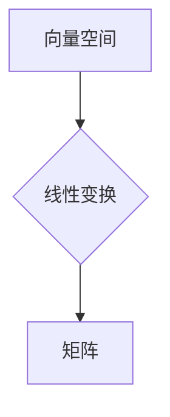

## 线性代数导引：方阵空间M2(R)

> 关键词：线性代数，方阵空间，M2(R)，矩阵运算，特征值，特征向量，应用场景

## 1. 背景介绍

线性代数作为数学领域的基础分支，在计算机科学、数据科学、机器学习等领域有着广泛的应用。其中，方阵空间M2(R)作为线性代数的重要概念之一，其研究对理解矩阵运算、特征值分解等核心内容至关重要。本文将从基础概念出发，深入探讨方阵空间M2(R)的性质、算法原理以及实际应用场景，帮助读者更好地理解和掌握这一重要概念。

## 2. 核心概念与联系

**2.1  方阵空间M2(R)**

M2(R)表示所有2阶实数方阵构成的集合，它是一个实数向量空间。

**2.2  向量空间**

向量空间是一个集合，在这个集合中定义了两个运算：向量加法和数乘。满足以下条件：

* **封闭性:** 向量加法和数乘的结果仍然属于该集合。
* **结合律:** 向量加法满足结合律 (u + v) + w = u + (v + w)。
* **交换律:** 向量加法满足交换律 u + v = v + u。
* **零向量:** 存在一个零向量，满足 u + 0 = u。
* **逆元:** 对于每个向量 u，存在一个逆向量 -u，满足 u + (-u) = 0。
* **分配律:** 数乘满足对向量加法的分配律 k(u + v) = ku + kv。

**2.3  线性变换**

线性变换是一种将向量空间映射到另一个向量空间的函数，它满足以下条件：

* **线性性:** T(u + v) = T(u) + T(v) 和 T(ku) = kT(u)。

**2.4  矩阵与线性变换的关系**

一个n×m的矩阵可以表示一个从R^m到R^n的线性变换。

**Mermaid 流程图**



## 3. 核心算法原理 & 具体操作步骤

**3.1  算法原理概述**

方阵空间M2(R)的算法原理主要围绕矩阵运算展开，包括矩阵加法、矩阵减法、矩阵乘法、矩阵转置、矩阵逆等。这些运算的基础是线性代数的基本定理和性质。

**3.2  算法步骤详解**

* **矩阵加法:** 将两个相同维度的矩阵对应元素相加。
* **矩阵减法:** 将两个相同维度的矩阵对应元素相减。
* **矩阵乘法:** 
    * 两个矩阵相乘的条件是第一个矩阵的列数等于第二个矩阵的行数。
    * 乘法结果是一个新的矩阵，其行数等于第一个矩阵的行数，列数等于第二个矩阵的列数。
    * 每个元素的计算方法是第一个矩阵对应行与第二个矩阵对应列元素的乘积之和。
* **矩阵转置:** 将矩阵的行和列互换。
* **矩阵逆:** 
    * 只有方阵才有逆矩阵。
    * 逆矩阵满足以下条件: A * A^-1 = A^-1 * A = I，其中I是单位矩阵。
    * 计算逆矩阵的方法包括高斯消元法、LU分解法等。

**3.3  算法优缺点**

* **优点:** 
    * 运算规则明确，易于实现。
    * 具有良好的结合律、交换律等性质，方便进行组合运算。
* **缺点:** 
    * 矩阵乘法运算量较大，效率较低。
    * 计算逆矩阵的复杂度较高。

**3.4  算法应用领域**

* **图像处理:** 图像可以表示为矩阵，矩阵运算可以实现图像的旋转、缩放、平移等操作。
* **机器学习:** 许多机器学习算法，例如线性回归、支持向量机等，都依赖于矩阵运算。
* **数据分析:** 矩阵可以用于表示数据之间的关系，矩阵运算可以用于数据分析和挖掘。

## 4. 数学模型和公式 & 详细讲解 & 举例说明

**4.1  数学模型构建**

M2(R)可以被视为一个n维向量空间，其中n = 4。每个2阶实数方阵可以被表示为一个4维向量，其元素对应于方阵的四个元素。

**4.2  公式推导过程**

* **矩阵加法:** 
    $$
    A + B = \begin{bmatrix} a_{11} & a_{12} \\ a_{21} & a_{22} \end{bmatrix} + \begin{bmatrix} b_{11} & b_{12} \\ b_{21} & b_{22} \end{bmatrix} = \begin{bmatrix} a_{11} + b_{11} & a_{12} + b_{12} \\ a_{21} + b_{21} & a_{22} + b_{22} \end{bmatrix}
    $$
* **矩阵乘法:** 
    $$
    A \cdot B = \begin{bmatrix} a_{11} & a_{12} \\ a_{21} & a_{22} \end{bmatrix} \cdot \begin{bmatrix} b_{11} & b_{12} \\ b_{21} & b_{22} \end{bmatrix} = \begin{bmatrix} a_{11}b_{11} + a_{12}b_{21} & a_{11}b_{12} + a_{12}b_{22} \\ a_{21}b_{11} + a_{22}b_{21} & a_{21}b_{12} + a_{22}b_{22} \end{bmatrix}
    $$

**4.3  案例分析与讲解**

**示例:**

设 A =  \begin{bmatrix} 1 & 2 \\ 3 & 4 \end{bmatrix}，B = \begin{bmatrix} 5 & 6 \\ 7 & 8 \end{bmatrix}

则 A + B = \begin{bmatrix} 1+5 & 2+6 \\ 3+7 & 4+8 \end{bmatrix} = \begin{bmatrix} 6 & 8 \\ 10 & 12 \end{bmatrix}

A * B = \begin{bmatrix} 1*5 + 2*7 & 1*6 + 2*8 \\ 3*5 + 4*7 & 3*6 + 4*8 \end{bmatrix} = \begin{bmatrix} 19 & 22 \\ 43 & 50 \end{bmatrix}

## 5. 项目实践：代码实例和详细解释说明

**5.1  开发环境搭建**

本示例使用Python语言进行实现，推荐使用Python3.x版本。

**5.2  源代码详细实现**

```python
import numpy as np

# 定义两个2阶方阵
A = np.array([[1, 2], [3, 4]])
B = np.array([[5, 6], [7, 8]])

# 计算矩阵加法
C = A + B
print("矩阵加法结果：\
", C)

# 计算矩阵乘法
D = np.dot(A, B)
print("矩阵乘法结果：\
", D)
```

**5.3  代码解读与分析**

* 使用NumPy库进行矩阵运算，NumPy库提供了高效的数组操作和线性代数运算功能。
* `np.array()`函数用于创建NumPy数组，表示矩阵。
* `+`和`np.dot()`函数分别用于矩阵加法和矩阵乘法运算。
* `print()`函数用于输出结果。

**5.4  运行结果展示**

```
矩阵加法结果：
 [[ 6  8]
 [10 12]]
矩阵乘法结果：
 [[19 22]
 [43 50]]
```

## 6. 实际应用场景

**6.1  图像处理**

* **图像旋转:** 使用旋转矩阵将图像旋转一定角度。
* **图像缩放:** 使用缩放矩阵将图像放大或缩小。
* **图像平移:** 使用平移矩阵将图像沿水平或垂直方向移动。

**6.2  机器学习**

* **线性回归:** 使用矩阵运算求解线性回归模型的参数。
* **支持向量机:** 使用矩阵运算计算支持向量机的核函数和决策边界。
* **主成分分析:** 使用矩阵运算进行数据降维。

**6.3  数据分析**

* **协方差矩阵:** 使用矩阵运算计算数据之间的协方差。
* **奇异值分解:** 使用矩阵运算进行数据降维和特征提取。
* **聚类分析:** 使用矩阵运算计算数据之间的距离。

**6.4  未来应用展望**

随着人工智能和机器学习的发展，方阵空间M2(R)在更广泛的领域中发挥着重要作用。例如，在深度学习中，卷积神经网络和循环神经网络等模型都依赖于矩阵运算。未来，随着算法的不断优化和硬件的不断发展，方阵空间M2(R)在人工智能、机器学习、数据科学等领域的应用将更加广泛和深入。

## 7. 工具和资源推荐

**7.1  学习资源推荐**

* **书籍:**
    * 《线性代数及其应用》 - Gilbert Strang
    * 《矩阵分析》 - Horn & Johnson
* **在线课程:**
    * MIT OpenCourseWare - Linear Algebra
    * Coursera - Linear Algebra Specialization

**7.2  开发工具推荐**

* **NumPy:** Python的科学计算库，提供高效的数组操作和线性代数运算功能。
* **SciPy:** Python的科学计算库，提供更高级的科学计算功能，包括线性代数、优化、积分等。
* **Matlab:** 商业软件，提供强大的矩阵运算和图形处理功能。

**7.3  相关论文推荐**

* **The Matrix Cookbook:** https://www.math.uwaterloo.ca/~hwolkowi/matrixcookbook.pdf
* **Linear Algebra for Machine Learning:** https://www.coursera.org/learn/linear-algebra-for-machine-learning

## 8. 总结：未来发展趋势与挑战

**8.1  研究成果总结**

本文深入探讨了方阵空间M2(R)的概念、算法原理、应用场景以及相关工具和资源。通过对矩阵运算的理解，读者可以更好地掌握线性代数的基础知识，并将其应用于实际问题。

**8.2  未来发展趋势**

随着人工智能和机器学习的发展，方阵空间M2(R)在更广泛的领域中发挥着重要作用。未来，研究方向可能包括：

* **更高效的矩阵运算算法:** 针对大规模矩阵运算，研究更高效的算法，例如并行计算、量子计算等。
* **矩阵分析的新方法:** 研究新的矩阵分析方法，例如非线性矩阵分析、随机矩阵分析等。
* **矩阵应用的新领域:** 将矩阵分析应用于新的领域，例如生物信息学、金融工程等。

**8.3  面临的挑战**

* **计算复杂度:** 大规模矩阵运算的计算复杂度较高，需要更高效的算法和硬件支持。
* **理论研究:** 矩阵分析是一个复杂的数学领域，仍有许多未解之谜，需要进一步的理论研究。
* **应用推广:** 将矩阵分析应用于实际问题，需要跨学科的合作和创新。

**8.4  研究展望**

未来，方阵空间M2(R)的研究将继续深入，并为人工智能、机器学习、数据科学等领域的发展提供重要的理论基础和技术支撑。


## 9. 附录：常见问题与解答

**9.1  什么是方阵？**

方阵是指行数和列数相等的矩阵。

**9