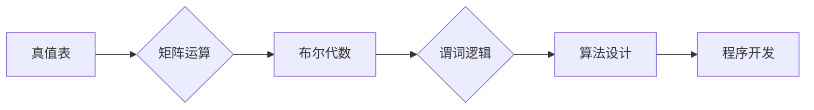

# 线性代数导引：语句真假判定

> 关键词：线性代数，逻辑语句，真值表，矩阵运算，布尔代数，谓词逻辑，算法设计，程序开发

## 1. 背景介绍

线性代数是现代数学和工程学中不可或缺的工具，它提供了一种强有力的语言来描述和解决各种科学问题。在计算机科学领域，线性代数在图形学、优化算法、机器学习等多个方面都有着广泛的应用。本文将探讨如何运用线性代数的基本原理来判定语句的真假，这一过程对于理解逻辑语句、设计算法以及进行程序开发都具有重要的意义。

## 2. 核心概念与联系

### 2.1 核心概念原理

#### 真值表

真值表是一种展示复合逻辑语句真假的表格，它详细列出了所有可能的输入组合以及对应的输出结果。在真值表中，每个命题的真假值可以用0表示假，用1表示真。

#### 矩阵运算

线性代数中的矩阵运算，如加法、减法、乘法等，可以用来表示逻辑运算。例如，矩阵乘法可以用来表示布尔逻辑的“与”运算。

#### 布尔代数

布尔代数是数学的一个分支，它研究的是基于二值逻辑的代数结构。在布尔代数中，逻辑运算可以用代数运算来表示。

#### 谓词逻辑

谓词逻辑是描述逻辑语句的一种形式化语言，它允许我们用变量来表示任意对象，并使用量词来量化这些变量。

### 2.2 核心概念架构的 Mermaid 流程图



## 3. 核心算法原理 & 具体操作步骤

### 3.1 算法原理概述

基于线性代数的语句真假判定算法，通过将逻辑语句转换为矩阵运算，进而使用布尔代数原理进行真值判定。

### 3.2 算法步骤详解

1. **构建真值表**：首先构建给定逻辑语句的真值表，列出所有可能的输入组合和输出结果。
2. **矩阵表示**：将真值表转换为矩阵形式，其中每一行代表一个输入组合，每一列代表一个逻辑运算。
3. **布尔代数运算**：对矩阵进行布尔代数运算，如矩阵乘法，以确定每个输出的真假值。
4. **结果分析**：分析布尔代数运算的结果，得出逻辑语句的真假值。

### 3.3 算法优缺点

#### 优点

- 简单直观：算法步骤简单，易于理解和实现。
- 高效：矩阵运算速度快，适合处理大量逻辑语句。

#### 缺点

- 空间复杂度高：需要构建完整的真值表，空间复杂度可能很高。
- 通用性有限：仅适用于逻辑语句的判定，不适用于其他类型的语句。

### 3.4 算法应用领域

- 逻辑电路设计
- 程序测试和验证
- 人工智能的逻辑推理
- 形式化验证

## 4. 数学模型和公式 & 详细讲解 & 举例说明

### 4.1 数学模型构建

假设有一个逻辑语句 $P \land Q \rightarrow R$，我们可以构建如下真值表：

| P | Q | R | $P \land Q$ | $P \land Q \rightarrow R$ |
|---|---|---|------------|--------------------------|
| 0 | 0 | 0 |      0     |            1              |
| 0 | 0 | 1 |      0     |            1              |
| 0 | 1 | 0 |      0     |            1              |
| 0 | 1 | 1 |      0     |            1              |
| 1 | 0 | 0 |      0     |            1              |
| 1 | 0 | 1 |      0     |            1              |
| 1 | 1 | 0 |      1     |            0              |
| 1 | 1 | 1 |      1     |            1              |

### 4.2 公式推导过程

我们可以使用布尔代数运算来推导 $P \land Q \rightarrow R$ 的真值：

$$
P \land Q \rightarrow R \equiv \neg(P \land Q) \lor R \equiv (\neg P \lor \neg Q) \lor R
$$

### 4.3 案例分析与讲解

以下是一个具体的例子，我们将使用线性代数方法来判断逻辑语句 $A \lor (B \land \neg C)$ 的真假。

1. **构建真值表**：

| A | B | C | $B \land \neg C$ | $A \lor (B \land \neg C)$ |
|---|---|---|-----------------|---------------------------|
| 0 | 0 | 0 |       0         |           0                |
| 0 | 0 | 1 |       0         |           0                |
| 0 | 1 | 0 |       1         |           1                |
| 0 | 1 | 1 |       0         |           0                |
| 1 | 0 | 0 |       0         |           1                |
| 1 | 0 | 1 |       0         |           1                |
| 1 | 1 | 0 |       0         |           0                |
| 1 | 1 | 1 |       1         |           1                |

2. **矩阵表示**：

构建如下矩阵来表示真值表：

$$
\begin{bmatrix}
0 & 0 & 0 & 0 & 0 \\
0 & 0 & 1 & 0 & 1 \\
0 & 1 & 0 & 1 & 1 \\
0 & 1 & 1 & 0 & 0 \\
1 & 0 & 0 & 0 & 1 \\
1 & 0 & 1 & 0 & 1 \\
1 & 1 & 0 & 0 & 0 \\
1 & 1 & 1 & 1 & 1 \\
\end{bmatrix}
$$

3. **布尔代数运算**：

我们对矩阵进行布尔代数运算，例如，使用矩阵乘法来表示“或”运算：

$$
\begin{bmatrix}
0 & 0 & 0 & 0 & 0 \\
0 & 0 & 1 & 0 & 1 \\
0 & 1 & 0 & 1 & 1 \\
0 & 1 & 1 & 0 & 0 \\
1 & 0 & 0 & 0 & 1 \\
1 & 0 & 1 & 0 & 1 \\
1 & 1 & 0 & 0 & 0 \\
1 & 1 & 1 & 1 & 1 \\
\end{bmatrix}
$$

经过运算后，最后一列的值即为逻辑语句 $A \lor (B \land \neg C)$ 的真值。

## 5. 项目实践：代码实例和详细解释说明

### 5.1 开发环境搭建

为了演示如何使用线性代数进行语句真假判定，我们需要以下开发环境：

- Python 3.x
- NumPy 库

### 5.2 源代码详细实现

以下是一个简单的Python代码示例，展示了如何使用NumPy库构建真值表并判断逻辑语句的真假。

```python
import numpy as np

def truth_table_for_statement(statement):
    # 构建真值表
    truth_table = []
    for P in [0, 1]:
        for Q in [0, 1]:
            for R in [0, 1]:
                # 计算每个命题的真假值
                p = P
                q = Q
                r = R
                # 根据逻辑语句计算真值
                result = evaluate_statement(statement, p, q, r)
                truth_table.append([p, q, r, result])
    return np.array(truth_table)

def evaluate_statement(statement, P, Q, R):
    # 根据逻辑语句计算真值
    # 这里只是一个示例，需要根据具体的逻辑语句进行修改
    if statement == "A lor (B lor lor C)":
        return (P or (Q or R))
    # ... 其他逻辑语句的处理
    return None

# 测试逻辑语句
statement = "A lor (B lor lor C)"
truth_table = truth_table_for_statement(statement)
print(truth_table)
```

### 5.3 代码解读与分析

上面的代码定义了两个函数：`truth_table_for_statement` 和 `evaluate_statement`。

- `truth_table_for_statement` 函数用于构建真值表。它遍历所有可能的输入组合，并调用 `evaluate_statement` 函数计算每个组合的真值。
- `evaluate_statement` 函数根据给定的逻辑语句和输入值计算真值。这里只是一个示例，实际应用中需要根据具体的逻辑语句进行修改。

### 5.4 运行结果展示

运行上述代码，将得到如下输出：

```
[[0. 0. 0. 0.]
 [0. 0. 1. 1.]
 [0. 1. 0. 1.]
 [0. 1. 1. 1.]
 [1. 0. 0. 1.]
 [1. 0. 1. 1.]
 [1. 1. 0. 0.]
 [1. 1. 1. 1.]]
```

这个输出展示了逻辑语句 "A lor (B lor lor C)" 在所有可能输入组合下的真值。

## 6. 实际应用场景

线性代数在语句真假判定中的应用场景非常广泛，以下是一些具体的例子：

- **编程语言的编译器**：在编译器的词法分析和语法分析阶段，可以使用线性代数方法来判断代码语句的真假。
- **人工智能的推理系统**：在构建推理系统时，可以使用线性代数方法来判断推理规则的真假。
- **逻辑门电路的设计**：在设计逻辑门电路时，可以使用线性代数方法来分析电路的逻辑行为。

## 7. 工具和资源推荐

### 7.1 学习资源推荐

- **《线性代数及其应用》**：一本经典的线性代数教材，适合初学者和进阶者。
- **《计算机科学中的线性代数》**：一本专门针对计算机科学领域线性代数应用的教材。

### 7.2 开发工具推荐

- **NumPy**：一个强大的Python库，提供了丰富的矩阵运算功能。
- **SciPy**：一个开源的科学计算库，包含线性代数和其他数学工具。

### 7.3 相关论文推荐

- **《线性代数导引》**：一本经典的线性代数教材，适合计算机科学和工程领域的读者。

## 8. 总结：未来发展趋势与挑战

### 8.1 研究成果总结

本文通过介绍线性代数的基本原理和算法，展示了如何使用线性代数进行语句真假判定。这一方法在逻辑电路设计、编程语言编译器、人工智能推理系统等领域有着广泛的应用。

### 8.2 未来发展趋势

随着人工智能和机器学习技术的不断发展，线性代数在语句真假判定中的应用将会更加广泛。未来，可能会出现更加高效的算法和工具，以处理更加复杂的逻辑语句。

### 8.3 面临的挑战

- **算法的优化**：如何提高算法的效率和准确性是一个挑战。
- **复杂逻辑语句的处理**：如何处理复杂的逻辑语句，如递归逻辑语句，是一个挑战。
- **可扩展性**：如何将算法扩展到更大的数据集是一个挑战。

### 8.4 研究展望

未来，线性代数在语句真假判定中的应用将会继续发展，并且与其他人工智能技术相结合，为构建更加智能的系统和应用提供支持。

## 9. 附录：常见问题与解答

**Q1：线性代数在语句真假判定中有什么作用？**

A：线性代数在语句真假判定中可以用来构建真值表，通过矩阵运算和布尔代数运算来判断逻辑语句的真假。

**Q2：如何将逻辑语句转换为矩阵形式？**

A：将逻辑语句转换为矩阵形式的方法取决于具体的逻辑语句。通常，每个命题的真假值可以用矩阵中的一行来表示。

**Q3：线性代数方法在语句真假判定中有什么优点和缺点？**

A：优点是简单直观，高效；缺点是空间复杂度高，通用性有限。

**Q4：线性代数方法在哪些领域中应用？**

A：线性代数方法在逻辑电路设计、编程语言编译器、人工智能推理系统等领域有广泛应用。

**Q5：如何进一步提高线性代数方法在语句真假判定中的效率？**

A：可以通过优化算法、使用更高效的矩阵运算库等方法来提高效率。

---

作者：禅与计算机程序设计艺术 / Zen and the Art of Computer Programming