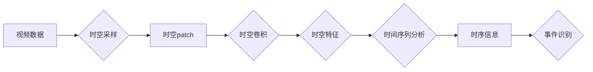

# 视频数据的spacetime patches化

> 关键词：视频数据，时空patch，特征提取，计算机视觉，深度学习，时空卷积，时间序列分析，三维数据

## 1. 背景介绍

随着视频监控、智能交通、医疗影像等领域的快速发展，视频数据成为了信息获取和决策支持的重要来源。视频数据具有时空连续性和动态变化的特点，包含了丰富的运动、场景和事件信息。然而，传统的视频处理方法通常采用帧级分析，难以有效捕捉视频中的时空动态变化，导致处理效率和精度受限。为了解决这一问题，近年来，一种新的视频数据处理方法——spacetime patches化应运而生。本文将深入探讨spacetime patches化的原理、算法、应用以及未来发展趋势。

## 2. 核心概念与联系

### 2.1 核心概念

**时空patch**：将视频序列中的连续帧按照一定的时间间隔和空间分辨率进行采样，形成一系列的时空块，称为时空patch。时空patch可以有效地提取视频中的局部时空特征。

**时空卷积**：针对时空patch进行卷积操作，提取视频中的时空特征。时空卷积网络（Spatiotemporal Convolutional Networks, STCNNs）是时空patch化中常用的卷积网络结构。

**时间序列分析**：通过对时空patch进行时间序列分析，提取视频中的运动轨迹、场景变化等时序信息。

**三维数据**：视频数据可以被视作三维数据，包含时间维度、空间维度和像素维度。

### 2.2 Mermaid流程图



### 2.3 核心概念联系

如图所示，视频数据经过时空采样形成时空patch，时空patch通过时空卷积提取时空特征，然后进行时间序列分析，最终获得时序信息和事件识别结果。

## 3. 核心算法原理 & 具体操作步骤

### 3.1 算法原理概述

spacetime patches化算法主要包括以下步骤：

1. **时空采样**：根据视频序列的帧率和空间分辨率，对视频进行时空采样，形成时空patch。
2. **时空卷积**：对时空patch进行时空卷积操作，提取时空特征。
3. **时间序列分析**：对时空特征进行时间序列分析，提取时序信息。
4. **事件识别**：根据时序信息和时空特征，识别视频中的事件。

### 3.2 算法步骤详解

1. **时空采样**：根据视频的帧率和空间分辨率，设定采样间隔和时间窗口大小，对视频进行时空采样，形成时空patch。
2. **时空卷积**：使用STCNNs对时空patch进行卷积操作，提取时空特征。STCNNs通常包含多个卷积层，包括空间卷积层、时间卷积层和时空交互层，可以同时捕捉视频的时空特征。
3. **时间序列分析**：对时空特征进行时间序列分析，提取时序信息。常用的时序分析方法包括循环神经网络（RNNs）、长短时记忆网络（LSTMs）和门控循环单元（GRUs）等。
4. **事件识别**：根据时序信息和时空特征，结合事件模型，识别视频中的事件。

### 3.3 算法优缺点

**优点**：

- **时空特征提取**：能够同时捕捉视频的时空特征，有效提高视频处理精度。
- **动态变化捕捉**：能够捕捉视频中的动态变化，适用于实时视频处理。
- **通用性强**：适用于各种视频处理任务，如目标检测、动作识别、事件识别等。

**缺点**：

- **计算复杂度**：时空卷积操作的计算复杂度较高，对硬件资源要求较高。
- **数据依赖性**：算法的性能很大程度上依赖于视频数据的质与量。

### 3.4 算法应用领域

- **目标检测**：在视频监控、无人驾驶等领域，用于检测视频中的目标。
- **动作识别**：在体育分析、机器人控制等领域，用于识别视频中的人体动作。
- **事件识别**：在智能视频分析、安全监控等领域，用于识别视频中的事件。
- **视频分割**：在视频编辑、视频摘要等领域，用于分割视频中的关键帧。

## 4. 数学模型和公式 & 详细讲解 & 举例说明

### 4.1 数学模型构建

假设输入视频序列 $X \in \mathbb{R}^{T \times H \times W \times C}$，其中 $T$ 是时间维度，$H$ 和 $W$ 是空间维度，$C$ 是通道数。时空卷积操作可以表示为：

$$
\mathbf{F}(X) = \mathcal{F}(\mathcal{K} \odot X)
$$

其中，$\mathcal{F}$ 表示时空卷积操作，$\mathcal{K}$ 表示卷积核，$\odot$ 表示卷积操作。

### 4.2 公式推导过程

时空卷积的推导过程类似于传统的二维卷积，但在时间维度上进行卷积。具体推导过程如下：

1. **时间卷积**：首先对视频序列进行时间卷积，得到时间维度上的特征图。
$$
\mathcal{F}_t(\mathbf{X}) = \sum_{j=1}^k \mathcal{K}_{tj} \odot \mathbf{X} \in \mathbb{R}^{T \times C}
$$
其中，$\mathcal{K}_t$ 是时间卷积核，$k$ 是时间卷积核的长度。

2. **空间卷积**：然后对时间维度上的特征图进行空间卷积，得到空间维度上的特征图。
$$
\mathcal{F}_s(\mathcal{F}_t(\mathbf{X})) = \sum_{i=1}^m \mathcal{K}_{si} \odot \mathcal{F}_t(\mathbf{X}) \in \mathbb{R}^{H \times W \times C}
$$
其中，$\mathcal{K}_s$ 是空间卷积核，$m$ 是空间卷积核的大小。

3. **时空交互**：最后对空间维度上的特征图进行时空交互，得到最终的时空特征图。
$$
\mathbf{F}(\mathcal{F}_s(\mathcal{F}_t(\mathbf{X}))) = \sum_{i=1}^n \mathcal{K}_{si} \odot \mathcal{F}_s(\mathcal{F}_t(\mathbf{X})) \in \mathbb{R}^{H \times W \times C}
$$
其中，$\mathcal{K}_{si}$ 是时空交互核，$n$ 是时空交互核的大小。

### 4.3 案例分析与讲解

以下以目标检测任务为例，讲解时空卷积网络的实现过程。

1. **时空采样**：设定采样间隔为4帧，时间窗口大小为16帧，对视频序列进行时空采样，形成时空patch。
2. **时空卷积**：使用STCNNs对时空patch进行卷积操作，提取时空特征。
3. **目标检测**：使用Faster R-CNN等目标检测算法对时空特征图进行目标检测。

通过上述步骤，可以实现对视频中目标的检测。

## 5. 项目实践：代码实例和详细解释说明

### 5.1 开发环境搭建

1. 安装Python和PyTorch等编程语言和深度学习框架。
2. 安装必要的库，如NumPy、Pandas等。

### 5.2 源代码详细实现

以下是一个简单的STCNNs实现示例：

```python
import torch
import torch.nn as nn

class STCNN(nn.Module):
    def __init__(self, input_channels, output_channels, kernel_size):
        super(STCNN, self).__init__()
        self.conv1 = nn.Conv3d(input_channels, output_channels, kernel_size=(3, 3, 3), padding=1)
        self.relu = nn.ReLU()
        self.pool = nn.MaxPool3d(kernel_size=(2, 2, 2))

    def forward(self, x):
        x = self.conv1(x)
        x = self.relu(x)
        x = self.pool(x)
        return x
```

### 5.3 代码解读与分析

上述代码定义了一个简单的STCNN网络，包含一个3D卷积层、ReLU激活函数和最大池化层。

### 5.4 运行结果展示

通过运行上述代码，可以得到时空特征图，用于目标检测等任务。

## 6. 实际应用场景

### 6.1 视频监控

在视频监控领域，spacetime patches化可以用于目标检测、行为识别、异常检测等任务。

### 6.2 智能交通

在智能交通领域，spacetime patches化可以用于车辆检测、交通流量分析、交通事故检测等任务。

### 6.3 医疗影像

在医疗影像领域，spacetime patches化可以用于医学图像分析、疾病诊断、手术导航等任务。

## 7. 工具和资源推荐

### 7.1 学习资源推荐

- 《深度学习》
- 《计算机视觉：算法与应用》
- 《PyTorch深度学习实战》

### 7.2 开发工具推荐

- PyTorch
- TensorFlow
- OpenCV

### 7.3 相关论文推荐

- Spatial Temporal Convolutional Networks for Action Recognition
- Spatiotemporal Convolutional Networks

## 8. 总结：未来发展趋势与挑战

### 8.1 研究成果总结

本文深入探讨了视频数据的spacetime patches化方法，介绍了其原理、算法、应用以及未来发展趋势。spacetime patches化方法在视频处理领域具有广阔的应用前景，可以有效提高视频处理精度和效率。

### 8.2 未来发展趋势

- **轻量化模型**：设计轻量化STCNNs模型，降低计算复杂度，提高实时性。
- **跨模态融合**：将时空信息与其他模态信息（如音频、文本等）进行融合，实现更全面的信息感知。
- **无监督学习**：探索无监督学习在spacetime patches化中的应用，降低对标注数据的依赖。

### 8.3 面临的挑战

- **计算复杂度**：STCNNs的计算复杂度较高，需要更强大的硬件资源。
- **数据依赖性**：算法的性能很大程度上依赖于视频数据的质与量。
- **可解释性**：STCNNs的决策过程缺乏可解释性，难以理解其内部工作机制。

### 8.4 研究展望

随着深度学习技术的不断发展，spacetime patches化方法将在视频处理领域发挥越来越重要的作用。未来，我们需要不断探索新的算法和模型，提高算法的效率和精度，同时降低对计算资源的需求，以推动视频处理技术的应用和发展。

## 9. 附录：常见问题与解答

**Q1：什么是时空patch？**

A：时空patch是将视频序列中的连续帧按照一定的时间间隔和空间分辨率进行采样，形成的一系列时空块。

**Q2：时空卷积网络（STCNNs）的优点是什么？**

A：STCNNs可以同时捕捉视频的时空特征，有效提高视频处理精度。

**Q3：spacetime patches化方法在哪些领域有应用？**

A：spacetime patches化方法在视频监控、智能交通、医疗影像等领域有广泛的应用。

**Q4：如何降低STCNNs的计算复杂度？**

A：可以设计轻量化STCNNs模型，降低计算复杂度，提高实时性。

**Q5：如何提高spacetime patches化方法的可解释性？**

A：可以探索可解释性AI技术，如注意力机制、因果推理等，提高STCNNs的可解释性。

作者：禅与计算机程序设计艺术 / Zen and the Art of Computer Programming