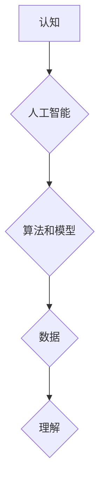

## 认知差：我懂的东西，你不懂

> 关键词：人工智能、深度学习、神经网络、算法、模型、数据、认知、理解

### 1. 背景介绍

在当今科技飞速发展的时代，人工智能（AI）正以惊人的速度改变着我们的世界。从自动驾驶汽车到智能语音助手，AI技术无处不在，并不断渗透到我们生活的方方面面。然而，对于许多人来说，AI仍然是一个神秘而难以理解的概念。

AI的复杂性在于其背后的算法和模型，这些算法和模型通常需要深厚的数学和计算机科学知识才能理解。而这些知识往往是大众所不具备的，导致了AI领域存在着巨大的“认知差”。

这种认知差不仅存在于普通大众中，也存在于不同专业领域的人群之间。例如，对于一个AI工程师来说，他可能非常熟悉深度学习算法，但对于一个生物学家来说，这些算法可能就如同天书一般难以理解。

### 2. 核心概念与联系

**2.1 认知的本质**

认知是指人类通过感知、记忆、思考、语言等方式获取、处理和理解信息的能力。它是一个复杂而多层次的过程，涉及到大脑的多种功能和神经网络的相互作用。

**2.2 人工智能的定义**

人工智能是指模拟人类智能行为的计算机系统。这些系统能够执行与人类类似的任务，例如学习、推理、决策、规划和解决问题。

**2.3 认知差的形成**

认知差的形成主要源于以下几个方面：

* **知识门槛高:** AI领域涉及到大量的数学、统计学、计算机科学等专业知识，这些知识对普通人来说学习难度较大。
* **抽象概念:** AI算法和模型通常是抽象的数学概念，难以用通俗易懂的语言进行解释。
* **缺乏实践经验:** 许多人没有接触过AI的实际应用，因此难以理解其价值和潜力。

**2.4 认知差的危害**

认知差会导致以下问题：

* **误解和偏见:** 对AI缺乏了解的人可能会产生误解和偏见，甚至对AI技术抱有恐惧心理。
* **决策失误:** 在涉及AI技术的决策中，缺乏认知的人可能会做出错误的判断，导致负面后果。
* **社会分化:** 认知差可能会加剧社会分化，导致不同群体之间难以沟通和理解。

**2.5 认知差的解决**

解决认知差需要多方面的努力：

* **普及AI知识:** 通过教育、培训和科普等方式，提高大众对AI的了解。
* **使用通俗易懂的语言:** 将AI技术用通俗易懂的语言进行解释，让更多人能够理解。
* **提供实践机会:** 鼓励人们参与AI的实践应用，让他们亲身体验AI的价值和潜力。

**Mermaid 流程图**



### 3. 核心算法原理 & 具体操作步骤

**3.1 算法原理概述**

深度学习算法是一种基于人工神经网络的机器学习算法。它能够从海量数据中学习复杂的模式和特征，从而实现对图像、语音、文本等多种数据的识别、分类和生成。

**3.2 算法步骤详解**

深度学习算法的训练过程通常包括以下步骤：

1. **数据预处理:** 将原始数据进行清洗、转换和格式化，使其适合深度学习模型的训练。
2. **网络结构设计:** 根据任务需求设计深度神经网络的结构，包括层数、节点数量、激活函数等参数。
3. **参数初始化:** 为神经网络中的参数进行随机初始化。
4. **前向传播:** 将输入数据通过神经网络进行传递，计算输出结果。
5. **反向传播:** 计算输出结果与真实值的误差，并根据误差反向调整神经网络的参数。
6. **优化算法:** 使用优化算法，例如梯度下降法，更新神经网络的参数，使其能够更好地拟合数据。
7. **模型评估:** 使用测试数据评估模型的性能，并根据评估结果进行模型调优。

**3.3 算法优缺点**

**优点:**

* **高准确率:** 深度学习算法能够学习到复杂的模式和特征，从而实现高准确率的预测和分类。
* **自动化特征提取:** 深度学习模型能够自动提取数据的特征，无需人工特征工程。
* **泛化能力强:** 深度学习模型能够对新的数据进行泛化，并取得良好的预测效果。

**缺点:**

* **数据依赖性强:** 深度学习算法需要大量的训练数据才能达到良好的性能。
* **计算资源消耗大:** 深度学习模型的训练过程需要大量的计算资源，例如GPU。
* **可解释性差:** 深度学习模型的决策过程难以解释，其内部机制难以理解。

**3.4 算法应用领域**

深度学习算法在各个领域都有广泛的应用，例如：

* **计算机视觉:** 图像识别、物体检测、图像分割、人脸识别等。
* **自然语言处理:** 文本分类、情感分析、机器翻译、语音识别等。
* **医疗诊断:** 疾病诊断、影像分析、药物研发等。
* **金融预测:** 股票预测、风险评估、欺诈检测等。

### 4. 数学模型和公式 & 详细讲解 & 举例说明

**4.1 数学模型构建**

深度学习模型通常由多个神经网络层组成，每一层都包含多个神经元。每个神经元接收来自上一层的输入信号，并通过激活函数进行处理，输出到下一层。

**4.2 公式推导过程**

深度学习模型的训练过程基于梯度下降算法，其核心公式为：

$$
\theta = \theta - \alpha \nabla L(\theta)
$$

其中：

* $\theta$ 表示神经网络的参数。
* $\alpha$ 表示学习率。
* $\nabla L(\theta)$ 表示损失函数 $L(\theta)$ 对参数 $\theta$ 的梯度。

**4.3 案例分析与讲解**

假设我们有一个简单的深度学习模型，用于分类手写数字。模型的输入是一个 28x28 的图像，输出是一个 10 维的向量，分别代表数字 0 到 9 的概率。

损失函数可以选用交叉熵损失函数，其公式为：

$$
L(\theta) = -\sum_{i=1}^{N} y_i \log(p_i)
$$

其中：

* $N$ 表示样本数量。
* $y_i$ 表示第 $i$ 个样本的真实标签。
* $p_i$ 表示模型预测第 $i$ 个样本标签的概率。

通过反向传播算法，我们可以计算出损失函数对参数 $\theta$ 的梯度，并使用梯度下降算法更新参数 $\theta$，从而使模型的预测结果越来越准确。

### 5. 项目实践：代码实例和详细解释说明

**5.1 开发环境搭建**

为了实现深度学习模型的训练和测试，我们需要搭建一个合适的开发环境。常用的开发环境包括：

* **Python:** 深度学习框架的编程语言。
* **TensorFlow/PyTorch:** 深度学习框架。
* **GPU:** 加速深度学习模型训练的硬件。

**5.2 源代码详细实现**

以下是一个使用 TensorFlow 框架训练手写数字分类模型的简单代码示例：

```python
import tensorflow as tf

# 定义模型结构
model = tf.keras.models.Sequential([
    tf.keras.layers.Flatten(input_shape=(28, 28)),
    tf.keras.layers.Dense(128, activation='relu'),
    tf.keras.layers.Dense(10, activation='softmax')
])

# 编译模型
model.compile(optimizer='adam',
              loss='sparse_categorical_crossentropy',
              metrics=['accuracy'])

# 训练模型
model.fit(x_train, y_train, epochs=5)

# 测试模型
loss, accuracy = model.evaluate(x_test, y_test)
print('Test loss:', loss)
print('Test accuracy:', accuracy)
```

**5.3 代码解读与分析**

这段代码首先定义了一个简单的深度学习模型，包含两层全连接神经网络层。然后，使用 Adam 优化器和交叉熵损失函数对模型进行编译。最后，使用训练数据训练模型，并使用测试数据评估模型的性能。

**5.4 运行结果展示**

训练完成后，我们可以查看模型的训练损失和准确率曲线，以及测试集上的损失和准确率。

### 6. 实际应用场景

**6.1 自动驾驶**

深度学习算法在自动驾驶领域中被广泛应用于图像识别、物体检测、路径规划等方面。例如，自动驾驶汽车可以使用深度学习模型识别道路上的行人、车辆和交通信号灯，从而做出安全驾驶决策。

**6.2 智能语音助手**

智能语音助手，例如 Siri 和 Alexa，也依赖于深度学习算法来实现语音识别、自然语言理解和对话生成等功能。

**6.3 医疗诊断**

深度学习算法在医疗诊断领域中也展现出巨大的潜力。例如，深度学习模型可以用于分析医学影像，辅助医生诊断疾病。

**6.4 未来应用展望**

随着深度学习算法的不断发展，其应用场景将会更加广泛。例如，深度学习可能被用于个性化教育、精准医疗、科学研究等领域。

### 7. 工具和资源推荐

**7.1 学习资源推荐**

* **课程:** Coursera、edX、Udacity 等平台提供丰富的深度学习课程。
* **书籍:** 《深度学习》、《神经网络与深度学习》等书籍是深度学习学习的经典教材。
* **博客:** TensorFlow、PyTorch 等深度学习框架的官方博客提供最新的技术资讯和应用案例。

**7.2 开发工具推荐**

* **TensorFlow:** Google 开发的开源深度学习框架。
* **PyTorch:** Facebook 开发的开源深度学习框架。
* **Keras:** TensorFlow 上的深度学习 API，易于使用。

**7.3 相关论文推荐**

* **AlexNet:** 《ImageNet Classification with Deep Convolutional Neural Networks》
* **VGGNet:** 《Very Deep Convolutional Networks for Large-Scale Image Recognition》
* **ResNet:** 《Deep Residual Learning for Image Recognition》

### 8. 总结：未来发展趋势与挑战

**8.1 研究成果总结**

近年来，深度学习算法取得了令人瞩目的成就，在图像识别、自然语言处理、语音识别等领域取得了突破性的进展。

**8.2 未来发展趋势**

* **模型规模的扩大:** 未来深度学习模型的规模将会进一步扩大，拥有更多的参数和层数，从而实现更强大的学习能力。
* **算法的创新:** 研究人员将继续探索新的深度学习算法，例如强化学习、生成对抗网络等，以解决更复杂的任务。
* **硬件的加速:** 随着硬件技术的进步，例如GPU 和 TPU 的发展，深度学习模型的训练速度将会进一步提升。

**8.3 面临的挑战**

* **数据隐私和安全:** 深度学习算法依赖于海量数据，如何保护数据隐私和安全是一个重要的挑战。
* **算法可解释性:** 深度学习模型的决策过程难以解释，如何提高算法的可解释性是一个重要的研究方向。
* **公平性和偏见:** 深度学习模型可能存在公平性和偏见问题，需要采取措施确保模型的公平性和公正性。

**8.4 研究展望**

未来，深度学习技术将继续发展，并对我们的生活产生更深远的影响。我们需要积极探索深度学习的应用潜力，同时也要关注其带来的挑战，并采取措施确保其安全、公平和可持续发展。

### 9. 附录：常见问题与解答

**9.1 什么是深度学习？**

深度学习是一种基于人工神经网络的机器学习算法，能够从海量数据中学习复杂的模式和特征。

**9.2 深度学习算法有哪些？**

常见的深度学习算法包括卷积神经网络（CNN）、循环神经网络（RNN）、生成对抗网络（GAN）等。

**9.3 如何学习深度学习？**

可以通过在线课程、书籍、博客等方式学习深度学习。

