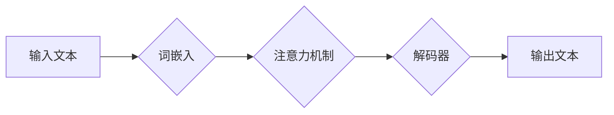

## 语言与思维的区别：大模型的认知难题

> 关键词：大语言模型、认知科学、人工智能、自然语言处理、思维、语言、符号系统、知识表示、泛化能力

## 1. 背景介绍

近年来，大语言模型（Large Language Models，LLMs）在自然语言处理（Natural Language Processing，NLP）领域取得了令人瞩目的成就。从文本生成、翻译到问答和代码编写，LLMs展现出惊人的能力，甚至被一些人认为是通往人工智能（Artificial Intelligence，AI）的钥匙。然而，尽管LLMs在模拟人类语言能力方面取得了突破，它们是否真正理解语言，是否具备人类一样的思维能力，仍然是一个备受争议的话题。

本篇文章将探讨语言与思维之间的区别，分析LLMs在模拟语言能力方面的成功，以及它们在理解和思考方面的局限性。我们将深入探讨LLMs的内部机制，分析其如何处理语言信息，并探讨LLMs能否真正实现“认知”。

## 2. 核心概念与联系

### 2.1 语言与思维

语言和思维是人类认知的核心组成部分，它们之间有着密切的联系，但又有着本质的区别。

* **语言**是一种符号系统，它通过特定的符号和规则来表达思想和概念。语言是人类交流和传递信息的工具，它可以帮助我们组织和表达我们的想法，也可以帮助我们学习和理解世界。
* **思维**则是人类大脑进行信息处理、解决问题和做出决策的活动。思维是抽象、逻辑和创造性的，它不受语言的限制，可以存在于语言之外。

虽然语言和思维是不同的概念，但它们之间存在着相互作用和依赖关系。语言可以帮助我们组织和表达我们的思维，而思维则为语言赋予了意义和目的。

### 2.2 大语言模型

大语言模型（LLMs）是一种基于深度学习的机器学习模型，它能够处理和生成大量的文本数据。LLMs通过训练大量的文本数据，学习语言的语法、语义和上下文关系。

LLMs的训练过程通常使用Transformer架构，这种架构能够有效地捕捉语言中的长距离依赖关系。通过训练，LLMs能够执行各种自然语言处理任务，例如：

* 文本生成：创作故事、诗歌、文章等。
* 文本翻译：将文本从一种语言翻译成另一种语言。
* 问答系统：回答用户提出的问题。
* 代码生成：生成计算机代码。

### 2.3 LLMs与认知

尽管LLMs在模拟语言能力方面取得了显著的成就，但它们是否真正理解语言，是否具备人类一样的思维能力，仍然是一个开放性问题。

LLMs的运作机制是基于统计模式识别，它们通过学习大量的文本数据，发现语言之间的统计规律，并根据这些规律生成文本。然而，这种统计模式识别与人类的理解和思考方式存在着本质区别。

人类的理解和思考是基于对世界经验的抽象和推理，而LLMs则缺乏这种世界经验和推理能力。

**Mermaid 流程图**



## 3. 核心算法原理 & 具体操作步骤

### 3.1 算法原理概述

大语言模型的核心算法是基于Transformer架构的深度神经网络。Transformer架构能够有效地捕捉语言中的长距离依赖关系，并通过注意力机制学习文本之间的上下文关系。

### 3.2 算法步骤详解

1. **词嵌入:** 将输入的文本序列转换为向量表示。每个词都对应一个唯一的向量，向量维度通常为数百或数千。
2. **编码器:** 使用多层Transformer编码器对文本序列进行编码，提取文本的语义信息和上下文关系。
3. **解码器:** 使用多层Transformer解码器生成输出文本序列。解码器会根据编码器的输出和当前生成的文本序列，预测下一个词的概率分布。
4. **注意力机制:** Transformer架构的核心是注意力机制，它能够学习文本中不同词之间的关系，并根据这些关系调整词的权重。

### 3.3 算法优缺点

**优点:**

* 能够有效地捕捉语言中的长距离依赖关系。
* 通过注意力机制学习文本之间的上下文关系。
* 在各种自然语言处理任务中取得了显著的成果。

**缺点:**

* 训练成本高，需要大量的计算资源和数据。
* 缺乏对世界知识的理解和推理能力。
* 容易受到训练数据中的偏差影响。

### 3.4 算法应用领域

* 文本生成：小说、诗歌、文章、对话等。
* 文本翻译：将文本从一种语言翻译成另一种语言。
* 问答系统：回答用户提出的问题。
* 代码生成：生成计算机代码。
* 文本摘要：生成文本的简短摘要。
* 情感分析：分析文本的情感倾向。

## 4. 数学模型和公式 & 详细讲解 & 举例说明

### 4.1 数学模型构建

LLMs的数学模型主要基于概率论和统计学。模型的目标是学习一个概率分布，该分布能够描述文本序列的生成概率。

**例子:**

假设我们有一个文本序列“The cat sat on the mat”。LLMs的目标是学习一个概率分布，能够描述每个词在该序列中出现的概率。

### 4.2 公式推导过程

LLMs通常使用交叉熵损失函数来训练模型。交叉熵损失函数衡量模型预测的概率分布与真实概率分布之间的差异。

**公式:**

$$
Loss = - \sum_{i=1}^{n} y_i \log(p_i)
$$

其中：

* $n$ 是文本序列的长度。
* $y_i$ 是真实词的 one-hot 编码。
* $p_i$ 是模型预测词的概率分布。

### 4.3 案例分析与讲解

通过训练大量的文本数据，LLMs能够学习到语言的统计规律，并能够根据这些规律生成新的文本序列。例如，LLMs能够学习到“The cat sat on the mat” 中，“cat” 之后通常是 “sat” 的概率较高。

## 5. 项目实践：代码实例和详细解释说明

### 5.1 开发环境搭建

* Python 3.6+
* TensorFlow 或 PyTorch
* CUDA 和 cuDNN (可选，用于 GPU 加速)

### 5.2 源代码详细实现

```python
# 使用 TensorFlow 实现简单的文本生成模型

import tensorflow as tf

# 定义模型结构
model = tf.keras.Sequential([
    tf.keras.layers.Embedding(input_dim=vocab_size, output_dim=embedding_dim),
    tf.keras.layers.LSTM(units=lstm_units),
    tf.keras.layers.Dense(units=vocab_size, activation='softmax')
])

# 编译模型
model.compile(optimizer='adam', loss='sparse_categorical_crossentropy', metrics=['accuracy'])

# 训练模型
model.fit(x_train, y_train, epochs=epochs)

# 生成文本
text = "The cat"
for _ in range(generate_length):
    predictions = model.predict(tf.expand_dims(text, 0))
    predicted_index = tf.argmax(predictions[0]).numpy()
    predicted_word = vocabulary[predicted_index]
    text += " " + predicted_word
```

### 5.3 代码解读与分析

* **Embedding层:** 将输入的词转换为向量表示。
* **LSTM层:** 使用长短期记忆网络来捕捉文本序列中的长距离依赖关系。
* **Dense层:** 使用全连接层来预测下一个词的概率分布。
* **训练过程:** 使用交叉熵损失函数和 Adam 优化器训练模型。
* **文本生成:** 根据模型的预测概率分布，生成新的文本序列。

### 5.4 运行结果展示

运行代码后，模型将生成一段基于训练数据的文本。

## 6. 实际应用场景

LLMs在各个领域都有着广泛的应用场景，例如：

* **聊天机器人:** LLMs可以用于构建更自然、更智能的聊天机器人，能够进行更流畅的对话。
* **文本摘要:** LLMs可以自动生成文本的简短摘要，帮助用户快速了解文章内容。
* **机器翻译:** LLMs可以用于将文本从一种语言翻译成另一种语言，提高跨语言沟通效率。
* **代码生成:** LLMs可以根据自然语言描述生成计算机代码，提高开发效率。

### 6.4 未来应用展望

随着LLMs技术的不断发展，其应用场景将会更加广泛，例如：

* **个性化教育:** LLMs可以根据学生的学习进度和需求，提供个性化的学习内容和辅导。
* **医疗诊断:** LLMs可以辅助医生进行疾病诊断，提高诊断准确率。
* **科学研究:** LLMs可以帮助科学家分析大量数据，发现新的科学规律。

## 7. 工具和资源推荐

### 7.1 学习资源推荐

* **书籍:**
    * 《深度学习》 by Ian Goodfellow, Yoshua Bengio, and Aaron Courville
    * 《自然语言处理》 by Dan Jurafsky and James H. Martin
* **在线课程:**
    * Coursera: Natural Language Processing Specialization
    * edX: Deep Learning
* **博客和网站:**
    * The Gradient
    * Towards Data Science

### 7.2 开发工具推荐

* **TensorFlow:** https://www.tensorflow.org/
* **PyTorch:** https://pytorch.org/
* **Hugging Face Transformers:** https://huggingface.co/transformers/

### 7.3 相关论文推荐

* **Attention Is All You Need:** https://arxiv.org/abs/1706.03762
* **BERT: Pre-training of Deep Bidirectional Transformers for Language Understanding:** https://arxiv.org/abs/1810.04805
* **GPT-3: Language Models are Few-Shot Learners:** https://arxiv.org/abs/2005.14165

## 8. 总结：未来发展趋势与挑战

### 8.1 研究成果总结

LLMs在自然语言处理领域取得了显著的成果，能够执行各种复杂的任务，并展现出强大的文本生成能力。

### 8.2 未来发展趋势

* **模型规模的进一步扩大:** 更大的模型能够学习更复杂的语言模式，并提高性能。
* **多模态学习:** LLMs将与其他模态数据（例如图像、音频）融合，实现更全面的理解和生成。
* **可解释性研究:** 研究LLMs的决策过程，提高模型的透明度和可信度。

### 8.3 面临的挑战

* **数据偏见:** LLMs容易受到训练数据中的偏见影响，导致模型输出存在偏差。
* **计算资源:** 训练大型LLMs需要大量的计算资源，成本较高。
* **安全问题:** LLMs可能被用于生成虚假信息或进行恶意攻击。

### 8.4 研究展望

未来研究将集中在解决LLMs面临的挑战，提高模型的鲁棒性、安全性、可解释性和泛化能力。


## 9. 附录：常见问题与解答

* **什么是LLMs？**

LLMs是指大型语言模型，是一种基于深度学习的机器学习模型，能够处理和生成大量的文本数据。

* **LLMs是如何工作的？**

LLMs通过训练大量的文本数据，学习语言的统计规律，并根据这些规律生成新的文本序列。

* **LLMs有哪些应用场景？**

LLMs在各个领域都有着广泛的应用场景，例如聊天机器人、文本摘要、机器翻译、代码生成等。

* **LLMs是否真的理解语言？**

LLMs能够模拟语言的能力，但它们是否真正理解语言仍然是一个开放性问题。

* **LLMs的未来发展趋势是什么？**

未来LLMs将朝着更大规模、多模态学习、可解释性等方向发展。


作者：禅与计算机程序设计艺术 / Zen and the Art of Computer Programming 
