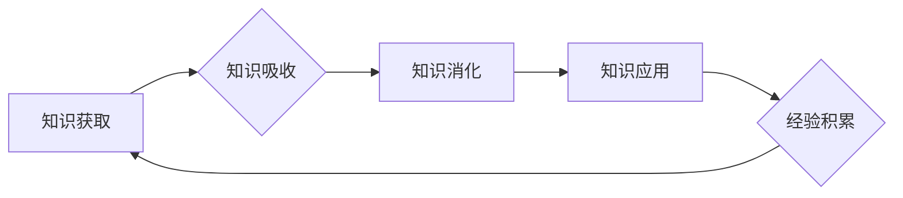

## 知识更新与个人核心竞争力

> 关键词：知识更新、个人核心竞争力、人工智能、机器学习、深度学习、持续学习、技术发展、职业发展

### 1. 背景介绍

在当今瞬息万变的科技时代，知识更新的速度前所未有。人工智能、机器学习、深度学习等新兴技术层出不穷，不断颠覆着传统行业和工作模式。在这种背景下，个人核心竞争力显得尤为重要。拥有持续学习能力、适应新技术的能力和解决问题的能力，才能在激烈的竞争中脱颖而出，获得职业发展和个人价值的提升。

### 2. 核心概念与联系

**2.1 知识更新**

知识更新是指个体不断获取、吸收、消化和应用新知识的过程。它是一个持续不断的循环，包括以下几个关键环节：

* **知识获取:** 通过阅读、学习、实践、交流等方式获取新知识。
* **知识吸收:** 将获取到的知识进行理解、记忆和整理。
* **知识消化:** 将知识与已有知识体系进行整合，形成新的认知和理解。
* **知识应用:** 将知识应用到实际工作或生活中，并不断反思和改进。

**2.2 个人核心竞争力**

个人核心竞争力是指个体在特定领域或行业中能够持续保持优势的独特能力和素质。它通常包括以下几个方面：

* **专业技能:** 掌握与工作相关的专业知识和技能。
* **软技能:** 具备沟通、协作、领导、解决问题等能力。
* **创新能力:** 能够提出新想法、解决新问题，并将其转化为实际成果。
* **学习能力:** 能够持续学习新知识、新技能，并不断提升自身能力。

**2.3 知识更新与个人核心竞争力的联系**

知识更新是个人核心竞争力的基础和源泉。只有不断更新知识，才能掌握最新的技术和技能，才能在竞争中保持优势。

**Mermaid 流程图**



### 3. 核心算法原理 & 具体操作步骤

**3.1 算法原理概述**

深度学习算法是一种基于人工神经网络的机器学习算法，能够自动从数据中学习特征，并进行预测或分类。其核心原理是通过多层神经网络，将输入数据逐层抽象和转换，最终得到输出结果。

**3.2 算法步骤详解**

1. **数据预处理:** 将原始数据进行清洗、转换和特征工程，使其适合深度学习模型的训练。
2. **网络结构设计:** 根据任务需求，设计深度神经网络的结构，包括层数、节点数、激活函数等。
3. **模型训练:** 使用训练数据，通过反向传播算法，调整网络参数，使模型的预测结果与真实值尽可能接近。
4. **模型评估:** 使用测试数据，评估模型的性能，例如准确率、召回率、F1-score等。
5. **模型调优:** 根据评估结果，调整网络结构、参数或训练方法，进一步提升模型性能。
6. **模型部署:** 将训练好的模型部署到实际应用场景中，用于预测或分类。

**3.3 算法优缺点**

**优点:**

* **自动特征学习:** 深度学习算法能够自动从数据中学习特征，无需人工特征工程。
* **高精度:** 在某些任务中，深度学习算法能够达到非常高的精度。
* **处理大规模数据:** 深度学习算法能够处理海量数据，并从中发现隐藏的模式。

**缺点:**

* **数据依赖:** 深度学习算法对数据质量和数量有很高的要求。
* **训练时间长:** 深度学习模型的训练时间通常较长，需要强大的计算资源。
* **可解释性差:** 深度学习模型的决策过程难以解释，难以理解模型是如何做出预测的。

**3.4 算法应用领域**

深度学习算法在各个领域都有广泛的应用，例如：

* **计算机视觉:** 图像识别、物体检测、图像分割、人脸识别等。
* **自然语言处理:** 文本分类、情感分析、机器翻译、对话系统等。
* **语音识别:** 语音转文本、语音合成等。
* **推荐系统:** 商品推荐、内容推荐等。
* **医疗诊断:** 疾病诊断、影像分析等。

### 4. 数学模型和公式 & 详细讲解 & 举例说明

**4.1 数学模型构建**

深度学习模型通常由多个神经网络层组成，每一层都包含多个神经元。每个神经元接收来自上一层的输入信号，并通过激活函数进行处理，输出到下一层。

**4.2 公式推导过程**

深度学习模型的训练过程基于反向传播算法。反向传播算法通过计算损失函数的梯度，更新网络参数，使模型的预测结果与真实值尽可能接近。

损失函数通常定义为预测结果与真实值的差值，例如均方误差 (MSE) 或交叉熵 (Cross-Entropy)。梯度则表示损失函数对网络参数的导数。

**4.3 案例分析与讲解**

假设我们有一个简单的深度学习模型，用于预测房价。模型的输入是房屋的面积、房间数等特征，输出是房价。

我们可以使用均方误差作为损失函数，并使用梯度下降算法更新模型参数。

**公式:**

* 损失函数: $L = \frac{1}{n} \sum_{i=1}^{n} (y_i - \hat{y}_i)^2$

* 梯度: $\frac{\partial L}{\partial w} = \frac{2}{n} \sum_{i=1}^{n} (y_i - \hat{y}_i) \cdot \frac{\partial \hat{y}_i}{\partial w}$

其中:

* $L$ 是损失函数
* $n$ 是样本数量
* $y_i$ 是真实房价
* $\hat{y}_i$ 是预测房价
* $w$ 是模型参数

通过计算梯度，我们可以更新模型参数，使损失函数最小化。

### 5. 项目实践：代码实例和详细解释说明

**5.1 开发环境搭建**

* Python 3.x
* TensorFlow 或 PyTorch 等深度学习框架
* Jupyter Notebook 或 VS Code 等代码编辑器

**5.2 源代码详细实现**

```python
import tensorflow as tf

# 定义模型结构
model = tf.keras.models.Sequential([
    tf.keras.layers.Dense(64, activation='relu', input_shape=(5,)),
    tf.keras.layers.Dense(32, activation='relu'),
    tf.keras.layers.Dense(1)
])

# 编译模型
model.compile(optimizer='adam', loss='mse')

# 训练模型
model.fit(x_train, y_train, epochs=10)

# 评估模型
loss, accuracy = model.evaluate(x_test, y_test)
print('Loss:', loss)
print('Accuracy:', accuracy)
```

**5.3 代码解读与分析**

* 首先，我们使用 TensorFlow 库定义了一个简单的深度学习模型。模型包含三层神经网络，第一层有 64 个神经元，第二层有 32 个神经元，最后一层只有一个神经元，用于输出房价预测结果。
* 然后，我们使用 Adam 优化器和均方误差损失函数编译模型。
* 接着，我们使用训练数据训练模型，训练 10 个 epochs。
* 最后，我们使用测试数据评估模型的性能，并打印损失和准确率。

**5.4 运行结果展示**

运行代码后，会输出模型的损失和准确率。

### 6. 实际应用场景

深度学习算法在各个领域都有广泛的应用，例如：

* **医疗诊断:** 深度学习算法可以用于分析医学影像，辅助医生诊断疾病。
* **金融风险控制:** 深度学习算法可以用于识别欺诈交易和评估风险。
* **智能客服:** 深度学习算法可以用于构建智能聊天机器人，提供客户服务。

### 7. 工具和资源推荐

**7.1 学习资源推荐**

* **书籍:**
    * 深度学习 (Deep Learning) - Ian Goodfellow, Yoshua Bengio, Aaron Courville
    * 深度学习实践 (Deep Learning with Python) - Francois Chollet
* **在线课程:**
    * Coursera: 深度学习 Specialization
    * Udacity: 深度学习 Nanodegree
    * fast.ai: 深度学习课程

**7.2 开发工具推荐**

* **TensorFlow:** Google 开发的开源深度学习框架。
* **PyTorch:** Facebook 开发的开源深度学习框架。
* **Keras:** TensorFlow 的高层 API，简化深度学习模型的构建。

**7.3 相关论文推荐**

* **AlexNet:** ImageNet Classification with Deep Convolutional Neural Networks
* **VGGNet:** Very Deep Convolutional Networks for Large-Scale Image Recognition
* **ResNet:** Deep Residual Learning for Image Recognition

### 8. 总结：未来发展趋势与挑战

**8.1 研究成果总结**

近年来，深度学习算法取得了显著的进展，在各个领域都取得了突破性的成果。

**8.2 未来发展趋势**

* **模型更深、更广:** 研究更深层次、更广阔结构的神经网络模型。
* **数据更丰富、更智能:** 利用更多数据类型和更智能的数据处理方法。
* **应用更广泛、更深入:** 将深度学习应用到更多领域，并深入到各个环节。

**8.3 面临的挑战**

* **数据隐私和安全:** 深度学习算法对大量数据依赖，如何保护数据隐私和安全是一个重要挑战。
* **算法可解释性:** 深度学习模型的决策过程难以解释，如何提高算法的可解释性是一个关键问题。
* **计算资源:** 深度学习模型的训练需要大量的计算资源，如何降低训练成本是一个重要挑战。

**8.4 研究展望**

未来，深度学习研究将继续朝着更智能、更安全、更可解释的方向发展。


### 9. 附录：常见问题与解答

**9.1 如何选择合适的深度学习框架？**

选择深度学习框架需要根据具体项目需求和个人偏好。 TensorFlow 和 PyTorch 是目前最流行的两个框架，各有优缺点。

**9.2 如何处理深度学习模型的过拟合问题？**

过拟合是指模型在训练数据上表现很好，但在测试数据上表现较差。

处理过拟合的方法包括：

* **增加训练数据量:** 更多的训练数据可以帮助模型更好地泛化。
* **使用正则化技术:** 正则化技术可以惩罚模型的复杂度，防止模型过拟合。
* **使用 dropout 技术:** dropout 技术可以随机丢弃一部分神经元，防止模型过于依赖某些神经元。
* **使用交叉验证:** 交叉验证可以帮助评估模型的泛化能力，并选择最佳模型参数。

**9.3 如何评估深度学习模型的性能？**

深度学习模型的性能通常使用以下指标评估：

* **准确率:** 模型正确预测的样本数量占总样本数量的比例。
* **召回率:** 模型正确预测的正样本数量占所有正样本数量的比例。
* **F1-score:** 准确率和召回率的 harmonic mean。
* **AUC:** 曲线下面积，用于评估模型的二分类能力。


作者：禅与计算机程序设计艺术 / Zen and the Art of Computer Programming 
