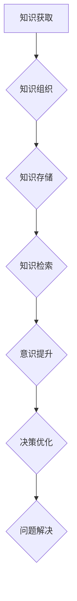

## 1. 背景介绍

在当今数据爆炸的时代，人类面临着前所未有的信息量。如何有效地管理和利用这些知识，成为了一个至关重要的挑战。意识管理，作为一种新兴的概念，旨在通过技术手段提升人类认知能力，帮助我们更好地理解和应对复杂的信息环境。而知识积累，作为意识管理的基础，扮演着至关重要的角色。

传统上，我们认为知识是通过学习、经验积累和思考获得的。然而，随着人工智能技术的飞速发展，我们开始认识到，知识的获取和管理方式正在发生深刻的变化。人工智能算法能够从海量数据中提取出隐藏的模式和规律，为人类提供新的知识和洞察。同时，人工智能技术也为知识的组织、存储和检索提供了更有效的方法。

## 2. 核心概念与联系

### 2.1 知识积累

知识积累是指通过持续学习、思考和实践，不断扩展和深化个人或组织的知识储备的过程。它是一个持续积累、整合和应用的过程，涉及到信息获取、理解、组织、存储和检索等多个环节。

### 2.2 意识管理

意识管理是指通过技术手段，提升人类认知能力，帮助我们更好地理解和应对复杂的信息环境。它涉及到感知、注意力、记忆、决策等多个方面，旨在帮助我们提高效率、增强创造力和解决问题的能力。

### 2.3 知识积累与意识管理的联系

知识积累是意识管理的基础。只有拥有丰富的知识储备，才能更好地理解和应用意识管理技术。

**Mermaid 流程图**



## 3. 核心算法原理 & 具体操作步骤

### 3.1 算法原理概述

知识积累与意识管理的实现离不开一系列先进的算法。其中，深度学习算法在知识提取、理解和应用方面发挥着重要作用。

深度学习算法通过多层神经网络结构，模拟人类大脑的学习机制，能够从海量数据中自动学习特征和模式。例如，自然语言处理领域的深度学习算法能够理解和生成人类语言，为知识提取和组织提供强大的支持。

### 3.2 算法步骤详解

1. **数据收集和预处理:** 首先需要收集大量相关数据，并进行预处理，例如文本清洗、数据格式转换等。
2. **模型构建:** 根据具体任务选择合适的深度学习模型，例如循环神经网络（RNN）、卷积神经网络（CNN）等。
3. **模型训练:** 使用训练数据训练模型，调整模型参数，使其能够准确地提取和理解知识。
4. **模型评估:** 使用测试数据评估模型的性能，例如准确率、召回率等。
5. **知识应用:** 将训练好的模型应用于实际场景，例如知识问答、文本摘要、机器翻译等。

### 3.3 算法优缺点

**优点:**

* 能够从海量数据中自动学习特征和模式，提取隐藏的知识。
* 能够处理复杂的数据类型，例如文本、图像、音频等。
* 性能不断提升，能够达到接近人类水平的准确率。

**缺点:**

* 需要大量的训练数据，数据质量对模型性能影响较大。
* 模型训练时间长，计算资源消耗大。
* 模型解释性差，难以理解模型的决策过程。

### 3.4 算法应用领域

* **自然语言处理:** 文本分类、情感分析、机器翻译、文本摘要等。
* **计算机视觉:** 图像识别、物体检测、图像分割等。
* **语音识别:** 语音转文本、语音合成等。
* **推荐系统:** 商品推荐、内容推荐等。
* **医疗诊断:** 病症诊断、疾病预测等。

## 4. 数学模型和公式 & 详细讲解 & 举例说明

### 4.1 数学模型构建

深度学习算法的核心是神经网络模型。神经网络模型由多个层组成，每层包含多个神经元。神经元之间通过连接权重进行信息传递。

**神经网络模型数学表示:**

$$
y = f(W_1x_1 + b_1)
$$

其中：

* $y$ 是输出值
* $x_1$ 是输入值
* $W_1$ 是连接权重
* $b_1$ 是偏置项
* $f$ 是激活函数

### 4.2 公式推导过程

深度学习算法的训练过程是通过反向传播算法来实现的。反向传播算法通过计算误差，并根据误差调整连接权重，使得模型输出值与真实值之间的差距最小化。

**反向传播算法公式:**

$$
\Delta W = \eta \frac{\partial L}{\partial W}
$$

其中：

* $\Delta W$ 是连接权重的更新量
* $\eta$ 是学习率
* $L$ 是损失函数

### 4.3 案例分析与讲解

例如，在文本分类任务中，我们可以使用深度学习算法训练一个神经网络模型，将文本分类为不同的类别。

训练过程中，模型会根据输入的文本数据，学习到文本特征和类别之间的关系。通过反向传播算法，模型会不断调整连接权重，使得模型能够准确地预测文本的类别。

## 5. 项目实践：代码实例和详细解释说明

### 5.1 开发环境搭建

* Python 3.x
* TensorFlow 或 PyTorch 深度学习框架
* Jupyter Notebook 或 VS Code 开发环境

### 5.2 源代码详细实现

```python
import tensorflow as tf

# 定义模型结构
model = tf.keras.models.Sequential([
    tf.keras.layers.Embedding(input_dim=10000, output_dim=128),
    tf.keras.layers.LSTM(units=128),
    tf.keras.layers.Dense(units=10, activation='softmax')
])

# 编译模型
model.compile(optimizer='adam',
              loss='sparse_categorical_crossentropy',
              metrics=['accuracy'])

# 训练模型
model.fit(x_train, y_train, epochs=10)

# 评估模型
loss, accuracy = model.evaluate(x_test, y_test)
print('Loss:', loss)
print('Accuracy:', accuracy)
```

### 5.3 代码解读与分析

* **Embedding 层:** 将单词转换为稠密的向量表示。
* **LSTM 层:** 处理文本序列数据，学习文本的上下文信息。
* **Dense 层:** 全连接层，输出文本的类别概率。
* **编译模型:** 选择优化器、损失函数和评价指标。
* **训练模型:** 使用训练数据训练模型。
* **评估模型:** 使用测试数据评估模型的性能。

### 5.4 运行结果展示

训练完成后，我们可以使用测试数据评估模型的性能，例如准确率、召回率等。

## 6. 实际应用场景

### 6.1 个性化教育

根据学生的学习进度和知识掌握情况，提供个性化的学习内容和教学方法。

### 6.2 智能客服

利用自然语言处理技术，为用户提供快速、准确的客服服务。

### 6.3 医疗诊断辅助

分析患者的病历、检查结果等信息，辅助医生进行诊断。

### 6.4 未来应用展望

随着人工智能技术的不断发展，知识积累在意识管理中的作用将更加重要。未来，我们可以期待看到更多基于知识积累的意识管理应用，例如：

* **增强现实 (AR) 和虚拟现实 (VR) 体验:** 通过知识积累，为用户提供更沉浸式、更个性化的 AR 和 VR 体验。
* **脑机接口 (BCI):** 利用知识积累，帮助 BCI 系统更好地理解用户的意图，实现更精准的控制。
* **人工智能辅助决策:** 利用知识积累，帮助人类在复杂决策场景下做出更明智的选择。

## 7. 工具和资源推荐

### 7.1 学习资源推荐

* **深度学习课程:** Coursera、edX、Udacity 等平台提供丰富的深度学习课程。
* **深度学习书籍:** 《深度学习》、《动手学深度学习》等书籍对深度学习原理和应用进行了深入讲解。
* **开源深度学习框架:** TensorFlow、PyTorch 等开源框架提供了丰富的工具和资源，方便开发者进行深度学习开发。

### 7.2 开发工具推荐

* **Jupyter Notebook:** 用于深度学习代码开发和实验的交互式笔记本环境。
* **VS Code:** 功能强大的代码编辑器，支持深度学习开发插件。
* **GPU 云平台:** 提供高性能 GPU 资源，加速深度学习模型训练。

### 7.3 相关论文推荐

* **《ImageNet Classification with Deep Convolutional Neural Networks》:** 
介绍了深度卷积神经网络在图像分类任务中的应用。
* **《Attention Is All You Need》:** 
介绍了 Transformer 模型，一种新的序列建模方法。
* **《BERT: Pre-training of Deep Bidirectional Transformers for Language Understanding》:** 
介绍了 BERT 模型，一种基于 Transformer 的预训练语言模型。

## 8. 总结：未来发展趋势与挑战

### 8.1 研究成果总结

知识积累在意识管理领域取得了显著进展，深度学习算法为知识提取、理解和应用提供了强大的工具。

### 8.2 未来发展趋势

* **知识图谱:** 建立更完善的知识图谱，为知识管理提供更结构化的表示。
* **联邦学习:** 隐私保护下进行知识积累，避免数据泄露风险。
* **跨模态知识融合:** 将文本、图像、音频等不同模态的知识融合在一起，构建更全面的知识体系。

### 8.3 面临的挑战

* **数据质量:** 深度学习算法对数据质量要求较高，如何获取高质量的数据仍然是一个挑战。
* **模型解释性:** 深度学习模型的决策过程难以解释，如何提高模型的透明度和可解释性是一个重要问题。
* **伦理问题:** 知识积累和意识管理技术可能带来伦理问题，例如数据隐私、算法偏见等，需要引起重视和探讨。

### 8.4 研究展望

未来，我们将继续探索知识积累在意识管理中的应用，努力构建更智能、更人性化的技术系统。


## 9. 附录：常见问题与解答

**Q1: 深度学习算法真的能够理解知识吗？**

A1: 深度学习算法能够从数据中学习到知识的模式和规律，但它并不真正理解知识的含义。深度学习算法更像是一个强大的数据处理引擎，能够根据训练数据进行预测和分类。

**Q2: 知识积累会取代人类的思考能力吗？**

A2: 知识积累可以帮助人类提高效率和解决问题的能力，但它不会取代人类的思考能力。人类的创造力和批判性思维仍然是不可替代的。

**Q3: 知识积累技术有哪些伦理风险？**

A3: 知识积累技术可能带来数据隐私、算法偏见、信息操控等伦理风险。我们需要谨慎地开发和应用这些技术，并制定相应的伦理规范和法律法规。


作者：禅与计算机程序设计艺术 / Zen and the Art of Computer Programming 
