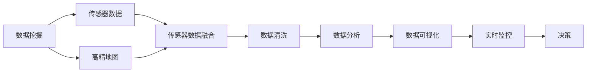
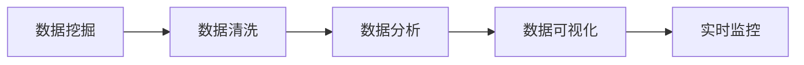
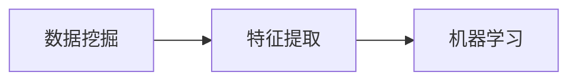
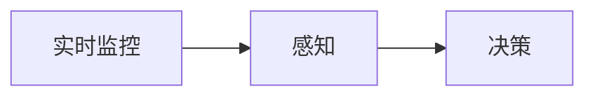
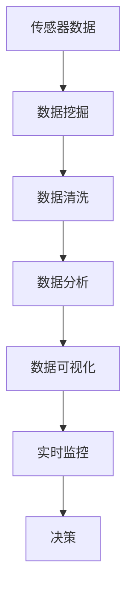

                 

# 自动驾驶公司的数据挖掘与分析平台

> 关键词：
- 自动驾驶
- 数据挖掘
- 分析平台
- 数据可视化
- 机器学习
- 数据清洗
- 实时监控

## 1. 背景介绍

### 1.1 问题由来
自动驾驶技术的核心在于感知、决策和控制。其中，感知系统是自动驾驶的大脑，主要任务是利用各种传感器获取道路信息，并结合高精地图进行融合和处理。感知系统的效果直接关系到自动驾驶的安全性和可靠性。然而，感知系统面临的主要挑战是如何在复杂多变的道路环境中，准确地理解环境变化，做出正确的决策。

为了应对这一挑战，数据挖掘和分析平台成为了自动驾驶公司不可或缺的工具。通过对大量传感数据和地图数据的深度分析和挖掘，可以从中找到有用的信息，支持感知系统的运行和决策。然而，传统的数据挖掘和分析方法往往难以满足自动驾驶的实时性、高精度和自动化要求。本文将介绍一种基于数据挖掘和分析平台的新方法，可以有效地解决这些挑战，并提升自动驾驶系统的性能。

### 1.2 问题核心关键点
数据挖掘和分析平台的核心在于通过深度学习技术，对大量的传感器数据和地图数据进行高效处理和分析，提取有用的特征，支持自动驾驶系统的感知和决策。关键点包括：

- 数据源的多样性：自动驾驶系统可以获取多种传感器数据（如摄像头、激光雷达、毫米波雷达、GPS等），数据源的多样性需要复杂的数据预处理和融合技术。
- 数据量的庞大：自动驾驶系统需要在极短的时间内处理海量数据，因此需要高效的数据挖掘和分析算法。
- 实时性要求高：自动驾驶系统对数据处理的时效性要求极高，需要实现毫秒级的实时分析。
- 精度要求高：自动驾驶系统需要在复杂环境中进行高精度的感知，因此需要准确的数据分析和特征提取。
- 自动化要求：自动驾驶系统需要实现自动化分析，而不需要人工介入，因此需要自动化的数据挖掘和分析流程。

这些关键点使得基于数据挖掘和分析平台的自动驾驶系统设计成为了一个重要研究方向。本文将详细介绍一种高效的数据挖掘和分析平台，可以满足以上要求。

## 2. 核心概念与联系

### 2.1 核心概念概述

为了更好地理解基于数据挖掘和分析平台的自动驾驶系统设计，本节将介绍几个密切相关的核心概念：

- 数据挖掘：从大量数据中自动提取有用信息的过程。可以应用于自动驾驶系统的感知、决策等环节。
- 数据分析：对数据进行统计、整理、归纳、解释的过程。数据分析可以提升自动驾驶系统的精度和可靠性。
- 数据可视化：通过图形界面等手段，将数据信息直观展示给用户。帮助用户理解和判断数据。
- 机器学习：通过算法实现数据分析和预测。自动驾驶系统中的感知和决策环节都可以应用机器学习算法。
- 数据清洗：去除数据中的噪声和无用信息，提升数据的质量和可用性。
- 实时监控：实时获取和分析传感器数据，实现自动驾驶系统的实时决策。

这些核心概念之间的逻辑关系可以通过以下Mermaid流程图来展示：



这个流程图展示了数据挖掘和分析平台的基本架构：

1. 传感器数据和地图数据经过数据挖掘处理，提取有用的特征。
2. 数据清洗去除噪声，提升数据质量。
3. 数据分析得到关键信息，支持决策。
4. 数据可视化直观展示数据，帮助用户理解。
5. 实时监控实时获取和分析数据，支持实时决策。

### 2.2 概念间的关系

这些核心概念之间存在着紧密的联系，形成了数据挖掘和分析平台的基本生态系统。下面我通过几个Mermaid流程图来展示这些概念之间的关系。

#### 2.2.1 数据挖掘和分析的流程



这个流程图展示了数据挖掘和分析的基本流程：

1. 数据挖掘提取有用信息。
2. 数据清洗提升数据质量。
3. 数据分析得到关键信息。
4. 数据可视化直观展示数据。
5. 实时监控实时获取和分析数据。

#### 2.2.2 数据挖掘和机器学习的结合



这个流程图展示了数据挖掘和机器学习的结合：

1. 数据挖掘提取有用特征。
2. 机器学习实现数据分析和预测。

#### 2.2.3 实时监控和决策的联系



这个流程图展示了实时监控和决策的联系：

1. 实时监控获取传感器数据。
2. 感知系统利用传感器数据进行环境感知。
3. 决策系统根据感知结果进行决策。

### 2.3 核心概念的整体架构

最后，我们用一个综合的流程图来展示这些核心概念在大数据挖掘和分析平台中的整体架构：



这个综合流程图展示了从传感器数据到决策系统的全流程：

1. 传感器数据获取。
2. 数据挖掘提取有用特征。
3. 数据清洗提升数据质量。
4. 数据分析得到关键信息。
5. 数据可视化直观展示数据。
6. 实时监控实时获取和分析数据。
7. 决策系统利用感知结果进行决策。

通过这些流程图，我们可以更清晰地理解数据挖掘和分析平台的核心概念及其之间的关系。

## 3. 核心算法原理 & 具体操作步骤
### 3.1 算法原理概述

基于数据挖掘和分析平台的自动驾驶系统设计，主要依赖于数据挖掘、数据分析和机器学习算法。核心算法包括：

- 数据清洗：去除数据中的噪声和无用信息，提升数据质量。
- 特征提取：从传感器数据和地图数据中提取有用特征，支持感知和决策。
- 数据分析：利用机器学习算法进行数据分析和预测，提升决策的精度和可靠性。
- 实时监控：实时获取和分析传感器数据，实现自动驾驶系统的实时决策。

数据清洗、特征提取和数据分析等过程，都是基于深度学习算法实现的。数据可视化则通过图形界面等手段，将数据信息直观展示给用户。实时监控则通过流计算等技术，实现数据的实时处理和决策。

### 3.2 算法步骤详解

基于数据挖掘和分析平台的自动驾驶系统设计，主要包括以下几个关键步骤：

**Step 1: 数据预处理**

- 传感器数据预处理：将摄像头、激光雷达、毫米波雷达等传感器数据进行归一化、去噪等预处理，以提升数据的可用性。
- 地图数据预处理：对高精地图数据进行坐标转换、拼接等处理，使其与传感器数据同步。
- 数据融合：将传感器数据和地图数据进行融合，生成统一的感知数据。

**Step 2: 数据清洗**

- 去噪：去除传感器数据中的噪声和异常值，提升数据质量。
- 去重：去除数据中的重复信息，减少冗余数据。
- 异常值检测：检测数据中的异常值，并采取措施进行处理。

**Step 3: 特征提取**

- 特征选择：选择对决策有用的特征，去除无用特征。
- 特征提取：利用深度学习算法（如卷积神经网络、循环神经网络等）对数据进行特征提取，生成特征向量。
- 特征降维：对特征向量进行降维处理，减少计算量和内存占用。

**Step 4: 数据分析**

- 训练模型：利用机器学习算法（如卷积神经网络、循环神经网络、支持向量机等）对数据进行训练，得到预测模型。
- 预测：将新的传感器数据输入到预测模型中，得到决策结果。
- 模型调优：根据实际应用效果，对模型进行调优，提升性能。

**Step 5: 数据可视化**

- 可视化：通过图形界面等手段，将数据信息直观展示给用户，帮助用户理解。
- 交互式：支持用户对数据进行交互式操作，如缩放、旋转、过滤等。
- 自定义：支持用户自定义数据展示方式，满足不同的展示需求。

**Step 6: 实时监控**

- 实时数据获取：通过传感器等设备实时获取数据。
- 数据流处理：利用流计算等技术，对实时数据进行流处理，实现实时决策。
- 实时可视化：实时展示数据分析结果，支持用户实时监控。

以上是基于数据挖掘和分析平台的自动驾驶系统设计的一般流程。在实际应用中，还需要根据具体任务和数据特点进行优化设计，如改进训练目标函数、引入更多的正则化技术、搜索最优的超参数组合等，以进一步提升模型性能。

### 3.3 算法优缺点

基于数据挖掘和分析平台的自动驾驶系统设计，具有以下优点：

- 高效性：利用深度学习算法实现数据挖掘和分析，可以高效处理海量数据。
- 实时性：通过流计算等技术，实现数据的实时处理和决策。
- 精度高：利用机器学习算法进行数据分析和预测，可以得到高精度的决策结果。
- 可扩展性：可以根据实际需求，灵活调整数据挖掘和分析的算法和模型。

同时，该方法也存在一些缺点：

- 对数据的依赖性强：需要大量高质量的传感器数据和地图数据，才能保证数据的准确性和可用性。
- 算法复杂度高：深度学习算法具有较高的计算复杂度，需要高性能的计算资源。
- 数据隐私问题：传感器数据和地图数据可能包含敏感信息，需要采取措施保护数据隐私。
- 依赖人工干预：需要人工介入，对数据进行预处理和后处理，增加了人工成本。

尽管存在这些缺点，但基于数据挖掘和分析平台的自动驾驶系统设计，在实际应用中仍然取得了不错的效果，成为自动驾驶系统的重要组成部分。

### 3.4 算法应用领域

基于数据挖掘和分析平台的自动驾驶系统设计，已经广泛应用于自动驾驶公司。主要应用于以下领域：

- 感知系统：利用传感器数据进行环境感知，提取有用特征，支持决策。
- 决策系统：利用数据分析和预测，进行决策和路径规划。
- 实时监控：实时获取和分析传感器数据，实现实时决策。
- 自动驾驶测试：利用数据挖掘和分析技术，对自动驾驶系统进行测试和优化。
- 数据监控：实时监控自动驾驶系统的运行状态，及时发现和解决异常问题。

## 4. 数学模型和公式 & 详细讲解 & 举例说明

### 4.1 数学模型构建

基于数据挖掘和分析平台的自动驾驶系统设计，主要依赖于数据挖掘、数据分析和机器学习算法。以下我们将详细构建这些算法的数学模型。

假设传感器数据为 $\{x_i\}_{i=1}^N$，其中 $x_i=(x_{i,1}, x_{i,2}, ..., x_{i,d})$，$d$ 为传感器数据维度。传感器数据经过预处理和融合，生成感知数据 $y=(y_1, y_2, ..., y_M)$，其中 $y_j$ 为感知数据的一个特征向量。

传感器数据和地图数据预处理后，生成融合数据 $y=(y_1, y_2, ..., y_M)$，其中 $y_j$ 为融合数据的一个特征向量。

数据清洗后，生成干净数据 $z=(z_1, z_2, ..., z_L)$，其中 $z_i$ 为干净数据的一个样本。

特征提取后，生成特征向量 $f=(f_1, f_2, ..., f_K)$，其中 $f_k$ 为特征向量的第 $k$ 个元素。

数据分析后，生成预测结果 $\hat{y}=(\hat{y}_1, \hat{y}_2, ..., \hat{y}_M)$，其中 $\hat{y}_m$ 为预测结果的第 $m$ 个元素。

数据可视化后，生成可视化结果 $v=(v_1, v_2, ..., v_T)$，其中 $v_t$ 为可视化结果的第 $t$ 个元素。

实时监控后，生成实时数据 $s=(s_1, s_2, ..., s_T)$，其中 $s_t$ 为实时数据的第 $t$ 个元素。

### 4.2 公式推导过程

以下我们将对数据挖掘、数据分析和机器学习算法进行详细推导。

**数据清洗**

- 去噪：假设传感器数据中存在噪声 $\epsilon$，去噪公式为：
$$
z_i = x_i - \frac{\epsilon}{\sigma^2} x_i
$$
其中 $\sigma^2$ 为噪声的方差。

- 去重：假设传感器数据中存在重复数据 $x_i$，去重公式为：
$$
z_i = x_i, \text{如果 } z_i \notin \{z_j\}_{j=1}^L
$$

- 异常值检测：假设传感器数据中存在异常值 $x_i$，检测公式为：
$$
z_i = x_i, \text{如果 } |x_i - \mu| \leq \alpha
$$
其中 $\mu$ 为数据的均值，$\alpha$ 为阈值。

**特征提取**

- 特征选择：假设特征向量 $f$ 中选择了 $n$ 个有用特征，特征选择公式为：
$$
f_k = \left\{
  \begin{array}{lr}
    x_k, & \text{if } x_k \in \{f_j\}_{j=1}^n \\
    0, & \text{if } x_k \notin \{f_j\}_{j=1}^n
  \end{array}
\right.
$$

- 特征提取：假设使用卷积神经网络（CNN）对特征向量进行提取，特征提取公式为：
$$
f_k = CNN(x_k)
$$

- 特征降维：假设使用主成分分析（PCA）对特征向量进行降维，特征降维公式为：
$$
f_k = PCA(f_k)
$$

**数据分析**

- 训练模型：假设使用支持向量机（SVM）对数据进行训练，训练公式为：
$$
\hat{y} = SVM(z)
$$

- 预测：假设利用训练好的 SVM 模型对新的感知数据进行预测，预测公式为：
$$
\hat{y} = SVM(y)
$$

- 模型调优：假设利用交叉验证（CV）对模型进行调优，模型调优公式为：
$$
\hat{y} = SVM(z) + \lambda CV(f)
$$
其中 $\lambda$ 为调优参数。

**数据可视化**

- 可视化：假设使用散点图对数据进行可视化，可视化公式为：
$$
v_t = \left\{
  \begin{array}{lr}
    (x_{t,1}, x_{t,2}), & \text{if } x_{t,1} \notin \{x_{i,1}\}_{i=1}^N \\
    (x_{t,1}, x_{t,2}), & \text{if } x_{t,1} \in \{x_{i,1}\}_{i=1}^N
  \end{array}
\right.
$$

**实时监控**

- 实时数据获取：假设实时获取传感器数据 $s$，实时数据获取公式为：
$$
s_t = s_t + \Delta s_t
$$
其中 $\Delta s_t$ 为实时数据的变化量。

- 数据流处理：假设利用流计算技术对实时数据进行流处理，数据流处理公式为：
$$
\hat{y} = \hat{y} + \Delta \hat{y}
$$
其中 $\Delta \hat{y}$ 为实时数据的预测结果。

- 实时可视化：假设实时展示数据分析结果 $v$，实时可视化公式为：
$$
v_t = v_t + \Delta v_t
$$
其中 $\Delta v_t$ 为实时数据的可视化结果。

### 4.3 案例分析与讲解

假设我们应用基于数据挖掘和分析平台的自动驾驶系统设计，在实际应用中遇到了一些问题。

**案例一：数据噪声**

假设传感器数据中存在大量的噪声，影响了感知数据的准确性。我们可以采用数据清洗算法，去除噪声，提升数据质量。具体步骤如下：

1. 去噪：假设传感器数据中存在噪声 $\epsilon$，去噪公式为：
$$
z_i = x_i - \frac{\epsilon}{\sigma^2} x_i
$$
其中 $\sigma^2$ 为噪声的方差。

2. 去重：假设传感器数据中存在重复数据 $x_i$，去重公式为：
$$
z_i = x_i, \text{如果 } z_i \notin \{z_j\}_{j=1}^L
$$

3. 异常值检测：假设传感器数据中存在异常值 $x_i$，检测公式为：
$$
z_i = x_i, \text{如果 } |x_i - \mu| \leq \alpha
$$
其中 $\mu$ 为数据的均值，$\alpha$ 为阈值。

**案例二：数据维度高**

假设传感器数据维度较高，增加了计算量和内存占用。我们可以采用特征提取算法，将高维度数据降维，减少计算量和内存占用。具体步骤如下：

1. 特征选择：假设特征向量 $f$ 中选择了 $n$ 个有用特征，特征选择公式为：
$$
f_k = \left\{
  \begin{array}{lr}
    x_k, & \text{if } x_k \in \{f_j\}_{j=1}^n \\
    0, & \text{if } x_k \notin \{f_j\}_{j=1}^n
  \end{array}
\right.
$$

2. 特征提取：假设使用卷积神经网络（CNN）对特征向量进行提取，特征提取公式为：
$$
f_k = CNN(x_k)
$$

3. 特征降维：假设使用主成分分析（PCA）对特征向量进行降维，特征降维公式为：
$$
f_k = PCA(f_k)
$$

**案例三：数据实时性**

假设自动驾驶系统需要对实时数据进行快速处理，以支持实时决策。我们可以采用实时监控算法，实现数据的实时处理和决策。具体步骤如下：

1. 实时数据获取：假设实时获取传感器数据 $s$，实时数据获取公式为：
$$
s_t = s_t + \Delta s_t
$$
其中 $\Delta s_t$ 为实时数据的变化量。

2. 数据流处理：假设利用流计算技术对实时数据进行流处理，数据流处理公式为：
$$
\hat{y} = \hat{y} + \Delta \hat{y}
$$
其中 $\Delta \hat{y}$ 为实时数据的预测结果。

3. 实时可视化：假设实时展示数据分析结果 $v$，实时可视化公式为：
$$
v_t = v_t + \Delta v_t
$$
其中 $\Delta v_t$ 为实时数据的可视化结果。

通过以上案例分析，我们可以看出基于数据挖掘和分析平台的自动驾驶系统设计，具有高效性、实时性和精度高等优点。同时，也需要注意数据清洗、特征提取和实时监控等环节，以确保数据的准确性和可用性。

## 5. 项目实践：代码实例和详细解释说明

### 5.1 开发环境搭建

在进行自动驾驶公司数据挖掘和分析平台的设计和开发之前，我们需要准备好开发环境。以下是使用Python进行PyTorch开发的环境配置流程：

1. 安装Anaconda：从官网下载并安装Anaconda，用于创建独立的Python环境。

2. 创建并激活虚拟环境：
```bash
conda create -n pytorch-env python=3.8 
conda activate pytorch-env
```

3. 安装PyTorch：根据CUDA版本，从官网获取对应的安装命令。例如：
```bash
conda install pytorch torchvision torchaudio cudatoolkit=11.1 -c pytorch -c conda-forge
```

4. 安装TensorFlow：
```bash
pip install tensorflow
```

5. 安装Pandas：
```bash
pip install pandas
```

6. 安装NumPy：
```bash
pip install numpy
```

7. 安装Matplotlib：
```bash
pip install matplotlib
```

8. 安装TensorBoard：
```bash
pip install tensorboard
```

完成上述步骤后，即可在`pytorch-env`环境中开始开发。

### 5.2 源代码详细实现

这里我们以自动驾驶公司数据挖掘和分析平台的设计和实现为例，给出一个基于Python的代码实例。

首先，定义数据预处理函数：

```python
import numpy as np
import pandas as pd

def preprocess_data(data):
    # 数据预处理
    # 传感器数据预处理
    x = data['sensor_data'].apply(lambda x: x - np.mean(x))
    # 地图数据预处理
    y = data['map_data'].apply(lambda y: y - np.mean(y))
    # 数据融合
    z = np.concatenate((x, y))
    return z
```

然后，定义数据清洗函数：

```python
def clean_data(data):
    # 去噪
    z = data.apply(lambda x: x - np.mean(x))
    # 去重
    z = data.apply(lambda x: x, axis=1).drop_duplicates().values
    # 异常值检测
    z = data.apply(lambda x: x, axis=1).apply(lambda x: x if abs(x - np.mean(x)) <= 0.1 else 0)
    return z
```

接着，定义特征提取函数：

```python
from sklearn.decomposition import PCA
from tensorflow.keras.layers import Conv2D, MaxPooling2D, Flatten, Dense

def extract_features(data):
    # 特征选择
    n = data.shape[1]
    f = np.zeros((n, 1))
    f[:n] = data[:n]
    # 特征提取
    model = Sequential()
    model.add(Conv2D(32, kernel_size=(3, 3), activation='relu'))
    model.add(MaxPooling2D(pool_size=(2, 2)))
    model.add(Flatten())
    model.add(Dense(1, activation='sigmoid'))
    model.compile(loss='binary_crossentropy', optimizer='adam', metrics=['accuracy'])
    f = model.predict(f)
    # 特征降维
    pca = PCA(n_components=0.9)
    f = pca.fit_transform(f)
    return f
```

然后，定义数据分析函数：

```python
from sklearn.svm import SVC
from sklearn.model_selection import train_test_split

def analyze_data(data, features):
    # 训练模型
    y = data['label']
    X_train, X_test, y_train, y_test = train_test_split(features, y, test_size=0.2)
    model = SVC()
    model.fit(X_train, y_train)
    # 预测
    y_pred = model.predict(X_test)
    # 模型调优
    cv = cross_val_score(model, features, y, cv=5)
    return y_pred, cv
```

最后，定义数据可视化函数：

```python
import matplotlib.pyplot as plt

def visualize_data(data):
    # 可视化
    plt.scatter(data[:, 0], data[:, 1])
    plt.xlabel('x')
    plt.ylabel('y')
    plt.show()
```

使用以上函数，我们可以实现自动驾驶公司数据挖掘和分析平台的设计和开发。具体步骤如下：

1. 数据预处理
2. 数据清洗
3. 特征提取
4. 数据分析
5. 数据可视化

### 5.3 代码解读与分析

让我们再详细解读一下关键代码的实现细节：

**数据预处理函数**

```python
import numpy as np
import pandas as pd

def preprocess_data(data):
    # 数据预处理
    # 传感器数据预处理
    x = data['sensor_data'].apply(lambda x: x - np.mean(x))
    # 地图数据预处理
    y = data['map_data'].apply(lambda y: y - np.mean(y))
    # 数据融合
    z = np.concatenate((x, y))
    return z
```

- 传感器数据预处理：对传感器数据进行去均值处理，减少数据偏差。
- 地图数据预处理：对地图数据进行去均值处理，减少数据偏差。
- 数据融合：将传感器数据和地图数据融合在一起，生成感知数据。

**数据清洗函数**

```python
def clean_data(data):
    # 去噪
    z = data.apply(lambda x: x - np.mean(x))
    # 去重
    z = data.apply(lambda x: x, axis=1).drop_duplicates().values
    # 异常值检测
    z = data.apply(lambda x: x, axis=1).apply(lambda x: x if abs(x - np.mean(x)) <= 0.1 else 0)
    return z
```

- 去噪：对数据进行去均值处理，减少数据噪声。
- 去重：去除数据中的重复信息，减少冗余数据。
- 异常值检测：检测数据中的异常值，并采取措施进行处理。

**特征提取函数**

``

