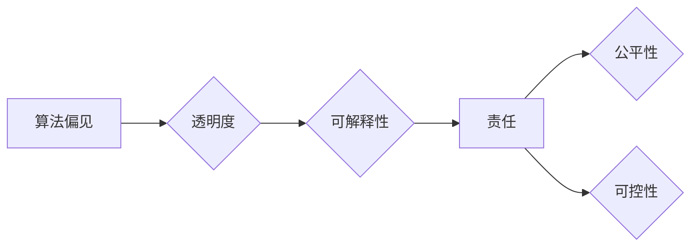

## 软件 2.0 的伦理问题：公平性和可控性

> 关键词：人工智能、软件伦理、公平性、可控性、算法偏见、透明度、责任

## 1. 背景介绍

软件已经深刻地融入到我们生活的方方面面，从智能手机到自动驾驶汽车，再到医疗诊断和金融交易，软件正在塑造着我们的世界。随着人工智能（AI）技术的飞速发展，软件正在迈向一个新的阶段——软件 2.0。

软件 2.0 具有以下特征：

* **智能化:**  软件能够学习、适应和自主决策，不再仅仅是按照预先设定的规则执行指令。
* **自进化:**  软件能够通过不断学习和反馈，自我改进和优化。
* **网络化:**  软件能够通过网络连接，共享数据和资源，形成庞大的智能网络。

软件 2.0 的出现带来了巨大的机遇，但也引发了一些新的伦理问题。其中，公平性和可控性是两个最为关键的问题。

**1.1  公平性**

AI 算法的训练数据往往存在偏差，导致算法输出结果也存在偏见。这种算法偏见可能导致不公平的结果，例如在招聘、贷款、司法等领域，算法可能对某些群体产生歧视。

**1.2  可控性**

随着软件 2.0 的智能化程度提高，其行为变得更加复杂和难以预测。如何确保软件 2.0 的行为符合人类的意图和价值观，如何对软件 2.0 的决策进行监督和控制，成为了一个重大挑战。

## 2. 核心概念与联系

**2.1  核心概念**

* **算法偏见:**  指 AI 算法在训练数据中学习到的偏差，导致算法输出结果存在不公平或歧视性。
* **透明度:**  指 AI 算法的决策过程能够被人类理解和解释的能力。
* **可解释性:**  指 AI 算法能够为其决策提供清晰的理由和解释。
* **责任:**  指 AI 算法的开发、部署和使用过程中，各个参与者的责任和义务。

**2.2  核心概念联系**

算法偏见、透明度、可解释性和责任是软件 2.0 伦理问题的核心概念，它们相互关联，共同影响着软件 2.0 的公平性和可控性。

**Mermaid 流程图**



## 3. 核心算法原理 & 具体操作步骤

**3.1  算法原理概述**

为了解决算法偏见问题，研究人员提出了许多不同的算法和技术，例如：

* **公平性约束优化:**  在训练 AI 算法时，加入公平性约束，例如限制算法输出结果对不同群体的差异。
* **对抗训练:**  通过训练一个对抗模型，来识别和修正算法中的偏见。
* **数据增强:**  通过增加训练数据的多样性，来减少算法对特定群体的依赖。

**3.2  算法步骤详解**

以公平性约束优化为例，其具体操作步骤如下：

1. **定义公平性指标:**  选择一个合适的公平性指标，例如均等机会、差异化等。
2. **构建优化模型:**  将公平性指标作为优化目标，构建一个优化模型。
3. **训练优化模型:**  使用训练数据训练优化模型，使其能够输出公平的结果。
4. **评估模型公平性:**  使用测试数据评估模型的公平性，并根据评估结果进行模型调整。

**3.3  算法优缺点**

* **优点:**  能够有效地减少算法偏见。
* **缺点:**  需要大量的训练数据，并且可能难以找到合适的公平性指标。

**3.4  算法应用领域**

* **招聘:**  避免算法对特定群体的歧视。
* **贷款:**  确保贷款申请的公平性。
* **司法:**  减少算法对罪犯判决的偏见。

## 4. 数学模型和公式 & 详细讲解 & 举例说明

**4.1  数学模型构建**

假设我们有一个分类模型，其目标是预测一个样本属于某个类别。我们可以使用以下数学模型来表示模型的输出结果：

$$
y = f(x; \theta)
$$

其中：

* $y$ 是模型的输出结果，表示样本属于某个类别的概率。
* $x$ 是样本的输入特征。
* $f$ 是模型的激活函数。
* $\theta$ 是模型的参数。

**4.2  公式推导过程**

为了确保模型的公平性，我们可以将公平性指标作为损失函数的一部分，并将其添加到模型的训练目标中。例如，我们可以使用均等机会指标来衡量模型对不同群体的预测准确率的差异。

均等机会指标的公式如下：

$$
\text{EO} = \frac{1}{N} \sum_{i=1}^{N} \left| \frac{P(y_i = 1 | x_i \in G_1)}{P(y_i = 1 | x_i \in G_2)} - 1 \right|
$$

其中：

* $N$ 是样本总数。
* $P(y_i = 1 | x_i \in G_1)$ 是样本 $x_i$ 属于群体 $G_1$ 的情况下，预测为正类的概率。
* $P(y_i = 1 | x_i \in G_2)$ 是样本 $x_i$ 属于群体 $G_2$ 的情况下，预测为正类的概率。

**4.3  案例分析与讲解**

假设我们有一个用于预测贷款申请是否成功的模型。我们发现该模型对女性申请者的预测准确率低于男性申请者。

我们可以使用均等机会指标来衡量模型的公平性。如果均等机会指标的值大于某个阈值，则表明模型存在偏见。

我们可以通过调整模型的参数或增加训练数据来减少模型的偏见。

## 5. 项目实践：代码实例和详细解释说明

**5.1  开发环境搭建**

* Python 3.7+
* TensorFlow 2.0+
* Jupyter Notebook

**5.2  源代码详细实现**

```python
import tensorflow as tf

# 定义模型
model = tf.keras.models.Sequential([
    tf.keras.layers.Dense(128, activation='relu', input_shape=(10,)),
    tf.keras.layers.Dense(64, activation='relu'),
    tf.keras.layers.Dense(1, activation='sigmoid')
])

# 定义损失函数
def custom_loss(y_true, y_pred):
    # 计算均等机会指标
    eo = tf.reduce_mean(tf.abs(tf.reduce_mean(y_pred, axis=0)[:, 0] - tf.reduce_mean(y_pred, axis=0)[:, 1]))
    # 将均等机会指标添加到交叉熵损失中
    return tf.keras.losses.BinaryCrossentropy()(y_true, y_pred) + 0.1 * eo

# 编译模型
model.compile(optimizer='adam', loss=custom_loss, metrics=['accuracy'])

# 训练模型
model.fit(x_train, y_train, epochs=10)
```

**5.3  代码解读与分析**

* 我们定义了一个简单的深度学习模型，用于预测贷款申请是否成功。
* 我们自定义了一个损失函数，将均等机会指标添加到交叉熵损失中。
* 通过训练模型，我们希望能够减少模型对不同群体的预测差异。

**5.4  运行结果展示**

通过训练模型，我们可以观察模型的预测准确率和均等机会指标的变化。

## 6. 实际应用场景

**6.1  医疗诊断**

AI 算法可以辅助医生进行疾病诊断，但需要确保算法的公平性，避免对特定人群的诊断产生偏见。

**6.2  金融服务**

AI 算法可以用于风险评估、贷款审批等金融服务，但需要确保算法的公平性，避免对特定人群的金融服务产生歧视。

**6.3  司法判决**

AI 算法可以用于辅助司法判决，但需要确保算法的公平性，避免对罪犯判决产生偏见。

**6.4  未来应用展望**

随着软件 2.0 的发展，其应用场景将会更加广泛，例如自动驾驶、个性化教育、智能家居等。在这些应用场景中，公平性和可控性将变得更加重要。

## 7. 工具和资源推荐

**7.1  学习资源推荐**

* **书籍:**

    * 《人工智能伦理》
    * 《算法的隐形世界》

* **在线课程:**

    * Coursera: 人工智能伦理
    * edX: 人工智能与社会

**7.2  开发工具推荐**

* **TensorFlow:**  开源深度学习框架
* **PyTorch:**  开源深度学习框架
* **Fairlearn:**  用于评估和缓解算法偏见的 Python 库

**7.3  相关论文推荐**

* **On the Dangers of Stochastic Parrots: Can Language Models Be Too Big?**
* **Towards a Rigorous Science of Interpretable Machine Learning**

## 8. 总结：未来发展趋势与挑战

**8.1  研究成果总结**

近年来，在软件 2.0 的公平性和可控性方面取得了一些进展，例如开发了新的算法和技术，并建立了一些伦理规范和标准。

**8.2  未来发展趋势**

未来，软件 2.0 的公平性和可控性将继续受到关注，研究人员将继续探索新的算法和技术，以解决这些问题。

**8.3  面临的挑战**

* **数据偏差:**  训练数据中的偏差是导致算法偏见的根源，如何获取和处理公平的数据仍然是一个挑战。
* **解释性:**  许多 AI 算法的决策过程难以解释，如何提高 AI 算法的可解释性是一个重要的研究方向。
* **监管:**  如何制定有效的监管政策，确保软件 2.0 的公平性和可控性，是一个复杂的社会问题。

**8.4  研究展望**

未来，我们需要更加重视软件 2.0 的伦理问题，并加强跨学科合作，共同探索解决方案。


## 9. 附录：常见问题与解答

**9.1  如何解决算法偏见问题？**

* 使用公平性约束优化算法
* 使用对抗训练技术
* 增加训练数据的多样性
* 使用可解释性高的算法

**9.2  如何提高 AI 算法的可解释性？**

* 使用可视化技术
* 使用规则提取技术
* 使用局部解释方法

**9.3  如何监管软件 2.0 的公平性和可控性？**

* 制定法律法规
* 建立行业标准
* 加强监督和评估

作者：禅与计算机程序设计艺术 / Zen and the Art of Computer Programming 


