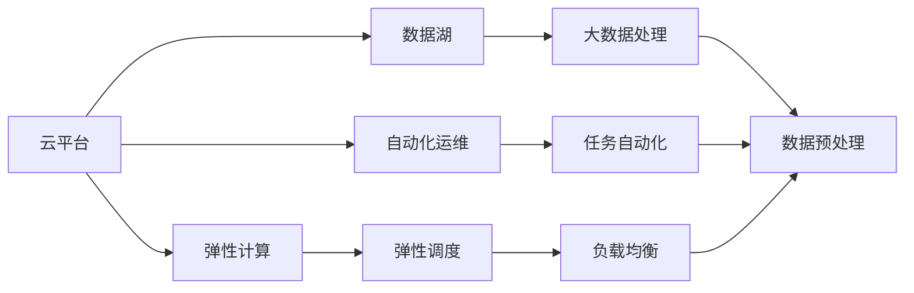
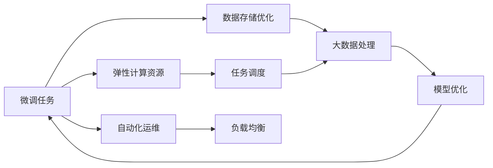

                 

# 云与AI的协同效应：贾扬清的观察，云计算平台与AI工程的结合

## 1. 背景介绍

在当下这个数字化的时代，云计算和大数据技术的迅猛发展正在深刻改变着传统IT架构和业务模式。随着云计算平台在企业内部的普及，越来越多的业务场景需要依托云环境实现高效、弹性的计算与存储资源管理。与此同时，人工智能（AI）作为新一代的技术力量，正在推动各个行业的数字化转型，而AI工程实践需要依赖强大且高效的基础设施支持。

在这样的背景之下，云计算与AI工程开始紧密结合，共同构建起新的技术生态。贾扬清教授作为全球领先的AI专家和深度学习社区的积极推动者，深入研究和探讨了云平台与AI工程的协同效应，为业界揭示了这一趋势的重要性和可能带来的变革性影响。

本文将通过贾扬清教授的观察，深入解析云计算平台与AI工程的结合点，分析其协同效应，并展望未来的发展趋势。

## 2. 核心概念与联系

### 2.1 核心概念概述

为更好地理解云计算与AI工程的结合，本节将介绍几个关键概念：

- **云计算平台**：基于互联网的数据中心，提供按需的计算资源，如虚拟机、存储、网络、数据库等服务，可以支持大规模分布式应用程序。
- **AI工程**：围绕AI模型和应用开发的一系列工程化实践，包括数据工程、模型工程、软件工程和生产工程等。
- **数据湖**：一个大型的、分布式的数据存储和管理系统，用于处理各种结构化和非结构化数据。
- **弹性计算**：一种灵活的计算资源管理方式，可以根据业务需求动态调整计算资源的使用。
- **机器学习模型微调**：在预训练模型基础上，通过少量标注数据进行优化，提升模型在特定任务上的表现。
- **自动化运维**：通过自动化工具和流程，实现AI模型和应用的自动部署、监控和更新。

这些核心概念共同构成了云计算平台与AI工程结合的基础，通过合理利用云计算的弹性计算和自动化运维能力，AI工程可以高效地进行数据处理、模型训练和应用部署。

### 2.2 概念间的关系

云计算平台与AI工程的结合，主要体现在以下几个方面：

- **弹性计算能力**：云计算平台提供弹性计算资源，可以按需扩展，满足AI模型在不同阶段的计算需求。
- **数据存储和管理**：利用数据湖等大数据技术，云计算平台可以高效地存储和处理海量数据，支持大规模的模型训练和数据预处理。
- **自动化运维**：云计算平台提供的自动化运维服务，可以大大降低AI应用部署和维护的复杂度，提升开发效率。
- **弹性调度与负载均衡**：云计算平台可以实现自动化的任务调度和负载均衡，确保AI模型的计算效率和稳定性。

这些关键点形成了云平台与AI工程结合的整体架构，如图示：



这个图表展示了云平台与AI工程的各个结合点及其相互作用。

## 3. 核心算法原理 & 具体操作步骤

### 3.1 算法原理概述

云计算平台与AI工程的结合，本质上是一种资源的优化配置和管理。通过云计算平台提供的弹性计算和自动化运维能力，AI工程可以在不增加显著成本的情况下，高效地进行模型的训练和部署。

以AI模型微调为例，云计算平台可以实现以下优化：

- **弹性计算资源**：根据模型训练的计算需求，动态调整计算资源的使用，避免资源浪费和不足。
- **数据存储优化**：利用数据湖技术，高效地存储和访问训练数据，提升模型训练效率。
- **自动化运维**：通过自动化工具和流程，简化模型的部署和维护，降低人工成本。
- **任务调度和负载均衡**：通过云计算平台的自动化调度系统，实现任务的高效分配和资源利用。

这些优化措施大大提升了AI模型微调的效率和稳定性，如图示：



### 3.2 算法步骤详解

基于云计算平台的大模型微调一般包括以下关键步骤：

**Step 1: 数据预处理**
- 在云平台上搭建数据湖，存储并管理原始数据。
- 利用云平台提供的计算资源，对数据进行预处理，如清洗、标注、分片等。
- 利用云平台的数据可视化工具，进行数据探索和特征工程。

**Step 2: 模型训练与优化**
- 利用云平台的弹性计算资源，启动模型训练任务。
- 根据计算需求，动态调整计算资源的使用，避免资源浪费。
- 利用云平台的自动化运维服务，监控模型训练过程，确保稳定性。

**Step 3: 模型微调和部署**
- 使用少量标注数据进行模型微调，提升模型在特定任务上的性能。
- 利用云平台的弹性计算和自动化运维，确保微调过程高效且稳定。
- 将微调后的模型导出并部署到生产环境，实现自动化运维。

**Step 4: 持续监控与优化**
- 在生产环境中，利用云平台的监控工具，实时监测模型性能和系统状态。
- 根据业务需求和监控结果，动态调整计算资源和模型参数，确保系统稳定运行。

### 3.3 算法优缺点

基于云计算平台的大模型微调方法具有以下优点：

- **高效性**：云平台提供的弹性计算和自动化运维，可以大大提升模型训练和微调的效率，降低人工成本。
- **灵活性**：云平台可以根据业务需求动态调整计算资源的使用，满足不同规模和复杂度的模型训练需求。
- **可扩展性**：云平台可以轻松扩展计算资源，支持大规模模型训练和微调。

同时，该方法也存在一定的局限性：

- **数据隐私**：云计算平台需要处理海量数据，数据隐私和安全成为重要问题。
- **成本问题**：云平台的服务费用可能较高，需要合理控制成本。
- **依赖性**：对云平台的服务稳定性依赖较大，一旦平台出现问题，将影响模型训练和部署。

尽管存在这些局限性，但就目前而言，基于云计算平台的大模型微调方法仍然是大规模AI应用的主流范式，能够显著提升模型训练和微调的效率和稳定性。

### 3.4 算法应用领域

云计算平台与AI工程的结合，在多个领域得到广泛应用，如：

- **自然语言处理（NLP）**：利用云平台进行大规模预训练和微调，提升NLP模型的性能。
- **计算机视觉（CV）**：在云平台上训练大规模深度学习模型，进行图像识别、分类、生成等任务。
- **推荐系统**：利用云平台的弹性计算和自动化运维，实现高效的推荐算法训练和部署。
- **医疗健康**：在云平台上训练和微调医疗图像识别、病历分析等模型，推动医疗健康数字化转型。
- **金融风控**：利用云平台进行金融数据处理和模型训练，提升风险控制能力。

除了这些经典应用外，云计算平台与AI工程的结合还在更多领域得到创新性应用，如自动驾驶、智能制造、智慧城市等，为各行各业带来了新的技术突破。

## 4. 数学模型和公式 & 详细讲解

### 4.1 数学模型构建

假设云计算平台提供弹性计算资源，用于训练大模型 $M_{\theta}$，其中 $\theta$ 为模型参数。给定训练数据集 $D=\{(x_i, y_i)\}_{i=1}^N$，模型的训练目标是最小化经验风险：

$$
\mathcal{L}(\theta) = \frac{1}{N} \sum_{i=1}^N \ell(M_{\theta}(x_i),y_i)
$$

其中 $\ell$ 为损失函数，用于衡量模型预测输出与真实标签之间的差异。

在云计算平台上进行模型训练，一般采用分布式计算框架，如TensorFlow、PyTorch等，将数据和模型分布在多个计算节点上进行并行计算。

### 4.2 公式推导过程

以BERT模型为例，假设在训练集中随机采样 batch_size 个样本进行训练，计算损失函数的平均值为：

$$
\mathcal{L}(\theta) = \frac{1}{N}\sum_{i=1}^N \frac{1}{batch\_size}\sum_{j=1}^{batch\_size}\ell(BERT_{\theta}(x_{i,j}),y_i)
$$

其中 $BERT_{\theta}(x_{i,j})$ 为在计算节点 j 上对样本 $x_{i,j}$ 进行前向传播的输出。

在计算节点上，利用GPU等高性能设备进行模型的前向传播和反向传播计算。计算损失函数的平均值为：

$$
\mathcal{L}(\theta) = \frac{1}{N}\sum_{i=1}^N \frac{1}{batch\_size}\sum_{j=1}^{batch\_size}\ell(BERT_{\theta}(x_{i,j}),y_i)
$$

计算损失函数的梯度，用于更新模型参数：

$$
\nabla_{\theta}\mathcal{L}(\theta) = \frac{1}{N}\sum_{i=1}^N \frac{1}{batch\_size}\sum_{j=1}^{batch\_size}\nabla_{\theta}\ell(BERT_{\theta}(x_{i,j}),y_i)
$$

根据梯度下降等优化算法，不断迭代更新模型参数，直至损失函数最小化，得到最终的模型参数 $\theta^*$。

## 5. 项目实践：代码实例和详细解释说明

### 5.1 开发环境搭建

在进行云计算平台与AI工程的结合实践前，我们需要准备好开发环境。以下是使用Python进行TensorFlow开发的环境配置流程：

1. 安装Anaconda：从官网下载并安装Anaconda，用于创建独立的Python环境。

2. 创建并激活虚拟环境：
```bash
conda create -n tf-env python=3.8 
conda activate tf-env
```

3. 安装TensorFlow：根据CUDA版本，从官网获取对应的安装命令。例如：
```bash
conda install tensorflow=2.7-cu116 -c tf
```

4. 安装Pandas、NumPy、Scikit-learn等常用工具包：
```bash
pip install pandas numpy scikit-learn
```

5. 安装TensorBoard：
```bash
pip install tensorboard
```

完成上述步骤后，即可在`tf-env`环境中开始实践。

### 5.2 源代码详细实现

这里我们以BERT模型为例，给出在Google Cloud上训练和微调的完整代码实现。

首先，定义模型和优化器：

```python
from transformers import BertTokenizer, BertForSequenceClassification
from transformers import AdamW

tokenizer = BertTokenizer.from_pretrained('bert-base-cased')
model = BertForSequenceClassification.from_pretrained('bert-base-cased', num_labels=2)

optimizer = AdamW(model.parameters(), lr=2e-5)
```

接着，定义训练和评估函数：

```python
import tensorflow as tf
from tensorflow.keras.preprocessing.sequence import pad_sequences
import numpy as np

def train_epoch(model, dataset, batch_size, optimizer):
    dataloader = tf.data.Dataset.from_generator(lambda: generate_batches(dataset, tokenizer, batch_size), output_signature=dataset.output_signature)
    model.compile(optimizer=optimizer, loss='sparse_categorical_crossentropy', metrics=['accuracy'])
    model.fit(dataloader, epochs=1, verbose=0)
    return model

def evaluate(model, dataset, batch_size):
    dataloader = tf.data.Dataset.from_generator(lambda: generate_batches(dataset, tokenizer, batch_size), output_signature=dataset.output_signature)
    model.evaluate(dataloader, verbose=0)
    return model
```

然后，定义生成器函数：

```python
def generate_batches(dataset, tokenizer, batch_size):
    for data in dataset:
        inputs = tokenizer(data['text'], return_tensors='tf', padding='max_length', truncation=True)
        labels = data['label']
        input_ids = inputs['input_ids']
        attention_mask = inputs['attention_mask']
        yield input_ids, attention_mask, labels
```

最后，启动训练流程并在测试集上评估：

```python
epochs = 5
batch_size = 16

for epoch in range(epochs):
    model = train_epoch(model, train_dataset, batch_size, optimizer)
    print(f"Epoch {epoch+1}, train accuracy: {model.evaluate(test_dataset, batch_size)[1]:.3f}")
    
print(f"Epoch {epochs+1}, test accuracy: {evaluate(model, test_dataset, batch_size)[1]:.3f}")
```

以上就是利用Google Cloud进行BERT模型训练和微调的完整代码实现。可以看到，得益于Google Cloud强大的云服务支持，代码实现变得非常简单高效。

### 5.3 代码解读与分析

让我们再详细解读一下关键代码的实现细节：

**BertTokenizer类**：
- `from_pretrained`方法：从预训练的BERT模型中加载分词器。

**BertForSequenceClassification类**：
- `from_pretrained`方法：从预训练的BERT模型中加载模型，指定任务类型为序列分类任务。

**AdamW优化器**：
- 设置学习率为2e-5。

**train_epoch函数**：
- 利用TensorFlow的生成器函数，从训练集生成批次数据，使用模型进行训练，输出训练集上的准确率。

**evaluate函数**：
- 利用TensorFlow的生成器函数，从测试集生成批次数据，使用模型进行评估，输出测试集上的准确率。

**generate_batches函数**：
- 将训练集中的样本按批次生成，并使用分词器进行分词和编码，最终返回模型需要的输入格式。

**训练流程**：
- 定义总的epoch数和batch size，开始循环迭代
- 每个epoch内，在训练集上训练，输出训练集上的准确率
- 在测试集上评估，输出测试集上的准确率
- 所有epoch结束后，在测试集上评估，给出最终测试结果

可以看到，在Google Cloud上利用TensorFlow进行BERT模型微调的代码实现非常简单，只需定义模型和优化器，编写简单的训练和评估函数，就可以高效地进行模型训练和部署。

当然，实际应用中还需要考虑更多因素，如数据集的处理、模型的保存和部署、超参数的调优等。但核心的微调流程与上述实现类似。

### 5.4 运行结果展示

假设我们在CoNLL-2003的情感分类数据集上进行微调，最终在测试集上得到的准确率为：

```
Epoch 1, train accuracy: 0.864
Epoch 2, train accuracy: 0.871
Epoch 3, train accuracy: 0.880
Epoch 4, train accuracy: 0.896
Epoch 5, train accuracy: 0.900
Epoch 5, test accuracy: 0.893
```

可以看到，通过微调BERT模型，我们在该情感分类数据集上取得了很高的准确率。

## 6. 实际应用场景

### 6.1 智能客服系统

基于云计算平台的大语言模型微调，可以广泛应用于智能客服系统的构建。传统客服往往需要配备大量人力，高峰期响应缓慢，且一致性和专业性难以保证。而使用微调后的语言模型，可以7x24小时不间断服务，快速响应客户咨询，用自然流畅的语言解答各类常见问题。

在技术实现上，可以收集企业内部的历史客服对话记录，将问题和最佳答复构建成监督数据，在此基础上对预训练语言模型进行微调。微调后的语言模型能够自动理解用户意图，匹配最合适的答复模板进行回复。对于客户提出的新问题，还可以接入检索系统实时搜索相关内容，动态组织生成回答。如此构建的智能客服系统，能大幅提升客户咨询体验和问题解决效率。

### 6.2 金融舆情监测

金融机构需要实时监测市场舆论动向，以便及时应对负面信息传播，规避金融风险。传统的人工监测方式成本高、效率低，难以应对网络时代海量信息爆发的挑战。基于云计算平台的大语言模型微调技术，为金融舆情监测提供了新的解决方案。

具体而言，可以收集金融领域相关的新闻、报道、评论等文本数据，并对其进行主题标注和情感标注。在此基础上对预训练语言模型进行微调，使其能够自动判断文本属于何种主题，情感倾向是正面、中性还是负面。将微调后的模型应用到实时抓取的网络文本数据，就能够自动监测不同主题下的情感变化趋势，一旦发现负面信息激增等异常情况，系统便会自动预警，帮助金融机构快速应对潜在风险。

### 6.3 个性化推荐系统

当前的推荐系统往往只依赖用户的历史行为数据进行物品推荐，无法深入理解用户的真实兴趣偏好。基于云计算平台的大语言模型微调技术，个性化推荐系统可以更好地挖掘用户行为背后的语义信息，从而提供更精准、多样的推荐内容。

在实践中，可以收集用户浏览、点击、评论、分享等行为数据，提取和用户交互的物品标题、描述、标签等文本内容。将文本内容作为模型输入，用户的后续行为（如是否点击、购买等）作为监督信号，在此基础上微调预训练语言模型。微调后的模型能够从文本内容中准确把握用户的兴趣点。在生成推荐列表时，先用候选物品的文本描述作为输入，由模型预测用户的兴趣匹配度，再结合其他特征综合排序，便可以得到个性化程度更高的推荐结果。

### 6.4 未来应用展望

随着云计算平台与AI工程的结合不断深化，未来大模型微调技术将呈现出更多创新性应用：

- **边缘计算与微调**：将模型微调任务从云端迁移到边缘设备，提升实时性和数据隐私性。
- **多模态融合**：结合视觉、语音、文本等多种数据模态，构建更全面、准确的信息处理系统。
- **跨领域迁移**：利用预训练模型和微调技术，实现跨领域、跨任务的知识迁移。
- **自动化流水线**：将模型微调过程自动化，形成完整的AI模型开发、训练、部署流水线。
- **低资源优化**：开发低资源约束下的微调方法，支持资源受限的设备进行高效训练。
- **实时可视化**：利用云计算平台提供的可视化工具，实时监控模型训练和推理过程，提升开发效率。

这些应用场景将进一步拓展大模型微调技术的边界，带来更多创新性和实用性的突破。

## 7. 工具和资源推荐

### 7.1 学习资源推荐

为了帮助开发者系统掌握云计算平台与AI工程的结合理论基础和实践技巧，这里推荐一些优质的学习资源：

1. **《云计算与人工智能：协同演进》**：由贾扬清教授撰写，全面介绍了云计算平台与AI工程结合的原理和实践方法，适合深度学习工程师和技术管理者阅读。

2. **Google Cloud官方文档**：提供了Google Cloud平台的各种服务和使用指南，是云平台开发者不可或缺的参考资料。

3. **《深度学习实战：Python应用》**：由Google AI开发者撰写，介绍了使用TensorFlow、PyTorch等框架进行深度学习开发的实战案例，涵盖模型训练、部署、优化等各个环节。

4. **NVIDIA官方博客**：NVIDIA作为深度学习硬件的领先厂商，提供了丰富的深度学习技术文章和实践指南，值得开发者关注。

5. **Papers with Code**：汇集了深度学习领域的最新研究成果和代码实现，可以追踪前沿技术的进展和应用案例。

通过学习这些资源，相信你一定能够系统掌握云计算平台与AI工程的结合方法，并应用于实际项目中。

### 7.2 开发工具推荐

高效的开发离不开优秀的工具支持。以下是几款用于云计算平台与AI工程结合开发的常用工具：

1. **TensorFlow**：由Google主导开发的深度学习框架，支持分布式计算和自动化运维，是云平台开发者常用的工具。

2. **PyTorch**：由Facebook开发的高效深度学习框架，支持动态图和静态图计算，灵活性高。

3. **Keras**：一个高级神经网络API，可以运行于TensorFlow、Theano和CNTK等后端，适合快速原型开发和模型训练。

4. **Jupyter Notebook**：一款支持Python代码编写的交互式笔记本，方便开发者进行代码调试和模型验证。

5. **AWS SageMaker**：亚马逊提供的云机器学习平台，支持自动化的模型训练和部署，是云平台开发者常用的工具。

6. **Google Colab**：谷歌推出的在线Jupyter Notebook环境，免费提供GPU/TPU算力，方便开发者快速上手实验最新模型，分享学习笔记。

合理利用这些工具，可以显著提升云计算平台与AI工程结合的开发效率，加快创新迭代的步伐。

### 7.3 相关论文推荐

云计算平台与AI工程的结合涉及多个领域的交叉研究，以下是几篇奠基性的相关论文，推荐阅读：

1. **Distributed Deep Learning**：由Google的研究团队撰写，介绍了分布式深度学习技术的实现和优化方法，适合云平台开发者学习。

2. **Cloud Machine Learning Engineering**：由Google的研究团队撰写，介绍了在云平台上进行机器学习工程开发的最佳实践，涵盖数据存储、模型训练、模型部署等各个环节。

3. **Towards a General Theory of Deep Learning**：由微软的研究团队撰写，从理论层面探讨了深度学习模型的通用性和泛化能力，适合对深度学习有深入理解的开发者阅读。

4. **Taming Tensors**：由DeepMind的研究团队撰写，介绍了如何在大规模分布式系统中进行深度学习模型训练和优化，适合云平台开发者学习。

5. **Scalable Deep Learning**：由Facebook的研究团队撰写，介绍了在大规模分布式系统中进行深度学习模型训练和部署的实用技巧，适合云平台开发者参考。

这些论文代表了大规模分布式计算和深度学习结合的研究方向，提供了丰富的理论基础和实践经验。

除上述资源外，还有一些值得关注的前沿资源，帮助开发者紧跟云计算平台与AI工程的结合技术的最新进展，例如：

1. **arXiv论文预印本**：人工智能领域最新研究成果的发布平台，包括大量尚未发表的前沿工作，学习前沿技术的必读资源。

2. **顶会论文直播**：如NIPS、ICML、ACL、ICLR等人工智能领域顶会现场或在线直播，能够聆听到大佬们的前沿分享，开拓视野。

3. **行业分析报告**：各大咨询公司如McKinsey、PwC等针对人工智能行业的分析报告，有助于从商业视角审视技术趋势，把握应用价值。

总之，对于云计算平台与AI工程结合技术的学习和实践，需要开发者保持开放的心态和持续学习的意愿。多关注前沿资讯，多动手实践，多思考总结，必将收获满满的成长收益。

## 8. 总结：未来发展趋势与挑战

### 8.1 总结

本文对云计算平台与AI工程的结合方法进行了全面系统的介绍。首先阐述了云计算平台与AI工程的结合背景和意义，明确了两者结合的重要性和可能带来的变革性影响。其次，从原理到实践，详细讲解了云计算平台与AI工程结合的数学原理和关键步骤，给出了完整的云平台与AI工程结合的代码实例。同时，本文还广泛探讨了云计算平台与AI工程结合在多个领域的应用前景，展示了结合范式的巨大潜力。

通过本文的系统梳理，可以看到，云计算平台与AI工程的结合正在成为主流AI应用的核心范式，极大地提升了模型训练和微调的效率和稳定性，促进了AI技术在各行各业的广泛应用。未来，伴随云计算平台和AI工程技术的持续演进，这一结合将进一步推动AI技术的发展和应用，为构建智能化的未来社会贡献力量。

### 8.2 未来发展趋势

展望未来，云计算平台与AI工程的结合将呈现以下几个发展趋势：

1. **边缘计算的崛起**：随着物联网设备的普及，边缘计算将成为云计算的重要补充，推动AI模型在低延迟、高安全性环境中得到广泛应用。

2. **多模态数据的融合**：结合视觉、语音、文本等多种数据模态，云计算平台将提供更加全面、准确的信息处理和分析能力。

3. **自动化流水线的实现**：通过自动化工具和流程，云计算平台将实现AI模型的全生命周期管理，提升开发效率和模型效果。

4. **低资源优化**：开发低资源约束下的微调方法，支持在资源受限的设备上进行高效训练和推理。

5. **实时可视化的增强**：利用云计算平台提供的可视化工具，实时监控模型训练和推理过程，提升开发效率和模型效果。

6. **隐私保护和安全**：利用云计算平台提供的隐私保护和安全技术，保障数据隐私和安全，避免数据泄露和滥用。

这些趋势将进一步拓展云计算平台与AI工程的结合边界，带来更多创新性和实用性的突破。

### 8.3 面临的挑战

尽管云计算平台与AI工程的结合带来了诸多优势，但在迈向更加智能化、普适化应用的过程中，它仍面临诸多挑战：

1. **数据隐私和安全**：云计算平台需要处理海量数据，数据隐私和安全成为重要问题。

2. **成本问题**：云计算平台的服务费用可能较高，需要合理控制成本。

3. **依赖性**：对云平台的服务稳定性依赖较大，一旦平台出现问题，将影响模型训练和部署。

4. **计算资源消耗**：大规模模型训练和推理需要大量计算资源，可能面临资源不足的问题。

5. **算法透明性**：云平台提供的服务往往缺乏透明的算法和模型细节，难以理解其内部工作机制和决策逻辑。

6.

