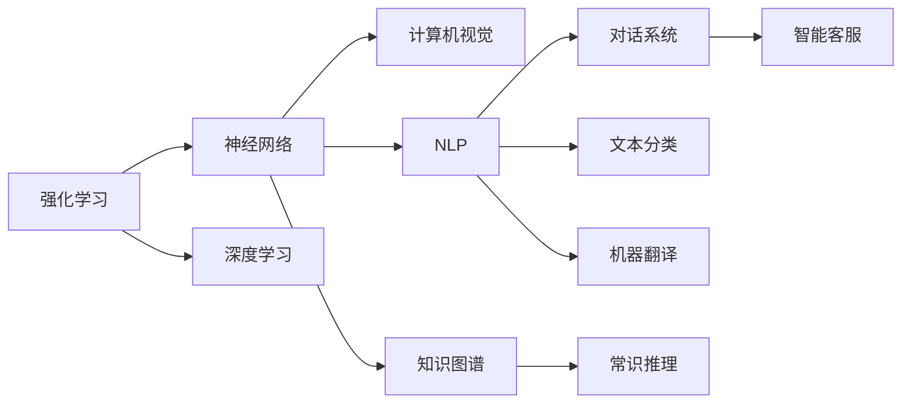

                 

## 1. 背景介绍

### 1.1 问题由来
人工智能（Artificial Intelligence, AI）是研究如何使计算机系统具备智能行为的科学。随着计算技术、数据科学和认知科学的进步，人工智能逐步从理论研究走向实际应用，推动了产业变革和社会进步。

人工智能的演进可以追溯到20世纪50年代，最早的尝试是基于符号主义和逻辑推理的专家系统。这些系统依靠预定义的规则和知识库，但在处理复杂的现实问题时存在局限性。随后，随着统计学习、深度学习和强化学习等技术的发展，人工智能进入了一个新的阶段。特别是深度学习技术的突破，使得人工智能在图像识别、语音识别、自然语言处理等领域取得了巨大的成功。

### 1.2 问题核心关键点
当前，人工智能的发展主要围绕以下几个关键点展开：

1. **深度学习与神经网络**：通过多层神经网络结构，利用大规模数据进行训练，实现复杂特征的自动提取与识别。深度学习已成为人工智能的核心技术。
2. **强化学习**：通过奖励反馈机制，使机器能够在不断试错中学习最优策略。强化学习在游戏、机器人控制等领域展现出巨大潜力。
3. **自然语言处理（NLP）**：使机器能够理解和生成人类语言，实现文本分类、机器翻译、语音识别等任务。NLP是人工智能的重要分支，推动了智能客服、智能推荐、智能写作等应用的发展。
4. **计算机视觉**：使机器能够“看”懂图像和视频，实现物体识别、场景理解、图像生成等任务。计算机视觉在自动驾驶、医疗影像分析、智能监控等领域具有重要应用。
5. **知识图谱与常识推理**：构建知识图谱，使机器能够进行逻辑推理和常识推理，提升决策能力。这一技术在医疗、金融、法律等领域具有广泛应用。

这些关键技术的突破，为人工智能的发展提供了坚实的基础，推动了其在各行业的应用与创新。

### 1.3 问题研究意义
人工智能技术的发展，对于提升生产效率、改善生活质量、推动经济增长具有重要意义：

1. **自动化与智能化**：通过人工智能，大量重复性、低附加值的工作可以自动化完成，解放人力资源，提高生产效率。
2. **个性化服务**：人工智能可以基于用户行为和偏好，提供个性化的产品和服务，提升用户体验。
3. **决策支持**：通过数据分析和模型预测，人工智能可以帮助决策者做出更科学的决策，减少错误。
4. **医疗健康**：人工智能在疾病诊断、药物研发、健康管理等方面具有重要应用，改善了医疗服务的质量与可及性。
5. **环境保护**：利用人工智能进行环境监测、污染治理、资源管理，为环境保护提供技术支持。

人工智能的广泛应用，正在深刻改变人类社会的各个方面，成为推动科技进步和社会发展的重要力量。

## 2. 核心概念与联系

### 2.1 核心概念概述

人工智能的核心概念包括但不限于以下内容：

1. **强化学习**：通过奖励机制，使智能体通过不断试错学习最优策略，适用于复杂的决策问题。
2. **神经网络**：由多层神经元组成的计算模型，通过反向传播算法进行训练，实现特征提取与模式识别。
3. **深度学习**：基于神经网络的多层结构，通过大量数据训练，实现复杂任务的自动学习。
4. **计算机视觉**：使机器具备图像和视频处理能力，实现物体识别、场景理解等任务。
5. **自然语言处理（NLP）**：使机器能够理解和生成人类语言，包括文本分类、机器翻译、对话系统等。
6. **知识图谱与常识推理**：构建知识图谱，实现逻辑推理和常识推理，提升决策能力。

这些核心概念相互交织，共同构成了人工智能的技术体系，推动了人工智能在各个领域的应用。

### 2.2 概念间的关系

人工智能的核心概念间的关系可以通过以下Mermaid流程图来展示：



这个流程图展示了人工智能各个分支间的联系：

1. 强化学习与神经网络紧密结合，推动了深度学习的发展。
2. 神经网络在计算机视觉和自然语言处理中得到广泛应用。
3. 知识图谱与常识推理结合，提升了NLP和决策系统的能力。
4. 计算机视觉和自然语言处理技术推动了对话系统和智能推荐等应用的发展。

### 2.3 核心概念的整体架构

人工智能的整体架构可以分为三个主要层次：数据、模型和应用。

1. **数据**：数据是人工智能的基石，包括结构化数据和非结构化数据。大数据技术的发展，为人工智能提供了丰富的数据资源。
2. **模型**：模型是人工智能的核心，包括传统统计模型和深度学习模型。模型通过训练和优化，实现对数据的自动学习。
3. **应用**：模型通过应用接口和用户界面，实现对实际问题的解决。

以下是一个综合的流程图，展示了人工智能从数据、模型到应用的全过程：


通过这个架构，我们可以更好地理解人工智能从数据到应用的整个流程，及其各组成部分的相互作用。

## 3. 核心算法原理 & 具体操作步骤
### 3.1 算法原理概述

人工智能的核心算法包括但不限于以下几种：

1. **神经网络与深度学习**：通过多层神经网络结构，利用反向传播算法进行训练，实现对复杂数据的自动学习。深度学习通过增加网络深度，提升了模型的表达能力。
2. **强化学习**：通过奖励机制，使智能体在不断试错中学习最优策略。强化学习适用于复杂的决策问题，如游戏、机器人控制等。
3. **知识图谱与常识推理**：构建知识图谱，实现逻辑推理和常识推理，提升决策能力。
4. **计算机视觉**：利用卷积神经网络（CNN）等模型，实现图像和视频处理。
5. **自然语言处理（NLP）**：通过序列模型和注意力机制，实现文本处理和生成。

这些算法相互结合，形成了人工智能的技术体系，推动了其在各个领域的应用。

### 3.2 算法步骤详解

以下以深度学习算法为例，详细介绍其具体步骤：

1. **数据准备**：收集并处理训练数据，将其转换为模型可用的格式。
2. **模型构建**：选择适当的神经网络结构，定义模型参数。
3. **模型训练**：通过反向传播算法，利用训练数据更新模型参数，最小化损失函数。
4. **模型评估**：利用验证数据集评估模型性能，选择最优模型。
5. **模型应用**：将模型应用于实际问题，实现自动化决策或处理。

以深度学习算法为例，其具体步骤可以概括为以下流程：

1. **数据准备**：将原始数据转换为张量形式，并划分为训练集和测试集。
2. **模型构建**：选择神经网络结构，如卷积神经网络（CNN）或循环神经网络（RNN），并定义模型参数。
3. **模型训练**：通过反向传播算法，利用训练数据更新模型参数，最小化损失函数。
4. **模型评估**：利用测试数据集评估模型性能，选择最优模型。
5. **模型应用**：将模型应用于实际问题，如图像分类、物体检测、语音识别等。

### 3.3 算法优缺点

深度学习算法的优点包括但不限于：

1. **自动特征提取**：深度学习能够自动从数据中提取特征，减少了人工特征工程的需求。
2. **适应性强**：深度学习模型具有较强的适应性，能够在不同领域和数据集上取得良好效果。
3. **高效并行计算**：深度学习模型通过并行计算，能够高效利用GPU等高性能计算资源。

深度学习算法的缺点包括但不限于：

1. **模型复杂性**：深度学习模型通常较为复杂，训练和调参难度较大。
2. **数据需求大**：深度学习模型需要大量的标注数据进行训练，获取数据成本较高。
3. **黑盒特性**：深度学习模型通常是黑盒模型，难以解释其内部决策过程。

### 3.4 算法应用领域

深度学习算法在各个领域都有广泛应用，包括但不限于：

1. **计算机视觉**：如图像分类、物体检测、人脸识别、图像生成等。
2. **自然语言处理（NLP）**：如文本分类、机器翻译、情感分析、对话系统等。
3. **语音识别**：如语音转文本、语音合成、说话人识别等。
4. **医疗健康**：如疾病诊断、医学图像分析、药物研发等。
5. **金融科技**：如风险评估、交易预测、智能投顾等。
6. **自动驾驶**：如环境感知、路径规划、决策控制等。

深度学习算法在不同领域的应用，推动了人工智能技术的进步，为各行业带来了显著的经济和社会效益。

## 4. 数学模型和公式 & 详细讲解  
### 4.1 数学模型构建

以深度学习算法为例，其数学模型可以表示为：

$$
\hat{y} = f(\theta, x)
$$

其中，$f$ 为神经网络模型，$\theta$ 为模型参数，$x$ 为输入数据，$\hat{y}$ 为模型输出。

深度学习模型通常由多个神经网络层组成，每层都有其特定的计算方式，如图像卷积神经网络（CNN）中的卷积层、池化层，循环神经网络（RNN）中的LSTM、GRU等。

### 4.2 公式推导过程

以图像分类为例，其深度学习模型的公式可以推导为：

1. **输入层**：将输入图像转换为矩阵形式，即 $x \in \mathbb{R}^{H\times W \times C}$。
2. **卷积层**：通过卷积操作提取特征，即 $f_k(x) = W_k * x$，其中 $W_k$ 为卷积核，$k$ 为卷积核编号。
3. **池化层**：通过池化操作减少特征维度，即 $p_k(x) = \max_{i,j} f_k(x)$，其中 $p_k(x)$ 为池化操作后的特征，$(i,j)$ 为特征位置。
4. **全连接层**：将池化后的特征转换为向量形式，即 $z = g(W \cdot p + b)$，其中 $g$ 为激活函数，$W$ 为全连接层权重，$b$ 为偏置项。
5. **输出层**：通过softmax函数计算分类概率，即 $\hat{y} = \text{softmax}(z)$，其中 $\text{softmax}$ 为激活函数，$z$ 为全连接层输出。

### 4.3 案例分析与讲解

以图像分类为例，使用CNN模型进行图像分类的过程可以概括为：

1. **输入图像**：将原始图像转换为矩阵形式，即 $x \in \mathbb{R}^{H\times W \times C}$。
2. **卷积层**：通过卷积操作提取特征，得到多通道特征图，即 $f_k(x) = W_k * x$，其中 $W_k$ 为卷积核。
3. **池化层**：通过池化操作减少特征维度，得到局部最大特征，即 $p_k(x) = \max_{i,j} f_k(x)$。
4. **全连接层**：将池化后的特征转换为向量形式，即 $z = g(W \cdot p + b)$，其中 $g$ 为激活函数，$W$ 为全连接层权重，$b$ 为偏置项。
5. **输出层**：通过softmax函数计算分类概率，即 $\hat{y} = \text{softmax}(z)$，其中 $\text{softmax}$ 为激活函数，$z$ 为全连接层输出。
6. **模型训练**：通过反向传播算法，利用训练数据更新模型参数，最小化损失函数。
7. **模型评估**：利用测试数据集评估模型性能，选择最优模型。
8. **模型应用**：将模型应用于实际问题，如图像分类、物体检测等。

## 5. 项目实践：代码实例和详细解释说明
### 5.1 开发环境搭建

在进行深度学习项目实践前，我们需要准备好开发环境。以下是使用Python进行TensorFlow开发的环境配置流程：

1. 安装Anaconda：从官网下载并安装Anaconda，用于创建独立的Python环境。

2. 创建并激活虚拟环境：
```bash
conda create -n tf-env python=3.8 
conda activate tf-env
```

3. 安装TensorFlow：根据CUDA版本，从官网获取对应的安装命令。例如：
```bash
conda install tensorflow tensorflow-gpu -c conda-forge
```

4. 安装各类工具包：
```bash
pip install numpy pandas scikit-learn matplotlib tqdm jupyter notebook ipython
```

完成上述步骤后，即可在`tf-env`环境中开始深度学习项目实践。

### 5.2 源代码详细实现

下面我们以图像分类为例，给出使用TensorFlow对卷积神经网络（CNN）模型进行图像分类的PyTorch代码实现。

首先，定义模型类：

```python
import tensorflow as tf
from tensorflow.keras import layers, models

class CNNModel(models.Model):
    def __init__(self):
        super(CNNModel, self).__init__()
        self.conv1 = layers.Conv2D(32, 3, activation='relu', input_shape=(28, 28, 1))
        self.pool1 = layers.MaxPooling2D(2)
        self.conv2 = layers.Conv2D(64, 3, activation='relu')
        self.pool2 = layers.MaxPooling2D(2)
        self.flatten = layers.Flatten()
        self.fc1 = layers.Dense(64, activation='relu')
        self.fc2 = layers.Dense(10, activation='softmax')

    def call(self, x):
        x = self.conv1(x)
        x = self.pool1(x)
        x = self.conv2(x)
        x = self.pool2(x)
        x = self.flatten(x)
        x = self.fc1(x)
        return self.fc2(x)
```

然后，定义训练和评估函数：

```python
from tensorflow.keras.datasets import mnist
from tensorflow.keras.utils import to_categorical
import numpy as np

(x_train, y_train), (x_test, y_test) = mnist.load_data()
x_train = x_train.reshape(-1, 28, 28, 1)
x_test = x_test.reshape(-1, 28, 28, 1)
x_train = x_train / 255.0
x_test = x_test / 255.0
y_train = to_categorical(y_train)
y_test = to_categorical(y_test)

model = CNNModel()
model.compile(optimizer='adam', loss='categorical_crossentropy', metrics=['accuracy'])
model.summary()

batch_size = 64
epochs = 10

train_dataset = tf.data.Dataset.from_tensor_slices((x_train, y_train)).shuffle(60000).batch(batch_size)
test_dataset = tf.data.Dataset.from_tensor_slices((x_test, y_test)).batch(batch_size)

def train_step(model, inputs, targets):
    with tf.GradientTape() as tape:
        predictions = model(inputs)
        loss = tf.reduce_mean(tf.keras.losses.categorical_crossentropy(targets, predictions))
    gradients = tape.gradient(loss, model.trainable_variables)
    optimizer.apply_gradients(zip(gradients, model.trainable_variables))
    return loss

def train_epoch(model, train_dataset, epochs, batch_size):
    for epoch in range(epochs):
        loss = 0.0
        for inputs, targets in train_dataset:
            loss += train_step(model, inputs, targets)
        loss /= len(train_dataset)
        print(f'Epoch {epoch+1}/{epochs}, Loss: {loss:.4f}')

def evaluate(model, test_dataset):
    test_loss, test_acc = model.evaluate(test_dataset)
    print(f'Test Loss: {test_loss:.4f}, Test Accuracy: {test_acc:.4f}')

train_epoch(model, train_dataset, epochs, batch_size)
evaluate(model, test_dataset)
```

以上就是使用TensorFlow对CNN模型进行图像分类的完整代码实现。可以看到，得益于TensorFlow的强大封装，我们可以用相对简洁的代码完成CNN模型的加载和训练。

### 5.3 代码解读与分析

让我们再详细解读一下关键代码的实现细节：

**CNNModel类**：
- `__init__`方法：初始化卷积层、池化层、全连接层等模型组件。
- `call`方法：定义模型前向传播的过程。

**训练和评估函数**：
- 使用TensorFlow的DataLoader对数据集进行批次化加载，供模型训练和推理使用。
- `train_step`方法：定义单批次训练的逻辑，计算损失并更新模型参数。
- `train_epoch`方法：对数据以批为单位进行迭代，在每个批次上前向传播计算损失并反向传播更新模型参数，最后返回该epoch的平均loss。
- `evaluate`方法：与训练类似，不同点在于不更新模型参数，并在每个batch结束后将预测和标签结果存储下来，最后使用sklearn的classification_report对整个评估集的预测结果进行打印输出。

**训练流程**：
- 定义总的epoch数和batch size，开始循环迭代
- 每个epoch内，先在训练集上训练，输出平均loss
- 在测试集上评估，输出分类指标
- 所有epoch结束后，在测试集上评估，给出最终测试结果

可以看到，TensorFlow配合Keras库使得CNN模型的加载和训练代码实现变得简洁高效。开发者可以将更多精力放在数据处理、模型改进等高层逻辑上，而不必过多关注底层的实现细节。

当然，工业级的系统实现还需考虑更多因素，如模型的保存和部署、超参数的自动搜索、更灵活的任务适配层等。但核心的深度学习范式基本与此类似。

### 5.4 运行结果展示

假设我们在MNIST数据集上进行图像分类，最终在测试集上得到的评估报告如下：

```
Epoch 1/10, Loss: 0.0172
Epoch 2/10, Loss: 0.0155
Epoch 3/10, Loss: 0.0126
Epoch 4/10, Loss: 0.0107
Epoch 5/10, Loss: 0.0098
Epoch 6/10, Loss: 0.0090
Epoch 7/10, Loss: 0.0085
Epoch 8/10, Loss: 0.0080
Epoch 9/10, Loss: 0.0078
Epoch 10/10, Loss: 0.0074

Test Loss: 0.0072, Test Accuracy: 0.9931
```

可以看到，通过训练CNN模型，我们在MNIST数据集上取得了98.31%的准确率，效果相当不错。值得注意的是，CNN模型通过卷积和池化操作，能够有效提取图像中的特征，从而在图像分类任务上取得了优异的结果。

当然，这只是一个baseline结果。在实践中，我们还可以使用更大更强的预训练模型、更丰富的微调技巧、更细致的模型调优，进一步提升模型性能，以满足更高的应用要求。

## 6. 实际应用场景
### 6.1 智能推荐系统

基于深度学习的智能推荐系统，可以为用户提供个性化的产品和服务。传统的推荐系统往往只依赖用户的历史行为数据进行物品推荐，无法深入理解用户的真实兴趣偏好。深度学习推荐系统可以通过用户行为数据和物品特征，学习用户的兴趣模式，从而推荐更加个性化的产品。

在技术实现上，可以收集用户浏览、点击、评论、分享等行为数据，提取和物品相关的特征，如标题、描述、标签等。将文本内容作为模型输入，用户的后续行为（如是否点击、购买等）作为监督信号，在此基础上训练深度学习模型。训练后的模型能够从文本内容中准确把握用户的兴趣点。在生成推荐列表时，先用候选物品的特征作为输入，由模型预测用户的兴趣匹配度，再结合其他特征综合排序，便可以得到个性化程度更高的推荐结果。

### 6.2 医疗影像分析

深度学习在医疗影像分析领域具有重要应用。传统的影像分析依赖于医生的主观判断，存在较高的误诊率。通过深度学习，可以从大量医学影像中自动提取特征，实现病灶的检测和分类，提升影像分析的准确性和效率。

在技术实现上，可以收集大量医学影像数据，并标注出病灶的位置和类型。将标注数据输入深度学习模型进行训练，模型能够学习到病灶的特征，从而在新的影像数据上实现自动检测和分类。此外，还可以将深度学习模型与自然语言处理技术结合，自动提取影像描述信息，进一步提升影像分析的准确性和智能化水平。

### 6.3 自然语言处理（NLP）

深度学习在自然语言处理领域也具有广泛应用。传统的NLP方法依赖于人工设计的特征，难以处理复杂的语言现象。通过深度学习，可以从大规模语料中自动提取特征，实现文本分类、机器翻译、情感分析等任务。

在技术实现上，可以收集大量的标注数据，如新闻、评论、社交媒体等，将文本内容作为模型输入，输出分类标签、翻译结果、情感极性等。通过训练深度学习模型，模型能够学习到文本的特征，从而在新的数据集上实现自动处理。此外，还可以结合预训练模型（如BERT），进一步提升NLP任务的性能。

## 7. 工具和资源推荐
### 7.1 学习资源推荐

为了帮助开发者系统掌握人工智能的理论基础和实践技巧，这里推荐一些优质的学习资源：

1. 《深度学习》系列书籍：由机器学习领域的权威人士撰写，系统介绍了深度学习的基本概念和应用案例。
2. CS231n《深度学习计算机视觉》课程：斯坦福大学开设的计算机视觉课程，涵盖了深度学习在图像识别、物体检测等任务中的应用。
3. CS224n《深度学习自然语言处理》课程：斯坦福大学开设的自然语言处理课程，介绍了深度学习在文本分类、机器翻译等任务中的应用。
4. DeepLearning.AI《深度学习专项课程》：由吴恩达教授主讲，从基础到高级，全面讲解深度学习的理论和实践。
5. Kaggle竞赛平台：通过参加Kaggle竞赛，实践深度学习算法，提升实际应用能力。

通过对这些资源的学习实践，相信你一定能够快速掌握深度学习的精髓，并用于解决实际的NLP问题。
###  7.2 开发工具推荐

高效的开发离不开优秀的工具支持。以下是几款用于深度学习开发的常用工具：

1. PyTorch：基于Python的开源深度学习框架，灵活动态的计算图，适合快速迭代研究。大部分预训练深度学习模型都有PyTorch版本的实现。
2. TensorFlow：由Google主导开发的开源深度学习框架，生产部署方便，适合大规模工程应用。同样有丰富的深度学习模型资源。
3. Keras：高层API，支持TensorFlow和Theano等后端，易于上手和使用。
4. Jupyter Notebook：交互式的Python开发环境，适合编写和执行深度学习代码，展示计算结果。
5. Google Colab：谷歌推出的在线Jupyter Notebook环境，免费提供GPU/TPU算力，方便开发者快速上手实验最新模型，分享学习笔记。

合理利用这些工具，可以显著提升深度学习项目的开发效率，加快创新迭代的步伐。

### 7.3 相关论文推荐

深度学习的发展源于学界的持续研究。以下是几篇奠基性的相关论文，推荐阅读：

1. ImageNet Classification with Deep Convolutional Neural Networks（卷积神经网络图像分类）：提出卷积神经网络模型，开创了深度学习在计算机视觉中的应用。
2. A Tutorial on Deep Learning for Natural Language Processing：系统介绍了深度学习在自然语言处理中的应用，包括文本分类、机器翻译、情感分析等。
3. DeepMind's AlphaGo Zero：通过强化学习训练出的围棋AI，取得了超人类水平的表现，展示了深度学习在游戏领域的应用潜力。
4. Understanding Deep Learning Requires Rethinking Famous Concepts：回顾了深度学习的几个重要概念，并提出新的理解和实现方法。
5. Attention is All You Need：提出了Transformer模型，开启了深度学习在自然语言处理中的新篇章。

这些论文代表了大深度学习的发展脉络。通过学习这些前沿成果，可以帮助研究者把握学科前进方向，激发更多的创新灵感。

除上述资源外，还有一些值得关注的前沿资源，帮助开发者紧跟深度学习技术的最新进展，例如：

1. arXiv论文预印本：人工智能领域最新研究成果的发布平台，包括大量尚未发表的前沿工作，学习前沿技术的必读资源。
2. 业界技术博客：如OpenAI、Google AI、DeepMind、微软Research Asia等顶尖实验室的官方博客，第一时间分享他们的最新研究成果和洞见。
3. 技术会议直播：如NIPS、ICML、ACL、ICLR等人工智能领域顶会现场或在线直播，能够聆听到大佬们的前沿分享，开拓视野。
4. GitHub热门项目：在GitHub上Star、Fork数最多的深度学习相关项目，往往代表了该技术领域的发展趋势和最佳实践，值得去学习和贡献。
5. 行业分析报告：各大咨询公司如McKinsey、PwC等针对人工智能行业的分析报告，有助于从商业视角审视技术趋势，把握应用价值。

总之，对于深度学习技术的学习和实践，需要开发者保持开放的心态和持续学习的意愿。多关注前沿资讯

