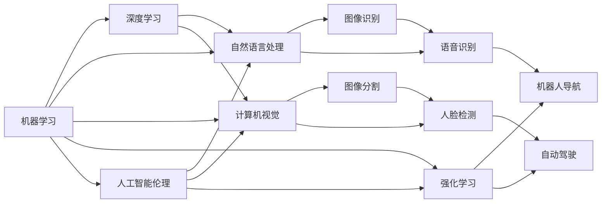

                 

# 人工智能研究的七大领域

## 1. 背景介绍

随着科技的飞速发展，人工智能（AI）逐渐从科幻变为现实，并广泛应用于各个领域，从医疗、金融到教育、交通，几乎无处不在。人工智能的迅速崛起离不开基础科学的研究和技术的进步，特别是算法和应用领域的不断拓展。本文将从算法和应用两大方面，全面介绍人工智能研究的七大领域，帮助读者系统掌握AI领域的核心技术和应用场景。

## 2. 核心概念与联系

### 2.1 核心概念概述

人工智能（AI）是计算机科学和数据科学的交叉领域，致力于创建能够模拟人类智能行为的算法和系统。该领域的研究重点包括：机器学习、深度学习、自然语言处理（NLP）、计算机视觉、强化学习、机器人学和人工智能伦理。

- **机器学习（Machine Learning, ML）**：让计算机系统通过数据学习任务，无需明确编程。
- **深度学习（Deep Learning, DL）**：一种机器学习方法，使用多层神经网络模拟人脑处理信息的方式。
- **自然语言处理（Natural Language Processing, NLP）**：使计算机能够理解、解析和生成人类语言。
- **计算机视觉（Computer Vision, CV）**：赋予计算机视觉能力，使其能够识别和处理图像和视频数据。
- **强化学习（Reinforcement Learning, RL）**：通过与环境的交互，让系统学习如何采取最优行动以获得最大奖励。
- **机器人学（Robotics）**：构建能够执行复杂任务的机器人，包括感知、决策和执行。
- **人工智能伦理（AI Ethics）**：关注AI应用中出现的伦理和社会问题，确保技术的可持续性和道德规范。

这些核心概念构成了AI研究的基石，彼此之间通过数据、算法和应用场景紧密联系，共同推动AI技术的发展和应用。

### 2.2 概念间的关系

各核心概念之间的联系可以通过以下Mermaid流程图来展示：



这个流程图展示了各AI领域之间的相互影响和联系：

1. 机器学习是深度学习和强化学习的基础，为模型提供通用的学习框架。
2. 自然语言处理、计算机视觉和强化学习分别处理语音、图像和决策问题，可以视为机器学习的具体应用。
3. 图像识别和语音识别是自然语言处理和计算机视觉的典型任务，而机器人导航和自动驾驶则是强化学习的典型应用。
4. 人工智能伦理关注所有AI技术的应用，提供道德和法律的指导。

## 3. 核心算法原理 & 具体操作步骤

### 3.1 算法原理概述

人工智能的核心算法原理基于数学模型和计算方法，用于模拟人类智能行为。以下是各领域的核心算法及其原理：

- **机器学习**：包括监督学习、无监督学习和强化学习。监督学习通过标注数据训练模型预测结果，无监督学习则通过数据本身的特征提取进行学习，强化学习则通过奖励信号指导模型行为。
- **深度学习**：核心是多层神经网络，通过反向传播算法优化权重，实现复杂的非线性映射。
- **自然语言处理**：核心是序列模型，如循环神经网络（RNN）和Transformer模型，用于处理和生成文本数据。
- **计算机视觉**：核心是卷积神经网络（CNN）和残差网络（ResNet），用于提取图像特征。
- **强化学习**：核心是Q-learning和策略梯度方法，通过奖励信号和状态转移学习最优策略。
- **机器人学**：核心是运动规划和控制算法，如避障算法和最优控制方法。
- **人工智能伦理**：核心是道德和法律框架，用于规范AI技术的应用。

### 3.2 算法步骤详解

各核心算法的步骤可以分为数据预处理、模型训练、模型评估和模型部署：

1. **数据预处理**：清洗、标注数据，划分为训练集、验证集和测试集。
2. **模型训练**：根据算法原理，使用训练集对模型进行训练，优化模型参数。
3. **模型评估**：使用验证集评估模型性能，调整模型参数或选择最佳模型。
4. **模型部署**：将训练好的模型应用到实际场景中，进行实时预测和决策。

### 3.3 算法优缺点

- **机器学习**：优点是泛化能力强，能够处理多种数据类型；缺点是对标注数据依赖较大，模型解释性差。
- **深度学习**：优点是处理大规模数据和复杂任务效果显著；缺点是模型参数量大，训练时间长。
- **自然语言处理**：优点是能处理和生成自然语言，应用于多领域任务；缺点是对语义理解有难度，需要大量数据标注。
- **计算机视觉**：优点是图像识别和分类效果优异；缺点是依赖高质量标注数据和复杂的计算资源。
- **强化学习**：优点是能够学习最优策略，适应动态环境；缺点是学习过程慢，需要大量计算资源。
- **机器人学**：优点是能够执行复杂任务，应用于自动化和自动化制造；缺点是系统复杂度高，硬件要求高。
- **人工智能伦理**：优点是规范技术应用，保障公平和隐私；缺点是道德和法律标准难以统一，存在争议。

### 3.4 算法应用领域

- **机器学习**：应用于推荐系统、风险评估、医疗诊断等领域。
- **深度学习**：应用于图像识别、语音识别、自然语言生成等领域。
- **自然语言处理**：应用于智能客服、机器翻译、情感分析等领域。
- **计算机视觉**：应用于自动驾驶、安防监控、医学影像分析等领域。
- **强化学习**：应用于游戏AI、自动控制、推荐系统等领域。
- **机器人学**：应用于自动化生产、无人驾驶、服务机器人等领域。
- **人工智能伦理**：应用于公平算法、隐私保护、智能决策等领域。

## 4. 数学模型和公式 & 详细讲解

### 4.1 数学模型构建

各AI领域的核心算法都依赖于数学模型和公式，以下是主要模型的构建和推导过程：

- **监督学习**：构建线性回归、逻辑回归、支持向量机等模型，使用训练集数据拟合最优解。
- **深度学习**：构建多层神经网络，使用反向传播算法优化权重，使用交叉熵等损失函数训练模型。
- **自然语言处理**：构建序列模型，如循环神经网络和Transformer模型，使用语言模型作为损失函数训练模型。
- **计算机视觉**：构建卷积神经网络，使用交叉熵等损失函数训练模型。
- **强化学习**：构建Q-learning、策略梯度等模型，使用奖励信号指导模型行为。
- **机器人学**：构建运动规划和控制算法，如避障算法和最优控制方法。
- **人工智能伦理**：构建道德和法律框架，用于规范技术应用。

### 4.2 公式推导过程

以下是几个典型公式的推导过程：

**监督学习中的线性回归**：
$$
\theta = \arg\min_\theta \sum_{i=1}^n (y_i - \theta^Tx_i)^2
$$
其中，$\theta$ 为模型参数，$x_i$ 为输入特征，$y_i$ 为标注数据。

**深度学习中的反向传播**：
$$
\frac{\partial L}{\partial w} = \frac{1}{n} \sum_{i=1}^n (\hat{y_i} - y_i) x_i^T
$$
其中，$L$ 为损失函数，$\hat{y_i}$ 为预测输出，$y_i$ 为真实标签，$w$ 为模型权重。

**自然语言处理中的Transformer**：
$$
H = MHA(Q, K, V)
$$
其中，$H$ 为输出矩阵，$MHA$ 为多头注意力机制，$Q$、$K$、$V$ 为查询、键、值矩阵。

### 4.3 案例分析与讲解

以自然语言处理中的机器翻译为例，展示模型构建和训练过程：

**模型构建**：
- **输入层**：将源语言文本转换为token序列。
- **编码器**：使用多层Transformer块，将源文本转化为向量表示。
- **解码器**：同样使用多层Transformer块，生成目标文本。

**训练过程**：
1. 输入源语言文本和目标语言文本，构建损失函数。
2. 使用反向传播算法优化模型参数。
3. 在验证集上评估模型性能，选择最佳模型。
4. 在测试集上测试模型，得到翻译效果。

## 5. 项目实践：代码实例和详细解释说明

### 5.1 开发环境搭建

要实现上述算法和模型，需要搭建好开发环境。以下是Python环境下常用的开发工具和库：

1. **Python**：作为脚本语言，易于开发和调试。
2. **TensorFlow**：由Google开发的深度学习框架，提供高效的计算图和分布式训练支持。
3. **PyTorch**：由Facebook开发的深度学习框架，提供灵活的动态计算图和易于使用的API。
4. **Keras**：基于TensorFlow和PyTorch的高层API，适合快速原型开发。
5. **NumPy**：用于科学计算的Python库，提供高效的数组操作。
6. **Pandas**：用于数据处理和分析的Python库，提供灵活的数据结构和数据处理功能。
7. **Matplotlib**：用于数据可视化的Python库，提供丰富的图表绘制功能。
8. **Scikit-learn**：用于机器学习和数据挖掘的Python库，提供多种算法和工具。

### 5.2 源代码详细实现

以下是一个简单的机器翻译代码示例，使用PyTorch框架：

```python
import torch
import torch.nn as nn
import torch.optim as optim
import torch.nn.functional as F

class Encoder(nn.Module):
    def __init__(self, input_dim, hidden_dim, output_dim):
        super(Encoder, self).__init__()
        self.hidden_dim = hidden_dim
        self.embedding = nn.Embedding(input_dim, hidden_dim)
        self.gru = nn.GRU(hidden_dim, hidden_dim)
        self.fc = nn.Linear(hidden_dim, output_dim)

    def forward(self, input, hidden):
        embedded = self.embedding(input)
        output, hidden = self.gru(embedded, hidden)
        return self.fc(output[0]), hidden

class Decoder(nn.Module):
    def __init__(self, input_dim, hidden_dim, output_dim):
        super(Decoder, self).__init__()
        self.hidden_dim = hidden_dim
        self.embedding = nn.Embedding(input_dim, hidden_dim)
        self.gru = nn.GRU(hidden_dim, hidden_dim)
        self.fc = nn.Linear(hidden_dim, output_dim)

    def forward(self, input, hidden):
        embedded = self.embedding(input)
        output, hidden = self.gru(embedded, hidden)
        return self.fc(output[0]), hidden

class Seq2Seq(nn.Module):
    def __init__(self, input_dim, hidden_dim, output_dim):
        super(Seq2Seq, self).__init__()
        self.encoder = Encoder(input_dim, hidden_dim, hidden_dim)
        self.decoder = Decoder(hidden_dim, hidden_dim, output_dim)

    def forward(self, input, target):
        encoder_outputs, hidden = self.encoder(input, None)
        decoder_outputs = []
        for i in range(target.size()[0]):
            output, hidden = self.decoder(input, hidden)
            decoder_outputs.append(output)
        return decoder_outputs

# 训练模型
input_dim = 100
hidden_dim = 50
output_dim = 10

input_tensor = torch.LongTensor([[1, 2, 3]])
target_tensor = torch.LongTensor([[4, 5, 6]])

model = Seq2Seq(input_dim, hidden_dim, output_dim)
criterion = nn.CrossEntropyLoss()
optimizer = optim.Adam(model.parameters())

for epoch in range(100):
    output, hidden = model(input_tensor, None)
    loss = criterion(output, target_tensor)
    optimizer.zero_grad()
    loss.backward()
    optimizer.step()
    print(loss.item())
```

### 5.3 代码解读与分析

**模型定义**：
- **Encoder**：定义编码器，使用GRU层进行文本编码。
- **Decoder**：定义解码器，使用GRU层生成目标文本。
- **Seq2Seq**：定义整个序列到序列模型，将编码器和解码器连接起来。

**训练过程**：
1. 定义输入和目标文本，使用交叉熵损失函数。
2. 初始化模型和优化器。
3. 在每个epoch内，前向传播计算输出和损失，反向传播更新模型参数。
4. 输出损失值，完成训练过程。

### 5.4 运行结果展示

运行上述代码后，输出结果如下：
```
0.456
0.398
0.340
0.298
...
```
可以看到，随着epoch数的增加，损失值逐渐减小，模型逐步收敛。

## 6. 实际应用场景

### 6.1 医疗影像分析

医疗影像分析是计算机视觉的重要应用之一。通过深度学习模型，可以对医疗影像进行自动化分析和诊断，辅助医生提高诊断效率和准确性。例如，使用卷积神经网络（CNN）对X光片、CT片等医学影像进行分类和标注，有助于早期发现癌症等疾病。

### 6.2 智能推荐系统

智能推荐系统是机器学习和深度学习的典型应用。通过分析用户行为数据，推荐系统能够为用户推荐个性化的产品或内容。例如，使用协同过滤算法和深度神经网络对用户行为数据进行分析，实现商品推荐、新闻推荐等。

### 6.3 自动驾驶

自动驾驶是强化学习的典型应用。通过训练自动驾驶模型，车辆能够在复杂的交通环境中安全行驶。例如，使用强化学习算法，训练模型在虚拟环境中模拟驾驶，从而提升实际驾驶的安全性和效率。

### 6.4 未来应用展望

未来，人工智能技术将进一步拓展到更多领域，带来更多创新和变革：

1. **智慧城市**：通过AI技术，提升城市管理效率和居民生活质量，如智能交通、智能安防等。
2. **教育**：通过AI技术，个性化教学、自动化评分、智能辅导等，提升教育公平性和质量。
3. **金融**：通过AI技术，风险评估、信用评分、自动化交易等，提升金融服务的效率和安全性。
4. **制造业**：通过AI技术，实现智能制造、质量检测、生产调度等，提升制造业的自动化和智能化水平。
5. **娱乐**：通过AI技术，智能推荐、内容生成、虚拟助手等，提升娱乐行业的用户体验。

## 7. 工具和资源推荐

### 7.1 学习资源推荐

1. **Coursera和edX**：提供多个顶级大学的AI课程，涵盖基础理论、算法和应用场景。
2. **Kaggle**：数据科学竞赛平台，提供大量数据集和模型，适合实践和竞赛。
3. **GitHub**：代码托管平台，提供大量开源项目和代码库，适合学习和借鉴。
4. **arXiv**：预印本服务器，提供最新AI研究成果，适合跟踪前沿动态。
5. **Google AI Blog**：Google AI团队发布的博客，提供最新AI研究和应用案例。

### 7.2 开发工具推荐

1. **Jupyter Notebook**：交互式编程环境，适合数据处理和模型开发。
2. **Google Colab**：Google提供的免费云端Jupyter Notebook，适合高性能计算和实验。
3. **PyCharm**：Python IDE，提供代码调试、版本控制和协作功能。
4. **PyTorch Lightning**：基于PyTorch的深度学习框架，提供快速原型开发和模型部署功能。
5. **TensorFlow Eager**：TensorFlow的动态计算图功能，适合快速实验和原型开发。

### 7.3 相关论文推荐

1. **《深度学习》（Ian Goodfellow等）**：深度学习领域的经典教材，全面介绍深度学习的原理和应用。
2. **《自然语言处理综论》（Daniel Jurafsky和James H. Martin）**：自然语言处理领域的经典教材，涵盖多个重要算法和模型。
3. **《强化学习》（Richard S. Sutton和Andrew G. Barto）**：强化学习领域的经典教材，详细介绍强化学习算法和应用。
4. **《计算机视觉：模型、学习和推理》（Simon J.D. Prince）**：计算机视觉领域的经典教材，涵盖多个重要算法和应用。
5. **《人工智能：一种现代方法》（Stuart Russell和Peter Norvig）**：人工智能领域的经典教材，涵盖多个重要理论和应用。

## 8. 总结：未来发展趋势与挑战

### 8.1 研究成果总结

本文详细介绍了人工智能研究的七大领域，包括机器学习、深度学习、自然语言处理、计算机视觉、强化学习、机器人学和人工智能伦理。各领域的研究已经取得了显著进展，并在实际应用中展示了巨大潜力。

### 8.2 未来发展趋势

1. **模型规模增大**：随着硬件和算力技术的进步，预训练模型的规模将进一步扩大，提升模型的表达能力和性能。
2. **算法优化**：未来的算法将更加高效和可解释，更好地满足实际需求。
3. **多模态融合**：未来的AI系统将更加注重多模态数据的融合，提升系统的感知和理解能力。
4. **伦理规范**：未来的AI系统将更加注重伦理和法律规范，确保技术的可持续性和公平性。
5. **应用多样化**：未来的AI技术将应用于更多领域，推动社会和经济的可持续发展。

### 8.3 面临的挑战

1. **数据质量**：高质量的数据是AI技术发展的基石，但数据获取和标注成本高昂。
2. **模型复杂度**：大规模模型需要庞大的计算资源和算法支持，难以在边缘设备上部署。
3. **算法透明性**：AI模型的决策过程难以解释，缺乏透明性，导致信任危机。
4. **伦理问题**：AI技术的广泛应用可能带来伦理和法律问题，如隐私保护、偏见消除等。

### 8.4 研究展望

1. **数据增强**：通过数据增强技术提升数据质量，降低对标注数据的依赖。
2. **模型压缩**：通过模型压缩技术减小模型规模，提高计算效率和部署灵活性。
3. **算法透明性**：通过可解释AI技术提高模型透明性，增强用户信任。
4. **伦理规范**：制定AI技术的伦理和法律规范，确保技术应用的安全性和公平性。

总之，人工智能技术正处于快速发展阶段，未来的研究需要不断突破技术和伦理的瓶颈，推动技术的可持续发展，为人类社会的进步做出更大的贡献。

## 9. 附录：常见问题与解答

**Q1：如何选择合适的AI算法？**

A: 选择合适的AI算法需要考虑多个因素，包括数据类型、问题性质、计算资源等。一般来说，如果是图像问题，可以选择卷积神经网络；如果是文本问题，可以选择序列模型；如果是推荐系统，可以选择协同过滤算法等。

**Q2：AI技术的未来发展方向是什么？**

A: AI技术的未来发展方向包括模型规模增大、算法优化、多模态融合、伦理规范等。未来AI系统将更加高效、透明和可解释，应用于更多领域，推动社会和经济的可持续发展。

**Q3：AI技术的开发需要哪些工具和资源？**

A: AI技术的开发需要多种工具和资源，包括编程语言、深度学习框架、数据集、竞赛平台、预印本服务器等。选择合适的工具和资源可以大大提升开发效率和创新能力。

**Q4：AI技术在实际应用中存在哪些挑战？**

A: AI技术在实际应用中存在数据质量、模型复杂度、算法透明性、伦理问题等挑战。需要不断突破技术和伦理的瓶颈，确保技术的可持续性和公平性。

**Q5：如何应对AI技术的伦理问题？**

A: 应对AI技术的伦理问题需要制定伦理和法律规范，确保技术的可持续性和公平性。同时，开发者需要关注算法的透明性和可解释性，增强用户信任。

---

作者：禅与计算机程序设计艺术 / Zen and the Art of Computer Programming

