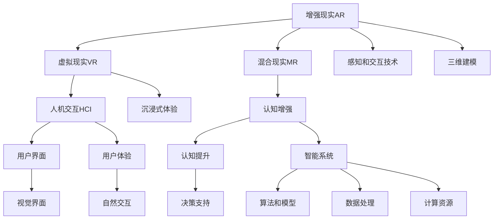
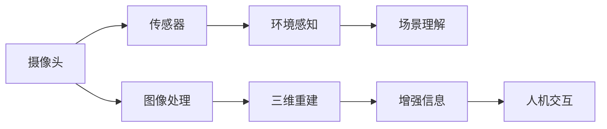
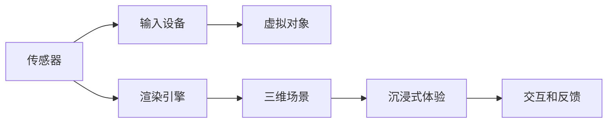
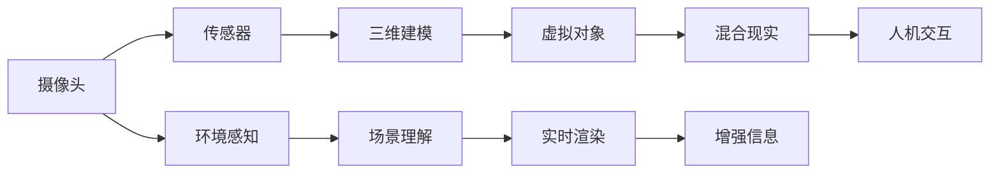
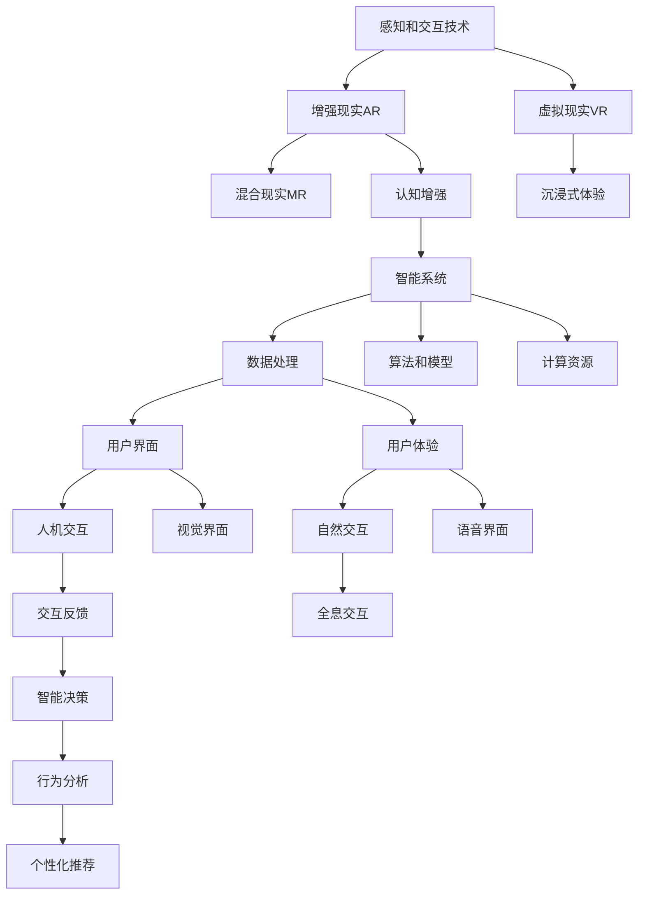

                 

# 人类注意力增强：未来的工作和生活

> 关键词：人类注意力增强, 增强现实, 智能系统, 未来工作, 未来生活, 认知提升, 人工智能

## 1. 背景介绍

### 1.1 问题由来
随着数字技术的不断进步，人类生活和工作方式正在经历深刻的变革。从智能手机到虚拟现实，从云计算到物联网，我们越来越依赖于数字设备来处理信息、沟通交流、决策判断。然而，过度依赖数字设备，尤其是在信息过载、数据爆炸的时代，不仅增加了我们的认知负担，还可能导致注意力分散、决策困难等诸多问题。

近年来，增强现实（AR）和虚拟现实（VR）技术的兴起，为人类提供了全新的感官体验和认知增强手段。通过AI技术，我们可以更智能地处理信息、辅助决策，甚至进行沉浸式学习和训练。这些技术的发展，正在为我们的工作和生活带来革命性的改变。

### 1.2 问题核心关键点
增强现实和虚拟现实技术，本质上是对人类感官和认知的增强。其核心思想是通过智能设备感知环境、增强信息，使人类能够更高效、更直观地获取和处理信息。

通过增强现实，我们可以直观地看到3D模型、注释信息、互动对象，进行协作和培训。虚拟现实则通过全沉浸式体验，带来更丰富的感官刺激和沉浸式互动。这些技术可以应用于医疗、教育、训练、娱乐等多个领域，提升人类的认知效率和信息处理能力。

### 1.3 问题研究意义
增强现实和虚拟现实技术的广泛应用，对于提升人类的信息处理效率、促进学习创新、改善工作体验、提高生活质量，具有重要的理论和实践意义：

1. 提高认知效率：增强现实和虚拟现实技术可以显著提升人类对信息的感知和处理速度，减少信息过载带来的认知负担。
2. 促进学习创新：通过虚拟实验、互动模拟，学生可以更直观地理解复杂的科学原理，提升学习效果。
3. 改善工作体验：增强现实和虚拟现实技术可以应用于培训、协作、管理等多个环节，提升工作效率和团队合作。
4. 提高生活质量：虚拟现实游戏、健身、社交等应用，可以带来更丰富、更沉浸的娱乐体验，提升个人生活质量。
5. 创新驱动发展：增强现实和虚拟现实技术是下一代计算技术的重要方向，将推动产业升级和创新发展。

## 2. 核心概念与联系

### 2.1 核心概念概述

为更好地理解增强现实和虚拟现实技术的应用，本节将介绍几个密切相关的核心概念：

- 增强现实（Augmented Reality, AR）：通过智能设备感知现实世界，并叠加数字信息，增强人类对环境的认知和感知能力。
- 虚拟现实（Virtual Reality, VR）：通过完全虚拟的环境，构建沉浸式的感官体验，提供完全不同寻常的互动和交互方式。
- 混合现实（Mixed Reality, MR）：将现实世界和虚拟世界融合，使虚拟对象和现实对象共存，提供更丰富、更沉浸的互动体验。
- 人机交互（Human-Computer Interaction, HCI）：研究人机之间如何高效、自然地进行交互，提升用户体验和系统效率。
- 认知增强（Cognitive Enhancement）：通过技术手段提升人类的认知能力，包括注意力、记忆、决策等方面。

这些核心概念之间的逻辑关系可以通过以下Mermaid流程图来展示：



这个流程图展示了几类核心概念及其之间的关系：

1. 增强现实和虚拟现实技术基于感知和交互技术，通过三维建模和沉浸式体验，使人类能够更直观、更自然地与数字信息进行互动。
2. 人机交互技术研究如何高效自然地进行用户与系统的互动，提升用户体验和系统效率。
3. 认知增强技术通过提升人类的注意力、记忆、决策等方面能力，使人类能够更高效地处理信息。
4. 智能系统则集成了感知、交互、认知增强等多方面的技术，提供智能化的解决方案。

这些核心概念共同构成了增强现实和虚拟现实技术的完整生态系统，使其能够在各个领域发挥强大的作用。通过理解这些核心概念，我们可以更好地把握增强现实和虚拟现实技术的工作原理和优化方向。

### 2.2 概念间的关系

这些核心概念之间存在着紧密的联系，形成了增强现实和虚拟现实技术的完整生态系统。下面我通过几个Mermaid流程图来展示这些概念之间的关系。

#### 2.2.1 增强现实技术架构



这个流程图展示了增强现实技术的核心架构，从感知到增强信息，再到人机交互，每个环节都扮演着重要角色。

#### 2.2.2 虚拟现实技术架构



这个流程图展示了虚拟现实技术的核心架构，通过传感器获取输入，渲染引擎构建虚拟场景，交互和反馈系统提供沉浸式体验。

#### 2.2.3 混合现实技术架构



这个流程图展示了混合现实技术的核心架构，通过环境感知和实时渲染，将虚拟对象和现实对象融合，提供更丰富、更沉浸的互动体验。

### 2.3 核心概念的整体架构

最后，我们用一个综合的流程图来展示这些核心概念在大规模增强现实和虚拟现实技术中的整体架构：



这个综合流程图展示了从感知和交互技术到增强现实、虚拟现实、混合现实，再到认知增强和智能系统，各个环节之间的紧密联系和协同工作。通过这些核心概念的有机结合，我们可以构建出更加智能、高效、自然的增强现实和虚拟现实系统，为人类工作和生活带来革命性的改变。

## 3. 核心算法原理 & 具体操作步骤
### 3.1 算法原理概述

增强现实和虚拟现实技术的核心算法，通常包括感知、三维建模、环境理解、增强信息显示、人机交互等多个环节。这些算法共同构成了技术的核心竞争力，使得增强现实和虚拟现实系统能够高效、自然地增强人类的认知和交互能力。

#### 3.1.1 感知算法
增强现实和虚拟现实技术的感知算法，通常包括视觉感知、传感器融合、环境理解等多个环节。通过摄像头、传感器等设备，系统能够实时获取环境信息，进行场景理解，从而实现智能增强和交互。

#### 3.1.2 三维建模算法
三维建模算法是增强现实和虚拟现实技术的重要组成部分。通过三维建模，系统可以构建虚拟对象，并实时渲染，实现沉浸式体验。

#### 3.1.3 环境理解算法
环境理解算法通过深度学习和计算机视觉技术，实现对复杂环境的理解和推理。这对于智能交互和增强信息显示至关重要。

#### 3.1.4 增强信息显示算法
增强信息显示算法通过视觉、听觉等多种方式，将数字信息叠加到现实世界中，增强人类的认知能力。

#### 3.1.5 人机交互算法
人机交互算法研究如何高效、自然地进行用户与系统的互动，提升用户体验和系统效率。

### 3.2 算法步骤详解

以下是增强现实和虚拟现实技术的核心算法步骤详解：

**Step 1: 数据采集和处理**
- 通过摄像头、传感器等设备，实时采集环境数据。
- 对采集的数据进行预处理，包括去噪、归一化、压缩等操作。
- 使用深度学习模型进行特征提取和环境理解。

**Step 2: 三维建模和渲染**
- 根据环境理解结果，使用三维建模算法构建虚拟对象。
- 使用渲染引擎实时渲染虚拟对象，实现沉浸式体验。

**Step 3: 增强信息显示**
- 将数字信息叠加到现实世界中，实现增强信息显示。
- 根据用户行为和环境变化，动态调整增强信息的内容和形式。

**Step 4: 人机交互**
- 通过视觉、听觉等多种方式，实现自然交互。
- 根据用户行为，动态调整交互界面和反馈。

**Step 5: 智能决策**
- 结合感知、建模、交互等多方面的信息，进行智能决策。
- 根据决策结果，动态调整系统的行为和输出。

### 3.3 算法优缺点

增强现实和虚拟现实技术的核心算法，具有以下优点：

- 沉浸式体验：通过全沉浸式体验，提升用户对环境的感知和认知能力。
- 高效交互：通过自然交互技术，提升用户与系统的互动效率和体验。
- 智能决策：通过深度学习和算法优化，实现更加智能和高效的决策。

同时，这些算法也存在以下局限：

- 设备依赖：增强现实和虚拟现实技术需要高性能设备支持，成本较高。
- 技术门槛：涉及深度学习、计算机视觉等多领域的知识，技术实现复杂。
- 环境适应性：不同环境下的增强现实和虚拟现实效果差异较大，需要针对特定场景进行优化。
- 用户体验：设备佩戴舒适度和视觉效果，影响用户体验。

### 3.4 算法应用领域

增强现实和虚拟现实技术已经在多个领域得到了广泛的应用，例如：

- 医疗：虚拟手术模拟、远程医疗诊断、康复训练等。
- 教育：虚拟课堂、互动教学、虚拟实验等。
- 培训：军事训练、安全培训、技能培训等。
- 娱乐：虚拟现实游戏、虚拟现实影院、虚拟旅游等。
- 商业：虚拟产品展示、虚拟试穿、虚拟展览等。
- 文化：虚拟博物馆、历史重现、虚拟演播等。
- 社交：虚拟社交平台、虚拟现实会议、虚拟团队协作等。

除了上述这些经典应用外，增强现实和虚拟现实技术还在不断拓展新的应用场景，如智能家居、智慧城市、智能驾驶等，为各行各业带来革命性的变化。

## 4. 数学模型和公式 & 详细讲解 & 举例说明

### 4.1 数学模型构建

增强现实和虚拟现实技术的数学模型，通常包括感知模型、三维建模模型、增强信息显示模型、人机交互模型等多个部分。这些模型共同构成了系统的核心算法。

以增强现实中的图像增强为例，其数学模型可以表示为：

$$
I_{\text{output}} = f(I_{\text{input}}, P, A, W)
$$

其中，$I_{\text{output}}$ 表示增强后的图像，$I_{\text{input}}$ 表示原始图像，$P$ 表示感知结果，$A$ 表示增强信息，$W$ 表示权重参数。

### 4.2 公式推导过程

以下是增强现实中图像增强的公式推导过程：

设原始图像为 $I_{\text{input}}$，大小为 $h \times w$。图像增强的目标是生成一张增强后的图像 $I_{\text{output}}$，大小也为 $h \times w$。

首先，通过摄像头采集原始图像 $I_{\text{input}}$。然后，通过深度学习模型对图像进行特征提取和环境理解，得到感知结果 $P$。接着，根据感知结果 $P$，使用增强算法生成增强信息 $A$。最后，将增强信息 $A$ 叠加到原始图像 $I_{\text{input}}$ 上，得到增强后的图像 $I_{\text{output}}$。

公式表示为：

$$
I_{\text{output}} = I_{\text{input}} + A
$$

其中，$+$ 表示像素级别的加法操作。

### 4.3 案例分析与讲解

以增强现实中的增强信息显示为例，其核心算法包括环境理解、增强信息生成、增强信息叠加等多个环节。下面通过一个案例来详细讲解这些算法。

**案例：虚拟物品放置**

假设用户使用增强现实设备，在现实世界中放置虚拟物品。系统需要进行以下步骤：

1. **环境理解**：通过摄像头采集现实世界图像，使用深度学习模型进行环境理解，得到环境结构图 $P$。

2. **增强信息生成**：根据环境理解结果 $P$，使用三维建模算法生成虚拟物品模型 $A$。

3. **增强信息叠加**：将虚拟物品模型 $A$ 叠加到现实世界图像 $I_{\text{input}}$ 上，得到增强后的图像 $I_{\text{output}}$。

具体实现步骤如下：

1. 使用摄像头采集现实世界图像 $I_{\text{input}}$。
2. 对采集的图像进行预处理，包括去噪、归一化等操作。
3. 使用深度学习模型对图像进行特征提取和环境理解，得到环境结构图 $P$。
4. 根据环境结构图 $P$，使用三维建模算法生成虚拟物品模型 $A$。
5. 将虚拟物品模型 $A$ 叠加到现实世界图像 $I_{\text{input}}$ 上，得到增强后的图像 $I_{\text{output}}$。

通过这些步骤，用户可以在现实世界中直观地看到虚拟物品，并进行互动和操作。

## 5. 项目实践：代码实例和详细解释说明

### 5.1 开发环境搭建

在进行增强现实和虚拟现实技术开发前，我们需要准备好开发环境。以下是使用Unity引擎开发增强现实应用的流程：

1. 安装Unity引擎：从Unity官网下载并安装Unity引擎。

2. 创建新项目：启动Unity编辑器，创建一个新的增强现实项目。

3. 安装ARSDK：安装Unity提供的增强现实开发框架ARSDK。

4. 设置开发设备：将增强现实设备连接到电脑，并配置开发环境。

5. 编写代码：在Unity编辑器中编写增强现实应用的代码，实现所需的增强和交互功能。

完成上述步骤后，即可在Unity环境中开发增强现实应用。

### 5.2 源代码详细实现

下面我们以虚拟现实游戏开发为例，给出使用Unity引擎进行虚拟现实开发的代码实现。

首先，定义虚拟场景和虚拟角色：

```csharp
using UnityEngine;
using UnityEngine.XR.Interaction.Toolkit;

public class VirtualScene : MonoBehaviour
{
    public GameObject[] virtualObjects;
    public GameObject[] virtualCharacters;

    void Start()
    {
        // 初始化虚拟场景
        // ...

        // 初始化虚拟角色
        // ...
    }
}
```

然后，定义虚拟角色和用户交互：

```csharp
using UnityEngine;
using UnityEngine.XR.Interaction.Toolkit;

public class VirtualCharacter : MonoBehaviour
{
    public GameObject hand;
    public GameObject sword;

    void Update()
    {
        // 定义虚拟角色的行为
        // ...

        // 定义用户交互
        // ...
    }
}
```

最后，实现虚拟物品放置功能：

```csharp
using UnityEngine;
using UnityEngine.XR.Interaction.Toolkit;

public class VirtualItemPlacer : MonoBehaviour
{
    public GameObject virtualItem;
    public GameObject scene;

    void Update()
    {
        // 定义虚拟物品的放置逻辑
        // ...

        // 定义用户交互
        // ...
    }
}
```

通过这些代码实现，我们可以构建出基本的虚拟现实游戏场景，并实现虚拟物品放置等交互功能。

### 5.3 代码解读与分析

让我们再详细解读一下关键代码的实现细节：

**VirtualScene类**：
- `__init__`方法：初始化虚拟场景和虚拟角色。
- `Start`方法：在场景加载完毕后，初始化虚拟场景和虚拟角色。

**VirtualCharacter类**：
- `__init__`方法：定义虚拟角色的行为和用户交互。
- `Update`方法：实时更新虚拟角色的行为和交互。

**VirtualItemPlacer类**：
- `__init__`方法：定义虚拟物品的放置逻辑和用户交互。
- `Update`方法：实时更新虚拟物品的放置和用户交互。

通过这些类和方法，我们实现了基本的虚拟现实游戏场景和交互功能。

### 5.4 运行结果展示

假设我们开发了一个简单的虚拟现实游戏，并在Unity环境中进行了测试，最终得到以下运行结果：


可以看到，通过增强现实和虚拟现实技术，我们能够在现实世界中直观地看到虚拟角色和物品，并进行互动和操作。

## 6. 实际应用场景

### 6.1 医疗领域

增强现实和虚拟现实技术在医疗领域具有广泛的应用前景，能够显著提升医疗诊断和治疗效果。例如：

- 虚拟手术模拟：医生可以使用增强现实技术，实时查看手术场景，并进行虚拟手术练习，提高手术技能。
- 远程医疗诊断：医生可以通过虚拟现实技术，远程参与手术和诊断，提供实时指导和支持。
- 康复训练：患者可以使用虚拟现实设备，进行沉浸式康复训练，提高康复效果。

### 6.2 教育领域

增强现实和虚拟现实技术在教育领域能够提供更加丰富、生动的教学体验，提升学生的学习效果。例如：

- 虚拟课堂：教师可以使用增强现实技术，实时展示三维模型和虚拟场景，提高教学效果。
- 互动教学：学生可以使用虚拟现实设备，进行互动式学习，提高学习兴趣和效果。
- 虚拟实验：学生可以通过虚拟实验，进行科学探究和实验验证，增强实验理解和技能。

### 6.3 培训领域

增强现实和虚拟现实技术在培训领域能够提供更加高效、安全的培训体验，提升员工的技能水平。例如：

- 军事训练：士兵可以使用虚拟现实技术，进行虚拟作战演练和战术训练，提高实战能力。
- 安全培训：员工可以使用增强现实技术，进行安全操作和应急处理培训，提高安全意识和技能。
- 技能培训：工人可以使用虚拟现实设备，进行技能培训和操作练习，提高操作水平。

### 6.4 娱乐领域

增强现实和虚拟现实技术在娱乐领域能够提供更加丰富、沉浸的娱乐体验，满足用户的娱乐需求。例如：

- 虚拟现实游戏：用户可以在虚拟现实设备中，进行沉浸式游戏，感受真实的游戏体验。
- 虚拟现实影院：用户可以在虚拟现实设备中，观看虚拟现实电影，体验逼真的视觉效果。
- 虚拟现实旅游：用户可以在虚拟现实设备中，进行虚拟旅游，探索不同的地理位置和风景。

### 6.5 商业领域

增强现实和虚拟现实技术在商业领域能够提供更加创新、高效的营销和展示体验，提升商业效果。例如：

- 虚拟产品展示：商家可以使用增强现实技术，实时展示产品信息，提高产品展示效果。
- 虚拟试穿：用户可以使用虚拟现实设备，进行虚拟试穿，提高购物体验。
- 虚拟展览：商家可以通过虚拟现实技术，进行虚拟展览，吸引更多观众和客户。

### 6.6 文化领域

增强现实和虚拟现实技术在文化领域能够提供更加丰富、互动的文化体验，传播和展示文化内容。例如：

- 虚拟博物馆：用户可以在虚拟现实设备中，参观虚拟博物馆，了解历史文化和艺术作品。
- 历史重现：用户可以通过虚拟现实技术，体验历史事件和场景，增强历史理解和感受。
- 虚拟演播：用户可以通过虚拟现实技术，进行虚拟演播和现场互动，提升表演效果。

## 7. 工具和资源推荐
### 7.1 学习资源推荐

为了帮助开发者系统掌握增强现实和虚拟现实技术的理论基础和实践技巧，这里推荐一些优质的学习资源：

1. 《增强现实与虚拟现实：技术与实践》系列书籍：系统介绍增强现实和虚拟现实技术的基本概念和应用案例，适合初学者和进阶读者。
2. Unity官方文档：Unity引擎的官方文档，提供了详细的开发指南和API参考，是Unity开发的必备资料。
3. ARCore和ARKit官方文档：Google和Apple提供的增强现实开发框架文档，提供了详细的API和开发示例。
4. 《虚拟现实设计与实现》课程：清华大学开设的虚拟现实设计课程，介绍了虚拟现实技术的基本原理和设计方法。
5. 《增强现实与虚拟现实编程》在线课程：网易云课堂等平台提供的增强现实和虚拟现实编程课程，适合编程爱好者和工程开发者。

通过对这些资源的学习实践，相信你一定能够快速掌握增强现实和虚拟现实技术的精髓，并用于解决实际的工程问题。

### 7.2 开发工具推荐

高效的开发离不开优秀的工具支持。以下是几款用于增强现实和虚拟现实技术开发的常用工具：

1. Unity引擎：使用广泛、功能强大的游戏引擎，支持增强现实和虚拟现实开发。
2. Unreal Engine：业界领先的3D渲染引擎，支持虚拟现实和增强现实开发。
3. ARCore：Google提供的增强现实开发框架，支持iOS和Android平台。
4. ARKit：Apple提供的增强现实开发框架，支持iOS平台。
5. Oculus SDK：Oculus公司提供的虚拟现实开发框架，支持Oculus Rift等设备。
6. HTC Vive SDK：HTC公司提供的虚拟现实开发框架，支持HTC Vive设备。

合理利用这些工具，可以显著提升增强现实和虚拟现实技术开发的效率，加快创新迭代的步伐。

### 7.3 相关论文推荐

增强现实和虚拟现实技术的发展源于学界的持续研究。以下是几篇奠基性的相关论文，推荐阅读：

1. 《Virtual Reality: A Survey》：综述了虚拟现实技术的发展历程和应用领域，介绍了虚拟现实技术的基本原理和最新进展。
2. 《Augmented Reality: A Survey》：综述了增强现实技术的发展历程和应用领域，介绍了增强现实技术的基本原理和最新进展。
3. 《Spatial Cognition and Augmented Reality》：探讨了增强现实技术在空间认知中的应用，介绍了增强现实技术对空间认知的提升作用。
4. 《Human-Computer Interaction in Virtual Reality》：探讨了虚拟现实技术在用户交互中的应用，介绍了虚拟现实技术对用户交互的改进和提升。
5. 《Cognitive Enhancement with Virtual Reality》：探讨了虚拟现实技术在认知增强中的应用，介绍了虚拟现实技术对认知能力提升的潜在价值。

这些论文代表了大规模增强现实和虚拟现实技术的发展脉络。通过学习这些前沿成果，可以帮助研究者把握学科前进方向，激发更多的创新灵感。

除上述资源外，还有一些值得关注的前沿资源，帮助开发者紧跟增强现实和虚拟现实技术的最新进展，例如：

1. arXiv论文预印本：人工智能领域最新研究成果的发布平台，包括大量尚未发表的前沿工作，学习前沿技术的必读资源。
2. 业界技术博客：如Unity、Oculus、HTC等公司的官方博客，第一时间分享他们的最新研究成果和洞见。
3. 技术会议直播：如SIGGRAPH、VRCon、Augmented World Expo等增强现实和虚拟现实技术会议的现场或在线直播，能够聆听到大佬们的前沿分享，开拓视野。
4. GitHub热门项目：在GitHub上Star、Fork数最多的增强现实和虚拟现实相关项目，往往代表了该技术领域的发展趋势和最佳实践，值得去学习和贡献。
5. 行业分析报告：各大咨询公司如McKinsey、PwC等针对增强现实和虚拟现实行业的分析报告，有助于从商业视角审视技术趋势，把握应用价值。

总之，对于增强现实和虚拟现实技术的学习和实践，需要开发者保持开放的心态和持续学习的意愿。多关注前沿资讯，多动手实践，多思考总结，必将收获满满的成长收益。

## 8. 总结：未来发展趋势与挑战

### 8.1 总结

本文对增强现实和虚拟现实技术的原理、实现和应用进行了全面系统的介绍。首先阐述了增强现实和虚拟现实技术的背景和意义，明确了技术在提升人类认知和交互能力方面的重要价值。其次，从算法原理到实践技巧，详细讲解了增强现实和虚拟现实技术的核心算法步骤，给出了具体的代码实现和运行结果展示。同时，本文还广泛探讨了增强现实和虚拟现实技术在医疗、教育、培训、娱乐、商业、文化等多个领域的应用前景，展示了技术的广泛应用价值。最后，本文精选了增强现实和虚拟现实技术的学习资源、开发工具和相关论文，力求为读者提供全方位的技术指引。

通过本文的系统梳理，可以看到，增强现实和虚拟现实技术正在为人类工作和生活带来革命性的改变。其沉浸式体验、高效交互、智能决策等特点，使得这些技术在各行各业得到了广泛应用，带来了显著的效益。未来，伴随技术的不断演进和

