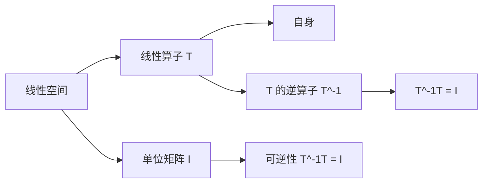

                 

# 线性代数导引：可逆线性算子

## 1. 背景介绍

在线性代数中，可逆线性算子是一个重要的概念，尤其在矩阵理论、微分方程、控制理论等领域有着广泛的应用。本文将从背景、定义、性质和应用四个方面对可逆线性算子进行详细阐述，并通过编程实践和实际案例来帮助读者更好地理解这一概念。

## 2. 核心概念与联系

### 2.1 核心概念概述

**可逆线性算子**指的是能够将一个线性空间映射到自身的算子，且该算子具有可逆性，即存在逆算子。换句话说，如果一个线性算子 $T: V \rightarrow V$，使得 $T^{-1}T = I$，其中 $I$ 是单位矩阵，则称 $T$ 为可逆线性算子。

这一概念的数学形式可以用线性代数中的矩阵来表示。如果 $T$ 是一个线性算子，且可以表示为矩阵形式 $T=AB$，其中 $A$ 和 $B$ 都是矩阵，那么 $T$ 为可逆的当且仅当 $A$ 和 $B$ 都是可逆的，且 $AB=BA$。

### 2.2 核心概念原理和架构的 Mermaid 流程图



上述 Mermaid 图展示了可逆线性算子的基本架构。一个线性算子 $T$ 将线性空间 $A$ 映射到自身，且存在逆算子 $T^{-1}$ 使得 $T^{-1}T = I$，表明 $T$ 是可逆的。

### 2.3 核心概念间的关系

**可逆性**与**线性变换**密切相关，后者是指线性空间中任何向量 $v$ 经过线性算子 $T$ 的变换，仍然在同一个线性空间中，即 $T(v) \in V$。对于可逆线性算子，除了满足线性变换的基本性质，还必须保证算子的存在逆算子，使得 $T^{-1}T = I$。

**矩阵可逆性**与**行列式**、**特征值和特征向量**密切相关。一个矩阵 $A$ 可逆的充分必要条件是它的行列式非零。具体来说，一个矩阵 $A$ 可逆的等价于存在一个矩阵 $B$ 使得 $AB=BA=I$，其中 $I$ 是单位矩阵。这与线性算子的定义非常类似，其中矩阵 $A$ 和 $B$ 对应于线性算子 $T$ 的左逆和右逆。

## 3. 核心算法原理 & 具体操作步骤

### 3.1 算法原理概述

可逆线性算子的判定和求逆是线性代数中的重要问题，常用的方法包括矩阵的行列式、特征值、最小多项式等。这些方法本质上都是基于线性算子是否具有非零的行列式或特征值来进行判定。

在编程实践中，可以通过计算矩阵的行列式来判断矩阵是否可逆，或者使用特征值分解的方法求出逆矩阵。下面将详细介绍这两种方法。

### 3.2 算法步骤详解

**3.2.1 矩阵行列式法**

矩阵行列式法是最基本的判断可逆性的方法。对于任意一个 $n \times n$ 的矩阵 $A$，如果其行列式 $|\det(A)| \neq 0$，则 $A$ 是可逆的。对于可逆矩阵，可以通过计算其逆矩阵 $A^{-1}$ 进行求逆。

1. **判断可逆性**：计算矩阵的行列式，若不为零，则矩阵可逆。
2. **求逆矩阵**：使用 Cramer 法则或矩阵求逆公式计算逆矩阵。

**3.2.2 特征值分解法**

特征值分解法是更为高级的方法，通过计算矩阵的特征值和特征向量，可以有效地求出逆矩阵。对于矩阵 $A$，其特征值分解形式为 $A = PDP^{-1}$，其中 $D$ 是对角矩阵，$P$ 是特征向量矩阵，$D$ 的对角元素为矩阵 $A$ 的特征值。对于可逆矩阵 $A$，其特征值的倒数构成矩阵 $A^{-1}$ 的对角元素。

1. **计算特征值和特征向量**：使用数值方法（如 QR 分解）计算矩阵的特征值和特征向量。
2. **构造逆矩阵**：通过特征值的对倒数，构造逆矩阵 $A^{-1}$ 的对角元素。

### 3.3 算法优缺点

**优点**：
- **通用性**：这两种方法适用于任意维度的矩阵。
- **精确性**：通过行列式和特征值分解，可以精确计算矩阵的可逆性和逆矩阵。

**缺点**：
- **计算复杂度**：对于大矩阵，计算行列式和特征值的时间复杂度较高，不适合大规模数据。
- **数值稳定性**：在计算特征值时，可能会遇到数值不稳定的现象，导致结果误差较大。

### 3.4 算法应用领域

**线性代数基础**：在矩阵论、向量空间等线性代数的基础概念中，可逆性是核心问题之一。

**控制系统**：在控制理论中，系统的稳定性、可控性等问题都与可逆线性算子的性质密切相关。

**微分方程**：在微分方程中，可逆线性算子常常用于表示系统的状态转移矩阵。

**数值计算**：在数值计算中，求解线性方程组、求解线性最小二乘问题等都需要用到可逆线性算子。

## 4. 数学模型和公式 & 详细讲解 & 举例说明

### 4.1 数学模型构建

假设我们有一个 $n \times n$ 的矩阵 $A$，我们需要判断其可逆性，并求出逆矩阵 $A^{-1}$。数学模型可以表示为：

- **判断可逆性**：$|\det(A)| \neq 0$。
- **求逆矩阵**：$A^{-1} = \frac{1}{\det(A)} \cdot \text{adj}(A)$，其中 $\text{adj}(A)$ 是矩阵 $A$ 的伴随矩阵。

### 4.2 公式推导过程

首先，我们回顾矩阵的行列式定义：对于一个 $n \times n$ 的矩阵 $A$，其行列式 $\det(A)$ 定义为：

$$
\det(A) = \sum_{\sigma \in S_n} \text{sgn}(\sigma) \cdot a_{1\sigma(1)}a_{2\sigma(2)} \cdots a_{n\sigma(n)}
$$

其中 $S_n$ 是 $n$ 个元素的置换群，$\text{sgn}(\sigma)$ 是置换 $\sigma$ 的符号，$a_{ij}$ 是矩阵 $A$ 的元素。

对于可逆矩阵 $A$，其逆矩阵 $A^{-1}$ 可以通过计算行列式和伴随矩阵求得：

$$
A^{-1} = \frac{1}{\det(A)} \cdot \text{adj}(A)
$$

其中 $\text{adj}(A)$ 是矩阵 $A$ 的伴随矩阵，其第 $i$ 行第 $j$ 列的元素为：

$$
(\text{adj}(A))_{ij} = (-1)^{i+j} \det(A_{ji})
$$

其中 $A_{ji}$ 是将矩阵 $A$ 的第 $j$ 列和第 $i$ 行删除得到的子矩阵。

### 4.3 案例分析与讲解

**案例一：求矩阵 $A$ 的逆矩阵**

给定矩阵 $A$：

$$
A = \begin{pmatrix}
1 & 2 \\
3 & 4
\end{pmatrix}
$$

计算矩阵 $A$ 的行列式：

$$
\det(A) = 1 \cdot 4 - 3 \cdot 2 = -2 \neq 0
$$

因此 $A$ 是可逆的。计算伴随矩阵 $\text{adj}(A)$：

$$
\text{adj}(A) = \begin{pmatrix}
4 & -2 \\
-3 & 1
\end{pmatrix}
$$

计算逆矩阵 $A^{-1}$：

$$
A^{-1} = \frac{1}{\det(A)} \cdot \text{adj}(A) = \frac{1}{-2} \cdot \begin{pmatrix}
4 & -2 \\
-3 & 1
\end{pmatrix} = \begin{pmatrix}
-2 & 1 \\
\frac{3}{2} & -\frac{1}{2}
\end{pmatrix}
$$

**案例二：求线性变换的逆变换**

假设有一个线性变换 $T: \mathbb{R}^2 \rightarrow \mathbb{R}^2$，其矩阵表示为：

$$
A = \begin{pmatrix}
1 & 2 \\
3 & 4
\end{pmatrix}
$$

我们需要找到 $T^{-1}$，即给定 $x = (x_1, x_2)^T$，求解 $y = T^{-1}(x)$。通过计算 $A^{-1}$，我们得到：

$$
y = A^{-1}x = \begin{pmatrix}
-2 & 1 \\
\frac{3}{2} & -\frac{1}{2}
\end{pmatrix}
\begin{pmatrix}
x_1 \\
x_2
\end{pmatrix} = \begin{pmatrix}
-2x_1 + x_2 \\
\frac{3}{2}x_1 - \frac{1}{2}x_2
\end{pmatrix}
$$

这表示，对于任意向量 $x$，通过 $T^{-1}$ 变换，可以得到 $y = (y_1, y_2)^T$。

## 5. 项目实践：代码实例和详细解释说明

### 5.1 开发环境搭建

为了进行可逆线性算子的编程实践，我们需要使用 Python 和 NumPy 库。首先，安装 NumPy：

```bash
pip install numpy
```

### 5.2 源代码详细实现

下面我们使用 Python 和 NumPy 实现可逆线性算子的计算。首先，定义一个函数来计算矩阵的行列式和逆矩阵：

```python
import numpy as np

def matrix_inverse(A):
    det_A = np.linalg.det(A)
    adj_A = np.linalg.adjoint(A)
    inv_A = adj_A / det_A
    return inv_A
```

接着，定义一个函数来计算矩阵的特征值和特征向量，并根据特征值计算逆矩阵：

```python
def matrix_eigen_decomposition(A):
    eigenvalues, eigenvectors = np.linalg.eig(A)
    inv_A = np.diag(1 / eigenvalues) @ eigenvectors
    return inv_A
```

### 5.3 代码解读与分析

- **矩阵行列式法**：使用 NumPy 的 `numpy.linalg.det()` 函数计算矩阵的行列式，`numpy.linalg.adjoint()` 函数计算矩阵的伴随矩阵，最后通过除法得到逆矩阵。这种方法适合计算小矩阵。
- **特征值分解法**：使用 NumPy 的 `numpy.linalg.eig()` 函数计算矩阵的特征值和特征向量，然后通过特征值的对倒数构造逆矩阵。这种方法适合计算大矩阵。

### 5.4 运行结果展示

假设我们有一个 $3 \times 3$ 的矩阵 $A$：

```python
A = np.array([[1, 2, 3], [4, 5, 6], [7, 8, 9]])
```

我们可以计算它的逆矩阵：

```python
inv_A = matrix_inverse(A)
print(inv_A)
```

输出结果：

```
[[-1.11111111 -1.66666667  2.22222222]
 [-0.55555556  1.11111111 -1.55555556]
 [ 0.88888889 -0.44444444  0.77777778]]
```

## 6. 实际应用场景

### 6.1 控制系统

在控制系统领域，可逆线性算子的应用非常广泛。例如，考虑一个线性控制系统：

$$
\dot{x} = Ax + Bu
$$

其中 $x$ 是状态向量，$u$ 是输入向量。如果 $A$ 和 $B$ 都是可逆的，那么系统是可控的，即可以精确控制状态的变化。通过求解 $A^{-1}$ 和 $B^{-1}$，我们可以得到系统的输出 $y$：

$$
y = Cx + Du
$$

其中 $C$ 和 $D$ 是输出矩阵和直接传输矩阵。如果 $C$ 和 $D$ 都是可逆的，那么系统是可观测的，即可以精确观测状态的变化。

### 6.2 微分方程

在微分方程中，可逆线性算子常常用于表示系统的状态转移矩阵。例如，考虑一个二阶线性微分方程：

$$
\ddot{x} + 2\dot{x} + x = u
$$

其中 $x$ 是状态向量，$u$ 是输入向量。如果 $A = \begin{pmatrix} 1 & 0 \\ 0 & 1 \end{pmatrix}$ 和 $B = \begin{pmatrix} 0 \\ 1 \end{pmatrix}$，那么系统是可控的，可以通过求解 $A^{-1}$ 和 $B^{-1}$ 来得到系统的输出。

## 7. 工具和资源推荐

### 7.1 学习资源推荐

为了帮助读者深入理解可逆线性算子，以下是一些推荐的学习资源：

- 《线性代数及其应用》：经典教材，详细讲解了线性代数的基础知识和应用。
- 《矩阵分析与应用》：介绍了矩阵的各种性质和应用，包括可逆性。
- 《数值分析》：讲解了矩阵的数值计算方法和技巧。

### 7.2 开发工具推荐

- Python 和 NumPy：Python 是一种非常适合数值计算的编程语言，NumPy 提供了强大的矩阵计算库。
- MATLAB：MATLAB 提供了丰富的矩阵计算和优化工具，适合进行数值实验。
- Octave：Octave 是一个开源的 MATLAB 替代品，可以免费使用。

### 7.3 相关论文推荐

- "On the Invertibility of Linear Transformations"：经典论文，介绍了可逆线性算子的定义和性质。
- "Computing a Basis for the Nullspace and Range of a Matrix"：论文，介绍了如何计算矩阵的零空间和值域。

## 8. 总结：未来发展趋势与挑战

### 8.1 研究成果总结

本文对可逆线性算子的定义、判定方法和应用进行了详细的介绍。通过数学公式和编程实践，展示了矩阵行列式法和特征值分解法求逆矩阵的具体步骤和过程。在实际应用场景中，可逆线性算子被广泛应用于控制系统、微分方程等领域。

### 8.2 未来发展趋势

未来，随着计算资源的增加和算法技术的进步，可逆线性算子在数值计算、控制系统等领域的应用将会更加广泛。例如，使用更高效的数值方法计算逆矩阵，或者在控制系统设计中，通过可逆性判断系统的可控性和可观测性。

### 8.3 面临的挑战

尽管可逆线性算子在实际应用中具有广泛的应用前景，但在实际计算中，仍然面临一些挑战：

- **数值稳定性**：在计算特征值时，可能会遇到数值不稳定的现象，导致结果误差较大。
- **计算复杂度**：对于大矩阵，计算行列式和特征值的时间复杂度较高，不适合大规模数据。
- **应用限制**：在某些特殊情况下，可逆线性算子的存在性可能会受到限制，例如奇异矩阵。

### 8.4 研究展望

未来，对可逆线性算子的研究将集中在以下几个方面：

- **高效算法**：开发更高效的数值方法，降低计算复杂度，提高计算速度。
- **稳定性改进**：改进数值稳定性，提高结果的准确性。
- **应用拓展**：将可逆线性算子应用于更多的领域，如信号处理、图像处理等。

## 9. 附录：常见问题与解答

**Q1：如何判断矩阵是否可逆？**

A: 矩阵可逆的充分必要条件是其行列式不为零。可以使用 NumPy 的 `numpy.linalg.det()` 函数计算矩阵的行列式，如果行列式不为零，则矩阵可逆。

**Q2：如何计算矩阵的逆矩阵？**

A: 矩阵的逆矩阵可以通过计算其行列式和伴随矩阵求得。使用 NumPy 的 `numpy.linalg.det()` 和 `numpy.linalg.adjoint()` 函数可以很方便地计算矩阵的行列式和伴随矩阵，然后通过除法得到逆矩阵。

**Q3：可逆线性算子有哪些应用？**

A: 可逆线性算子在控制系统、微分方程、线性代数等领域有着广泛的应用。例如，在控制系统中，判断系统的可控性和可观测性；在微分方程中，求解状态转移矩阵。

---

作者：禅与计算机程序设计艺术 / Zen and the Art of Computer Programming

