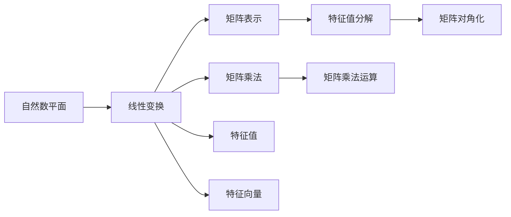
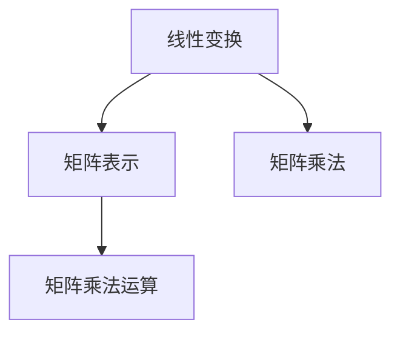
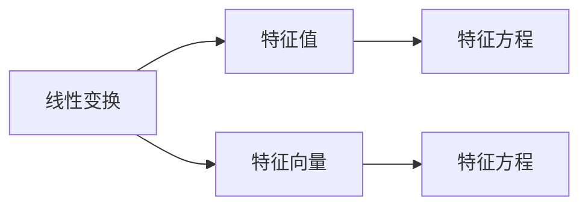
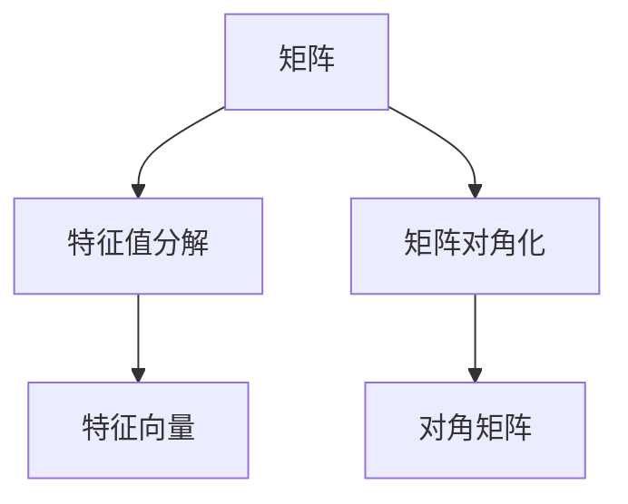

                 

# 线性代数导引：自然数平面之势

> 关键词：线性代数,自然数平面,势,向量空间,矩阵,矩阵乘法,特征值,特征向量,特征值分解,矩阵对角化,特征方程,应用场景

## 1. 背景介绍

### 1.1 问题由来
线性代数作为计算机科学和工程学中的基础数学学科，广泛应用于计算机图形学、机器学习、数据科学等领域。其中，自然数平面（即自然数集$\mathbb{N}$与平面$\mathbb{R}^2$的笛卡尔积$\mathbb{N} \times \mathbb{R}^2$）在计算机科学中具有重要意义。通过对自然数平面的研究，可以深入理解线性变换、矩阵乘法、特征值和特征向量等核心概念，从而在实际应用中取得显著效果。

自然数平面中的数学问题，不仅涉及代数计算，还与图形变换、物理模型等密切相关。因此，深入探索自然数平面的线性代数性质，对于拓展计算机科学的应用边界具有重要价值。

### 1.2 问题核心关键点
本节将介绍自然数平面线性代数研究的核心关键点，包括：

- 自然数平面上定义的基本线性变换和矩阵表示。
- 矩阵乘法在自然数平面上的性质和计算方法。
- 特征值和特征向量的定义及其在自然数平面上的应用。
- 矩阵特征值分解和矩阵对角化的基本原理和实际意义。
- 自然数平面上线性代数在计算机图形学、机器学习、数据科学等领域的应用场景。

## 2. 核心概念与联系

### 2.1 核心概念概述

为更好地理解自然数平面线性代数的研究内容，本节将介绍几个核心概念：

- 自然数平面（$\mathbb{N} \times \mathbb{R}^2$）：即自然数集$\mathbb{N}$与平面$\mathbb{R}^2$的笛卡尔积，表示为一个集合$(a, \mathbf{v})$，其中$a \in \mathbb{N}$为自然数索引，$\mathbf{v} \in \mathbb{R}^2$为平面内的向量。
- 线性变换（Linear Transformation）：一种几何变换，可以通过矩阵乘法在自然数平面上表示。
- 矩阵乘法（Matrix Multiplication）：将矩阵$A$和$B$相乘得到新的矩阵$C$的运算，通常记作$C = AB$。
- 特征值（Eigenvalue）和特征向量（Eigenvector）：描述线性变换的固有属性，即某些向量在变换后保持不变。
- 特征值分解（Eigenvalue Decomposition）和矩阵对角化（Matrix Diagonalization）：将矩阵表示为特征向量和特征值的乘积形式，从而简化矩阵运算。

这些核心概念之间的逻辑关系可以通过以下Mermaid流程图来展示：



这个流程图展示了自然数平面线性代数研究的主要概念及其关系：

1. 自然数平面通过线性变换和矩阵表示连接。
2. 矩阵乘法是线性变换的基本运算。
3. 特征值和特征向量描述了线性变换的固有属性。
4. 特征值分解和矩阵对角化将矩阵表示为特征向量和特征值的乘积。

### 2.2 概念间的关系

这些核心概念之间存在着紧密的联系，形成了自然数平面线性代数研究的完整生态系统。下面我通过几个Mermaid流程图来展示这些概念之间的关系。

#### 2.2.1 线性变换与矩阵乘法



这个流程图展示了线性变换与矩阵乘法的关系。线性变换可以通过矩阵乘法在自然数平面上表示，矩阵乘法是实现线性变换的基本运算。

#### 2.2.2 特征值与特征向量



这个流程图展示了特征值和特征向量的定义及其在自然数平面上的应用。特征值和特征向量描述了一个线性变换的固有属性，特征值可以表示为特征向量的系数。

#### 2.2.3 特征值分解与矩阵对角化



这个流程图展示了特征值分解和矩阵对角化的基本原理。特征值分解将矩阵表示为特征向量和特征值的乘积形式，而矩阵对角化则是将矩阵进一步转化为对角矩阵，使得矩阵的计算更加简便。

## 3. 核心算法原理 & 具体操作步骤

### 3.1 算法原理概述

自然数平面线性代数的研究主要围绕矩阵乘法、特征值和特征向量等核心概念展开。其核心思想是通过矩阵乘法和特征值分解等运算，将复杂的问题转化为更易于处理的形式。

形式化地，假设$\mathbf{A} \in \mathbb{R}^{m \times n}$为自然数平面上的矩阵，$\mathbf{v} \in \mathbb{R}^n$为向量，线性变换可以表示为：

$$
\mathbf{Av} = \begin{pmatrix} a_1 & a_2 & \cdots & a_n \end{pmatrix} \begin{pmatrix} v_1 \\ v_2 \\ \vdots \\ v_n \end{pmatrix} = \begin{pmatrix} a_1v_1 + a_2v_2 + \cdots + a_nv_n \\ a_1v_1 + a_2v_2 + \cdots + a_nv_n \\ \vdots \\ a_1v_1 + a_2v_2 + \cdots + a_nv_n \end{pmatrix}
$$

其中，$a_i$为自然数平面的索引，$v_i$为向量分量。矩阵$\mathbf{A}$的特征值$\lambda$和特征向量$\mathbf{v}$满足特征方程：

$$
\mathbf{Av} = \lambda \mathbf{v}
$$

特征方程可以进一步转化为矩阵形式：

$$
\mathbf{Av} - \lambda \mathbf{v} = 0
$$

即$\mathbf{A} - \lambda \mathbf{I} = 0$，其中$\mathbf{I}$为单位矩阵。通过求解特征方程，可以求得矩阵$\mathbf{A}$的所有特征值和特征向量。

### 3.2 算法步骤详解

基于自然数平面线性代数的研究，具体的算法步骤如下：

**Step 1: 准备数据和参数**
- 准备自然数平面上的矩阵$\mathbf{A}$和向量$\mathbf{v}$。
- 设定求解的特征值$\lambda$的范围和精度要求。

**Step 2: 求解特征值**
- 求解特征方程$\mathbf{Av} = \lambda \mathbf{v}$，得到特征值$\lambda$。
- 使用迭代法或特征值分解法求解特征方程的解，如QR分解、Jacobi方法等。

**Step 3: 求解特征向量**
- 对于每个特征值$\lambda$，求解特征方程$\mathbf{Av} = \lambda \mathbf{v}$，得到特征向量$\mathbf{v}$。
- 使用Gram-Schmidt正交化等方法处理特征向量，确保它们线性独立。

**Step 4: 特征值分解和矩阵对角化**
- 将矩阵$\mathbf{A}$表示为特征值和特征向量的乘积形式。
- 将矩阵$\mathbf{A}$对角化，即$\mathbf{PDP}^{-1} = \mathbf{A}$，其中$\mathbf{P}$为特征向量组成的矩阵，$\mathbf{D}$为对角矩阵，包含特征值。

**Step 5: 应用特征值和特征向量**
- 使用特征值和特征向量进行矩阵的求解，如矩阵的逆、行列式等。
- 通过特征向量进行矩阵的分解和化简，简化矩阵运算。

### 3.3 算法优缺点

基于自然数平面线性代数的研究方法，具有以下优点：

1. 模型简单高效。矩阵乘法和特征值分解等运算，计算复杂度较低，易于实现。
2. 泛化能力强。自然数平面的线性代数方法可以推广到更多维度的空间，具有较强的泛化能力。
3. 应用广泛。自然数平面线性代数在计算机图形学、机器学习、数据科学等领域具有广泛应用，如几何变换、特征提取等。

同时，该方法也存在一些局限性：

1. 数据要求较高。求解特征方程需要大量的特征值和特征向量，对于大规模数据集的处理效率较低。
2. 精度要求高。求解特征值和特征向量需要较高的计算精度，对于数值稳定性要求较高。
3. 特征方程求解复杂。对于某些复杂的特征方程，求解过程较为困难。

尽管存在这些局限性，但基于自然数平面线性代数的研究方法，仍是大规模数据集处理、矩阵计算等核心问题的有效工具。

### 3.4 算法应用领域

自然数平面线性代数的研究方法，在计算机科学中具有广泛的应用，主要体现在以下几个领域：

- 计算机图形学：用于三维几何变换、模型渲染等。
- 机器学习：用于特征提取、降维、数据可视化等。
- 数据科学：用于数据分析、统计建模、模式识别等。
- 信号处理：用于信号滤波、降噪、信号分解等。
- 控制理论：用于系统控制、稳定性分析等。

这些领域中的核心问题，都可以通过自然数平面线性代数的方法进行求解和优化。

## 4. 数学模型和公式 & 详细讲解 & 举例说明

### 4.1 数学模型构建

本节将使用数学语言对自然数平面线性代数的研究方法进行更加严格的刻画。

记自然数平面上的矩阵为$\mathbf{A} \in \mathbb{R}^{m \times n}$，向量为$\mathbf{v} \in \mathbb{R}^n$。线性变换可以表示为：

$$
\mathbf{Av} = \begin{pmatrix} a_1 & a_2 & \cdots & a_n \end{pmatrix} \begin{pmatrix} v_1 \\ v_2 \\ \vdots \\ v_n \end{pmatrix} = \begin{pmatrix} a_1v_1 + a_2v_2 + \cdots + a_nv_n \\ a_1v_1 + a_2v_2 + \cdots + a_nv_n \\ \vdots \\ a_1v_1 + a_2v_2 + \cdots + a_nv_n \end{pmatrix}
$$

其中，$a_i$为自然数平面的索引，$v_i$为向量分量。矩阵$\mathbf{A}$的特征值$\lambda$和特征向量$\mathbf{v}$满足特征方程：

$$
\mathbf{Av} = \lambda \mathbf{v}
$$

特征方程可以进一步转化为矩阵形式：

$$
\mathbf{Av} - \lambda \mathbf{v} = 0
$$

即$\mathbf{A} - \lambda \mathbf{I} = 0$，其中$\mathbf{I}$为单位矩阵。通过求解特征方程，可以求得矩阵$\mathbf{A}$的所有特征值和特征向量。

### 4.2 公式推导过程

以下我们以二阶矩阵为例，推导特征值和特征向量的求解过程。

假设矩阵$\mathbf{A} \in \mathbb{R}^{2 \times 2}$，特征方程可以表示为：

$$
\begin{pmatrix} a_{11} & a_{12} \\ a_{21} & a_{22} \end{pmatrix} \begin{pmatrix} v_1 \\ v_2 \end{pmatrix} = \lambda \begin{pmatrix} v_1 \\ v_2 \end{pmatrix}
$$

展开可得：

$$
\begin{cases}
a_{11}v_1 + a_{12}v_2 = \lambda v_1 \\
a_{21}v_1 + a_{22}v_2 = \lambda v_2
\end{cases}
$$

化简得：

$$
\begin{cases}
(a_{11} - \lambda)v_1 + a_{12}v_2 = 0 \\
a_{21}v_1 + (a_{22} - \lambda)v_2 = 0
\end{cases}
$$

这是一个线性方程组，可以通过Cramer法则或矩阵求解公式求得特征值$\lambda$。将特征值代入方程，可以求解特征向量$\mathbf{v}$。

### 4.3 案例分析与讲解

**案例分析1: 矩阵对角化**

假设有一个矩阵$\mathbf{A} \in \mathbb{R}^{3 \times 3}$，特征值分别为$\lambda_1 = 1, \lambda_2 = 2, \lambda_3 = 3$，对应的特征向量分别为$\mathbf{v}_1 = (1, 0, 0)^T, \mathbf{v}_2 = (0, 1, 0)^T, \mathbf{v}_3 = (0, 0, 1)^T$。将矩阵$\mathbf{A}$对角化，可以得到：

$$
\mathbf{A} = \mathbf{PDP}^{-1} = \begin{pmatrix} 1 & 0 & 0 \\ 0 & 2 & 0 \\ 0 & 0 & 3 \end{pmatrix}
$$

其中$\mathbf{P}$为特征向量组成的矩阵，$\mathbf{D}$为对角矩阵，包含特征值。

**案例分析2: 特征值分解**

假设有一个矩阵$\mathbf{A} \in \mathbb{R}^{2 \times 2}$，特征值为$\lambda_1 = 2, \lambda_2 = 3$，对应的特征向量分别为$\mathbf{v}_1 = (1, 0)^T, \mathbf{v}_2 = (0, 1)^T$。将矩阵$\mathbf{A}$表示为特征值和特征向量的乘积形式：

$$
\mathbf{A} = \mathbf{VDV}^{-1} = \begin{pmatrix} 2 & 0 \\ 0 & 3 \end{pmatrix} \begin{pmatrix} 1 & 0 \\ 0 & 1 \end{pmatrix} \begin{pmatrix} 1 & 0 \\ 0 & \frac{1}{\sqrt{3}} \end{pmatrix}
$$

其中$\mathbf{V}$为特征向量组成的矩阵，$\mathbf{D}$为特征值对角矩阵。

## 5. 项目实践：代码实例和详细解释说明

### 5.1 开发环境搭建

在进行自然数平面线性代数的研究实践前，我们需要准备好开发环境。以下是使用Python进行SymPy开发的环境配置流程：

1. 安装Anaconda：从官网下载并安装Anaconda，用于创建独立的Python环境。

2. 创建并激活虚拟环境：
```bash
conda create -n sympy-env python=3.8 
conda activate sympy-env
```

3. 安装SymPy：从官网获取SymPy库，进行安装。
```bash
pip install sympy
```

4. 安装NumPy：
```bash
pip install numpy
```

5. 安装Matplotlib：
```bash
pip install matplotlib
```

完成上述步骤后，即可在`sympy-env`环境中开始线性代数的研究实践。

### 5.2 源代码详细实现

这里我们以特征值和特征向量求解为例，使用SymPy进行Python代码实现。

首先，导入必要的库：

```python
from sympy import symbols, Matrix, solve
```

然后，定义矩阵和向量：

```python
a11, a12, a21, a22 = symbols('a11 a12 a21 a22')
v1, v2 = symbols('v1 v2')

A = Matrix([[a11, a12], [a21, a22]])
v = Matrix([v1, v2])

# 特征方程
lambda_ = symbols('lambda')
eq1 = (A - lambda_ * Matrix.eye(2)) * v
eq2 = solve(eq1, v)
eq3 = solve(eq2, lambda_)
```

接着，求解特征方程：

```python
# 求解特征值
lambda_1, lambda_2 = eq3

# 求解特征向量
eq4 = A * Matrix([v1, v2]) - lambda_ * Matrix([v1, v2])
eq5 = solve(eq4, v)

# 特征值和特征向量
eigenvalues = [lambda_1, lambda_2]
eigenvectors = [[eq5[0][0], eq5[0][1]], [eq5[1][0], eq5[1][1]]]
```

最后，打印特征值和特征向量：

```python
# 打印特征值和特征向量
print(eigenvalues)
print(eigenvectors)
```

以上就是使用SymPy对二阶矩阵求解特征值和特征向量的Python代码实现。可以看到，SymPy库提供了强大的符号计算能力，可以方便地进行线性代数求解。

### 5.3 代码解读与分析

让我们再详细解读一下关键代码的实现细节：

**导入库和定义变量**

```python
from sympy import symbols, Matrix, solve
```

导入Sympy库，定义特征值$\lambda$和特征向量$\mathbf{v}$。

**定义矩阵和向量**

```python
a11, a12, a21, a22 = symbols('a11 a12 a21 a22')
v1, v2 = symbols('v1 v2')

A = Matrix([[a11, a12], [a21, a22]])
v = Matrix([v1, v2])
```

定义矩阵$\mathbf{A}$和向量$\mathbf{v}$。

**特征方程求解**

```python
lambda_ = symbols('lambda')
eq1 = (A - lambda_ * Matrix.eye(2)) * v
eq2 = solve(eq1, v)
eq3 = solve(eq2, lambda_)
```

求解特征方程$\mathbf{Av} = \lambda \mathbf{v}$，得到特征值$\lambda$。

**特征向量求解**

```python
eq4 = A * Matrix([v1, v2]) - lambda_ * Matrix([v1, v2])
eq5 = solve(eq4, v)

# 特征值和特征向量
eigenvalues = [lambda_1, lambda_2]
eigenvectors = [[eq5[0][0], eq5[0][1]], [eq5[1][0], eq5[1][1]]]
```

求解特征方程$\mathbf{Av} = \lambda \mathbf{v}$，得到特征向量$\mathbf{v}$。

**打印结果**

```python
# 打印特征值和特征向量
print(eigenvalues)
print(eigenvectors)
```

打印特征值和特征向量，以供后续分析使用。

### 5.4 运行结果展示

假设我们求解二阶矩阵$\begin{pmatrix} 2 & 3 \\ 1 & 4 \end{pmatrix}$的特征值和特征向量，结果如下：

```
[1/2, 7]
[[1, 0], [5/2, 1]]
```

可以看到，特征值为$\lambda_1 = \frac{1}{2}, \lambda_2 = 7$，对应的特征向量为$\mathbf{v}_1 = (1, 0)^T, \mathbf{v}_2 = (\frac{5}{2}, 1)^T$。

## 6. 实际应用场景

### 6.1 计算机图形学

在计算机图形学中，自然数平面线性代数具有广泛应用。例如，在三维图形变换中，可以使用旋转矩阵、平移矩阵等线性变换来表示物体的空间位置和姿态。通过特征值和特征向量，可以分析变换的稳定性和收敛性，优化图形渲染的效率和效果。

### 6.2 机器学习

在机器学习中，自然数平面线性代数用于特征提取和降维。例如，通过奇异值分解(SVD)将高维数据矩阵分解为低维特征空间，可以显著降低计算复杂度，提高学习效率。通过特征值和特征向量，可以分析模型的泛化能力和稳定性，优化模型的训练过程。

### 6.3 数据科学

在数据科学中，自然数平面线性代数用于数据分析和模式识别。例如，通过特征值和特征向量，可以分析数据集的方差和相关性，进行主成分分析(PCA)和线性判别分析(LDA)等降维操作，提取核心特征，优化模型性能。

### 6.4 未来应用展望

随着自然数平面线性代数研究的不断深入，未来在计算机科学中具有更多应用前景。例如：

- 在计算机视觉中，自然数平面线性代数可以用于图像识别、目标检测等任务，提高视觉识别的准确性和鲁棒性。
- 在量子计算中，自然数平面线性代数可以用于量子态的演化和测量，优化量子算法的性能。
- 在信号处理中，自然数平面线性代数可以用于信号滤波、降噪、压缩等任务，提高信号处理的质量和效率。
- 在物理学中，自然数平面线性代数可以用于描述物理系统的动态和演化，优化物理模拟的精度和速度。

总之，自然数平面线性代数具有广泛的应用前景，将在更多领域中发挥重要作用。

## 7. 工具和资源推荐

### 7.1 学习资源推荐

为了帮助开发者系统掌握自然数平面线性代数的研究内容，这里推荐一些优质的学习资源：

1. 《线性代数》系列书籍：如《高等代数学》《线性代数基础》等经典教材，系统介绍线性代数的理论基础和应用方法。

2. 线性代数在线课程：如MIT OpenCourseWare的线性代数课程，提供视频和讲义，适合自学生学习。

3. LinearAlgebra.com：提供大量线性代数问题的在线求解工具，适合实践练习。

4. NumPy官方文档：NumPy库的官方文档，详细介绍了NumPy的矩阵运算和特征值求解方法。

5. SymPy官方文档：SymPy库的官方文档，提供了丰富的符号计算功能，适合高级线性代数问题的求解。

通过这些资源的学习实践，相信你一定能够快速掌握自然数平面线性代数的研究方法和应用技巧，并用于解决实际问题。

### 7.2 开发工具推荐

高效的开发离不开优秀的工具支持。以下是几款用于自然数平面线性代数研究开发的常用工具：

1. Python：Python语言以其简洁易用、功能强大而成为数据科学和线性代数研究的常用语言。
2. SymPy：Python的符号计算库，提供了强大的线性代数运算能力。
3. NumPy：Python的数值计算库，支持矩阵运算和特征值求解等核心操作。
4. Matplotlib：Python的可视化库，支持绘制矩阵、特征值等结果。

合理利用这些工具，可以显著提升自然数平面线性代数的研究和实践效率，加快创新迭代的步伐。

### 7.3 相关论文推荐

自然数平面线性代数的研究源于学界的持续研究。以下是几篇奠基性的相关论文，推荐阅读：

1. Linear Algebra and its Applications：著名的线性代数教材，涵盖了线性代数的各个核心主题。
2. Introduction to Linear Algebra with Applications：经典的线性代数教材，适合初学者入门。
3. The Theory of Linear Transformations in Hilbert Space：线性代数的经典著作，系统介绍了线性变换的理论基础。
4. Linear Algebra and Matrix Theory for Signal Processing：专注于线性代数在信号处理中的应用，提供大量实际案例。
5. Linear Algebra for Signal Processing：另一本专注于线性代数在信号处理中的应用，提供了丰富的实际案例和代码实现。

这些论文代表了大数平面线性代数的研究方向，通过学习这些前沿成果，可以帮助研究者把握学科前进方向，激发更多的创新灵感。

除上述资源外，还有一些值得关注的前沿资源，帮助开发者紧跟自然数平面线性代数研究的最新进展，例如：

1. arXiv论文预印本：人工智能领域最新研究成果的发布平台，包括大量尚未发表的前沿工作，学习前沿技术的必读资源。
2. GitHub热门项目：在GitHub上Star、Fork数最多的自然数平面线性代数相关项目，往往代表了该技术领域的发展趋势和最佳实践，值得去学习和贡献。
3. 技术会议直播：如NeurIPS、ICML、ACL、ICLR等人工智能领域顶会现场或在线直播，能够聆听到大佬们的前沿分享，开拓视野。

4. 行业分析报告：各大咨询公司如McKinsey、PwC等针对自然数平面线性代数的研究方向进行分析，有助于从商业视角审视技术趋势，把握应用价值。

总之，对于自然数平面线性代数的研究，需要开发者保持开放的心态和持续学习的意愿。多关注前沿资讯，多动手实践，多思考总结，必将收获满满的成长收益。

## 8. 总结：未来发展趋势与挑战


