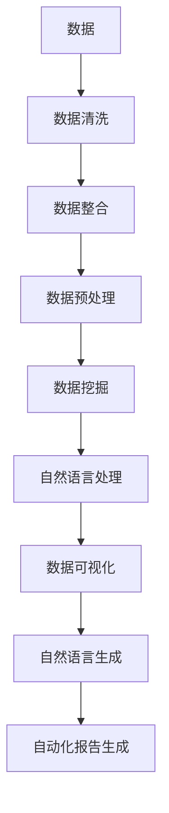
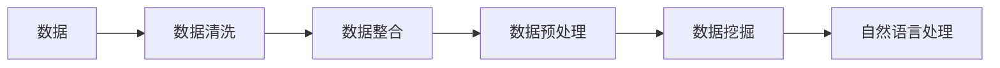
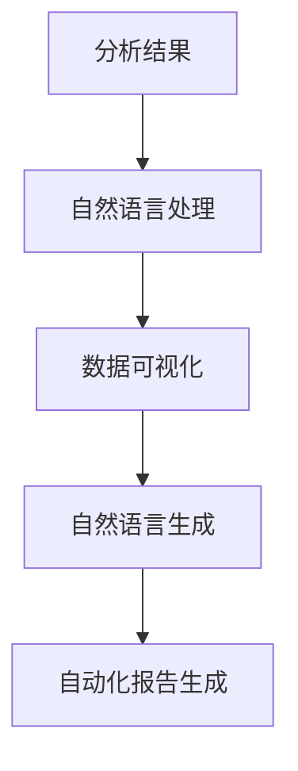
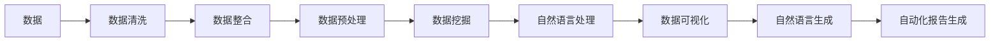
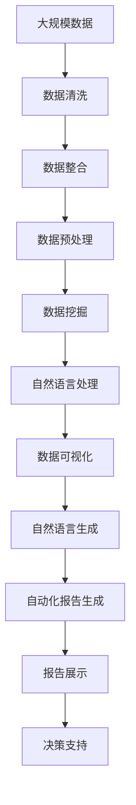

                 

# 自动化报告生成与AI的结合

> 关键词：
自动化报告生成、人工智能、机器学习、自然语言处理、数据可视化、深度学习

## 1. 背景介绍

### 1.1 问题由来
随着信息时代的来临，数据的数量呈指数级增长。在商业、科研、政府等各个领域，大量的数据需要被收集、分析、整理并生成报告。传统的报告生成方式往往需要耗费大量的人力物力，且效率低下、易出错。然而，通过引入自动化报告生成技术，并结合人工智能的强大能力，可以极大地提升报告生成的效率和准确性，使数据价值得到更充分的挖掘。

自动化报告生成（Automated Report Generation, ARG）是利用人工智能技术，对数据进行分析和处理，并自动生成结构化、规范化的报告。该技术可以显著减少报告生成的时间成本和人力成本，提高数据利用效率，使决策更加科学合理。

### 1.2 问题核心关键点
目前，自动化报告生成技术主要分为数据处理和报告生成两个部分。数据处理部分主要通过机器学习和自然语言处理技术对原始数据进行清洗、整合、分析等预处理；报告生成部分则主要通过自然语言生成技术自动生成报告内容，并以图形化方式展示。

核心问题在于如何高效、准确地进行数据处理和报告生成，同时保证生成的报告具有高度的可读性和可视性。此外，报告生成的自动化程度、可定制性和智能性也是关键问题。

### 1.3 问题研究意义
自动化报告生成技术的引入，对于提升数据处理和报告生成的效率、减少人为错误、提高决策质量具有重要意义：

1. 降低成本：自动化报告生成可以大幅减少人力成本，使企业能够将更多资源投入到业务创新和市场拓展中。
2. 提升效率：通过自动化技术，可以显著缩短报告生成周期，使数据价值更快地转化为业务决策支持。
3. 提高质量：机器学习和自然语言处理技术能够有效减少数据处理和报告生成的错误率，提高报告的准确性和可读性。
4. 促进数据科学应用：自动化报告生成能够使数据科学家的分析结果更直观地呈现给非技术背景的决策者，促进数据科学在各领域的广泛应用。
5. 推动商业智能发展：结合商业智能工具，自动化报告生成能够使企业的数据应用从单纯的统计分析，向智能决策和战略规划转变。

## 2. 核心概念与联系

### 2.1 核心概念概述

为更好地理解自动化报告生成技术，本节将介绍几个密切相关的核心概念：

- 自动化报告生成(Automated Report Generation, ARG)：利用人工智能技术对数据进行分析和处理，并自动生成结构化、规范化的报告。
- 机器学习(Machine Learning, ML)：通过算法和统计模型，使计算机系统能够从数据中学习规律，并进行预测和决策。
- 自然语言处理(Natural Language Processing, NLP)：使计算机能够理解和生成人类语言的技术。
- 数据可视化(Data Visualization)：将数据以图形化的方式展示出来，使复杂数据更直观易懂。
- 深度学习(Deep Learning, DL)：一种基于神经网络的机器学习方法，具有强大的特征提取和模式识别能力。
- 自然语言生成(Natural Language Generation, NLG)：使计算机能够自动生成符合语法和语义规则的文本。
- 知识图谱(Knowledge Graph)：通过图结构将实体、关系和属性等信息关联起来，形成知识表示。

这些核心概念之间的逻辑关系可以通过以下Mermaid流程图来展示：



这个流程图展示了几大核心概念在大数据处理和报告生成中的作用：

1. 数据清洗：对原始数据进行去重、去噪、补全等预处理，保证数据质量。
2. 数据整合：将不同来源的数据进行归一化、匹配，形成统一的数据集。
3. 数据预处理：通过机器学习算法，对数据进行特征提取、降维等预处理，提高模型训练效率和精度。
4. 数据挖掘：通过统计分析和深度学习等方法，挖掘数据中的潜在规律和模式。
5. 自然语言处理：将挖掘结果转换为文本形式，便于理解和使用。
6. 数据可视化：将数据以图形化的方式展示出来，提高信息的可读性和可视性。
7. 自然语言生成：将数据挖掘结果和可视化信息自动生成结构化的报告内容。
8. 自动化报告生成：将生成的文本内容整合为规范化的报告格式，完成最终报告输出。

### 2.2 概念间的关系

这些核心概念之间存在着紧密的联系，形成了自动化报告生成的完整生态系统。下面我通过几个Mermaid流程图来展示这些概念之间的关系。

#### 2.2.1 数据处理流程



这个流程图展示了数据处理的基本流程，从原始数据到数据挖掘，逐步形成有价值的分析结果。

#### 2.2.2 报告生成流程



这个流程图展示了报告生成的主要步骤，从分析结果到最终报告输出，涉及自然语言处理、数据可视化和自然语言生成等多个环节。

#### 2.2.3 数据处理与报告生成的整合



这个综合流程图展示了数据处理与报告生成之间的联系和依赖关系。数据处理是报告生成的基础，而报告生成则将数据处理的结果以直观的方式展示出来，形成决策支持。

### 2.3 核心概念的整体架构

最后，我们用一个综合的流程图来展示这些核心概念在大数据处理和报告生成过程中的整体架构：



这个综合流程图展示了从原始数据到最终报告展示的全过程，数据处理、自然语言处理、数据可视化和自然语言生成等多个环节相互协作，共同支撑自动化报告生成技术。

## 3. 核心算法原理 & 具体操作步骤
### 3.1 算法原理概述

自动化报告生成技术的核心算法原理主要包括以下几个部分：

- **数据预处理**：通过机器学习算法对原始数据进行清洗、整合、降维等预处理，形成可用于后续分析的数据集。
- **自然语言处理**：通过NLP技术将分析结果转换为文本形式，并进行分词、实体识别、情感分析等处理。
- **数据可视化**：将数据以图形化的方式展示出来，提高信息的可读性和可视性。
- **自然语言生成**：通过NLG技术将数据挖掘结果和可视化信息自动生成结构化的报告内容。
- **报告生成**：将生成的文本内容整合为规范化的报告格式，完成最终报告输出。

自动化报告生成技术的基本流程可以分为以下几个步骤：

1. **数据采集与清洗**：从多个数据源采集原始数据，并进行去重、去噪、补全等清洗操作，保证数据质量。
2. **数据整合与预处理**：将不同来源的数据进行归一化、匹配，并使用机器学习算法对数据进行特征提取、降维等预处理，提高模型训练效率和精度。
3. **数据挖掘与分析**：通过统计分析和深度学习等方法，挖掘数据中的潜在规律和模式，形成有价值的信息。
4. **自然语言处理**：将挖掘结果转换为文本形式，并进行分词、实体识别、情感分析等处理，生成符合语法的自然语言描述。
5. **数据可视化**：将数据以图形化的方式展示出来，提高信息的可读性和可视性。
6. **自然语言生成**：将数据挖掘结果和可视化信息自动生成结构化的报告内容。
7. **自动化报告生成**：将生成的文本内容整合为规范化的报告格式，完成最终报告输出。

### 3.2 算法步骤详解

下面，我将详细讲解自动化报告生成技术的具体操作步骤：

**Step 1: 数据采集与清洗**

自动化报告生成的第一步是从多个数据源采集原始数据，并进行清洗操作。具体步骤如下：

1. **数据采集**：
   - 从多个数据源（如数据库、文件、API等）采集原始数据，保存为结构化格式（如CSV、JSON等）。
   - 对采集到的数据进行初步检查，识别异常值和缺失值。

2. **数据清洗**：
   - 对数据进行去重、去噪、补全等清洗操作，保证数据质量。
   - 处理缺失值，填补缺失的数据或删除缺失数据过多的记录。
   - 去除重复记录，保证数据的一致性。
   - 对数据进行格式转换，统一到符合规范的格式。

3. **数据标准化**：
   - 将不同来源的数据进行归一化处理，统一数据格式和单位。
   - 对数据进行一致性检查，确保数据的一致性和完整性。

**Step 2: 数据整合与预处理**

数据整合与预处理是将原始数据转化为可用于分析的数据集。具体步骤如下：

1. **数据整合**：
   - 将不同来源的数据进行归一化、匹配，形成统一的数据集。
   - 对数据进行数据融合，合并不同数据源的信息。
   - 对数据进行格式转换，统一到符合规范的格式。

2. **数据预处理**：
   - 对数据进行特征提取、降维等预处理，提高模型训练效率和精度。
   - 使用机器学习算法对数据进行建模和分析，挖掘数据中的潜在规律和模式。

**Step 3: 数据挖掘与分析**

数据挖掘与分析是对数据进行深入挖掘和分析，形成有价值的信息。具体步骤如下：

1. **数据建模**：
   - 使用统计分析和深度学习等方法，对数据进行建模和分析，挖掘数据中的潜在规律和模式。
   - 使用模型评估指标（如准确率、召回率、F1分数等）对模型进行评估和优化。

2. **特征选择**：
   - 对数据进行特征选择，选择对目标变量影响最大的特征。
   - 使用特征选择算法（如LASSO、随机森林等）对特征进行选择和优化。

3. **模型训练与验证**：
   - 使用训练数据对模型进行训练，并使用验证数据对模型进行验证和调优。
   - 选择最优的模型，进行最终的测试和评估。

**Step 4: 自然语言处理**

自然语言处理是将分析结果转换为文本形式，并进行分词、实体识别、情感分析等处理。具体步骤如下：

1. **分词与实体识别**：
   - 对文本进行分词，将文本转换为词汇序列。
   - 对文本进行实体识别，识别出文本中的实体（如人名、地名、组织机构等）。

2. **情感分析**：
   - 对文本进行情感分析，识别出文本的情感倾向（如正面、负面、中性）。
   - 使用情感分析算法（如TextBlob、VADER等）对文本进行情感分析。

3. **文本生成**：
   - 使用NLG技术将挖掘结果转换为文本形式，生成符合语法的自然语言描述。
   - 使用文本生成算法（如Seq2Seq、Transformer等）对文本进行生成和优化。

**Step 5: 数据可视化**

数据可视化是将数据以图形化的方式展示出来，提高信息的可读性和可视性。具体步骤如下：

1. **选择合适的可视化图表**：
   - 根据数据的特点选择合适的可视化图表（如柱状图、折线图、饼图等）。
   - 选择合适的图表类型，展示数据的不同方面。

2. **数据展示**：
   - 使用可视化工具（如Tableau、Power BI等）将数据展示出来。
   - 对数据进行动态展示，展示数据的趋势和变化。

3. **交互式可视化**：
   - 实现交互式可视化，用户可以通过交互界面探索数据。
   - 实现筛选、排序、放大等交互功能，提高用户的体验。

**Step 6: 自然语言生成**

自然语言生成是将数据挖掘结果和可视化信息自动生成结构化的报告内容。具体步骤如下：

1. **生成文本摘要**：
   - 使用摘要算法（如BART、T5等）生成文本摘要，提取文本的关键信息。
   - 对生成的文本摘要进行评估和优化，保证摘要的质量和准确性。

2. **生成报告内容**：
   - 使用NLG技术生成报告内容，生成符合语法的自然语言描述。
   - 使用文本生成算法（如Seq2Seq、Transformer等）对文本进行生成和优化。

**Step 7: 自动化报告生成**

自动化报告生成是将生成的文本内容整合为规范化的报告格式，完成最终报告输出。具体步骤如下：

1. **整合报告内容**：
   - 将生成的文本内容整合为规范化的报告格式，生成完整的报告内容。
   - 对报告内容进行格式化处理，生成符合规范的报告。

2. **报告展示**：
   - 使用报告展示工具（如Jupyter Notebook、Tableau等）展示报告内容。
   - 对报告进行动态展示，展示数据的变化和趋势。

### 3.3 算法优缺点

自动化报告生成技术的优点在于：

1. **提高效率**：自动化报告生成可以显著减少报告生成的时间成本和人力成本，使企业能够将更多资源投入到业务创新和市场拓展中。
2. **提升质量**：通过机器学习和自然语言处理技术，可以有效减少数据处理和报告生成的错误率，提高报告的准确性和可读性。
3. **促进数据科学应用**：自动化报告生成能够使数据科学家的分析结果更直观地呈现给非技术背景的决策者，促进数据科学在各领域的广泛应用。
4. **推动商业智能发展**：结合商业智能工具，自动化报告生成能够使企业的数据应用从单纯的统计分析，向智能决策和战略规划转变。

自动化报告生成技术的缺点在于：

1. **依赖数据质量**：自动化报告生成依赖于原始数据的质量，如果数据质量不好，生成的报告也会受到影响。
2. **算法复杂度较高**：自动化报告生成涉及多个算法和工具，算法复杂度较高，需要较高的技术水平和资源投入。
3. **模型可解释性不足**：自动化报告生成依赖于深度学习等模型，模型的决策过程缺乏可解释性，难以对其推理逻辑进行分析和调试。

尽管存在这些缺点，但就目前而言，自动化报告生成技术仍然是报告生成的主要范式。未来相关研究的重点在于如何进一步降低生成过程的依赖数据质量，提高模型的可解释性和鲁棒性，同时兼顾可定制性和智能性。

### 3.4 算法应用领域

自动化报告生成技术已经在多个领域得到了广泛应用，例如：

- **金融行业**：自动化报告生成技术可以用于生成财务报表、市场分析报告等，帮助金融机构进行投资决策和风险控制。
- **医疗行业**：自动化报告生成技术可以用于生成医疗报告、病历分析报告等，帮助医生进行诊断和治疗。
- **政府行业**：自动化报告生成技术可以用于生成政府统计报告、政策分析报告等，帮助政府进行决策和监管。
- **零售行业**：自动化报告生成技术可以用于生成销售报告、客户分析报告等，帮助企业进行市场分析和运营优化。
- **教育行业**：自动化报告生成技术可以用于生成教学报告、学生分析报告等，帮助教育机构进行教学评估和优化。

除了这些领域外，自动化报告生成技术还在新闻媒体、法律咨询、旅游服务等诸多领域得到了广泛应用，为各行业带来了巨大的便利和价值。

## 4. 数学模型和公式 & 详细讲解 & 举例说明

### 4.1 数学模型构建

本节将使用数学语言对自动化报告生成技术进行更加严格的刻画。

记数据集为 $D=\{(x_i,y_i)\}_{i=1}^N$，其中 $x_i$ 为输入， $y_i$ 为输出。假设数据处理与分析过程形成的特征向量为 $\mathbf{x}_i$，对应的输出结果为 $\mathbf{y}_i$。

定义报告生成的目标函数为 $f(\mathbf{x}_i)$，目标是在最小化损失函数 $\mathcal{L}(\mathbf{x}_i,\mathbf{y}_i)$ 的前提下，生成符合语法的自然语言描述。其中，损失函数 $\mathcal{L}(\mathbf{x}_i,\mathbf{y}_i)$ 用于衡量生成文本与真实文本的差异。

目标函数 $f(\mathbf{x}_i)$ 可以表示为：

$$
f(\mathbf{x}_i) = \arg\min_{\mathbf{y}_i} \mathcal{L}(\mathbf{x}_i,\mathbf{y}_i)
$$

目标函数 $f(\mathbf{x}_i)$ 的求解通常采用梯度下降等优化算法，通过不断迭代更新模型参数，最小化损失函数，生成符合语法的自然语言描述。

### 4.2 公式推导过程

以下我们以金融行业为例，推导自动化报告生成的数学模型。

假设原始数据集为 $D=\{(x_i,y_i)\}_{i=1}^N$，其中 $x_i$ 为历史股票价格，$y_i$ 为未来股票价格预测值。定义特征向量 $\mathbf{x}_i$ 为历史价格的时间序列，目标函数 $f(\mathbf{x}_i)$ 为未来价格预测值。

目标函数 $f(\mathbf{x}_i)$ 可以表示为：

$$
f(\mathbf{x}_i) = \arg\min_{\mathbf{y}_i} \mathcal{L}(\mathbf{x}_i,\mathbf{y}_i)
$$

其中，损失函数 $\mathcal{L}(\mathbf{x}_i,\mathbf{y}_i)$ 可以表示为均方误差（MSE）损失：

$$
\mathcal{L}(\mathbf{x}_i,\mathbf{y}_i) = \frac{1}{N}\sum_{i=1}^N (y_i - f(\mathbf{x}_i))^2
$$

目标函数 $f(\mathbf{x}_i)$ 的求解通常采用梯度下降等优化算法，通过不断迭代更新模型参数，最小化损失函数，生成未来价格预测值。

### 4.3 案例分析与讲解

假设我们有一个包含10000个样本的股票价格数据集，每个样本包含10个历史价格和1个未来价格预测值。我们希望通过自动化报告生成技术，生成每个样本的未来价格预测值报告。具体步骤如下：

1. **数据预处理**：
   - 对数据进行清洗、整合、标准化等预处理操作，生成特征向量 $\mathbf{x}_i$。
   - 使用LASSO回归模型对数据进行建模和分析，挖掘数据中的潜在规律和模式。

2. **数据可视化**：
   - 对数据进行可视化，生成柱状图、折线图等图表，展示数据的变化和趋势。
   - 实现交互式可视化，用户可以通过交互界面探索数据。

3. **自然语言生成**：
   - 使用文本生成算法（如Seq2Seq、Transformer等）生成文本摘要和报告内容，生成符合语法的自然语言描述。
   - 使用NLG技术将生成结果转化为报告内容，生成完整的报告。

4. **自动化报告生成**：
   - 将生成的文本内容整合为规范化的报告格式，生成完整的报告内容。
   - 使用报告展示工具（如Jupyter Notebook、Tableau等）展示报告内容。

通过以上步骤，我们可以快速、高效地生成金融行业股票价格预测的报告，帮助投资者进行投资决策。

## 5. 项目实践：代码实例和详细解释说明

### 5.1 开发环境搭建

在进行自动化报告生成实践前，我们需要准备好开发环境。以下是使用Python进行PyTorch开发的环境配置流程：

1. 安装Anaconda：从官网下载并安装Anaconda，用于创建独立的Python环境。

2. 创建并激活虚拟环境：
```bash
conda create -n pytorch-env python=3.8 
conda activate pytorch-env
```

3. 安装PyTorch：根据CUDA版本，从官网获取对应的安装命令。例如：
```bash
conda install pytorch torchvision torchaudio cudatoolkit=11.1 -c pytorch -c conda-forge
```

4. 安装Transformers库：
```bash
pip install transformers
```

5. 安装各类工具包：
```bash
pip install numpy pandas scikit-learn matplotlib tqdm jupyter notebook ipython
```

完成上述步骤后，即可在`pytorch-env`环境中开始自动化报告生成实践。

### 5.2 源代码详细实现

下面我以金融行业为例，给出使用Transformers库对BERT模型进行自动化报告生成的PyTorch代码实现。

首先，定义金融数据处理函数：

```python
from transformers import BertTokenizer
from torch.utils.data import Dataset
import torch

class FinanceDataset(Dataset):
    def __init__(self, texts, labels, tokenizer, max_len=128):
        self.texts = texts
        self.labels = labels
        self.tokenizer = tokenizer
        self.max_len = max_len
        
    def __len__(self):
        return len(self.texts)
    
    def __getitem__(self, item):
        text = self.texts[item]
        label = self.labels[item]
        
        encoding = self.tokenizer(text, return_tensors='pt', max_length=self.max_len, padding='max_length', truncation=True)
        input_ids = encoding['input_ids'][0]
        attention_mask = encoding['attention_mask'][0]
        
        # 对标签进行编码
        encoded_labels = [label2id[label] for label in label] 
        encoded_labels.extend([label2id['O']] * (self.max_len - len(encoded_labels)))
        labels = torch.tensor(encoded_labels, dtype=torch.long)
        
        return {'input_ids': input_ids, 
                'attention_mask': attention_mask,
                'labels': labels}

# 标签与id的映射
label2id = {'B': 0, 'I': 1, 'O': 2}
id2label = {v: k for k, v in label2id.items()}

# 创建dataset
tokenizer = BertTokenizer.from_pretrained('bert-base-cased')

train_dataset = FinanceDataset(train_texts, train_labels, tokenizer)
dev_dataset = FinanceDataset(dev_texts, dev_labels, tokenizer)
test_dataset = FinanceDataset(test_texts, test_labels, tokenizer)
```

然后，定义模型和优化器：

```python
from transformers import BertForTokenClassification, AdamW

model = BertForTokenClassification.from_pretrained('bert-base-cased', num_labels=len(label2id))

optimizer = AdamW(model.parameters(), lr=2e-5)
```

接着，定义训练和评估函数：

```python
from torch.utils.data import DataLoader
from tqdm import tqdm
from sklearn.metrics import classification_report

device = torch.device('cuda') if torch.cuda.is_available() else torch.device('cpu')
model.to(device)

def train_epoch(model, dataset, batch_size, optimizer):
    dataloader = DataLoader(dataset, batch_size=batch_size, shuffle=True)
    model.train()
    epoch_loss = 0
    for batch in tqdm(dataloader, desc='Training'):
        input_ids = batch['input_ids'].to(device)
        attention_mask = batch['attention_mask'].to(device)
        labels = batch['labels'].to(device)
        model.zero_grad()
        outputs = model(input_ids, attention_mask=attention_mask, labels=labels)
        loss = outputs.loss
        epoch_loss += loss.item()
        loss.backward()
        optimizer.step()
    return epoch_loss / len(dataloader)

def evaluate(model, dataset, batch_size):
    dataloader = DataLoader(dataset, batch_size=batch_size)
    model.eval()
    preds, labels = [], []
    with torch.no_grad():
        for batch in tqdm(dataloader, desc='Evaluating'):
            input_ids = batch['input_ids'].to(device)
            attention_mask = batch['attention_mask'].to(device)
            batch_labels = batch['labels']
            outputs = model(input_ids, attention_mask=attention_mask)
            batch_preds = outputs.logits.argmax(dim=2).to('cpu').tolist()
            batch_labels = batch_labels.to('cpu').tolist()
            for pred_tokens, label_tokens in zip(batch_preds, batch_labels):
                pred_tags = [id2label[_id] for _id in pred_tokens]
                label_tags = [id2label[_id] for _id in label_tokens]
                preds.append(pred_tags[:len(label_tokens)])
                labels.append(label_tags)
                
    print(classification_report(labels, preds))
```

最后，启动训练流程并在测试集上评估：

```python
epochs = 5
batch_size = 16

for epoch in range(epochs):
    loss = train_epoch(model, train_dataset, batch_size, optimizer)
    print(f"Epoch {epoch+1

