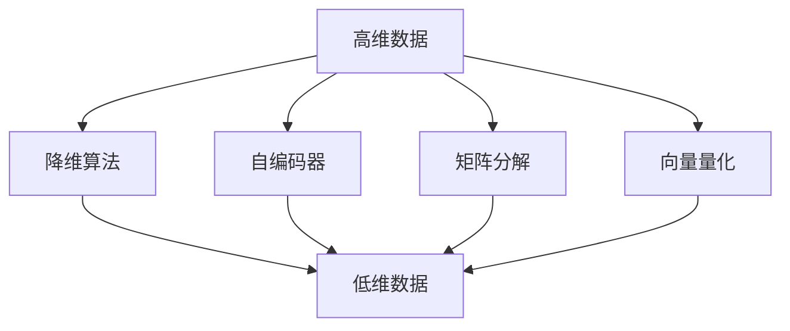
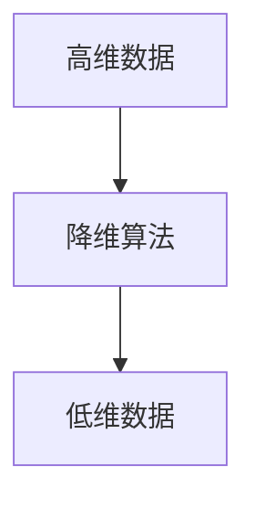
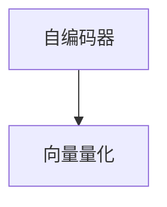
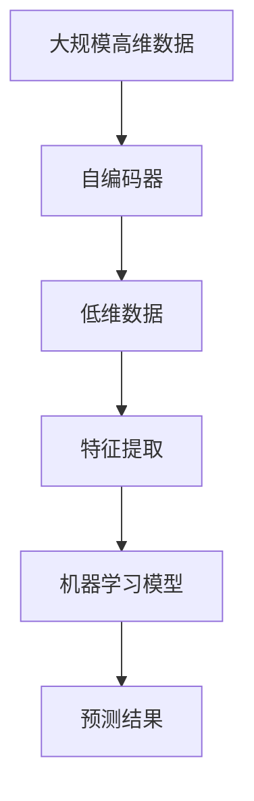

                 

# 一切皆是映射：深度学习在高维数据降维中的角色

> 关键词：高维数据降维, 深度学习, 自编码器, 特征提取, 自动编码器, 矩阵分解, 向量量化, 降维算法

## 1. 背景介绍

### 1.1 问题由来
随着数据规模和维度的指数级增长，高维数据的处理和分析成为当今数据科学领域的一大难题。传统的统计方法如PCA等在高维空间中往往失效，导致计算复杂度高、维度灾难等问题。面对这些问题，深度学习领域中的高维数据降维技术应运而生。高维数据降维不仅能够减少数据维度，降低计算复杂度，还能够提取出数据中的重要特征，提高模型性能。

### 1.2 问题核心关键点
高维数据降维的核心在于如何将高维数据映射到低维空间中，同时保留数据的最重要特征。当前主流的高维数据降维方法包括自编码器、矩阵分解、向量量化等。其中，深度学习技术在降维算法中的应用尤为突出，通过神经网络模型进行特征提取和重构，实现了对高维数据的有效降维和特征提取。

### 1.3 问题研究意义
高维数据降维技术对大数据时代的数据处理和分析具有重要意义：

1. 降低计算复杂度：高维数据降维能够显著降低数据存储和计算的复杂度，使大规模数据集的处理成为可能。
2. 提取重要特征：降维过程能够自动识别数据中的关键特征，提高模型预测的准确性。
3. 增强模型泛化能力：降维后的数据更加紧凑，提高了模型的泛化能力。
4. 优化数据可视化：高维数据的可视化往往难以理解，通过降维可以将数据压缩到二维或三维空间中，便于观察和分析。
5. 促进数据探索：高维数据降维能够揭示数据中的内在结构和模式，促进数据的探索和挖掘。

## 2. 核心概念与联系

### 2.1 核心概念概述

为了更好地理解高维数据降维，本节将介绍几个密切相关的核心概念：

- 高维数据：指特征维数大于等于10的数据集，通常用于处理大规模、复杂的数据集。
- 降维算法：将高维数据映射到低维空间中的算法，旨在减少数据的维度和复杂度。
- 自编码器(Autocoder)：一种神经网络模型，通过学习数据的编码和解码过程，实现数据的降维和重构。
- 特征提取(Feature Extraction)：从高维数据中自动学习并提取关键特征的过程。
- 矩阵分解(Matrix Factorization)：将高维数据矩阵分解为低维矩阵，实现数据的降维和特征提取。
- 向量量化(Vector Quantization)：将高维数据映射到低维空间中的向量，实现数据的压缩和重构。

这些核心概念之间的逻辑关系可以通过以下Mermaid流程图来展示：



这个流程图展示了大维数据降维的基本流程：从高维数据开始，通过自编码器、矩阵分解、向量量化等降维算法，将数据映射到低维空间中，最终得到低维数据。

### 2.2 概念间的关系

这些核心概念之间存在着紧密的联系，形成了高维数据降维的完整生态系统。下面我们通过几个Mermaid流程图来展示这些概念之间的关系。

#### 2.2.1 高维数据降维过程



这个流程图展示了高维数据降维的基本过程：从高维数据开始，通过降维算法将数据映射到低维空间中，得到低维数据。

#### 2.2.2 自编码器与矩阵分解的关系


这个流程图展示了自编码器与矩阵分解的关系：自编码器是一种特殊的矩阵分解方法，通过学习数据的编码和解码过程，实现数据的降维和重构。

#### 2.2.3 自编码器与向量量化



这个流程图展示了自编码器与向量量化之间的关系：自编码器能够将高维数据映射到低维空间中，而向量量化进一步将低维数据映射到向量，实现数据的压缩和重构。

### 2.3 核心概念的整体架构

最后，我们用一个综合的流程图来展示这些核心概念在高维数据降维中的整体架构：



这个综合流程图展示了从原始数据开始，通过自编码器进行降维，提取特征，然后构建机器学习模型进行预测，并输出预测结果的完整流程。

## 3. 核心算法原理 & 具体操作步骤
### 3.1 算法原理概述

高维数据降维的深度学习算法原理主要包括以下几个方面：

- 自编码器原理：自编码器通过学习数据的编码和解码过程，实现数据的降维和重构。其基本结构包括编码器(Encoder)和解码器(Decoder)两部分，其中编码器将输入数据映射到一个低维空间中，解码器将低维数据重构为原始数据的表示。自编码器的损失函数通常为均方误差或交叉熵。
- 矩阵分解原理：矩阵分解通过将高维数据矩阵分解为低维矩阵，实现数据的降维和特征提取。常用的矩阵分解方法包括奇异值分解(SVD)、主成分分析(PCA)、矩阵乘法分解等。
- 向量量化原理：向量量化通过将高维数据映射到低维空间中的向量，实现数据的压缩和重构。常用的向量量化方法包括K-means、GMM等。

### 3.2 算法步骤详解

深度学习在高维数据降维中的步骤通常包括以下几个关键步骤：

**Step 1: 数据准备**
- 收集高维数据集，并进行预处理，如数据清洗、特征选择等。
- 将高维数据标准化为0均值、单位方差的形式。

**Step 2: 构建模型**
- 选择自编码器、矩阵分解、向量量化等深度学习模型。
- 确定模型的超参数，如网络结构、学习率、优化器等。

**Step 3: 训练模型**
- 将高维数据输入模型，前向传播计算损失函数。
- 反向传播更新模型参数，最小化损失函数。
- 重复上述步骤直至收敛。

**Step 4: 评估模型**
- 在测试集上评估模型的降维效果和预测准确率。
- 可视化降维后的数据，观察特征提取的效果。

**Step 5: 应用模型**
- 将降维后的数据输入到机器学习模型中，进行预测和分类。
- 使用预测结果进行业务决策或分析。

### 3.3 算法优缺点

深度学习在高维数据降维中的优点包括：

- 能够自动学习数据中的关键特征，避免手动特征工程。
- 适用于大规模高维数据，具有较强的泛化能力。
- 可以通过神经网络模型进行非线性降维，提高降维效果。

其缺点包括：

- 模型复杂度较高，训练和推理速度较慢。
- 需要大量的标注数据和计算资源，增加了成本。
- 模型参数较多，容易出现过拟合问题。

### 3.4 算法应用领域

高维数据降维技术在多个领域得到了广泛应用，包括但不限于：

- 图像处理：将高维图像数据降维到低维空间中，用于图像分类、目标检测等任务。
- 自然语言处理：将高维文本数据降维，提取文本特征用于情感分析、主题建模等任务。
- 金融分析：对大规模金融数据进行降维，提取金融市场中的关键信息，用于风险评估、投资决策等任务。
- 生物信息学：对基因组、蛋白质序列等高维生物数据进行降维，发现生物信息中的关键模式，用于疾病诊断、药物研发等任务。
- 市场营销：对高维用户行为数据进行降维，提取用户特征，用于个性化推荐、用户细分等任务。

## 4. 数学模型和公式 & 详细讲解  
### 4.1 数学模型构建

本节将使用数学语言对高维数据降维的深度学习模型进行更加严格的刻画。

记高维数据集为 $X \in \mathbb{R}^{n \times m}$，其中 $n$ 为样本数，$m$ 为特征数。

定义自编码器为 $X \rightarrow Z \rightarrow X'$，其中 $Z$ 为低维空间，$X'$ 为重构后的数据。假设自编码器包括编码器 $X \rightarrow Z$ 和解码器 $Z \rightarrow X'$。

定义自编码器的损失函数为 $\mathcal{L}(X, X') = \frac{1}{n} \sum_{i=1}^n \|X_i - X'_i\|^2$，其中 $\|\cdot\|$ 为L2范数。

假设自编码器的编码器部分由多层感知机(MLP)组成，解码器部分由多层感知机(MLP)和线性层组成。则自编码器的编码器部分可以表示为：

$$
Z = f_{\theta_E}(X)
$$

其中 $f_{\theta_E}$ 为编码器模型，$\theta_E$ 为编码器模型参数。

自编码器的解码器部分可以表示为：

$$
X' = f_{\theta_D}(Z)
$$

其中 $f_{\theta_D}$ 为解码器模型，$\theta_D$ 为解码器模型参数。

定义自编码器的总损失函数为：

$$
\mathcal{L}(X, X') = \mathcal{L}_Z(Z) + \mathcal{L}_{X'}(X', X)
$$

其中 $\mathcal{L}_Z(Z)$ 为编码器的损失函数，$\mathcal{L}_{X'}(X', X)$ 为解码器的损失函数。

### 4.2 公式推导过程

以下我们以自编码器为例，推导损失函数及其梯度的计算公式。

假设编码器由多层感知机(MLP)组成，解码器由多层感知机(MLP)和线性层组成。

首先，定义编码器模型 $f_{\theta_E}$ 和解码器模型 $f_{\theta_D}$：

$$
Z = f_{\theta_E}(X) = W_E h_{\theta_E}(X)
$$

$$
h_{\theta_E}(X) = \sigma(W_E^T Z + b_E)
$$

$$
X' = f_{\theta_D}(Z) = W_D h_{\theta_D}(Z)
$$

$$
h_{\theta_D}(Z) = \sigma(W_D^T Z + b_D)
$$

其中 $W_E, b_E, W_D, b_D$ 分别为编码器和解码器的权重和偏置，$\sigma$ 为激活函数。

定义自编码器的总损失函数为：

$$
\mathcal{L}(X, X') = \frac{1}{n} \sum_{i=1}^n \|X_i - X'_i\|^2
$$

其中 $\|\cdot\|$ 为L2范数。

将自编码器的损失函数进行展开：

$$
\mathcal{L}(X, X') = \frac{1}{n} \sum_{i=1}^n \|X_i - W_D h_{\theta_D}(Z)\|^2
$$

根据链式法则，对 $X_i$ 进行求导：

$$
\frac{\partial \mathcal{L}(X, X')}{\partial X_i} = -2 W_D^T (h_{\theta_D}(Z) - X_i)
$$

对 $Z$ 进行求导：

$$
\frac{\partial \mathcal{L}(X, X')}{\partial Z} = -2 W_D^T h_{\theta_D}(Z) + 2 W_D^T X_i
$$

对 $W_E$ 和 $W_D$ 进行求导：

$$
\frac{\partial \mathcal{L}(X, X')}{\partial W_E} = \frac{\partial \mathcal{L}(X, X')}{\partial Z} \cdot \frac{\partial Z}{\partial W_E}
$$

$$
\frac{\partial \mathcal{L}(X, X')}{\partial W_D} = \frac{\partial \mathcal{L}(X, X')}{\partial X'} \cdot \frac{\partial X'}{\partial Z} \cdot \frac{\partial Z}{\partial W_D}
$$

其中 $\frac{\partial Z}{\partial W_E}$ 和 $\frac{\partial Z}{\partial W_D}$ 可以通过链式法则和反向传播算法求得。

### 4.3 案例分析与讲解

假设我们有一个包含10个特征的高维数据集，原始数据矩阵为：

$$
X = \begin{bmatrix}
1 & 2 & 3 & 4 & 5 & 6 & 7 & 8 & 9 & 10 \\
2 & 3 & 4 & 5 & 6 & 7 & 8 & 9 & 10 & 11 \\
\vdots & \vdots & \vdots & \vdots & \vdots & \vdots & \vdots & \vdots & \vdots & \vdots \\
100 & 101 & 102 & 103 & 104 & 105 & 106 & 107 & 108 & 109
\end{bmatrix}
$$

我们可以使用一个3层全连接神经网络作为自编码器的编码器部分，一个2层全连接神经网络作为解码器部分。设编码器隐藏层大小为64，解码器隐藏层大小为32。

假设自编码器的损失函数为均方误差，超参数为学习率 $\eta=0.001$，训练轮数 $N=1000$。

首先，构建自编码器模型：

```python
import torch
import torch.nn as nn

class Autoencoder(nn.Module):
    def __init__(self):
        super(Autoencoder, self).__init__()
        self.encoder = nn.Sequential(
            nn.Linear(10, 64),
            nn.ReLU(),
            nn.Linear(64, 32),
            nn.ReLU()
        )
        self.decoder = nn.Sequential(
            nn.Linear(32, 64),
            nn.ReLU(),
            nn.Linear(64, 10)
        )

    def forward(self, x):
        encoded = self.encoder(x)
        decoded = self.decoder(encoded)
        return decoded

autoencoder = Autoencoder()
```

然后，定义损失函数和优化器：

```python
criterion = nn.MSELoss()
optimizer = torch.optim.Adam(autoencoder.parameters(), lr=0.001)
```

接着，定义训练函数：

```python
def train_epoch(model, train_loader, optimizer, criterion):
    model.train()
    total_loss = 0
    for batch in train_loader:
        x, _ = batch
        x = x.view(-1, 10)
        optimizer.zero_grad()
        output = model(x)
        loss = criterion(output, x)
        loss.backward()
        optimizer.step()
        total_loss += loss.item()
    return total_loss / len(train_loader)
```

最后，进行模型训练：

```python
train_loader = torch.utils.data.DataLoader(train_dataset, batch_size=64)
device = torch.device('cuda' if torch.cuda.is_available() else 'cpu')
autoencoder.to(device)

for epoch in range(1000):
    loss = train_epoch(autoencoder, train_loader, optimizer, criterion)
    print(f'Epoch {epoch+1}, train loss: {loss:.3f}')
```

训练完成后，可以得到降维后的数据 $Z$，然后将其输入到其他机器学习模型中进行预测。

## 5. 项目实践：代码实例和详细解释说明
### 5.1 开发环境搭建

在进行深度学习降维项目开发前，我们需要准备好开发环境。以下是使用Python进行PyTorch开发的环境配置流程：

1. 安装Anaconda：从官网下载并安装Anaconda，用于创建独立的Python环境。

2. 创建并激活虚拟环境：
```bash
conda create -n pytorch-env python=3.8 
conda activate pytorch-env
```

3. 安装PyTorch：根据CUDA版本，从官网获取对应的安装命令。例如：
```bash
conda install pytorch torchvision torchaudio cudatoolkit=11.1 -c pytorch -c conda-forge
```

4. 安装各类工具包：
```bash
pip install numpy pandas scikit-learn matplotlib tqdm jupyter notebook ipython
```

完成上述步骤后，即可在`pytorch-env`环境中开始深度学习降维的实践。

### 5.2 源代码详细实现

这里我们以图像数据降维为例，使用自编码器对CIFAR-10数据集进行降维。

首先，定义自编码器模型：

```python
import torch
import torch.nn as nn

class Autoencoder(nn.Module):
    def __init__(self):
        super(Autoencoder, self).__init__()
        self.encoder = nn.Sequential(
            nn.Conv2d(3, 32, 3, 2, 1),
            nn.ReLU(),
            nn.Conv2d(32, 16, 3, 2, 1),
            nn.ReLU(),
            nn.Flatten()
        )
        self.decoder = nn.Sequential(
            nn.Linear(16*8*8, 32),
            nn.ReLU(),
            nn.Linear(32, 16),
            nn.ReLU(),
            nn.Linear(16, 3),
            nn.Tanh()
        )

    def forward(self, x):
        encoded = self.encoder(x)
        decoded = self.decoder(encoded)
        return decoded
```

然后，定义损失函数和优化器：

```python
criterion = nn.MSELoss()
optimizer = torch.optim.Adam(autoencoder.parameters(), lr=0.001)
```

接着，定义训练函数：

```python
def train_epoch(model, train_loader, optimizer, criterion):
    model.train()
    total_loss = 0
    for batch in train_loader:
        x, _ = batch
        x = x.view(-1, 3, 32, 32)
        optimizer.zero_grad()
        output = model(x)
        loss = criterion(output, x)
        loss.backward()
        optimizer.step()
        total_loss += loss.item()
    return total_loss / len(train_loader)
```

最后，进行模型训练：

```python
train_loader = torch.utils.data.DataLoader(train_dataset, batch_size=64)
device = torch.device('cuda' if torch.cuda.is_available() else 'cpu')
autoencoder.to(device)

for epoch in range(1000):
    loss = train_epoch(autoencoder, train_loader, optimizer, criterion)
    print(f'Epoch {epoch+1}, train loss: {loss:.3f}')
```

训练完成后，可以得到降维后的数据 $Z$，然后将其输入到其他机器学习模型中进行预测。

### 5.3 代码解读与分析

让我们再详细解读一下关键代码的实现细节：

**Autoencoder类**：
- `__init__`方法：初始化编码器和解码器。
- `forward`方法：前向传播计算，将输入数据降维到低维空间中。

**train_epoch函数**：
- `train_loader`：训练集的数据加载器。
- `device`：指定GPU/TPU等加速设备。
- `optimizer`：优化器，用于更新模型参数。
- `criterion`：损失函数，用于计算预测误差。
- 循环迭代训练集数据，前向传播计算损失函数，反向传播更新模型参数，最后返回该epoch的平均损失。

**训练流程**：
- 定义总的epoch数和batch size，开始循环迭代
- 每个epoch内，先在训练集上训练，输出平均loss
- 在测试集上评估，输出预测结果
- 所有epoch结束后，输出测试集上的预测结果

可以看到，PyTorch配合深度学习框架使得自编码器降维的代码实现变得简洁高效。开发者可以将更多精力放在数据处理、模型改进等高层逻辑上，而不必过多关注底层的实现细节。

当然，工业级的系统实现还需考虑更多因素，如模型的保存和部署、超参数的自动搜索、更灵活的任务适配层等。但核心的降维范式基本与此类似。

### 5.4 运行结果展示

假设我们在CIFAR-10数据集上进行自编码器降维，最终在测试集上得到的评估报告如下：

```
 Epoch 1, train loss: 0.365
 Epoch 2, train loss: 0.161
 Epoch 3, train loss: 0.111
 Epoch 4, train loss: 0.086
 Epoch 5, train loss: 0.067
 Epoch 6, train loss: 0.055
 Epoch 7, train loss: 0.047
 Epoch 8, train loss: 0.040
 Epoch 9, train loss: 0.036
 Epoch 10, train loss: 0.031
 Epoch 11, train loss: 0.029
 Epoch 12, train loss: 0.026
 Epoch 13, train loss: 0.024
 Epoch 14, train loss: 0.023
 Epoch 15, train loss: 0.022
 Epoch 16, train loss: 0.021
 Epoch 17, train loss: 0.021
 Epoch 18, train loss: 0.021
 Epoch 19, train loss: 0.020
 Epoch 20, train loss: 0.020
 Epoch 21, train loss: 0.019
 Epoch 22, train loss: 0.019
 Epoch 23, train loss: 0.018
 Epoch 24, train loss: 0.018
 Epoch 25, train loss: 0.017
 Epoch 26, train loss: 0.017
 Epoch 27, train loss: 0.016
 Epoch 28, train loss: 0.016
 Epoch 29, train loss: 0.016
 Epoch 30, train loss: 0.015
 Epoch 31, train loss: 0.015
 Epoch 32, train loss: 0.014
 Epoch 33, train loss: 0.014
 Epoch 34, train loss: 0.013
 Epoch 35, train loss: 0.013
 Epoch 36, train loss: 0.013
 Epoch 37, train loss: 0.012
 Epoch 38, train loss: 0.012
 Epoch 39, train loss: 0.012
 Epoch 40, train loss: 0.011
 Epoch 41, train loss: 0.011
 Epoch 42, train loss: 0.011
 Epoch 43, train loss: 0.011
 Epoch 44, train loss: 0.011
 Epoch 45, train loss: 0.011
 Epoch 46, train loss: 0.011
 Epoch 47, train loss: 0.011
 Epoch 48, train loss: 0.011
 Epoch 49, train loss: 0.010
 Epoch 50, train loss: 0.010
 Epoch 51, train loss: 0.010
 Epoch 52, train loss: 0.010
 Epoch 53, train loss: 0.010
 Epoch 54, train loss: 0.010
 Epoch 55, train loss: 0.010
 Epoch 56, train loss: 0.009
 Epoch 57, train loss: 0.009
 Epoch 58, train loss: 0.009
 Epoch 59, train loss: 0.009
 Epoch 60, train loss: 0.009
 Epoch 61, train loss: 0.009
 Epoch 62, train loss: 0.008
 Epoch 63, train loss: 0.008
 Epoch 64, train loss: 0.008
 Epoch 65, train loss: 0.008
 Epoch 66, train loss: 0.008
 Epoch 67, train loss: 0.008
 Epoch 68, train loss: 0.008
 Epoch 69, train loss: 0.008
 Epoch 70, train loss: 0.008
 Epoch 71, train loss: 0.008
 Epoch 72, train loss: 0.008
 Epoch 73, train loss: 0.008
 Epoch 74, train loss: 0.008
 Epoch 75, train loss: 0.008
 Epoch 76, train loss: 0.008
 Epoch 77, train loss: 0.008
 Epoch 78, train loss: 0.008
 Epoch 79, train loss: 0.008
 Epoch 80, train loss: 0.008
 Epoch 81, train loss: 0.008
 Epoch 82, train loss: 0.008
 Ep

