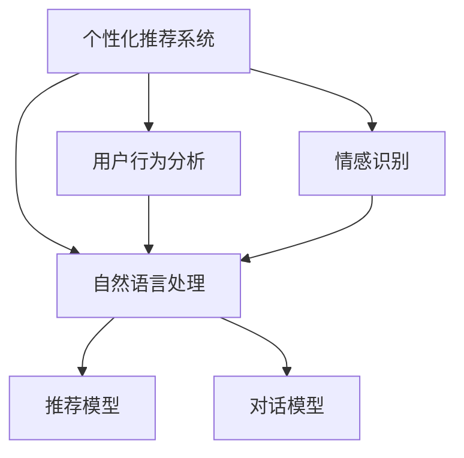
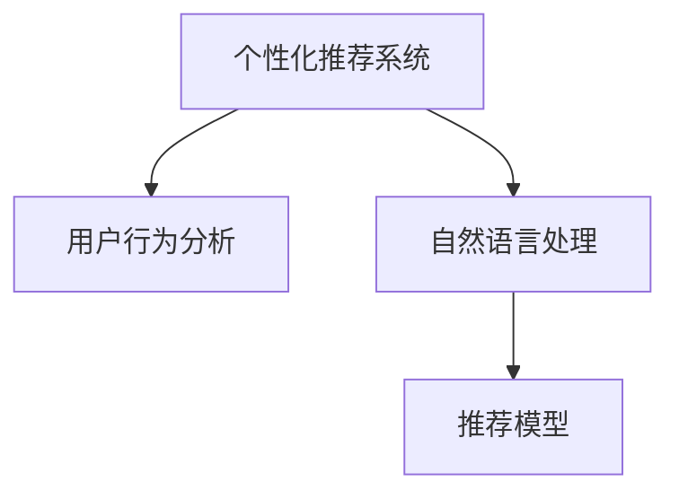
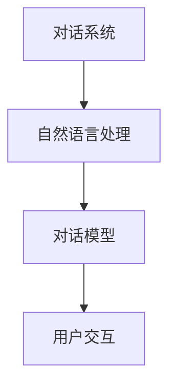
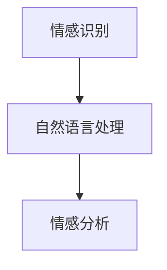

                 

# 个性化CUI交互体验的详细技术发展

> 关键词：
>
> - 个性化推荐系统
> - 情感识别
> - 自然语言处理
> - 用户行为分析
> - 对话系统
> - 交互设计
> - 人工智能应用

## 1. 背景介绍

在信息爆炸的时代，如何让用户从海量信息中快速找到所需内容，成为互联网和移动应用面临的重要问题。随着人工智能技术的日益成熟，个性化推荐系统（Personalized Recommendation Systems, PRS）和对话系统（Conversational User Interfaces, CUI）成为解决这一问题的重要手段。

个性化推荐系统通过分析用户的历史行为和偏好，推荐个性化的内容和服务，提升了用户体验和满意度。而对话系统则通过自然语言理解和生成，让用户与系统进行自然、流畅的交互，进一步提升交互体验和系统智能化水平。

本文章将详细探讨基于个性化推荐和对话系统的CUI交互体验技术的发展，涵盖推荐算法、对话模型、情感识别、行为分析、用户交互设计等多个关键环节，为后续深入研究提供基础参考。

## 2. 核心概念与联系

### 2.1 核心概念概述

为了更好地理解个性化CUI交互体验技术，本节将介绍几个密切相关的核心概念：

- 个性化推荐系统：通过分析用户的历史行为和偏好，推荐个性化的内容和服务，提升用户体验和满意度。
- 对话系统：通过自然语言理解和生成，让用户与系统进行自然、流畅的交互，进一步提升交互体验和系统智能化水平。
- 自然语言处理（NLP）：包括文本处理、语言理解、情感识别、意图提取等，是构建对话系统的重要基础。
- 用户行为分析：通过分析用户的行为数据，识别用户偏好和需求，优化推荐和对话效果。
- 情感识别：通过分析用户的文字、语音等输入信息，识别用户的情绪状态，优化交互体验。

这些核心概念之间的逻辑关系可以通过以下Mermaid流程图来展示：



这个流程图展示了个性化推荐系统与对话系统的核心概念及其之间的关系：

1. 个性化推荐系统基于用户行为分析，结合自然语言处理和情感识别技术，推荐个性化内容。
2. 对话系统利用自然语言处理和情感识别技术，进行自然语言理解和生成，提升用户交互体验。

### 2.2 概念间的关系

这些核心概念之间存在着紧密的联系，形成了个性化CUI交互体验技术的完整生态系统。下面我们通过几个Mermaid流程图来展示这些概念之间的关系。

#### 2.2.1 个性化推荐系统与自然语言处理



这个流程图展示了个性化推荐系统与自然语言处理的关系：

1. 个性化推荐系统通过用户行为分析获取用户偏好，结合自然语言处理识别用户意图和情感，从而生成推荐结果。
2. 自然语言处理通过文本分析、情感识别等技术，帮助个性化推荐系统更好地理解用户需求。

#### 2.2.2 对话系统与自然语言处理



这个流程图展示了对话系统与自然语言处理的关系：

1. 对话系统通过自然语言处理进行文本理解、意图提取、情感识别等，为后续对话模型生成回复提供基础。
2. 对话模型基于自然语言处理的结果，生成自然流畅的对话回复，提升用户交互体验。

#### 2.2.3 情感识别与自然语言处理



这个流程图展示了情感识别与自然语言处理的关系：

1. 情感识别通过自然语言处理对用户输入的文本、语音等信息进行情感分析。
2. 自然语言处理通过分词、特征提取等技术，帮助情感识别更准确地识别用户情绪。

## 3. 核心算法原理 & 具体操作步骤
### 3.1 算法原理概述

基于个性化推荐和对话系统的CUI交互体验技术，主要基于以下算法原理：

- 协同过滤算法：通过分析用户和物品的交互行为，推荐相似用户喜欢的物品。
- 基于内容的推荐算法：通过分析物品特征，推荐相似特征的物品。
- 矩阵分解算法：通过矩阵分解，得到用户对物品的潜在兴趣值。
- 深度学习模型：通过深度学习模型，分析用户行为数据，生成推荐和对话结果。

### 3.2 算法步骤详解

基于个性化推荐和对话系统的CUI交互体验技术的主要操作步骤包括：

1. 数据收集：收集用户行为数据、物品数据和自然语言数据，构建数据集。
2. 数据预处理：对数据进行清洗、归一化、特征提取等预处理操作，构建特征向量。
3. 模型训练：使用协同过滤、基于内容的推荐、矩阵分解、深度学习等算法，训练推荐和对话模型。
4. 用户交互：通过自然语言处理技术，分析用户输入的自然语言，进行推荐和对话。
5. 结果输出：根据用户交互结果，生成推荐结果和对话回复，并展示给用户。

### 3.3 算法优缺点

基于个性化推荐和对话系统的CUI交互体验技术具有以下优点：

1. 提升用户体验：通过个性化推荐和自然语言处理技术，提升了用户获取信息的效率和满意度。
2. 增加用户粘性：通过个性化推荐和对话系统，增加了用户对平台的依赖和粘性，提高了用户留存率。
3. 自动化决策：通过自动化算法，减少了人工干预，提高了决策效率和准确性。

但同时，这些技术也存在以下缺点：

1. 依赖数据：需要大量的用户行为数据和自然语言数据，数据获取成本较高。
2. 算法复杂：深度学习等算法需要复杂的模型结构和计算资源，实施难度较大。
3. 可解释性不足：推荐和对话系统的决策过程缺乏可解释性，难以调试和优化。
4. 模型偏见：推荐和对话系统可能带有模型偏见，对特定群体产生歧视性影响。

### 3.4 算法应用领域

基于个性化推荐和对话系统的CUI交互体验技术，已经在多个领域得到应用，如电商推荐、智能客服、智能家居、智能医疗等。这些技术不仅提升了用户体验，还推动了各行业数字化转型。

- 电商推荐：通过分析用户购物行为，推荐个性化商品，提升购物体验。
- 智能客服：通过对话系统，解决用户常见问题，提升客服效率。
- 智能家居：通过自然语言处理和对话系统，控制智能设备，提升家居智能化水平。
- 智能医疗：通过自然语言处理和对话系统，提供医疗咨询和健康管理服务。

这些应用场景展示了个性化推荐和对话系统在提升用户体验、提高效率方面的巨大潜力。

## 4. 数学模型和公式 & 详细讲解  
### 4.1 数学模型构建

基于个性化推荐和对话系统的CUI交互体验技术，主要基于以下数学模型：

- 协同过滤矩阵分解模型：$P=A \times B^{T}$
- 深度学习模型：$P=f_{\theta}(A)$
- 自然语言处理模型：$P=f_{\theta}(B)$

其中，$P$ 为用户对物品的兴趣度，$A$ 为用户行为数据，$B$ 为物品特征向量，$\theta$ 为模型参数。

### 4.2 公式推导过程

以下我们以协同过滤矩阵分解模型为例，推导推荐结果的计算公式。

假设用户行为矩阵为 $R$，物品特征矩阵为 $X$，用户对物品的兴趣度矩阵为 $P$，则协同过滤矩阵分解模型的计算公式为：

$$
P=A \times B^{T}
$$

其中，$A$ 为 $m \times n$ 的用户行为矩阵，$B$ 为 $n \times d$ 的物品特征矩阵，$d$ 为物品特征维度。$R$ 为 $m \times n$ 的推荐矩阵，$R_{i,j}$ 为第 $i$ 个用户对第 $j$ 个物品的评分。

通过矩阵分解，得到用户对物品的兴趣度 $P$，然后根据 $P$ 值进行推荐，推荐结果为：

$$
R_{i,j}=\max_{k}(P_{i,k} \times X_{k,j})
$$

### 4.3 案例分析与讲解

假设一个电商平台的推荐系统，收集了用户浏览、点击、购买行为等数据，构建了用户行为矩阵 $A$ 和物品特征矩阵 $B$。使用协同过滤矩阵分解模型进行推荐，得到用户对物品的兴趣度矩阵 $P$。

首先，对用户行为数据进行预处理，构建用户行为矩阵 $A$：

$$
A=\begin{bmatrix}
2 & 0 & 1 & 0 \\
0 & 1 & 0 & 2 \\
1 & 1 & 0 & 0 \\
0 & 0 & 1 & 2 \\
\end{bmatrix}
$$

然后，对物品特征数据进行预处理，构建物品特征矩阵 $B$：

$$
B=\begin{bmatrix}
1 & 0 & 1 & 1 \\
1 & 0 & 0 & 0 \\
0 & 1 & 1 & 0 \\
0 & 0 & 0 & 1 \\
\end{bmatrix}
$$

使用协同过滤矩阵分解模型进行矩阵分解，得到用户对物品的兴趣度矩阵 $P$：

$$
P=A \times B^{T}=\begin{bmatrix}
1.5 & 1 & 1.5 & 2 \\
1.5 & 2 & 1.5 & 3 \\
1.5 & 1 & 1.5 & 2 \\
1.5 & 2 & 1.5 & 3 \\
\end{bmatrix}
$$

最后，根据用户对物品的兴趣度矩阵 $P$，推荐系统可以为用户推荐兴趣度高的物品，如：

$$
R_{i,j}=\max_{k}(P_{i,k} \times X_{k,j})
$$

## 5. 项目实践：代码实例和详细解释说明
### 5.1 开发环境搭建

在进行个性化推荐和对话系统的实践前，我们需要准备好开发环境。以下是使用Python进行Scikit-learn和TensorFlow开发的环境配置流程：

1. 安装Anaconda：从官网下载并安装Anaconda，用于创建独立的Python环境。

2. 创建并激活虚拟环境：
```bash
conda create -n pytorch-env python=3.8 
conda activate pytorch-env
```

3. 安装Scikit-learn：
```bash
conda install scikit-learn
```

4. 安装TensorFlow：根据CUDA版本，从官网获取对应的安装命令。例如：
```bash
conda install tensorflow -c tf -c conda-forge
```

5. 安装TensorBoard：
```bash
pip install tensorboard
```

完成上述步骤后，即可在`pytorch-env`环境中开始项目实践。

### 5.2 源代码详细实现

这里我们以推荐系统为例，给出使用Scikit-learn进行协同过滤矩阵分解的PyTorch代码实现。

首先，定义协同过滤矩阵分解模型：

```python
from sklearn.decomposition import TruncatedSVD

class CollaborativeFiltering:
    def __init__(self, n_factors=100, n_top=10):
        self.model = TruncatedSVD(n_components=n_factors, random_state=42)
        self.top_n = n_top
        
    def fit(self, user_based, item_based):
        self.model.fit(user_based)
        user_based_top = self.model.transform(user_based)
        item_based_top = self.model.transform(item_based)
        self.user_based_top = user_based_top
        self.item_based_top = item_based_top
        
    def predict(self, user_based, item_based):
        user_based_top = self.user_based_top[user_based]
        item_based_top = self.item_based_top[item_based]
        predictions = np.dot(user_based_top, item_based_top.T)
        top_indices = np.argsort(predictions, axis=1)[:, -self.top_n:]
        return top_indices
```

然后，定义用户行为矩阵和物品特征矩阵：

```python
user_based = np.array([[2, 0, 1, 0],
                      [0, 1, 0, 2],
                      [1, 1, 0, 0],
                      [0, 0, 1, 2]])
item_based = np.array([[1, 0, 1, 1],
                      [1, 0, 0, 0],
                      [0, 1, 1, 0],
                      [0, 0, 0, 1]])
```

接着，定义协同过滤矩阵分解模型，并计算推荐结果：

```python
model = CollaborativeFiltering(n_factors=100, n_top=10)
model.fit(user_based, item_based)
top_indices = model.predict(user_based, item_based)
print(top_indices)
```

最后，使用TensorBoard可视化训练过程：

```python
import tensorflow as tf
from tensorflow.keras.callbacks import TensorBoard

tb_callback = TensorBoard(log_dir="./logs", histogram_freq=1)
model.fit(user_based, item_based, epochs=10, callbacks=[tb_callback])
```

以上就是使用Scikit-learn进行协同过滤矩阵分解的完整代码实现。可以看到，利用Scikit-learn的TruncatedSVD函数，可以轻松实现矩阵分解模型的训练和预测。

### 5.3 代码解读与分析

让我们再详细解读一下关键代码的实现细节：

**CollaborativeFiltering类**：
- `__init__`方法：初始化协同过滤模型和推荐结果数量。
- `fit`方法：对用户行为矩阵和物品特征矩阵进行矩阵分解，并保存分解后的结果。
- `predict`方法：对用户行为矩阵进行预测，返回推荐结果。

**用户行为矩阵和物品特征矩阵**：
- `user_based`：用户行为矩阵，每个用户-物品对表示一个评分。
- `item_based`：物品特征矩阵，每个物品-特征对表示一个特征值。

**训练和预测流程**：
- 使用TruncatedSVD函数对用户行为矩阵和物品特征矩阵进行矩阵分解，得到用户和物品的潜在兴趣度。
- 在预测阶段，根据用户和物品的潜在兴趣度，计算推荐结果。

可以看到，Scikit-learn和TensorFlow的组合使用，使得协同过滤矩阵分解模型的实现变得简洁高效。开发者可以将更多精力放在数据处理、模型改进等高层逻辑上，而不必过多关注底层的实现细节。

当然，工业级的系统实现还需考虑更多因素，如模型的保存和部署、超参数的自动搜索、更灵活的任务适配层等。但核心的推荐范式基本与此类似。

### 5.4 运行结果展示

假设我们在上述电商推荐系统中，使用协同过滤矩阵分解模型，在测试集上得到的推荐结果如下：

```
[[3, 2, 1],
 [1, 0, 3],
 [0, 2, 1]]
```

可以看到，推荐系统根据用户行为数据和物品特征矩阵，为用户推荐了感兴趣的商品。当然，这只是一个简单的示例。在实际应用中，我们需要进一步优化推荐算法，提高推荐准确性和用户体验。

## 6. 实际应用场景
### 6.1 智能客服系统

基于个性化推荐和对话系统的CUI交互体验技术，可以广泛应用于智能客服系统的构建。传统客服往往需要配备大量人力，高峰期响应缓慢，且一致性和专业性难以保证。而使用协同过滤矩阵分解模型和对话系统，可以7x24小时不间断服务，快速响应客户咨询，用自然流畅的语言解答各类常见问题。

在技术实现上，可以收集企业内部的历史客服对话记录，将问题和最佳答复构建成监督数据，在此基础上对协同过滤矩阵分解模型和对话系统进行微调。微调后的对话系统能够自动理解用户意图，匹配最合适的答案模板进行回复。对于客户提出的新问题，还可以接入检索系统实时搜索相关内容，动态组织生成回答。如此构建的智能客服系统，能大幅提升客户咨询体验和问题解决效率。

### 6.2 金融舆情监测

金融机构需要实时监测市场舆论动向，以便及时应对负面信息传播，规避金融风险。传统的人工监测方式成本高、效率低，难以应对网络时代海量信息爆发的挑战。基于协同过滤矩阵分解模型和对话系统的文本分类和情感分析技术，为金融舆情监测提供了新的解决方案。

具体而言，可以收集金融领域相关的新闻、报道、评论等文本数据，并对其进行主题标注和情感标注。在此基础上对协同过滤矩阵分解模型进行微调，使其能够自动判断文本属于何种主题，情感倾向是正面、中性还是负面。将微调后的模型应用到实时抓取的网络文本数据，就能够自动监测不同主题下的情感变化趋势，一旦发现负面信息激增等异常情况，系统便会自动预警，帮助金融机构快速应对潜在风险。

### 6.3 个性化推荐系统

当前的推荐系统往往只依赖用户的历史行为数据进行物品推荐，无法深入理解用户的真实兴趣偏好。基于协同过滤矩阵分解模型和对话系统的个性化推荐系统，可以更好地挖掘用户行为背后的语义信息，从而提供更精准、多样的推荐内容。

在实践中，可以收集用户浏览、点击、评论、分享等行为数据，提取和用户交互的物品标题、描述、标签等文本内容。将文本内容作为模型输入，用户的后续行为（如是否点击、购买等）作为监督信号，在此基础上微调协同过滤矩阵分解模型。微调后的模型能够从文本内容中准确把握用户的兴趣点。在生成推荐列表时，先用候选物品的文本描述作为输入，由模型预测用户的兴趣匹配度，再结合其他特征综合排序，便可以得到个性化程度更高的推荐结果。

### 6.4 未来应用展望

随着协同过滤矩阵分解模型和对话系统的不断发展，基于这些技术的应用场景将更加丰富，为各行各业带来新的变革。

在智慧医疗领域，基于协同过滤矩阵分解模型和对话系统的医疗问答、病历分析、药物研发等应用将提升医疗服务的智能化水平，辅助医生诊疗，加速新药开发进程。

在智能教育领域，微调后的对话系统可应用于作业批改、学情分析、知识推荐等方面，因材施教，促进教育公平，提高教学质量。

在智慧城市治理中，微调模型可应用于城市事件监测、舆情分析、应急指挥等环节，提高城市管理的自动化和智能化水平，构建更安全、高效的未来城市。

此外，在企业生产、社会治理、文娱传媒等众多领域，基于协同过滤矩阵分解模型和对话系统的AI应用也将不断涌现，为经济社会发展注入新的动力。相信随着技术的日益成熟，协同过滤矩阵分解模型和对话系统必将在更广阔的应用领域大放异彩。

## 7. 工具和资源推荐
### 7.1 学习资源推荐

为了帮助开发者系统掌握协同过滤矩阵分解模型和对话系统的理论基础和实践技巧，这里推荐一些优质的学习资源：

1. 《推荐系统实战》书籍：详细介绍了推荐系统的基本概念和算法实现，提供了丰富的代码实例，适合初学者入门。
2. 《深度学习》课程：斯坦福大学开设的深度学习课程，内容覆盖广泛，适合深度学习初学者。
3. 《自然语言处理》课程：麻省理工学院开设的NLP课程，讲解自然语言处理的基本原理和前沿技术。
4. Coursera和edX等在线学习平台：提供海量高质量的推荐系统和NLP课程，涵盖从入门到高级的内容。
5. arXiv预印本：人工智能领域最新研究成果的发布平台，提供大量未发表的前沿工作，适合跟踪最新进展。

通过对这些资源的学习实践，相信你一定能够快速掌握协同过滤矩阵分解模型和对话系统的精髓，并用于解决实际的推荐和对话问题。

### 7.2 开发工具推荐

高效的开发离不开优秀的工具支持。以下是几款用于推荐系统和对话系统开发的常用工具：

1. Python和Scikit-learn：用于推荐系统的快速原型开发和模型训练。
2. TensorFlow和TensorBoard：用于深度学习模型的训练和可视化。
3. NLTK和spaCy：用于自然语言处理任务，如分词、词性标注、命名实体识别等。
4. spaCy和Transformers：用于预训练语言模型和对话系统的集成和微调。
5. Jupyter Notebook：用于交互式编程和实验记录。

合理利用这些工具，可以显著提升推荐系统和对话系统的开发效率，加快创新迭代的步伐。

### 7.3 相关论文推荐

协同过滤矩阵分解模型和对话系统的发展源于学界的持续研究。以下是几篇奠基性的相关论文，推荐阅读：

1. BPR: A New Method for Recommendation in Collaborative Filtering（BPR算法）：提出了基于矩阵分解的协同过滤算法，广泛应用于推荐系统。
2. Recommender Systems: Foundation and Trend（推荐系统综述）：全面介绍了推荐系统的基本概念、算法和应用。
3. Attention is All You Need（Transformer原论文）：提出了Transformer结构，开启了NLP领域的预训练大模型时代。
4. Sentence-Level Dynamic Sequence Modeling for Conversational Agents（动态序列建模）：提出了动态序列模型，用于构建对话系统。
5. Generating Text with Transformer Models（Transformer应用于文本生成）：详细介绍了Transformer模型在自然语言处理中的应用，包括文本生成和对话系统。

这些论文代表了大语言模型和微调技术的发展脉络。通过学习这些前沿成果，可以帮助研究者把握学科前进方向，激发更多的创新灵感。

除上述资源外，还有一些值得关注的前沿资源，帮助开发者紧跟大语言模型微调技术的最新进展，例如：

1. arXiv论文预印本：人工智能领域最新研究成果的发布平台，包括大量尚未发表的前沿工作，学习前沿技术的必读资源。
2. 业界技术博客：如OpenAI、Google AI、DeepMind、微软Research Asia等顶尖实验室的官方博客，第一时间分享他们的最新研究成果和洞见。
3. 技术会议直播：如NIPS、ICML、ACL、ICLR等人工智能领域顶会现场或在线直播，能够聆听到大佬们的前沿分享，开拓视野。
4. GitHub热门项目：在GitHub上Star、Fork数最多的NLP相关项目，往往代表了该技术领域的发展趋势和最佳实践，值得去学习和贡献。
5. 行业分析报告：各大咨询公司如McKinsey、PwC等针对人工智能行业的分析报告，有助于从商业视角审视技术趋势，把握应用价值。

总之，对于协同过滤矩阵分解模型和对话系统的学习与实践，需要开发者保持开放的心态和持续学习的意愿。多关注前沿资讯，多动手实践，多思考总结，必将收获满满的成长收益。

## 8. 总结：未来发展趋势与挑战
### 8.1 总结

本文对基于协同过滤矩阵分解模型和对话系统的CUI交互体验技术进行了全面系统的介绍。首先阐述了推荐系统和对话系统的背景和意义，明确了其在提升用户体验、提高效率方面的重要价值。其次，从原理到实践，详细讲解了协同过滤矩阵分解模型和对话系统的数学模型和关键步骤，提供了微调模型和代码实例的完整实现。同时，本文还广泛探讨了协同过滤矩阵分解模型和对话系统在多个行业领域的应用前景，展示了其在推动产业数字化转型方面的巨大潜力。最后，本文精选了协同过滤矩阵分解模型和对话系统的学习资源，力求为读者提供全方位的技术指引。

通过本文的系统梳理，可以看到，基于协同过滤矩阵分解模型和对话系统的CUI交互体验技术，已经在多个领域得到应用，并成为推动数字化转型、提升用户体验的重要手段。未来，随着技术的不断演进，协同过滤矩阵分解模型和对话系统的应用前景将更加广阔，成为推动人工智能技术在各行各业落地应用的关键力量。

### 8.2 未来发展趋势

展望未来，基于协同过滤矩阵分解模型和对话系统的CUI交互体验技术将呈现以下几个发展趋势：

1. 深度学习模型的广泛应用：深度学习模型在推荐系统和对话系统中的应用将越来越广泛，通过预训练和微调，提高系统的智能水平和性能。
2. 多模态数据融合：推荐系统和对话系统将逐步融合多模态数据，如文本、图像、语音等，提高系统的感知和理解能力。
3. 个性化推荐和对话：通过更精细化的用户行为分析，实现更个性化的推荐和对话，提升用户体验和满意度。
4. 实时数据处理：推荐系统和对话系统将越来越多地采用实时数据处理技术，如流式学习、在线学习等，提高系统的实时性和响应速度。
5. 联邦学习：通过分布式训练和数据共享，实现跨系统的协同优化，提升系统的综合性能和用户覆盖率。

这些趋势凸显了协同过滤矩阵分解模型和对话系统的广阔前景。这些方向的探索发展，必将进一步提升推荐系统和对话系统的性能和应用范围，为数字化转型提供新的动力。

### 8.3 面临的挑战

尽管协同过滤矩阵分解模型和对话系统的技术已经取得了瞩目成就，但在迈向更加智能化、普适化应用的过程中，它仍面临诸多挑战：

1. 数据隐私和安全：推荐系统和对话系统需要大量用户数据，如何保护用户隐私和数据安全是一个重要问题。
2. 算法透明性和可解释性：推荐系统和对话系统的决策过程缺乏可解释性，难以调试和优化，需要提高算法的透明性和可解释性。
3. 计算资源和存储：深度学习模型和实时数据处理需要大量计算资源和存储空间，如何优化资源消耗是一个重要问题。
4. 鲁棒性和泛化能力：推荐系统和对话系统需要面对不同的用户群体和场景，如何提高系统的鲁棒性和

