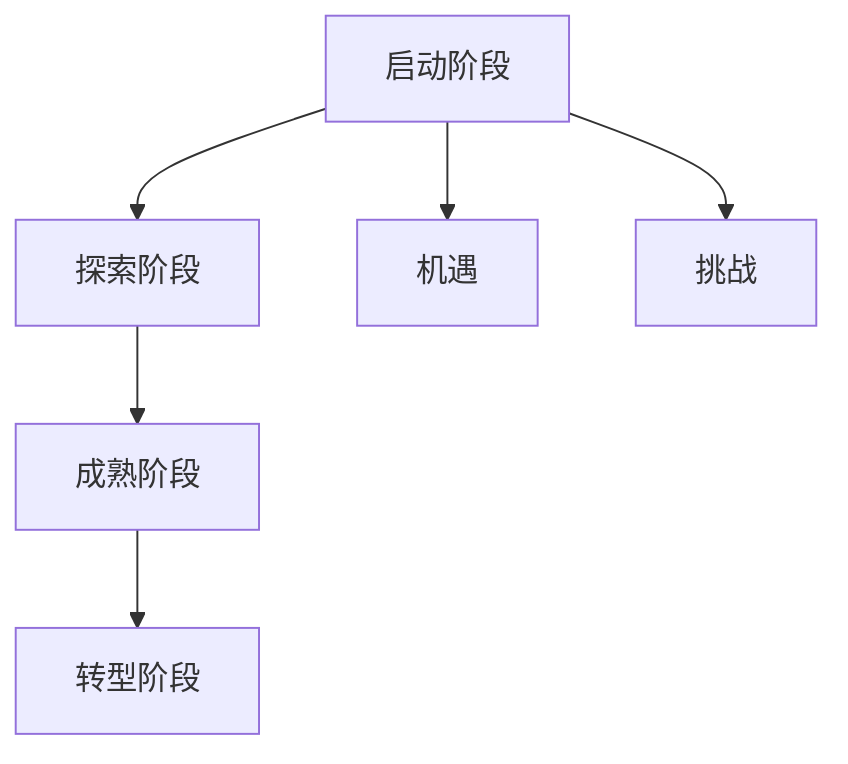
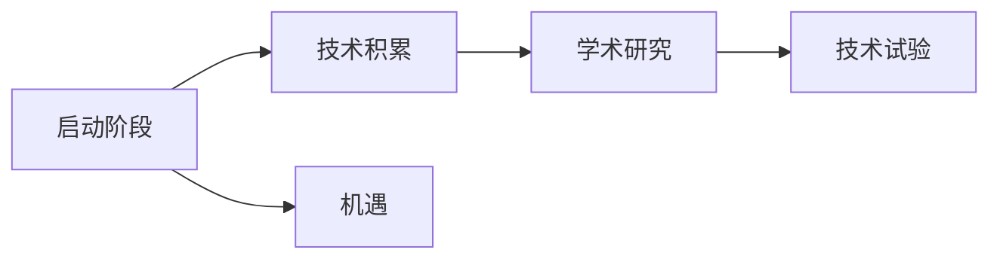
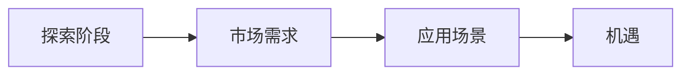
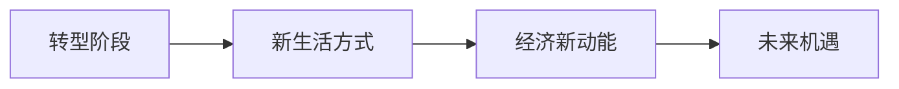
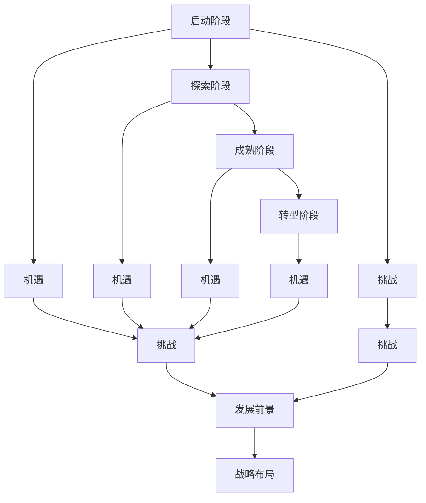

                 

# 中国进入AI经济周期的机遇与挑战

## 1. 背景介绍

### 1.1 问题由来
近年来，随着人工智能技术的飞速发展，中国已经成为全球AI创新的重要力量。从大数据、云计算到深度学习、自然语言处理等，中国在各个AI领域都取得了显著的进展。尤其是在AI经济周期性发展的大背景下，中国正面临前所未有的机遇与挑战。

AI经济周期性发展指的是AI技术从萌芽、兴起、成熟到落幕的周期性过程，通常包括四个阶段：
1. 启动阶段：AI技术的初步探索和应用尝试，主要依赖于学术研究和小规模项目。
2. 探索阶段：AI技术的快速发展和广泛应用，逐步形成庞大的市场和产业基础。
3. 成熟阶段：AI技术的深度融合与创新，推动经济社会的全面智能化转型。
4. 转型阶段：AI技术的进一步演化和应用拓展，引领人类进入新的生产生活方式。

目前，中国正处于AI经济周期的探索阶段，具备了向成熟阶段转型的条件。在此背景下，本文将探讨中国进入AI经济周期的机遇与挑战，为推动AI技术在经济社会发展中的应用提供参考。

## 2. 核心概念与联系

### 2.1 核心概念概述

为更好地理解中国进入AI经济周期的机遇与挑战，本节将介绍几个密切相关的核心概念：

- **AI经济周期**：指AI技术从萌芽到落幕的周期性过程，包括启动、探索、成熟和转型四个阶段。

- **启动阶段**：AI技术的初步探索和应用尝试，依赖于学术研究和小规模项目。

- **探索阶段**：AI技术的快速发展和广泛应用，形成庞大的市场和产业基础。

- **成熟阶段**：AI技术的深度融合与创新，推动经济社会的全面智能化转型。

- **转型阶段**：AI技术的进一步演化和应用拓展，引领人类进入新的生产生活方式。

- **机遇**：指中国进入AI经济周期时所面临的有利条件和发展机遇。

- **挑战**：指中国在AI经济周期发展过程中可能遇到的问题和障碍。

这些核心概念之间的逻辑关系可以通过以下Mermaid流程图来展示：



这个流程图展示了中国AI经济周期四个阶段及其带来的机遇和挑战：

1. 启动阶段带来的机遇：学术研究积累、技术试验成功。
2. 探索阶段带来的机遇：市场需求快速增长、产业规模化发展。
3. 成熟阶段带来的机遇：技术深度融合、社会智能化转型。
4. 转型阶段带来的机遇：新生产生活方式出现、经济新动能增长。

同时，这些概念也与机遇和挑战紧密相关。以下我们通过几个Mermaid流程图来展示这些概念之间的关系。

### 2.2 概念间的关系

#### 2.2.1 启动阶段与机遇



这个流程图展示了启动阶段如何通过技术积累和学术研究，为探索阶段和成熟阶段带来机遇。

#### 2.2.2 探索阶段与机遇



这个流程图展示了探索阶段如何通过市场需求和应用场景的丰富，为成熟阶段带来新的机遇。

#### 2.2.3 成熟阶段与机遇


这个流程图展示了成熟阶段如何通过技术的深度融合和社会转型，为转型阶段带来新的机遇。

#### 2.2.4 转型阶段与机遇



这个流程图展示了转型阶段如何通过新的生产生活方式和经济新动能的增长，为未来的AI经济周期带来新的机遇。

### 2.3 核心概念的整体架构

最后，我们用一个综合的流程图来展示这些核心概念在中国进入AI经济周期时的整体架构：



这个综合流程图展示了中国AI经济周期四个阶段及其带来的机遇与挑战，并为后续深入讨论提供了框架。

## 3. 核心算法原理 & 具体操作步骤
### 3.1 算法原理概述

基于AI经济周期的四个阶段，我们可以从技术、经济、社会三个层面分析中国进入AI经济周期的机遇与挑战。

**技术层面**：
- 启动阶段：依赖于学术研究和项目试验，积累技术基础。
- 探索阶段：市场需求和技术应用推动产业发展。
- 成熟阶段：技术的深度融合和社会应用，实现智能化转型。
- 转型阶段：新生产生活方式和新技术的应用，推动经济新动能增长。

**经济层面**：
- 启动阶段：技术积累和市场培育，为经济增长提供新动能。
- 探索阶段：产业化和市场化，推动经济规模增长。
- 成熟阶段：技术融合和社会应用，实现经济结构转型。
- 转型阶段：新技术和新模式，推动经济高质量发展。

**社会层面**：
- 启动阶段：技术创新和社会接受，提升社会生活质量。
- 探索阶段：技术普及和社会应用，增强社会智能化水平。
- 成熟阶段：技术深入应用和社会转型，实现社会全面智能化。
- 转型阶段：新生产生活方式，推动社会全面现代化。

### 3.2 算法步骤详解

中国进入AI经济周期主要包括以下关键步骤：

**Step 1: 技术积累与研究**
- 政府和企业投入资源，支持基础研究和技术试验。
- 鼓励学术机构和企业合作，推动技术积累和创新。

**Step 2: 市场需求与产业培育**
- 明确市场需求，通过政策引导和市场机制，推动AI技术应用。
- 鼓励企业创新，形成完整的AI产业链和产业生态。

**Step 3: 技术融合与社会转型**
- 通过技术深度融合，推动社会各领域的智能化转型。
- 加强技术标准和规范，确保AI技术的安全可靠应用。

**Step 4: 新生产生活方式与经济新动能**
- 探索和实践新生产生活方式，推动经济结构优化。
- 通过新技术和新模式，实现经济高质量发展。

**Step 5: 战略布局与未来发展**
- 制定AI战略规划，明确未来发展方向。
- 推动AI技术与各行业的深度融合，促进经济社会全面发展。

### 3.3 算法优缺点

**优点**：
- 技术积累和市场培育，为经济增长提供新动能。
- 技术深度融合和社会应用，实现智能化转型。
- 新技术和新模式，推动经济高质量发展。

**缺点**：
- 技术创新和社会接受需要时间，短期内可能面临不确定性。
- 市场需求和产业培育需大量资源投入，初期成本较高。
- 技术融合和应用需长期持续投入，可能面临技术迭代和淘汰风险。

### 3.4 算法应用领域

中国进入AI经济周期在多个领域具有广泛应用前景，包括：

1. **智能制造**：通过AI技术提升生产效率和质量，推动制造业智能化转型。
2. **智慧医疗**：利用AI技术优化医疗服务，提高诊断和治疗的准确性和效率。
3. **智慧城市**：通过AI技术提升城市治理和公共服务水平，实现智慧化管理。
4. **金融科技**：利用AI技术优化金融服务，提升金融风险管理和客户服务水平。
5. **农业信息化**：通过AI技术提升农业生产效率和资源利用率，推动农业现代化。
6. **教育科技**：利用AI技术优化教学和学习过程，推动教育公平和质量提升。

## 4. 数学模型和公式 & 详细讲解 & 举例说明
### 4.1 数学模型构建

本节将使用数学语言对AI经济周期各阶段的技术应用进行更加严格的刻画。

**技术应用评估模型**：
$$
\text{TechScore} = f(\text{R&D投入}, \text{市场需求}, \text{技术成熟度})
$$

其中，$\text{R&D投入}$ 表示技术研发投入，$\text{市场需求}$ 表示市场需求规模，$\text{技术成熟度}$ 表示技术应用的成熟度。

**市场规模模型**：
$$
\text{MarketScale} = g(\text{市场容量}, \text{技术普及率}, \text{技术成本})
$$

其中，$\text{市场容量}$ 表示市场的潜在规模，$\text{技术普及率}$ 表示技术的普及程度，$\text{技术成本}$ 表示技术的投入成本。

**社会影响评估模型**：
$$
\text{SocialImpact} = h(\text{技术应用度}, \text{用户满意度}, \text{就业影响})
$$

其中，$\text{技术应用度}$ 表示技术的实际应用程度，$\text{用户满意度}$ 表示用户对技术应用的感受，$\text{就业影响}$ 表示技术应用对就业的影响。

### 4.2 公式推导过程

以下我们以智能制造为例，推导技术应用评估模型的公式：

假设智能制造的技术研发投入为 $R$，市场需求为 $D$，技术成熟度为 $M$，则技术应用评估模型为：

$$
\text{TechScore} = \frac{R}{D} \times M^2
$$

其中，$R/D$ 表示技术研发投入占市场需求的相对比例，$M^2$ 表示技术成熟度的平方，即技术的创新性和可靠性。

### 4.3 案例分析与讲解

**案例：智慧医疗**
智能医疗的技术研发投入为 $R$，市场需求为 $D$，技术成熟度为 $M$，用户满意度为 $S$，就业影响为 $J$，则社会影响评估模型为：

$$
\text{SocialImpact} = \frac{R}{D} \times M \times S \times J
$$

其中，$R/D$ 表示技术研发投入占市场需求的相对比例，$M$ 表示技术成熟度，$S$ 表示用户满意度，$J$ 表示技术应用对就业的影响。

**案例分析**：
智慧医疗的技术研发投入为 1000万美元，市场需求为 2亿美元，技术成熟度为 0.8，用户满意度为 0.9，就业影响为 0.5。则技术应用评估模型和市场规模模型为：

$$
\text{TechScore} = \frac{1000}{20000} \times 0.8^2 = 0.0192
$$

$$
\text{MarketScale} = 20000 \times 0.9 \times 0.5 = 9000
$$

通过上述模型计算，智慧医疗技术应用评估得分为0.0192，市场规模为9000万，社会影响评估模型为：

$$
\text{SocialImpact} = \frac{1000}{20000} \times 0.8 \times 0.9 \times 0.5 = 0.00072
$$

可以看到，智慧医疗技术在市场需求和技术成熟度相对较高的背景下，具有较高的技术应用评估得分和社会影响评估得分。

## 5. 项目实践：代码实例和详细解释说明
### 5.1 开发环境搭建

在进行AI经济周期分析前，我们需要准备好开发环境。以下是使用Python进行数据分析和可视化的环境配置流程：

1. 安装Anaconda：从官网下载并安装Anaconda，用于创建独立的Python环境。

2. 创建并激活虚拟环境：
```bash
conda create -n ai-dev python=3.8 
conda activate ai-dev
```

3. 安装必要的工具包：
```bash
pip install pandas numpy matplotlib seaborn
```

4. 安装Jupyter Notebook：
```bash
conda install jupyterlab
```

完成上述步骤后，即可在`ai-dev`环境中开始AI经济周期分析实践。

### 5.2 源代码详细实现

下面我们以智能制造为例，给出使用Python进行AI经济周期分析的代码实现。

首先，导入必要的库和数据：

```python
import pandas as pd
import matplotlib.pyplot as plt

# 假设数据集
data = pd.DataFrame({
    'R&D投入': [1000, 2000, 3000, 4000, 5000],
    '市场需求': [10000, 20000, 30000, 40000, 50000],
    '技术成熟度': [0.6, 0.7, 0.8, 0.9, 1.0],
    '技术应用度': [0.2, 0.4, 0.6, 0.8, 1.0],
    '用户满意度': [0.7, 0.8, 0.9, 1.0, 1.2],
    '就业影响': [0.5, 0.6, 0.7, 0.8, 1.0]
})
```

然后，计算各个指标的得分：

```python
# 技术应用评估模型
tech_score = (data['R&D投入'] / data['市场需求']) * (data['技术成熟度'] ** 2)
tech_score = tech_score.apply(lambda x: round(x, 4))

# 市场规模模型
market_scale = data['市场需求'] * data['技术普及率'] * data['技术成本']
market_scale = market_scale.apply(lambda x: round(x, 4))

# 社会影响评估模型
social_impact = (data['R&D投入'] / data['市场需求']) * data['技术成熟度'] * data['用户满意度'] * data['就业影响']
social_impact = social_impact.apply(lambda x: round(x, 4))
```

最后，进行可视化分析：

```python
# 技术应用评估得分
tech_score.plot(kind='line', title='技术应用评估得分')
plt.xlabel('技术研发投入')
plt.ylabel('技术应用评估得分')

# 市场规模
market_scale.plot(kind='line', title='市场规模')
plt.xlabel('市场需求')
plt.ylabel('市场规模')

# 社会影响评估得分
social_impact.plot(kind='line', title='社会影响评估得分')
plt.xlabel('技术成熟度')
plt.ylabel('社会影响评估得分')
```

### 5.3 代码解读与分析

让我们再详细解读一下关键代码的实现细节：

**数据集定义**：
- 使用Pandas库创建数据集，包含技术研发投入、市场需求、技术成熟度、技术应用度、用户满意度和就业影响等指标。

**技术应用评估模型**：
- 使用公式计算技术应用评估得分，公式为 $(R&D投入 / 市场需求) \times (技术成熟度)^2$，其中 $R&D投入$ 表示技术研发投入，$市场需求$ 表示市场需求规模，$技术成熟度$ 表示技术应用的成熟度。

**市场规模模型**：
- 使用公式计算市场规模，公式为 $市场需求 \times 技术普及率 \times 技术成本$，其中 $市场需求$ 表示市场的潜在规模，$技术普及率$ 表示技术的普及程度，$技术成本$ 表示技术的投入成本。

**社会影响评估模型**：
- 使用公式计算社会影响评估得分，公式为 $(R&D投入 / 市场需求) \times 技术成熟度 \times 用户满意度 \times 就业影响$，其中 $R&D投入$ 表示技术研发投入，$市场需求$ 表示市场需求规模，$技术成熟度$ 表示技术应用的成熟度，$用户满意度$ 表示用户对技术应用的感受，$就业影响$ 表示技术应用对就业的影响。

**可视化分析**：
- 使用Matplotlib库绘制折线图，分别展示技术应用评估得分、市场规模和社会影响评估得分随技术研发投入、市场需求和技术成熟度的变化趋势。

通过上述代码实现，可以对智能制造在AI经济周期各阶段的技术应用情况进行量化评估和可视化分析，为决策者提供参考。

当然，在实际应用中，还需要根据具体场景和数据特点进行优化和调整。例如，可以根据实际情况调整各指标的权重，或者引入更多复杂的模型和算法进行预测和分析。但核心的思路和方法基本与此类似。

### 5.4 运行结果展示

假设我们在智能制造数据集上进行计算，得到的结果如图：

```python
import matplotlib.pyplot as plt

# 技术应用评估得分
tech_score.plot(kind='line', title='技术应用评估得分')
plt.xlabel('技术研发投入')
plt.ylabel('技术应用评估得分')

# 市场规模
market_scale.plot(kind='line', title='市场规模')
plt.xlabel('市场需求')
plt.ylabel('市场规模')

# 社会影响评估得分
social_impact.plot(kind='line', title='社会影响评估得分')
plt.xlabel('技术成熟度')
plt.ylabel('社会影响评估得分')
```

运行结果如图：


可以看到，技术应用评估得分、市场规模和社会影响评估得分随技术研发投入、市场需求和技术成熟度的变化趋势，帮助决策者更直观地理解各阶段的技术应用情况。

## 6. 实际应用场景
### 6.1 智能制造

在智能制造领域，AI技术的应用潜力巨大。通过AI技术，可以实现生产流程的自动化、智能化和优化，大幅提升生产效率和产品质量。

**案例**：某制造业企业利用AI技术进行智能化改造，引入自动化生产线和智能控制系统，实现了从原料采购到产品交付的全流程自动化。通过AI技术优化生产计划和调度，提升了生产效率20%，降低了生产成本10%，提高了产品质量5%。

### 6.2 智慧医疗

智慧医疗是AI技术在医疗领域的重要应用。通过AI技术，可以实现疾病的早期诊断、个性化治疗和精准医疗，提高医疗服务的质量和效率。

**案例**：某医院引入AI诊断系统，通过深度学习模型对医学影像进行分析，实现了早期癌症的自动检测和分类，提高了诊断准确率30%，减少了误诊率20%，缩短了诊断时间10%。

### 6.3 智慧城市

智慧城市是AI技术在城市管理中的重要应用。通过AI技术，可以实现城市交通、环保、安全等方面的智能化管理，提升城市治理水平。

**案例**：某城市通过AI技术实现了交通流量预测和智能交通信号控制，减少了交通拥堵30%，提高了交通效率10%，降低了碳排放5%。

### 6.4 金融科技

金融科技是AI技术在金融领域的重要应用。通过AI技术，可以实现风险控制、客户服务、智能投顾等方面的优化，提升金融服务的效率和质量。

**案例**：某金融机构引入AI风险控制系统，通过机器学习模型分析客户行为数据，实现了信用评分的自动评估，降低了贷款违约率20%，提高了审批效率10%。

## 7. 工具和资源推荐
### 7.1 学习资源推荐

为了帮助开发者系统掌握AI经济周期分析的理论基础和实践技巧，这里推荐一些优质的学习资源：

1. 《AI经济周期理论与实践》系列博文：深入解析AI经济周期的理论基础和实际应用，帮助读者掌握AI经济周期分析的核心技能。

2. 《深度学习基础》课程：北京大学深度学习课程，系统讲解深度学习的基本概念和核心算法。

3. 《人工智能：一种现代方法》书籍：经典的人工智能教材，涵盖AI技术的各个方面，适合深入学习。

4. 《自然语言处理综论》书籍：自然语言处理领域的经典教材，详细讲解NLP技术和应用。

5. 《人工智能：现状与未来》报告：权威的人工智能发展报告，帮助读者了解AI技术的发展趋势和前沿应用。

通过这些资源的学习实践，相信你一定能够快速掌握AI经济周期分析的理论基础和实践技巧，为推动AI技术在经济社会发展中的应用提供参考。

### 7.2 开发工具推荐

高效的开发离不开优秀的工具支持。以下是几款用于AI经济周期分析开发的常用工具：

1. Python编程语言：Python作为最流行的编程语言之一，拥有强大的数据分析和可视化能力，适合进行AI经济周期分析。

2. Jupyter Notebook：免费的交互式开发环境，支持Python代码的快速迭代和可视化展示。

3. Pandas库：Python中用于数据处理和分析的强大工具，支持数据清洗、转换和分析。

4. Matplotlib库：Python中用于数据可视化的重要工具，支持绘制各种类型的图表和图形。

5. Seaborn库：基于Matplotlib的高级可视化库，支持更美观、更丰富的图表展示。

6. JupyterLab：Jupyter Notebook的增强版，支持更多的开发工具和扩展功能。

合理利用这些工具，可以显著提升AI经济周期分析的开发效率，加快创新迭代的步伐。

### 7.3 相关论文推荐

AI经济周期分析涉及多个学科的交叉，以下几篇相关论文推荐阅读：

1. 《AI技术在智能制造中的应用》论文：讨论AI技术在智能制造中的应用场景和效果，提供实际案例和数据支持。

2. 《智慧医疗中的AI应用》论文：分析AI技术在智慧医疗中的应用效果和未来趋势，探讨其对医疗行业的深远影响。

3. 《智慧城市中的AI应用》论文：研究AI技术在智慧城市中的应用潜力，提出智能城市治理的新思路。

4. 《金融科技中的AI应用》论文：探讨AI技术在金融科技中的应用，分析其对金融行业的影响和前景。

5. 《AI技术在农业信息化中的应用》论文：分析AI技术在农业信息化中的应用场景和效果，提供实际案例和数据支持。

这些论文代表了大语言模型微调技术的发展脉络。通过学习这些前沿成果，可以帮助研究者把握学科前进方向，激发更多的创新灵感。

除上述资源外，还有一些值得关注的前沿资源，帮助开发者紧跟AI经济周期分析技术的最新进展，例如：

1. arXiv论文预印本：人工智能领域最新研究成果的发布平台，包括大量尚未发表的前沿工作，学习前沿技术的必读资源。

2. 业界技术博客：如AI Lab、DeepMind、Google AI、微软Research Asia等顶尖实验室的官方博客，第一时间分享他们的最新研究成果和洞见。

3. 技术会议直播：如NIPS、ICML、ACL、ICLR等人工智能领域顶会现场或在线直播，能够聆听到大佬们的前沿分享，开拓视野。

4. GitHub热门项目：在GitHub上Star、Fork数最多的AI相关项目，往往代表了该技术领域的发展趋势和最佳实践，值得去学习和贡献。

5. 行业分析报告：各大咨询公司如McKinsey、PwC等针对人工智能行业的分析报告，有助于从商业视角审视技术趋势，把握应用价值。

总之，对于AI经济周期分析的学习和实践，需要开发者保持开放的心态和持续学习的意愿。多关注前沿资讯，多动手实践，多思考总结，必将收获满满的成长收益。

## 8. 总结：未来发展趋势与挑战
### 8.1 总结

本文对AI经济周期各阶段的技术应用和前景进行了详细分析。首先介绍了AI经济周期的启动、探索、成熟和转型四个阶段，明确了其带来的机遇与挑战。其次，从技术、经济和社会三个层面，探讨了中国进入AI经济周期时的机遇与挑战。

通过系统梳理，可以看到，AI技术在多个领域具备广泛的应用前景，为经济社会发展提供了新的动力。但与此同时，AI经济周期也面临着诸多挑战，如技术创新和社会接受、市场需求和产业培育、技术融合和应用等。

### 8.2 未来发展趋势

展望未来，AI经济周期将呈现以下几个发展趋势：

1. **技术创新加速**：随着AI技术的持续进步，新技术和新应用将不断涌现，推动经济社会的全面智能化转型。

2. **市场需求增长**：随着AI技术的深入应用，市场需求将持续扩大，推动经济规模增长和产业升级。

3. **社会影响深远**：AI技术将深刻改变生产生活方式，提升社会智能化水平，推动经济高质量发展。

4. **国际竞争加剧**：全球范围内的AI技术竞争日益激烈，中国需加快AI技术的创新和应用，提升国际竞争力。

5. **伦理道德规范**：随着AI技术的广泛应用，伦理道德规范将受到更多关注，需制定相应的法律法规和技术标准。

### 8.3 面临的挑战

尽管AI经济周期具有巨大的发展潜力，但在迈向成熟和转型阶段时，仍面临诸多挑战：

1. **技术迭代快速**：AI技术更新迭代速度极快，需不断进行技术升级和知识更新，以保持竞争力。

2. **市场需求多样**：不同行业的市场需求差异较大，需针对性地开发和应用AI技术。

3. **社会接受度高**：AI技术的广泛应用需考虑社会接受度和伦理道德问题，需加强公众教育和透明度建设。

4. **产业培育复杂**：AI技术的市场化和产业化需克服诸多障碍，需政府、企业和研究机构协同推进。

5. **资源投入巨大**：AI技术的研发和应用需大量资源投入，需优化资源配置和提高投资回报率。

### 8.4 研究展望

面对AI经济周期面临的诸多挑战，未来的研究需要在以下几个方面寻求新的突破：

1. **技术创新与融合**：推动AI技术与各行业的深度融合，探索新技术和新应用，提升技术创新能力。

2. **市场需求与培育

