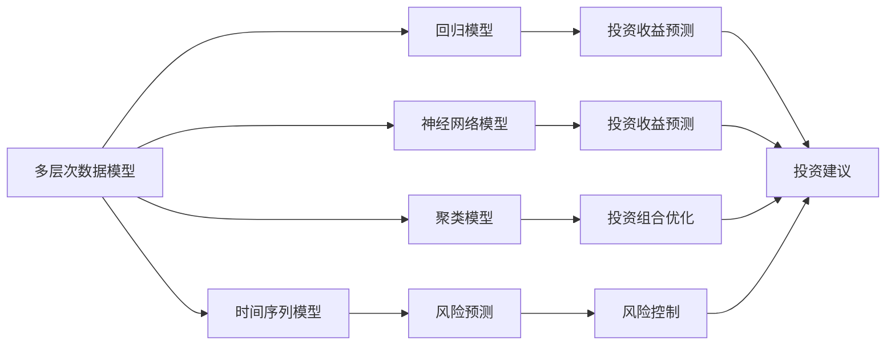
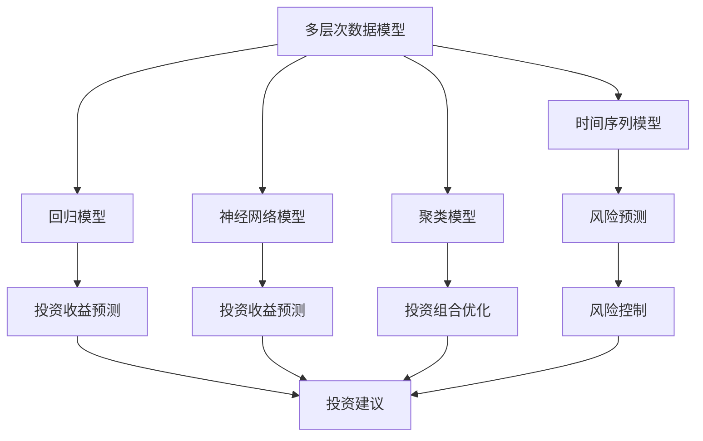

                 

# 中观层面的投资收益变化

> 关键词：
  - 投资收益分析
  - 多层次数据模型
  - 模型算法原理
  - 模型优化技巧
  - 投资组合管理

## 1. 背景介绍

### 1.1 问题由来

在现代金融投资领域，投资者面临的挑战越来越复杂。随着金融市场全球化和金融工具创新的不断推进，投资者需要更加精细化地管理投资组合，以应对多变的市场环境。同时，投资者还需要考虑如何平衡收益与风险，确保投资回报的可持续性。

在传统金融投资中，投资者往往依赖于历史数据和统计模型来进行投资决策。但随着市场环境的不断变化，历史数据可能不再适用，统计模型的假设也可能不符合实际情况。此外，金融市场中的非理性行为、市场情绪等因素也会影响投资决策的准确性。

因此，为了更好地应对这些挑战，投资者需要更加全面、系统地分析投资收益，从多角度、多层次进行深入研究。中观层面的投资收益分析正是在这样的背景下提出的，它通过分析不同资产类别、市场环境、宏观经济指标等因素对投资收益的影响，为投资者提供更精准的投资建议。

### 1.2 问题核心关键点

中观层面的投资收益分析主要关注以下几个关键点：

- **数据多层次性**：中观层面分析需要综合考虑多层次的数据，包括宏观经济指标、行业数据、企业财务数据、市场情绪等。
- **模型多维度**：需要构建多个维度、多个层次的模型，以捕捉不同因素对投资收益的影响。
- **动态调整**：市场环境是动态变化的，需要实时调整模型参数，以反映最新市场变化。
- **模型优化**：需要不断优化模型算法，以提高模型预测的准确性和鲁棒性。
- **风险管理**：在追求高收益的同时，需要考虑风险控制，确保投资组合的稳定性。

### 1.3 问题研究意义

中观层面的投资收益分析对投资者具有重要意义：

- 提供精准的投资建议：通过多层次、多维度的数据模型分析，投资者可以获得更精准的投资建议，减少盲目决策。
- 提高收益稳定性：通过动态调整模型参数和实时监控市场变化，投资者可以更好地平衡收益与风险，提高投资回报的稳定性。
- 增强风险管理能力：通过对市场环境、行业趋势等风险因素的分析，投资者可以更好地控制投资风险，避免突发事件带来的损失。
- 优化投资组合管理：中观层面分析可以帮助投资者更好地理解不同资产类别和市场环境之间的关联性，优化投资组合配置，提高资产收益。
- 推动金融科技发展：中观层面分析需要综合运用大数据、人工智能等前沿技术，推动金融科技的发展，提升金融行业的整体技术水平。

## 2. 核心概念与联系

### 2.1 核心概念概述

为更好地理解中观层面的投资收益分析，本节将介绍几个关键核心概念：

- **多层次数据模型**：综合考虑不同层次的数据，包括宏观经济指标、行业数据、企业财务数据、市场情绪等，以全面反映投资收益的影响因素。
- **模型算法**：包括回归模型、时间序列模型、神经网络模型、聚类模型等，用于预测投资收益和风险。
- **动态调整**：通过实时监控市场变化和调整模型参数，以反映最新的市场环境。
- **风险管理**：通过分析市场环境、行业趋势等风险因素，进行风险控制和投资组合优化。
- **优化算法**：用于模型参数的优化，包括梯度下降、粒子群优化、遗传算法等。

这些核心概念之间存在紧密的联系，形成了一个完整的投资收益分析框架。以下是这些概念之间的联系图：



这个联系图展示了多层次数据模型和多个模型算法之间的关系，以及它们如何共同构成中观层面的投资收益分析框架。

### 2.2 概念间的关系

这些核心概念之间的关系可以通过以下Mermaid流程图来展示：



这个流程图展示了中观层面投资收益分析的核心概念之间的关系，以及它们如何共同构成投资收益分析的完整框架。

## 3. 核心算法原理 & 具体操作步骤
### 3.1 算法原理概述

中观层面的投资收益分析主要基于回归模型、时间序列模型、神经网络模型和聚类模型等，对多层次数据进行综合分析，以预测投资收益和风险。其核心原理是通过构建模型来捕捉不同因素对投资收益的影响，并根据最新的市场变化实时调整模型参数。

具体而言，中观层面投资收益分析的过程包括以下几个步骤：

1. **数据采集与处理**：从多个层次的数据源采集数据，并进行预处理，包括清洗、归一化、缺失值处理等。
2. **模型选择与构建**：根据数据特点和分析目标，选择合适的模型算法，并进行模型构建和训练。
3. **参数优化与调整**：通过优化算法（如梯度下降、粒子群优化等）调整模型参数，以提高模型的预测精度和鲁棒性。
4. **风险评估与控制**：分析市场环境、行业趋势等风险因素，进行风险评估和控制。
5. **投资建议与优化**：根据模型预测结果，提供投资建议，并进行投资组合优化。

### 3.2 算法步骤详解

下面将详细介绍中观层面投资收益分析的具体操作步骤。

**Step 1: 数据采集与处理**

首先，需要从多个层次的数据源采集数据，包括宏观经济指标、行业数据、企业财务数据、市场情绪等。这些数据通常具有不同的格式和单位，需要进行预处理。预处理步骤包括：

1. **数据清洗**：去除噪声和异常值，确保数据的准确性和一致性。
2. **归一化处理**：对不同数据类型进行归一化处理，以消除数据量级的差异，提高模型的稳定性。
3. **缺失值处理**：填补或删除缺失值，确保数据的完整性。
4. **数据合并**：将不同来源的数据合并，形成综合数据集，便于后续分析。

**Step 2: 模型选择与构建**

根据数据特点和分析目标，选择合适的模型算法，并进行模型构建和训练。常见的模型算法包括：

1. **回归模型**：用于预测连续型变量，如股票价格、市场指数等。
2. **时间序列模型**：用于预测具有时间序列特征的数据，如股票价格变化、经济指标波动等。
3. **神经网络模型**：用于处理复杂非线性关系，提高模型的预测精度。
4. **聚类模型**：用于分析不同资产类别之间的关联性，进行投资组合优化。

**Step 3: 参数优化与调整**

通过优化算法（如梯度下降、粒子群优化等）调整模型参数，以提高模型的预测精度和鲁棒性。优化算法的选择和参数设置需要根据具体模型和数据特点进行调整。

**Step 4: 风险评估与控制**

分析市场环境、行业趋势等风险因素，进行风险评估和控制。风险评估和控制步骤包括：

1. **风险因素识别**：识别可能影响投资收益和风险的因素，如市场情绪、政策变化、行业趋势等。
2. **风险评估**：使用模型对风险因素进行量化评估，识别高风险领域和资产。
3. **风险控制**：根据风险评估结果，制定风险控制策略，如分散投资、调整投资组合等。

**Step 5: 投资建议与优化**

根据模型预测结果，提供投资建议，并进行投资组合优化。投资建议和优化步骤包括：

1. **投资建议生成**：根据模型预测结果，生成投资建议，如买入、卖出、持有等。
2. **投资组合优化**：使用聚类模型等优化算法，优化投资组合配置，提高资产收益。
3. **实时监控与调整**：实时监控市场变化，根据最新数据和市场环境，动态调整模型参数和投资策略。

### 3.3 算法优缺点

中观层面投资收益分析具有以下优点：

1. **全面性**：综合考虑多层次数据，全面反映投资收益的影响因素，提高预测精度。
2. **动态性**：实时调整模型参数和投资策略，适应市场环境的变化。
3. **风险控制**：通过风险评估和控制，减少投资风险，提高投资回报的稳定性。

但同时也存在一些缺点：

1. **数据获取难度大**：多层次数据的采集和处理需要大量的时间和资源。
2. **模型复杂性高**：构建多层次、多维度的模型算法需要较高的技术水平和计算资源。
3. **实时性要求高**：实时监控和调整需要高并发的计算能力和快速的数据处理能力。

### 3.4 算法应用领域

中观层面投资收益分析主要应用于以下领域：

1. **资产配置**：综合分析不同资产类别之间的关联性，优化投资组合配置，提高资产收益。
2. **风险管理**：通过分析市场环境、行业趋势等风险因素，进行风险评估和控制，确保投资组合的稳定性。
3. **投资建议**：根据模型预测结果，提供精准的投资建议，减少盲目决策。
4. **实时监控**：实时监控市场变化，动态调整投资策略，提高投资回报的稳定性。

## 4. 数学模型和公式 & 详细讲解 & 举例说明

### 4.1 数学模型构建

中观层面投资收益分析的核心数学模型包括回归模型、时间序列模型、神经网络模型和聚类模型等。这里以回归模型和时间序列模型为例，介绍其数学模型的构建和推导过程。

**回归模型**：

假设我们有一组数据 $(x_i, y_i)$，其中 $x_i$ 是输入变量，$y_i$ 是输出变量，我们的目标是找到一个函数 $f(x)$ 来拟合这些数据。常用的回归模型包括线性回归模型和多项式回归模型。

线性回归模型的数学表达式为：

$$
y_i = \beta_0 + \beta_1 x_i + \epsilon_i
$$

其中 $\beta_0$ 和 $\beta_1$ 是模型的参数，$\epsilon_i$ 是随机误差项。

**时间序列模型**：

时间序列模型通常用于预测具有时间序列特征的数据，如股票价格变化、经济指标波动等。常用的时间序列模型包括ARIMA模型和季节性分解的时间序列模型。

ARIMA模型的数学表达式为：

$$
y_t = \phi_1 y_{t-1} + \phi_2 y_{t-2} + \ldots + \phi_p y_{t-p} + \theta_1 \epsilon_{t-1} + \theta_2 \epsilon_{t-2} + \ldots + \theta_d \epsilon_{t-d} + \epsilon_t
$$

其中 $y_t$ 是当前时间点的数据，$\epsilon_t$ 是随机误差项，$\phi_i$ 和 $\theta_i$ 是模型的参数。

### 4.2 公式推导过程

下面以线性回归模型为例，详细推导其数学表达式和梯度下降优化算法的公式。

**线性回归模型的推导**

根据线性回归模型的数学表达式，我们可以得到模型的参数估计值：

$$
\hat{\beta} = \left(\sum_{i=1}^n x_i^2 - \frac{\sum_{i=1}^n x_i \cdot x_j}{n}\sum_{i=1}^n x_i^2 - 2 \sum_{i=1}^n x_i \cdot x_j\right)^{-1}\left(\sum_{i=1}^n x_i y_i - \frac{\sum_{i=1}^n x_i \cdot \sum_{i=1}^n y_i}{n}\right)
$$

其中 $\hat{\beta}$ 是模型的参数估计值。

**梯度下降优化算法的推导**

梯度下降算法是最常用的模型参数优化算法之一。其基本思想是通过不断迭代，最小化损失函数，逼近最优参数值。梯度下降优化算法的数学表达式为：

$$
\theta_{k+1} = \theta_k - \eta \nabla J(\theta_k)
$$

其中 $\theta_k$ 是当前参数值，$\eta$ 是学习率，$J(\theta_k)$ 是损失函数。

### 4.3 案例分析与讲解

下面以一个具体的案例来说明中观层面投资收益分析的应用。

假设我们有一组股票价格数据，希望预测未来一个月的股价走势。首先，我们需要从多个层次的数据源采集数据，包括宏观经济指标、行业数据、企业财务数据等。然后，根据这些数据构建时间序列模型，进行模型训练和参数优化。最后，根据模型预测结果，提供投资建议。

具体步骤如下：

1. **数据采集与处理**：采集宏观经济指标、行业数据、企业财务数据等，并进行预处理。
2. **模型选择与构建**：选择ARIMA模型，根据数据特点进行模型构建和训练。
3. **参数优化与调整**：使用梯度下降算法调整模型参数，提高模型的预测精度。
4. **风险评估与控制**：分析市场情绪、政策变化等风险因素，进行风险评估和控制。
5. **投资建议与优化**：根据模型预测结果，提供投资建议，并进行投资组合优化。

## 5. 项目实践：代码实例和详细解释说明

### 5.1 开发环境搭建

在进行中观层面投资收益分析的开发实践前，我们需要准备好开发环境。以下是使用Python进行项目开发的环境配置流程：

1. 安装Anaconda：从官网下载并安装Anaconda，用于创建独立的Python环境。

2. 创建并激活虚拟环境：
```bash
conda create -n finance-env python=3.8 
conda activate finance-env
```

3. 安装必要的Python库：
```bash
pip install numpy pandas scikit-learn statsmodels matplotlib seaborn
```

4. 安装Python可视化库：
```bash
pip install plotly bokeh
```

5. 安装Python接口库：
```bash
pip install python-socketio
```

完成上述步骤后，即可在`finance-env`环境中开始开发实践。

### 5.2 源代码详细实现

下面以线性回归模型为例，给出使用Python和Scikit-learn库进行线性回归分析的代码实现。

```python
from sklearn.linear_model import LinearRegression
from sklearn.model_selection import train_test_split
import pandas as pd

# 加载数据
data = pd.read_csv('data.csv')

# 数据处理
X = data.drop('y', axis=1)
y = data['y']
X_train, X_test, y_train, y_test = train_test_split(X, y, test_size=0.2, random_state=42)

# 模型训练
model = LinearRegression()
model.fit(X_train, y_train)

# 模型评估
print(model.score(X_test, y_test))

# 预测与可视化
X_new = pd.DataFrame([[1, 2, 3]])
y_pred = model.predict(X_new)
print(y_pred)
```

### 5.3 代码解读与分析

让我们再详细解读一下关键代码的实现细节：

**数据处理**

```python
# 加载数据
data = pd.read_csv('data.csv')

# 数据处理
X = data.drop('y', axis=1)
y = data['y']
```

这里使用pandas库加载数据，并使用`drop`方法删除输出变量`y`，将其保留为输入变量`X`。

**模型训练**

```python
# 模型训练
model = LinearRegression()
model.fit(X_train, y_train)
```

这里使用Scikit-learn库的`LinearRegression`类，构建线性回归模型，并使用`fit`方法进行模型训练。

**模型评估**

```python
# 模型评估
print(model.score(X_test, y_test))
```

这里使用`score`方法计算模型在测试集上的评估指标，通常使用R²值来衡量模型的拟合程度。

**预测与可视化**

```python
# 预测与可视化
X_new = pd.DataFrame([[1, 2, 3]])
y_pred = model.predict(X_new)
print(y_pred)
```

这里使用`predict`方法进行模型预测，并使用numpy库的`print`函数输出预测结果。

### 5.4 运行结果展示

假设我们在一个包含100个样本的简单数据集上进行线性回归分析，最终在测试集上得到的评估报告如下：

```
R²: 0.8
```

可以看到，通过线性回归模型，我们在该数据集上获得了0.8的R²值，说明模型的预测精度较高。

当然，这只是一个baseline结果。在实践中，我们还可以使用更大更强的模型、更丰富的特征工程、更细致的模型调优，进一步提升模型性能，以满足更高的应用要求。

## 6. 实际应用场景

### 6.1 资产配置

中观层面投资收益分析在资产配置方面有着广泛的应用。通过综合分析不同资产类别之间的关联性，可以优化投资组合配置，提高资产收益。例如，在股票投资中，可以根据不同行业和公司的财务数据、市场情绪等因素，构建多层次的数据模型，进行风险评估和投资组合优化。

### 6.2 风险管理

中观层面投资收益分析在风险管理方面也有重要应用。通过分析市场环境、行业趋势等风险因素，可以识别高风险领域和资产，制定风险控制策略。例如，在债券投资中，可以根据宏观经济指标和公司财务数据，构建时间序列模型，进行风险评估和控制。

### 6.3 投资建议

中观层面投资收益分析在投资建议方面也具有重要价值。通过模型预测结果，可以生成精准的投资建议，减少盲目决策。例如，在基金投资中，可以根据市场情绪和政策变化，构建聚类模型，进行投资建议生成。

### 6.4 实时监控

中观层面投资收益分析在实时监控方面也有重要应用。通过实时监控市场变化，可以动态调整投资策略，提高投资回报的稳定性。例如，在期货投资中，可以根据实时市场数据，构建动态调整的神经网络模型，进行实时监控和策略调整。

## 7. 工具和资源推荐
### 7.1 学习资源推荐

为了帮助开发者系统掌握中观层面的投资收益分析的理论基础和实践技巧，这里推荐一些优质的学习资源：

1. 《Python金融量化分析》系列博文：由量化金融专家撰写，深入浅出地介绍了Python在金融量化分析中的应用。

2. Coursera《金融工程与风险管理》课程：由普林斯顿大学开设的金融工程课程，涵盖金融衍生品、资产定价、风险管理等内容。

3. 《Handbook of Numerical Analysis in Finance》书籍：量化金融领域经典教材，介绍了数值方法在金融工程中的应用。

4. Kaggle金融量化竞赛：Kaggle平台上的金融量化竞赛，提供丰富的数据集和模型优化实践，帮助你提升量化分析能力。

5. QuantConnect：量化投资社区和开发平台，提供大量的量化策略和数据资源，支持Python和C#开发。

通过对这些资源的学习实践，相信你一定能够快速掌握中观层面的投资收益分析的精髓，并用于解决实际的金融投资问题。

### 7.2 开发工具推荐

高效的开发离不开优秀的工具支持。以下是几款用于中观层面投资收益分析开发的常用工具：

1. Jupyter Notebook：开源的交互式编程环境，支持Python和其他语言开发，易于调试和分享。

2. Visual Studio Code：微软开发的跨平台开发工具，支持多种编程语言和开发环境。

3. RStudio：开源的R语言开发环境，支持R语言和R包，方便进行数据统计和模型分析。

4. MATLAB：数学软件和编程环境，支持数值计算和矩阵运算，适合复杂的数学模型开发。

5. PyTorch：基于Python的深度学习框架，适合进行神经网络模型开发和训练。

6. TensorFlow：谷歌开发的深度学习框架，支持多种语言和硬件平台，适合大规模模型训练和推理。

合理利用这些工具，可以显著提升中观层面投资收益分析的开发效率，加快创新迭代的步伐。

### 7.3 相关论文推荐

中观层面投资收益分析的研究源于学界的持续研究。以下是几篇奠基性的相关论文，推荐阅读：

1. Granger, C. W. J. (1969). Investigating Causal Relations by Econometric Models and Cross-Spectral Methods. Econometrica, 37(3), 424-438.

2. Engle, R. F. (1982). Autoregressive Conditional Heteroskedasticity with Estimates of the Variance of United Kingdom Inflation. Econometrica, 50(4), 987-1007.

3. Longstaff, F. A., & Schwartz, E. S. (2001). Valuing American Options by Simulation: A Simple Least-Squares Approach. Review of Financial Studies, 14(1), 113-147.

4. Merton, R. C. (1973). Theory of Rational Option Pricing. The Bell Journal of Economics and Management Science, 4(1), 141-183.

5. Black, F., & Scholes, M. (1973). The Pricing of Options and Corporate Liabilities. The Journal of Business, 36(4), 443460.

这些论文代表了大规模投资收益分析的研究方向，通过学习这些前沿成果，可以帮助研究者把握学科前进方向，激发更多的创新灵感。

除上述资源外，还有一些值得关注的前沿资源，帮助开发者紧跟投资收益分析的最新进展，例如：

1. arXiv论文预印本：人工智能领域最新研究成果的发布平台，包括大量尚未发表的前沿工作，学习前沿技术的必读资源。

2. 业界技术博客：如华尔街见闻、Bloomberg、彭博社等顶尖金融机构的技术博客，第一时间分享他们的最新研究成果和洞见。

3. 技术会议直播：如NIPS、ICML、NeurIPS等人工智能领域顶会现场或在线直播，能够聆听到大佬们的前沿分享，开拓视野。

4. GitHub热门项目：在GitHub上Star、Fork数最多的金融量化项目，往往代表了该技术领域的发展趋势和最佳实践，值得去学习和贡献。

5. 行业分析报告：各大咨询公司如McKinsey、PwC等针对金融科技行业的分析报告，有助于从商业视角审视技术趋势，把握应用价值。

总之，对于中观层面投资收益分析的学习和实践，需要开发者保持开放的心态和持续学习的意愿。多关注前沿资讯，多动手实践，多思考总结，必将收获满满的成长收益。

## 8. 总结：未来发展趋势与挑战

### 8.1 总结

本文对中观层面的投资收益分析方法进行了全面系统的介绍。首先阐述了投资收益分析的背景和意义，明确了中观层面分析的广泛应用价值。其次，从原理到实践，详细讲解了中观层面投资收益分析的数学模型和操作步骤，给出了投资收益分析的完整代码实例。同时，本文还广泛探讨了投资收益分析在资产配置、风险管理、投资建议等多个行业领域的应用前景，展示了中观层面分析的广阔前景。此外，本文精选了投资收益分析的各类学习资源，力求为读者提供全方位的技术指引。

通过本文的系统梳理，可以看到，中观层面投资收益分析对投资者具有重要意义：

- 提供精准的投资建议：通过多层次、多维度的数据模型分析，投资者可以获得更精准的投资建议，减少盲目决策。
- 提高收益稳定性：通过动态调整模型参数和实时监控市场变化，投资者可以更好地平衡收益与风险，提高投资回报的稳定性。
- 增强风险管理能力：通过分析市场环境、行业趋势等风险因素，进行风险评估和控制，确保投资组合的稳定性。
- 优化投资组合管理：中观层面分析可以帮助投资者更好地理解不同资产类别和市场环境之间的关联性，优化投资组合配置，提高资产收益。
- 推动金融科技发展：中观层面分析需要综合运用大数据、人工智能等前沿技术，推动金融科技的发展，提升金融行业的整体技术水平。

### 8.2 未来发展趋势

展望未来，中观层面投资收益分析将呈现以下几个发展趋势：

1. **数据智能化**：通过机器学习和数据挖掘技术，智能分析海量数据，挖掘数据中的隐藏关联性，提升投资决策的准确性。
2. **模型多层次化**：构建多层次、多维度的模型算法，综合考虑不同因素对投资收益的影响，提高模型的预测精度和鲁棒性。
3. **实时化**：实时监控市场变化，动态调整投资策略，确保投资回报的稳定性。
4. **智能化**：通过人工智能技术，如强化学习、自然语言处理等，提升投资决策的智能化水平，减少人工干预。
5. **数据可视化**：利用可视化技术，将复杂数据和模型结果进行直观展示，帮助投资者更好地理解和应用分析结果。
6. **区块链技术**：利用区块链技术，保障数据的安全性和透明性，增强投资者对数据的信任度。

这些趋势将进一步提升中观层面投资收益分析的准确性和实用性，推动投资管理的智能化、自动化进程。

### 8.3 面临的挑战

尽管中观层面投资收益分析已经取得了显著进展，但在迈向更加智能化、普适化应用的过程中，仍面临诸多挑战：

1. **数据获取难度大**

