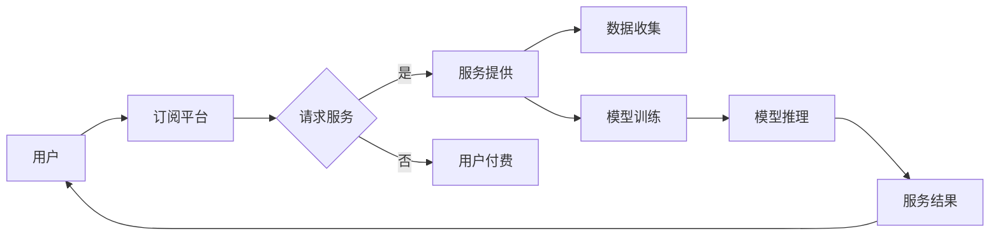

# AI 大模型原理与应用：订阅商业模式

> 关键词：AI 大模型，订阅模式，商业模式，自然语言处理，机器学习，服务化，SaaS

## 1. 背景介绍

随着人工智能技术的快速发展，AI 大模型（Large AI Models）逐渐成为推动产业变革的重要力量。大模型在自然语言处理、图像识别、语音识别等领域展现出惊人的能力，为各行各业提供了新的解决方案。然而，如何将 AI 大模型的应用成本降到最低，实现规模化商业落地，成为了企业关注的焦点。本文将探讨 AI 大模型的原理、应用，并重点分析其订阅商业模式的可行性。

### 1.1 AI 大模型的兴起

近年来，随着计算能力的提升、大数据的积累和深度学习技术的进步，AI 大模型开始崭露头角。这些模型通常在数十亿甚至上千亿参数级别，能够处理复杂任务，并在各种基准测试中取得优异的成绩。例如，BERT、GPT-3、LaMDA 等模型在自然语言处理领域取得了突破性进展。

### 1.2 AI 大模型的应用挑战

尽管 AI 大模型具有强大的能力，但在实际应用中仍面临诸多挑战：

- **计算资源消耗**：训练和推理大模型需要大量的计算资源，对于中小企业而言，高昂的成本是难以承受的。
- **数据隐私**：大模型在训练过程中需要大量数据，如何保障用户数据隐私成为一大难题。
- **定制化需求**：不同行业和企业的需求各异，如何根据用户需求进行定制化开发是另一挑战。

### 1.3 订阅商业模式的兴起

面对上述挑战，订阅商业模式逐渐成为 AI 大模型应用的新趋势。通过订阅模式，企业可以按需获取 AI 大模型服务，降低使用成本，并享受到持续的技术更新和个性化服务。

## 2. 核心概念与联系

### 2.1 核心概念原理和架构的 Mermaid 流程图



### 2.2 核心概念

- **AI 大模型**：一种规模庞大、参数数量多的神经网络模型，能够处理复杂任务，如自然语言处理、图像识别等。
- **订阅平台**：为企业提供 AI 大模型服务的平台，负责模型训练、推理、部署等环节。
- **用户**：使用 AI 大模型服务的个人或企业。
- **服务请求**：用户向订阅平台发送的服务请求，如文本分类、情感分析等。
- **数据收集**：订阅平台收集用户数据，用于模型训练和优化。
- **模型训练**：订阅平台使用用户数据训练 AI 大模型，提高模型性能。
- **模型推理**：订阅平台使用训练好的模型对用户请求进行推理，生成服务结果。
- **服务结果**：订阅平台返回给用户的服务结果，如文本分类结果、图像识别结果等。

## 3. 核心算法原理 & 具体操作步骤

### 3.1 算法原理概述

AI 大模型的算法原理主要基于深度学习技术，包括以下步骤：

1. 数据预处理：对原始数据进行清洗、标准化等处理，为模型训练提供高质量的数据。
2. 模型选择：选择合适的模型架构，如 Transformer、CNN 等。
3. 模型训练：使用标注数据训练模型，调整模型参数，提高模型性能。
4. 模型评估：使用测试数据评估模型性能，确保模型满足应用要求。
5. 模型部署：将训练好的模型部署到订阅平台，提供在线服务。

### 3.2 算法步骤详解

1. **数据预处理**：包括数据清洗、去除噪声、文本分词、数据标注等步骤。
2. **模型选择**：根据任务需求选择合适的模型架构，如 BERT、GPT-3、ResNet 等。
3. **模型训练**：使用标注数据训练模型，通过反向传播算法调整模型参数。
4. **模型评估**：使用测试数据评估模型性能，包括准确率、召回率、F1 值等指标。
5. **模型部署**：将训练好的模型部署到订阅平台，提供在线服务。

### 3.3 算法优缺点

**优点**：

- **泛化能力强**：大模型在训练过程中学习到丰富的知识，能够处理各种复杂任务。
- **易于部署**：大模型通常采用标准化框架，易于部署和扩展。

**缺点**：

- **计算资源消耗大**：训练和推理大模型需要大量的计算资源。
- **数据隐私问题**：大模型在训练过程中需要大量数据，如何保障用户数据隐私成为一大难题。

### 3.4 算法应用领域

AI 大模型的应用领域非常广泛，包括：

- **自然语言处理**：文本分类、情感分析、机器翻译、问答系统等。
- **计算机视觉**：图像识别、目标检测、图像生成等。
- **语音识别**：语音合成、语音识别、语音翻译等。

## 4. 数学模型和公式 & 详细讲解 & 举例说明

### 4.1 数学模型构建

AI 大模型通常采用神经网络作为数学模型，包括以下部分：

- **输入层**：接收输入数据，如文本、图像等。
- **隐藏层**：对输入数据进行特征提取和变换。
- **输出层**：生成输出结果，如分类标签、概率分布等。

### 4.2 公式推导过程

以下以 BERT 模型为例，简要介绍其数学模型：

- **编码器**：采用 Transformer 架构，公式如下：

$$
\text{Enc}(\mathbf{x}) = \text{Multi-Head Attention}(\text{Enc}(\mathbf{x}), \text{Enc}(\mathbf{x}), \text{Enc}(\mathbf{x})) 
$$

- **解码器**：采用 Transformer 架构，公式如下：

$$
\text{Dec}(\mathbf{y}) = \text{Multi-Head Attention}(\text{Dec}(\mathbf{y}), \text{Dec}(\mathbf{y}), \text{Enc}(\mathbf{x})) 
$$

### 4.3 案例分析与讲解

以文本分类任务为例，分析 AI 大模型的微调过程：

1. **数据预处理**：对文本数据进行清洗、分词等处理。
2. **模型选择**：选择预训练的 BERT 模型作为基础模型。
3. **模型微调**：在预训练模型的基础上，添加分类层，并使用标注数据进行微调。
4. **模型评估**：使用测试数据评估模型性能，如准确率、召回率、F1 值等。

## 5. 项目实践：代码实例和详细解释说明

### 5.1 开发环境搭建

以下是使用 Python 和 Hugging Face Transformers 库实现 AI 大模型订阅平台的示例代码：

```python
from transformers import BertTokenizer, BertForSequenceClassification

# 加载预训练模型和分词器
model = BertForSequenceClassification.from_pretrained('bert-base-uncased')
tokenizer = BertTokenizer.from_pretrained('bert-base-uncased')

# 定义服务端点
from flask import Flask, request, jsonify
app = Flask(__name__)

@app.route('/classify', methods=['POST'])
def classify():
    # 获取输入文本
    text = request.json.get('text')
    # 编码文本
    inputs = tokenizer(text, return_tensors='pt', padding=True, truncation=True)
    # 模型推理
    with torch.no_grad():
        logits = model(**inputs).logits
    # 获取分类结果
    predictions = logits.argmax(-1).tolist()
    return jsonify({'predictions': predictions})

if __name__ == '__main__':
    app.run(host='0.0.0.0', port=5000)
```

### 5.2 源代码详细实现

上述代码展示了使用 Python 和 Hugging Face Transformers 库实现 AI 大模型订阅平台的基本流程：

1. **加载预训练模型和分词器**：从 Hugging Face Hub 加载预训练的 BERT 模型和分词器。
2. **定义服务端点**：使用 Flask 框架定义一个 RESTful API，用于接收用户输入的文本，并返回分类结果。
3. **模型推理**：使用加载的模型对用户输入的文本进行推理，得到分类结果。
4. **返回结果**：将分类结果返回给用户。

### 5.3 代码解读与分析

上述代码展示了如何快速搭建一个简单的 AI 大模型订阅平台：

- **预训练模型**：使用预训练的 BERT 模型作为基础，能够处理各种文本分类任务。
- **服务端点**：使用 Flask 框架定义 RESTful API，方便用户通过 HTTP 请求获取模型服务。
- **模型推理**：使用预训练模型对用户输入的文本进行推理，得到分类结果。

## 6. 实际应用场景

### 6.1 智能客服

通过订阅 AI 大模型服务，企业可以构建智能客服系统，实现自动回答客户咨询、处理投诉等功能。

### 6.2 内容审核

AI 大模型可以用于自动审核网络内容，如评论、文章等，帮助平台及时清除违法违规内容。

### 6.3 个性化推荐

AI 大模型可以用于分析用户行为，为用户提供个性化推荐，如新闻、电影、音乐等。

## 7. 工具和资源推荐

### 7.1 学习资源推荐

- 《深度学习》
- 《Python深度学习》
- 《Hugging Face Transformers》

### 7.2 开发工具推荐

- Python
- PyTorch
- Hugging Face Transformers

### 7.3 相关论文推荐

- BERT: Pre-training of Deep Bidirectional Transformers for Language Understanding
- GPT-3: Language Models are Few-Shot Learners
- Transformer: Attention is All You Need

## 8. 总结：未来发展趋势与挑战

### 8.1 研究成果总结

本文介绍了 AI 大模型的原理、应用和订阅商业模式，分析了其优势和挑战。通过订阅模式，企业可以降低 AI 大模型的应用成本，实现规模化商业落地。

### 8.2 未来发展趋势

- **模型小型化**：开发轻量级 AI 大模型，降低计算资源消耗。
- **模型可解释性**：提高 AI 大模型的可解释性，增强用户信任。
- **个性化服务**：根据用户需求提供定制化 AI 大模型服务。

### 8.3 面临的挑战

- **数据隐私**：如何保障用户数据隐私是 AI 大模型应用的重要挑战。
- **模型可解释性**：提高 AI 大模型的可解释性，增强用户信任。
- **技术门槛**：AI 大模型技术门槛较高，需要培养更多专业人才。

### 8.4 研究展望

AI 大模型订阅商业模式具有广阔的应用前景，未来将在更多领域得到应用，推动产业智能化进程。

## 9. 附录：常见问题与解答

**Q1：AI 大模型订阅模式的成本如何？**

A：AI 大模型订阅模式成本取决于模型规模、服务内容等因素。一般来说，成本相对较低，且可按需付费，降低了企业的使用门槛。

**Q2：AI 大模型订阅模式是否安全可靠？**

A：AI 大模型订阅模式采用数据加密、访问控制等措施保障用户数据安全。同时，平台会定期更新模型，确保模型安全可靠。

**Q3：如何选择合适的 AI 大模型订阅平台？**

A：选择 AI 大模型订阅平台时，需要考虑以下因素：

- 模型性能：评估平台提供的模型性能是否满足需求。
- 服务质量：了解平台的技术支持和售后服务。
- 成本效益：比较不同平台的成本和性价比。

作者：禅与计算机程序设计艺术 / Zen and the Art of Computer Programming