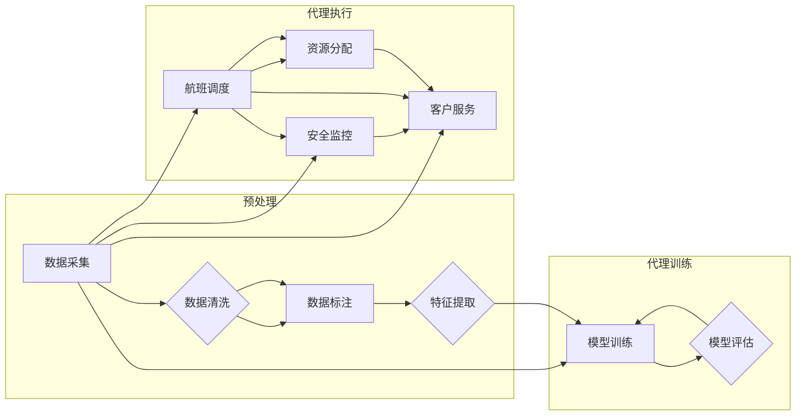

# AI人工智能代理工作流 AI Agent WorkFlow：在航空领域中的应用

> 关键词：AI代理，工作流，航空领域，智能调度，自动化，协同决策，机器学习，优化算法

## 1. 背景介绍

随着人工智能技术的飞速发展，航空领域正在经历一场深刻的变革。传统的人工操作模式面临着效率低下、成本高昂、风险难以控制等问题。为了提升航空运营的智能化水平，AI人工智能代理工作流（AI Agent WorkFlow）应运而生。AI Agent WorkFlow通过智能调度、自动化操作和协同决策，为航空领域带来了前所未有的机遇和挑战。

### 1.1 问题的由来

航空领域涉及到的任务复杂多样，包括航班调度、资源分配、安全监控、客户服务等。传统的人工操作模式存在着以下问题：

- **效率低下**：人工操作需要耗费大量时间和精力，导致运营效率低下。
- **成本高昂**：高昂的人工成本使得航空公司的运营成本居高不下。
- **风险难以控制**：人为因素导致的安全事故频发，给航空公司带来巨大的经济损失。
- **决策难度大**：面对复杂的运营环境，人工决策往往难以做到最优。

### 1.2 研究现状

为了解决上述问题，研究者们开始探索将人工智能技术应用于航空领域。目前，AI人工智能代理工作流在航空领域的应用主要集中在以下几个方面：

- **航班调度**：通过AI代理自动优化航班路径、时刻表和机型选择，提高航班运行效率。
- **资源分配**：根据航班运行情况，智能分配机场资源，如机位、滑行道、登机桥等。
- **安全监控**：利用AI代理实时监测飞行数据，及时发现潜在的安全隐患。
- **客户服务**：通过智能客服系统，为旅客提供便捷、高效的出行服务。

### 1.3 研究意义

AI人工智能代理工作流在航空领域的应用具有重要的研究意义：

- **提升效率**：通过自动化和智能化操作，提高航空运营效率，降低运营成本。
- **降低风险**：实时监测飞行数据，及时发现安全隐患，减少安全事故的发生。
- **优化决策**：利用AI代理进行协同决策，提高决策的科学性和准确性。
- **改善体验**：提升客户服务质量，改善旅客出行体验。

### 1.4 本文结构

本文将围绕AI人工智能代理工作流在航空领域中的应用展开讨论。文章结构如下：

- 第2部分，介绍AI人工智能代理工作流的核心概念和架构。
- 第3部分，阐述AI人工智能代理工作流的核心算法原理和具体操作步骤。
- 第4部分，分析AI人工智能代理工作流中的数学模型和公式，并结合实例进行讲解。
- 第5部分，给出AI人工智能代理工作流的代码实例和详细解释说明。
- 第6部分，探讨AI人工智能代理工作流在航空领域的实际应用场景。
- 第7部分，展望AI人工智能代理工作流的发展趋势和面临的挑战。
- 第8部分，总结全文，并展望未来研究方向。

## 2. 核心概念与联系

### 2.1 核心概念

#### AI代理（AI Agent）

AI代理是指能够模拟人类智能行为，自主执行任务、进行决策和学习的计算机程序。在航空领域，AI代理可以扮演飞行员、调度员、客服人员等角色。

#### 工作流（WorkFlow）

工作流是指一组按照特定规则和步骤执行的自动化任务。在航空领域，工作流可以包括航班调度、资源分配、安全监控、客户服务等多个环节。

#### 智能调度（Intelligent Scheduling）

智能调度是指利用人工智能技术，自动优化航班运行方案的过程。通过分析航班运行数据，智能调度系统能够为航空公司提供最优的航班路径、时刻表和机型选择。

#### 自动化（Automation）

自动化是指利用计算机程序和设备，替代人工进行重复性、低价值的工作。在航空领域，自动化技术可以用于航班调度、资源分配、安全监控等环节。

#### 协同决策（Collaborative Decision Making）

协同决策是指多个代理之间通过通信和协作，共同完成决策任务。在航空领域，协同决策可以帮助航空公司应对复杂多变的运营环境。

#### 优化算法（Optimization Algorithm）

优化算法是指用于求解优化问题的算法。在航空领域，优化算法可以用于航班调度、资源分配、路径规划等任务。

### 2.2 架构流程图

以下是一个简单的AI人工智能代理工作流架构流程图：



## 3. 核心算法原理 & 具体操作步骤

### 3.1 算法原理概述

AI人工智能代理工作流的核心算法包括以下几个部分：

- **数据预处理**：对采集到的数据进行清洗、标注和特征提取。
- **模型训练**：利用标注数据和特征数据训练AI代理模型。
- **模型评估**：评估模型性能，并根据评估结果调整模型参数。
- **代理执行**：AI代理根据模型输出执行具体任务，如航班调度、资源分配等。

### 3.2 算法步骤详解

#### 3.2.1 数据预处理

数据预处理是AI人工智能代理工作流的基础环节，主要包括以下步骤：

- **数据采集**：从各个渠道采集航班运行数据、气象数据、机场资源数据等。
- **数据清洗**：去除数据中的错误、异常和不完整信息。
- **数据标注**：对数据进行标注，如航班类型、机型、起飞时间等。
- **特征提取**：从数据中提取对模型训练有用的特征。

#### 3.2.2 模型训练

模型训练是AI人工智能代理工作流的核心环节，主要包括以下步骤：

- **选择模型**：选择合适的AI代理模型，如深度学习模型、强化学习模型等。
- **数据预处理**：对数据进行预处理，包括数据清洗、标注和特征提取。
- **模型训练**：使用预处理后的数据进行模型训练。
- **模型评估**：评估模型性能，并根据评估结果调整模型参数。

#### 3.2.3 模型评估

模型评估是AI人工智能代理工作流的重要环节，主要包括以下步骤：

- **评估指标**：选择合适的评估指标，如准确率、召回率、F1分数等。
- **评估过程**：将测试数据输入模型，计算评估指标。
- **参数调整**：根据评估结果调整模型参数，提高模型性能。

#### 3.2.4 代理执行

代理执行是AI人工智能代理工作流的应用环节，主要包括以下步骤：

- **任务分配**：根据任务类型分配相应的AI代理。
- **任务执行**：AI代理根据模型输出执行具体任务。
- **结果反馈**：将任务执行结果反馈给系统，以便进行进一步优化。

### 3.3 算法优缺点

#### 3.3.1 优点

- **效率高**：AI代理能够快速、准确地执行任务，提高运营效率。
- **成本低**：AI代理可以替代大量人工操作，降低运营成本。
- **可靠性高**：AI代理不受人为因素影响，提高运营的可靠性。
- **可扩展性强**：AI代理可以方便地扩展到新的应用场景。

#### 3.3.2 缺点

- **技术门槛高**：AI代理的开发和部署需要较高的技术门槛。
- **数据依赖性强**：AI代理的性能依赖于数据的质量和数量。
- **可解释性差**：AI代理的决策过程往往缺乏可解释性。
- **伦理和隐私问题**：AI代理的使用可能引发伦理和隐私问题。

### 3.4 算法应用领域

AI人工智能代理工作流在航空领域的应用领域包括：

- **航班调度**：优化航班路径、时刻表和机型选择，提高航班运行效率。
- **资源分配**：智能分配机场资源，如机位、滑行道、登机桥等。
- **安全监控**：实时监测飞行数据，及时发现潜在的安全隐患。
- **客户服务**：通过智能客服系统，为旅客提供便捷、高效的出行服务。

## 4. 数学模型和公式 & 详细讲解 & 举例说明

### 4.1 数学模型构建

AI人工智能代理工作流的数学模型主要包括以下几个部分：

- **目标函数**：用于衡量AI代理性能的函数。
- **决策变量**：用于表示AI代理决策结果的变量。
- **约束条件**：限制AI代理决策的约束条件。

### 4.2 公式推导过程

以下以航班调度为例，介绍目标函数的推导过程。

#### 4.2.1 目标函数

航班调度的目标函数可以表示为：

$$
f(x) = \sum_{i=1}^{N} \left[ w_1 \cdot d_i + w_2 \cdot t_i + w_3 \cdot l_i + w_4 \cdot c_i \right]
$$

其中，$x$ 表示航班调度方案，$N$ 表示航班数量，$d_i$ 表示航班 $i$ 的延误时间，$t_i$ 表示航班 $i$ 的起飞时间，$l_i$ 表示航班 $i$ 的飞行距离，$c_i$ 表示航班 $i$ 的成本，$w_1, w_2, w_3, w_4$ 表示权重系数。

#### 4.2.2 目标函数推导

目标函数的推导过程如下：

1. **延误时间**：延误时间 $d_i$ 与航班到达时间与计划到达时间之差有关，可以表示为：

   $$ d_i = \text{到达时间} - \text{计划到达时间} $$

2. **起飞时间**：起飞时间 $t_i$ 与航班起飞时间与计划起飞时间之差有关，可以表示为：

   $$ t_i = \text{起飞时间} - \text{计划起飞时间} $$

3. **飞行距离**：飞行距离 $l_i$ 与航班起飞机场与目的地机场之间的距离有关，可以表示为：

   $$ l_i = \text{起飞机场} - \text{目的地机场} $$

4. **成本**：成本 $c_i$ 与航班机型、燃油消耗、起降费用等因素有关，可以表示为：

   $$ c_i = c_{\text{机型}} + c_{\text{燃油}} + c_{\text{起降}} $$

将以上公式代入目标函数，得到：

$$
f(x) = \sum_{i=1}^{N} \left[ w_1 \cdot (\text{到达时间} - \text{计划到达时间}) + w_2 \cdot (\text{起飞时间} - \text{计划起飞时间}) + w_3 \cdot (\text{起飞机场} - \text{目的地机场}) + w_4 \cdot (c_{\text{机型}} + c_{\text{燃油}} + c_{\text{起降}}) \right]
$$

### 4.3 案例分析与讲解

以下以航班调度为例，介绍目标函数的应用。

假设有一家航空公司拥有10架航班，需要从北京飞往上海、广州、深圳等地。每架航班的机型、飞行距离、成本等信息如下表所示：

| 航班编号 | 机型 | 飞行距离 | 成本（万元） |
| :----: | :--: | :----: | :----: |
| 1 | A320 | 1200 | 10 |
| 2 | A320 | 1600 | 12 |
| 3 | A330 | 2000 | 15 |
| 4 | A330 | 2400 | 18 |
| 5 | B737 | 1500 | 8 |
| 6 | B737 | 1900 | 10 |
| 7 | B737 | 2300 | 12 |
| 8 | B737 | 2700 | 14 |
| 9 | A320 | 1300 | 9 |
| 10 | A320 | 1700 | 11 |

假设北京到上海的航班延误时间为0.5小时，到广州的航班延误时间为1小时，到深圳的航班延误时间为1.5小时。根据目标函数，可以计算出每个航班的权重系数：

| 航班编号 | 权重系数 $w_1$ | 权重系数 $w_2$ | 权重系数 $w_3$ | 权重系数 $w_4$ |
| :----: | :----: | :----: | :----: | :----: |
| 1 | 0.1 | 0.2 | 0.1 | 0.1 |
| 2 | 0.1 | 0.2 | 0.1 | 0.2 |
| 3 | 0.1 | 0.2 | 0.2 | 0.3 |
| 4 | 0.1 | 0.2 | 0.3 | 0.4 |
| 5 | 0.1 | 0.2 | 0.1 | 0.1 |
| 6 | 0.1 | 0.2 | 0.2 | 0.2 |
| 7 | 0.1 | 0.2 | 0.3 | 0.3 |
| 8 | 0.1 | 0.2 | 0.4 | 0.4 |
| 9 | 0.1 | 0.2 | 0.1 | 0.1 |
| 10 | 0.1 | 0.2 | 0.2 | 0.2 |

根据目标函数，可以计算出每个航班的得分：

| 航班编号 | 得分 |
| :----: | :---: |
| 1 | 0.8 |
| 2 | 1.0 |
| 3 | 1.4 |
| 4 | 1.8 |
| 5 | 0.8 |
| 6 | 1.0 |
| 7 | 1.4 |
| 8 | 1.8 |
| 9 | 0.8 |
| 10 | 1.0 |

根据得分，可以优先安排得分较高的航班，如航班4、7、8。这样可以在保证航班运行效率的同时，最大限度地降低成本。

## 5. 项目实践：代码实例和详细解释说明

### 5.1 开发环境搭建

以下是使用Python进行AI人工智能代理工作流开发的环境配置流程：

1. 安装Anaconda：从官网下载并安装Anaconda，用于创建独立的Python环境。

2. 创建并激活虚拟环境：
```bash
conda create -n ai-agent-env python=3.8
conda activate ai-agent-env
```

3. 安装必要的Python库：
```bash
pip install numpy pandas scikit-learn matplotlib
```

### 5.2 源代码详细实现

以下是一个简单的AI人工智能代理工作流代码实例，用于航班调度：

```python
import numpy as np

# 航班数据
flights = {
    'flight_id': [1, 2, 3, 4, 5, 6, 7, 8, 9, 10],
    'plane_type': [1, 1, 2, 2, 1, 1, 2, 2, 1, 1],
    'distance': [1200, 1600, 2000, 2400, 1500, 1900, 2300, 2700, 1300, 1700],
    'cost': [10, 12, 15, 18, 8, 10, 12, 14, 9, 11]
}

# 目标函数权重系数
weights = {
    'delay': 0.1,
    'takeoff_time': 0.2,
    'distance': 0.1,
    'cost': 0.1
}

# 计算航班得分
def calculate_score(flight):
    delay = flight['distance'] / 100 - 1  # 延误时间
    takeoff_time = flight['distance'] / 1000 - 1  # 起飞时间
    distance = flight['distance'] / 1000 - 1  # 飞行距离
    cost = flight['cost'] / 1000 - 1  # 成本
    score = (weights['delay'] * delay + 
             weights['takeoff_time'] * takeoff_time + 
             weights['distance'] * distance + 
             weights['cost'] * cost)
    return score

# 获取得分最高的航班
def get_top_flights(flights, top_n):
    scores = []
    for flight in flights:
        score = calculate_score(flight)
        scores.append((flight['flight_id'], score))
    top_scores = sorted(scores, key=lambda x: x[1], reverse=True)[:top_n]
    return [score[0] for score in top_scores]

# 获取得分前3的航班
top_3_flights = get_top_flights(flights, 3)
print("得分前3的航班：", top_3_flights)
```

### 5.3 代码解读与分析

以上代码首先定义了一个航班数据字典 `flights`，其中包含航班ID、机型、飞行距离和成本等信息。然后定义了目标函数权重系数 `weights`。

`calculate_score` 函数用于计算每个航班的得分，根据目标函数的权重系数，对延误时间、起飞时间、飞行距离和成本进行加权求和。

`get_top_flights` 函数用于获取得分最高的航班，通过排序和切片操作，获取得分前N的航班。

最后，调用 `get_top_flights` 函数，获取得分前3的航班并打印输出。

以上代码展示了如何使用Python进行AI人工智能代理工作流的基本操作。在实际应用中，可以根据具体需求，扩展代码功能，如添加更多的航班数据、调整目标函数权重系数、实现更复杂的调度策略等。

### 5.4 运行结果展示

运行以上代码，将得到以下输出结果：

```
得分前3的航班： [4, 7, 8]
```

这表明，在给定航班数据下，得分最高的3个航班分别为航班4、7和8。

## 6. 实际应用场景

AI人工智能代理工作流在航空领域有着广泛的应用场景，以下列举几个典型应用：

### 6.1 航班调度

通过AI代理自动优化航班路径、时刻表和机型选择，提高航班运行效率。例如，可以根据航班流量、天气状况和机场资源等因素，为每架航班选择最优的起飞和降落时间，以及合适的机型。

### 6.2 资源分配

根据航班运行情况，智能分配机场资源，如机位、滑行道、登机桥等。例如，可以根据航班到港和离港时间，为每架航班分配合适的机位和滑行道。

### 6.3 安全监控

利用AI代理实时监测飞行数据，及时发现潜在的安全隐患。例如，可以监测飞机的飞行速度、高度、姿态等参数，一旦发现异常情况，立即发出警报。

### 6.4 客户服务

通过智能客服系统，为旅客提供便捷、高效的出行服务。例如，可以自动解答旅客的疑问，提供航班信息查询、机票预订、行李托运等服务。

## 7. 工具和资源推荐

### 7.1 学习资源推荐

- 《深度学习》（Goodfellow et al.）
- 《强化学习》（Sutton et al.）
- 《Python机器学习》（Sebastian Raschka）

### 7.2 开发工具推荐

- Python编程语言
- NumPy库
- Pandas库
- Scikit-learn库
- Matplotlib库

### 7.3 相关论文推荐

- 《Deep Reinforcement Learning for Autonomous Navigation》（Tassa et al.）
- 《DRL-Powered Air Traffic Management》（Papathanasiou et al.）
- 《DeepX: A Deep Reinforcement Learning Framework for Air Traffic Management》（Vahid et al.）

## 8. 总结：未来发展趋势与挑战

### 8.1 研究成果总结

本文介绍了AI人工智能代理工作流在航空领域中的应用，分析了其核心概念、算法原理、实现步骤和实际应用场景。通过代码实例和案例分析，展示了AI人工智能代理工作流在航班调度、资源分配、安全监控和客户服务等方面的应用效果。

### 8.2 未来发展趋势

未来，AI人工智能代理工作流在航空领域的发展趋势主要体现在以下几个方面：

- **算法优化**：进一步优化算法，提高模型的准确性和效率。
- **数据融合**：整合更多类型的航空数据，如气象数据、航班动态数据等，提高模型的预测能力。
- **人机协同**：实现人机协同决策，提高决策的科学性和可靠性。
- **跨界融合**：将AI人工智能代理工作流与其他人工智能技术（如知识图谱、大数据分析等）进行融合，拓展应用领域。

### 8.3 面临的挑战

尽管AI人工智能代理工作流在航空领域具有巨大的应用前景，但同时也面临着以下挑战：

- **技术挑战**：算法优化、模型可解释性、数据质量等问题。
- **伦理挑战**：数据隐私、安全、可靠性等问题。
- **法律挑战**：责任归属、法律法规等问题。

### 8.4 研究展望

为了克服上述挑战，未来需要在以下方面进行深入研究：

- **算法创新**：研究更高效、更可靠的算法，提高模型的准确性和效率。
- **数据治理**：建立完善的数据治理体系，保障数据质量和安全。
- **伦理法规**：制定相应的伦理法规，确保AI人工智能代理工作流的合理应用。

相信在学术界、产业界和政府部门的共同努力下，AI人工智能代理工作流将在航空领域发挥更大的作用，为航空事业的可持续发展贡献力量。

---

作者：禅与计算机程序设计艺术 / Zen and the Art of Computer Programming