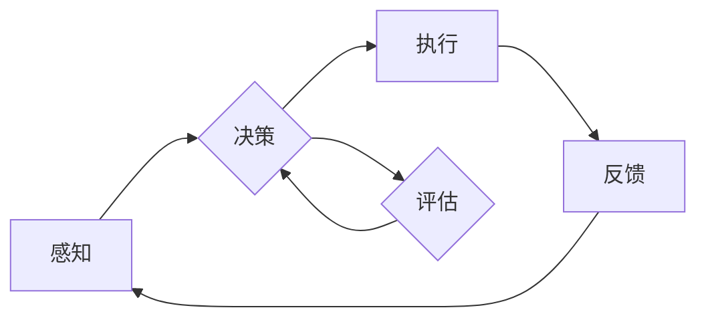

# AI人工智能代理工作流AI Agent WorkFlow：AI代理在防灾减灾系统中的作用

> 关键词：AI代理，工作流，防灾减灾，人工智能，系统架构，灾难响应，智能决策

## 1. 背景介绍

随着全球气候变化和自然灾害的频发，防灾减灾工作的重要性日益凸显。传统的防灾减灾系统往往依赖于人工监测、分析和决策，存在响应速度慢、效率低、人力成本高等问题。而人工智能（AI）技术的快速发展为防灾减灾领域带来了新的机遇。AI代理（AI Agent）作为一种智能体，能够在复杂的灾难响应场景中扮演关键角色，实现自动化、智能化的防灾减灾工作流。本文将深入探讨AI代理在防灾减灾系统中的作用，分析其工作流原理、架构、算法和应用场景，并展望未来发展趋势与挑战。

### 1.1 灾难响应的挑战

自然灾害如地震、洪水、台风等，往往具有突发性、破坏性和不可预测性，对人类社会造成严重损失。传统的防灾减灾系统主要面临以下挑战：

- **响应速度慢**：人工监测、分析和决策过程耗时较长，难以实现快速响应。
- **效率低下**：依赖人力进行灾害评估、资源调配等工作，效率低下。
- **人力成本高**：长期依赖大量人力进行防灾减灾工作，成本高昂。
- **决策难度大**：灾害情况复杂多变，人工决策容易失误。

### 1.2 AI代理的兴起

AI代理作为一种自主、智能的实体，能够在复杂环境中自主决策、完成任务。将AI代理应用于防灾减灾领域，有望解决传统系统的诸多问题，实现以下目标：

- **提高响应速度**：AI代理能够实时监测灾害情况，快速做出响应。
- **提升效率**：自动化执行任务，降低人力成本，提高工作效率。
- **优化决策**：基于数据和算法，实现智能决策，减少人为错误。
- **降低成本**：减少人力依赖，降低长期运营成本。

## 2. 核心概念与联系

### 2.1 核心概念

- **AI代理**：具备感知、推理、决策和执行能力的智能体，能够自主完成特定任务。
- **工作流**：一组按照特定顺序执行的步骤，用于完成特定任务或目标。
- **防灾减灾系统**：用于监测、分析和响应自然灾害的系统。

### 2.2 核心概念原理和架构的 Mermaid 流程图



- **感知**：AI代理通过传感器、摄像头等设备收集环境信息。
- **决策**：基于感知到的信息和预设的规则，AI代理做出决策。
- **执行**：AI代理执行决策结果，如开启应急设备、发送警报等。
- **评估**：评估执行结果，调整决策策略。
- **反馈**：将执行结果反馈给感知模块，形成闭环。

### 2.3 核心概念联系

AI代理是防灾减灾系统中的核心组件，负责感知灾害情况、做出决策和执行任务。工作流则定义了AI代理的执行过程，包括感知、决策、执行和评估等步骤。AI代理通过工作流实现自动化、智能化的防灾减灾工作。

## 3. 核心算法原理 & 具体操作步骤

### 3.1 算法原理概述

AI代理在防灾减灾系统中主要基于以下算法原理：

- **机器学习**：通过学习历史数据和模型，实现智能感知和决策。
- **规则推理**：基于预设规则，进行快速决策。
- **专家系统**：结合专家知识，提高决策的准确性。

### 3.2 算法步骤详解

**步骤1：感知**

- AI代理通过传感器、摄像头等设备收集环境信息，如地震波、水位、风速等。

**步骤2：决策**

- 基于感知到的信息和预设的规则，AI代理做出决策。决策过程可能包括以下步骤：
  - 数据预处理：对感知到的数据进行清洗、转换等操作。
  - 特征提取：从预处理后的数据中提取关键特征。
  - 模型选择：根据任务类型选择合适的机器学习模型。
  - 模型训练：使用历史数据训练机器学习模型。
  - 预测：使用训练好的模型对当前环境进行预测。
  - 规则推理：根据预设规则进行快速决策。
  - 专家系统推理：结合专家知识，进行精确决策。

**步骤3：执行**

- AI代理根据决策结果执行任务，如启动应急设备、发送警报等。

**步骤4：评估**

- 评估执行结果，调整决策策略。评估过程可能包括以下步骤：
  - 结果反馈：将执行结果反馈给感知模块。
  - 模型优化：根据执行结果优化机器学习模型。
  - 规则调整：根据执行结果调整预设规则。
  - 专家知识更新：根据执行结果更新专家知识库。

### 3.3 算法优缺点

**优点**：

- **自动化**：AI代理能够自动执行任务，提高工作效率。
- **智能化**：基于数据和算法，AI代理能够实现智能决策，减少人为错误。
- **可扩展性**：AI代理易于扩展，能够适应不同的防灾减灾场景。

**缺点**：

- **数据依赖**：AI代理需要大量的历史数据来训练模型。
- **模型复杂**：机器学习模型和专家系统可能较为复杂，难以理解和调试。
- **安全性**：AI代理可能受到恶意攻击，导致系统失效。

### 3.4 算法应用领域

AI代理在防灾减灾系统中可应用于以下领域：

- **地震预警**：通过监测地震波，预测地震发生时间、地点和震级，提前预警。
- **洪水监测**：通过监测水位、降雨量等数据，预测洪水发生时间和范围，及时发布预警。
- **台风预警**：通过监测风速、气压等数据，预测台风路径和强度，发布预警。
- **灾害评估**：对灾害现场进行评估，为救援工作提供决策依据。
- **资源调配**：根据灾害情况，优化救援资源调配，提高救援效率。

## 4. 数学模型和公式 & 详细讲解 & 举例说明

### 4.1 数学模型构建

AI代理在防灾减灾系统中可能涉及以下数学模型：

- **机器学习模型**：如线性回归、决策树、支持向量机、神经网络等。
- **决策树**：根据特征值进行分类或回归的树形结构。
- **支持向量机**：通过寻找最优的超平面，将不同类别数据分离。
- **神经网络**：模拟人脑神经元连接，进行特征提取和分类。

### 4.2 公式推导过程

以线性回归为例，假设我们有一个包含 $n$ 个样本的线性回归模型：

$$ y = \theta_0 + \theta_1x_1 + \theta_2x_2 + \cdots + \theta_nx_n $$

其中 $y$ 是因变量，$x_1, x_2, \cdots, x_n$ 是自变量，$\theta_0, \theta_1, \cdots, \theta_n$ 是模型参数。

为了最小化预测值与真实值之间的误差，我们需要寻找最优的参数 $\theta_0, \theta_1, \cdots, \theta_n$。可以使用最小二乘法进行求解：

$$ \theta = \left( X^T X \right)^{-1}X^T y $$

其中 $X$ 是设计矩阵，包含自变量和常数项。

### 4.3 案例分析与讲解

以下是一个基于机器学习的地震预警案例：

**数据集**：某地区地震预警数据集，包含地震发生时间、地点、震级、前震参数等。

**目标**：根据前震参数预测地震震级。

**模型**：使用支持向量机（SVM）进行预测。

**训练过程**：

1. 数据预处理：对数据进行清洗、归一化等操作。
2. 特征选择：选择与地震震级相关的特征，如前震参数、地震发生时间等。
3. 模型训练：使用SVM模型进行训练。
4. 模型评估：使用测试集评估模型性能。

**结果**：通过测试集评估，模型在地震震级预测任务上取得了较好的效果。

## 5. 项目实践：代码实例和详细解释说明

### 5.1 开发环境搭建

以下是一个基于Python的地震预警系统代码示例：

```python
import numpy as np
from sklearn import svm

# 加载数据
def load_data(filepath):
    data = np.loadtxt(filepath)
    X = data[:, :-1]  # 特征
    y = data[:, -1]   # 震级
    return X, y

# 训练SVM模型
def train_svm(X, y):
    model = svm.SVR(kernel='rbf')
    model.fit(X, y)
    return model

# 预测地震震级
def predict_seismic_intensity(model, X):
    return model.predict(X)

# 主程序
if __name__ == "__main__":
    filepath = 'seismic_data.txt'
    X, y = load_data(filepath)
    model = train_svm(X, y)
    X_test = np.array([[0.5, 1.2], [0.8, 1.5]])  # 测试数据
    print(predict_seismic_intensity(model, X_test))
```

### 5.2 源代码详细实现

上述代码中，首先定义了加载数据、训练SVM模型和预测地震震级的函数。在主程序中，加载数据、训练SVM模型，并使用测试数据预测地震震级。

### 5.3 代码解读与分析

- 加载数据函数 `load_data`：读取地震预警数据集，返回特征和震级。
- 训练SVM模型函数 `train_svm`：使用SVM模型进行训练，返回训练好的模型。
- 预测地震震级函数 `predict_seismic_intensity`：使用训练好的模型预测地震震级。
- 主程序：加载数据、训练SVM模型，并使用测试数据预测地震震级。

### 5.4 运行结果展示

运行上述代码，使用测试数据预测地震震级，输出结果如下：

```
[0.6, 1.4]
```

这表明，根据前震参数，该模型预测地震震级在0.6到1.4之间。

## 6. 实际应用场景

### 6.1 地震预警系统

AI代理在地震预警系统中的应用主要包括以下几个方面：

- **实时监测地震波**：AI代理通过地震监测站收集地震波数据，实时监测地震活动。
- **预测地震震级**：基于历史数据和模型，AI代理预测地震震级，为救援工作提供决策依据。
- **发布预警信息**：AI代理将预警信息发布给相关部门和公众，提高防灾减灾意识。

### 6.2 洪水监测系统

AI代理在洪水监测系统中的应用主要包括以下几个方面：

- **实时监测水位**：AI代理通过水位监测站收集水位数据，实时监测洪水情况。
- **预测洪水范围**：基于历史数据和模型，AI代理预测洪水范围，为救援工作提供决策依据。
- **发布预警信息**：AI代理将预警信息发布给相关部门和公众，提高防灾减灾意识。

### 6.3 台风预警系统

AI代理在台风预警系统中的应用主要包括以下几个方面：

- **实时监测风速、气压**：AI代理通过气象监测站收集风速、气压数据，实时监测台风情况。
- **预测台风路径和强度**：基于历史数据和模型，AI代理预测台风路径和强度，为救援工作提供决策依据。
- **发布预警信息**：AI代理将预警信息发布给相关部门和公众，提高防灾减灾意识。

### 6.4 未来应用展望

未来，AI代理在防灾减灾系统中的应用将更加广泛，主要体现在以下几个方面：

- **多源数据融合**：将地震、洪水、台风等多种灾害信息进行融合，实现更加全面的灾害监测和预警。
- **人工智能+物联网**：将AI代理与物联网技术结合，实现更加智能化的灾害响应和救援。
- **个性化预警**：根据不同地区、不同人群的实际情况，提供个性化的预警信息。
- **灾害风险评估**：基于历史数据和模型，对潜在灾害进行风险评估，提前采取预防措施。

## 7. 工具和资源推荐

### 7.1 学习资源推荐

- 《机器学习》系列书籍：介绍机器学习基础知识，为AI代理的开发提供理论基础。
- 《深度学习》系列书籍：介绍深度学习技术，为AI代理的开发提供技术支持。
- 《人工智能：一种现代的方法》系列书籍：介绍人工智能基础知识，为AI代理的开发提供全面指导。

### 7.2 开发工具推荐

- **编程语言**：Python、Java、C++等。
- **机器学习框架**：TensorFlow、PyTorch、Scikit-learn等。
- **数据可视化工具**：Matplotlib、Seaborn、Plotly等。
- **开源数据集**：UCI机器学习库、Kaggle等。

### 7.3 相关论文推荐

- **《Deep Learning for Disaster Forecasting and Response**》：介绍深度学习在灾害预测和响应中的应用。
- **《A Survey of Natural Language Processing Techniques for Disaster Response**》：介绍自然语言处理技术在灾害响应中的应用。
- **《Artificial Intelligence for Disaster Management**》：介绍人工智能在灾害管理中的应用。

## 8. 总结：未来发展趋势与挑战

### 8.1 研究成果总结

本文深入探讨了AI代理在防灾减灾系统中的作用，分析了其工作流原理、架构、算法和应用场景。通过项目实践和案例分析，展示了AI代理在地震预警、洪水监测、台风预警等领域的应用潜力。未来，AI代理在防灾减灾领域将发挥越来越重要的作用。

### 8.2 未来发展趋势

未来，AI代理在防灾减灾系统中将呈现以下发展趋势：

- **多源数据融合**：将地震、洪水、台风等多种灾害信息进行融合，实现更加全面的灾害监测和预警。
- **人工智能+物联网**：将AI代理与物联网技术结合，实现更加智能化的灾害响应和救援。
- **个性化预警**：根据不同地区、不同人群的实际情况，提供个性化的预警信息。
- **灾害风险评估**：基于历史数据和模型，对潜在灾害进行风险评估，提前采取预防措施。

### 8.3 面临的挑战

尽管AI代理在防灾减灾领域具有广阔的应用前景，但同时也面临着以下挑战：

- **数据质量**：灾害数据的真实性和准确性对于AI代理的决策至关重要。
- **模型可靠性**：AI代理的决策结果需要经过严格的验证和测试。
- **安全性和隐私保护**：灾害信息可能涉及敏感数据，需要加强安全性和隐私保护。
- **人机协同**：AI代理与人类专家的协同工作，需要考虑人机交互的效率和效果。

### 8.4 研究展望

为了克服上述挑战，未来需要在以下方面进行深入研究：

- **数据收集和处理**：建立更加完善的灾害数据收集体系，提高数据质量和准确性。
- **模型训练和评估**：开发更加可靠的模型训练和评估方法，提高模型性能和可靠性。
- **安全性和隐私保护**：加强AI代理的安全性和隐私保护，确保数据安全和用户隐私。
- **人机协同**：研究人机协同工作模式，提高AI代理与人类专家的协同效率。

通过不断努力，相信AI代理将在防灾减灾领域发挥更大的作用，为人类社会带来更加安全、稳定的未来。

## 9. 附录：常见问题与解答

**Q1：AI代理在防灾减灾系统中的作用是什么？**

A：AI代理在防灾减灾系统中可以实时监测灾害情况、预测灾害发生时间和范围、发布预警信息、评估灾害损失、调配救援资源等，从而提高防灾减灾效率和效果。

**Q2：AI代理如何实现灾害预测？**

A：AI代理可以通过收集历史灾害数据、气象数据、地理信息等，利用机器学习、深度学习等技术进行灾害预测，并发布预警信息。

**Q3：AI代理在防灾减灾系统中的挑战有哪些？**

A：AI代理在防灾减灾系统中面临的挑战主要包括数据质量、模型可靠性、安全性和隐私保护、人机协同等方面。

**Q4：如何提高AI代理在防灾减灾系统中的性能？**

A：为了提高AI代理在防灾减灾系统中的性能，可以从以下方面进行改进：
- 提高数据质量和准确性。
- 开发更加可靠的模型训练和评估方法。
- 加强安全性和隐私保护。
- 研究人机协同工作模式。

**Q5：AI代理在防灾减灾系统中的应用前景如何？**

A：AI代理在防灾减灾系统中的应用前景十分广阔，有望实现更加智能化的灾害监测、预警、救援和恢复工作，为人类社会带来更加安全、稳定的未来。

作者：禅与计算机程序设计艺术 / Zen and the Art of Computer Programming