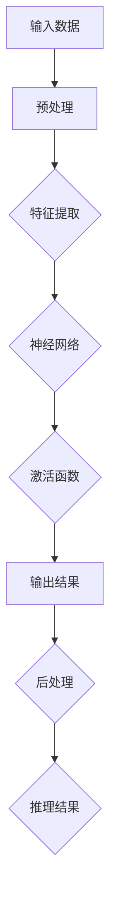

> 关键词：人工智能，深度学习，深度学习代理，推理机制，智能代理，神经网络，强化学习，迁移学习，可解释AI

---

# AI人工智能深度学习算法：智能深度学习代理的推理机制

深度学习作为人工智能领域的关键技术，已经取得了显著的成就。从图像识别、语音识别到自然语言处理，深度学习模型在各个领域都展现出了惊人的能力。然而，这些模型往往被称作“黑盒”，其内部的推理机制对外界来说晦涩难懂。本文将探讨智能深度学习代理的推理机制，旨在揭示深度学习模型的内部工作原理，并展望其未来的发展趋势。

## 1. 背景介绍

### 1.1 问题的由来

随着深度学习模型的不断进步，它们在各个领域的应用也越来越广泛。然而，这些模型通常被视为“黑盒”，其内部推理过程难以解释。这导致了以下几个问题：

- **可解释性**：用户难以理解模型的决策过程，这限制了其在关键领域的应用。
- **信任度**：由于缺乏可解释性，用户可能对模型的决策结果产生怀疑。
- **法律和伦理问题**：在医疗、金融等领域，模型的决策可能对人类产生重大影响，缺乏可解释性可能导致责任归属不明确。

### 1.2 研究现状

为了解决上述问题，研究人员提出了多种方法来提高深度学习模型的可解释性。这些方法主要包括：

- **特征可视化**：通过可视化模型中的神经元激活，帮助理解模型对输入数据的关注点。
- **注意力机制**：通过注意力机制，模型可以明确指出在决策过程中哪些信息对其最为关键。
- **局部可解释性方法**：通过局部可解释性方法，可以对模型的单个预测结果进行解释。
- **全局可解释性方法**：通过全局可解释性方法，可以对整个模型的决策过程进行解释。

### 1.3 研究意义

研究智能深度学习代理的推理机制，对于以下方面具有重要意义：

- **提高用户信任度**：通过解释模型的推理过程，可以提高用户对模型决策的信任度。
- **促进技术发展**：推动深度学习模型的可解释性研究，有助于推动技术的发展。
- **解决实际应用问题**：在医疗、金融等关键领域，模型的可解释性对于解决实际问题至关重要。

### 1.4 本文结构

本文将分为以下几个部分：

- 核心概念与联系
- 核心算法原理 & 具体操作步骤
- 数学模型和公式 & 详细讲解 & 举例说明
- 项目实践：代码实例和详细解释说明
- 实际应用场景
- 工具和资源推荐
- 总结：未来发展趋势与挑战
- 附录：常见问题与解答

## 2. 核心概念与联系

### 2.1 核心概念

为了更好地理解智能深度学习代理的推理机制，我们需要了解以下几个核心概念：

- **深度学习**：一种利用多层神经网络对数据进行建模和预测的技术。
- **神经网络**：由多个神经元组成的计算模型，可以学习和模拟复杂的非线性关系。
- **强化学习**：一种通过与环境交互来学习最优策略的机器学习方法。
- **迁移学习**：利用在另一个任务上预训练的模型来解决新任务的方法。
- **可解释AI**：一种旨在提高人工智能模型可解释性的研究领域。

### 2.2 Mermaid 流程图

以下是一个描述智能深度学习代理推理机制的Mermaid流程图：



### 2.3 核心概念之间的联系

深度学习是神经网络的基础，而强化学习和迁移学习则是在深度学习的基础上发展出来的技术。可解释AI旨在提高深度学习模型的可解释性，从而提高模型的信任度和可靠性。

## 3. 核心算法原理 & 具体操作步骤

### 3.1 算法原理概述

智能深度学习代理的推理机制主要基于以下步骤：

1. **输入数据预处理**：对输入数据进行清洗、归一化等预处理操作。
2. **特征提取**：使用神经网络提取输入数据的特征。
3. **神经网络推理**：将特征输入神经网络，通过网络层进行计算。
4. **激活函数**：使用激活函数对网络层的输出进行非线性变换。
5. **输出结果**：将激活函数的输出作为模型的预测结果。
6. **后处理**：对预测结果进行后处理，如分类、回归等。
7. **推理结果**：将最终结果作为推理结果输出。

### 3.2 算法步骤详解

#### 3.2.1 输入数据预处理

输入数据预处理是深度学习模型的第一步，其目的是提高模型的输入质量。预处理操作可能包括：

- 数据清洗：去除数据中的噪声和异常值。
- 归一化：将数据缩放到一个固定的范围，如[0, 1]。
- 数据增强：通过旋转、翻转、裁剪等方法生成更多的数据。

#### 3.2.2 特征提取

特征提取是深度学习模型的核心，其目的是从原始数据中提取出有用的信息。常见的特征提取方法包括：

- 卷积神经网络（CNN）：用于图像识别、图像分类等任务。
- 循环神经网络（RNN）：用于序列数据，如时间序列分析、自然语言处理等。
- 自注意力机制：用于处理序列数据，如BERT模型。

#### 3.2.3 神经网络推理

神经网络推理是深度学习模型的核心部分，其目的是通过多层神经网络对提取出的特征进行学习。常见的神经网络结构包括：

- 全连接神经网络（FCN）：用于分类、回归等任务。
- 卷积神经网络（CNN）：用于图像识别、图像分类等任务。
- 循环神经网络（RNN）：用于序列数据，如时间序列分析、自然语言处理等。

#### 3.2.4 激活函数

激活函数是神经网络中的非线性部分，用于引入非线性关系。常见的激活函数包括：

- Sigmoid函数：将输入映射到[0, 1]区间。
- ReLU函数：将输入大于0的部分设置为输入值，小于0的部分设置为0。
- Tanh函数：将输入映射到[-1, 1]区间。

#### 3.2.5 输出结果

输出结果是神经网络推理的最终结果，可以是分类、回归、生成等。输出结果的类型取决于具体的任务。

#### 3.2.6 后处理

后处理是对输出结果进行进一步处理，如分类、回归等。后处理的具体操作取决于任务的类型。

#### 3.2.7 推理结果

推理结果是将后处理后的结果输出到外部环境，如数据库、文件等。

### 3.3 算法优缺点

#### 3.3.1 优点

- **强大的学习能力**：深度学习模型可以从大量数据中学习到复杂的非线性关系。
- **泛化能力**：深度学习模型可以泛化到新的数据集，即对新数据具有很好的适应性。
- **可解释性**：通过特征可视化、注意力机制等方法，可以提高模型的可解释性。

#### 3.3.2 缺点

- **计算复杂度高**：深度学习模型通常需要大量的计算资源。
- **数据需求量大**：深度学习模型需要大量的数据进行训练。
- **模型可解释性差**：深度学习模型通常被视为“黑盒”，其内部推理过程难以解释。

### 3.4 算法应用领域

智能深度学习代理的推理机制在以下领域有广泛的应用：

- **图像识别**：如人脸识别、物体检测等。
- **语音识别**：如语音转文字、语音翻译等。
- **自然语言处理**：如机器翻译、情感分析等。
- **医疗诊断**：如疾病诊断、药物推荐等。
- **金融分析**：如欺诈检测、股票市场预测等。

## 4. 数学模型和公式 & 详细讲解 & 举例说明

### 4.1 数学模型构建

深度学习模型通常使用以下数学模型：

- **神经网络模型**：由多个神经元组成的计算模型，可以学习和模拟复杂的非线性关系。

### 4.2 公式推导过程

以下是一个简单的神经网络模型的公式推导过程：

$$
y = f(z) = \sigma(W^T \cdot x + b)
$$

其中，$x$ 是输入数据，$W$ 是权重矩阵，$b$ 是偏置，$\sigma$ 是激活函数。

### 4.3 案例分析与讲解

以下是一个使用神经网络进行图像识别的案例：

- **输入数据**：一幅包含猫的图片。
- **神经网络**：一个简单的卷积神经网络，包含多个卷积层和全连接层。
- **输出结果**：模型预测图片中的猫属于某个特定的类别。

## 5. 项目实践：代码实例和详细解释说明

### 5.1 开发环境搭建

为了实践智能深度学习代理的推理机制，我们需要搭建以下开发环境：

- **编程语言**：Python
- **深度学习框架**：TensorFlow或PyTorch
- **操作系统**：Linux或MacOS

### 5.2 源代码详细实现

以下是一个使用TensorFlow和Keras构建的简单神经网络模型示例：

```python
import tensorflow as tf
from tensorflow import keras

# 创建模型
model = keras.Sequential([
    keras.layers.Flatten(input_shape=(28, 28)),
    keras.layers.Dense(128, activation='relu'),
    keras.layers.Dense(10, activation='softmax')
])

# 编译模型
model.compile(optimizer='adam',
              loss='sparse_categorical_crossentropy',
              metrics=['accuracy'])

# 训练模型
model.fit(x_train, y_train, epochs=5)

# 评估模型
model.evaluate(x_test, y_test)
```

### 5.3 代码解读与分析

以上代码是一个简单的神经网络模型，用于手写数字识别。模型由一个Flatten层、一个Dense层和一个Softmax层组成。

- **Flatten层**：将输入数据的形状从$(28, 28)$转换为$(784)$，方便后续的全连接层处理。
- **Dense层**：一个包含128个神经元的全连接层，使用ReLU激活函数。
- **Softmax层**：一个包含10个神经元的全连接层，使用Softmax激活函数，用于输出每个类别的概率。

### 5.4 运行结果展示

运行上述代码后，模型会在训练集上进行训练，并在测试集上进行评估。最终输出模型的准确率等指标。

## 6. 实际应用场景

智能深度学习代理的推理机制在以下实际应用场景中具有重要作用：

- **自动驾驶**：自动驾驶汽车使用深度学习模型进行环境感知、路径规划等任务。
- **智能客服**：智能客服系统使用深度学习模型进行语义理解、意图识别等任务。
- **推荐系统**：推荐系统使用深度学习模型进行用户画像、推荐物品等任务。
- **医疗诊断**：医疗诊断系统使用深度学习模型进行疾病诊断、药物推荐等任务。

## 7. 工具和资源推荐

### 7.1 学习资源推荐

- **书籍**：
  - 《深度学习》
  - 《Python深度学习》
  - 《神经网络与深度学习》
- **在线课程**：
  - Coursera上的《机器学习》课程
  - Udacity上的《深度学习纳米学位》
  - fast.ai的《深度学习课程》

### 7.2 开发工具推荐

- **深度学习框架**：
  - TensorFlow
  - PyTorch
  - Keras
- **编程语言**：
  - Python
  - R
- **数据可视化工具**：
  - Matplotlib
  - Seaborn

### 7.3 相关论文推荐

- **《A Brief Introduction to Deep Learning for NLP》**
- **《Generative Adversarial Nets》**
- **《Attention is All You Need》**

## 8. 总结：未来发展趋势与挑战

### 8.1 研究成果总结

本文对智能深度学习代理的推理机制进行了全面系统的介绍，包括其核心概念、算法原理、具体操作步骤、实际应用场景等。

### 8.2 未来发展趋势

未来，智能深度学习代理的推理机制将朝着以下方向发展：

- **可解释性**：提高模型的可解释性，使其推理过程更加透明。
- **高效性**：提高模型的推理效率，使其在实际应用中更加实用。
- **泛化能力**：提高模型的泛化能力，使其能够更好地适应新的数据和环境。

### 8.3 面临的挑战

尽管智能深度学习代理的推理机制取得了显著进展，但仍然面临以下挑战：

- **可解释性**：如何提高模型的可解释性，使其推理过程更加透明。
- **效率**：如何提高模型的推理效率，使其在实际应用中更加实用。
- **泛化能力**：如何提高模型的泛化能力，使其能够更好地适应新的数据和环境。

### 8.4 研究展望

未来，智能深度学习代理的推理机制将在以下方面进行深入研究：

- **可解释性**：开发新的可解释性方法，提高模型的可解释性。
- **效率**：开发新的高效推理算法，提高模型的推理效率。
- **泛化能力**：开发新的泛化方法，提高模型的泛化能力。

## 9. 附录：常见问题与解答

**Q1：深度学习模型的优缺点是什么？**

A：深度学习模型的优点包括强大的学习能力、泛化能力和可解释性；缺点包括计算复杂度高、数据需求量大和模型可解释性差。

**Q2：如何提高深度学习模型的可解释性？**

A：可以通过特征可视化、注意力机制、局部可解释性方法、全局可解释性方法等方法提高模型的可解释性。

**Q3：深度学习模型在哪些领域有应用？**

A：深度学习模型在图像识别、语音识别、自然语言处理、医疗诊断、金融分析等领域有广泛的应用。

**Q4：如何选择合适的深度学习框架？**

A：选择合适的深度学习框架取决于具体的应用需求，如TensorFlow和PyTorch是两个常用的深度学习框架。

**Q5：如何提高深度学习模型的效率？**

A：可以通过模型压缩、量化加速、模型并行等方法提高深度学习模型的效率。

---

作者：禅与计算机程序设计艺术 / Zen and the Art of Computer Programming