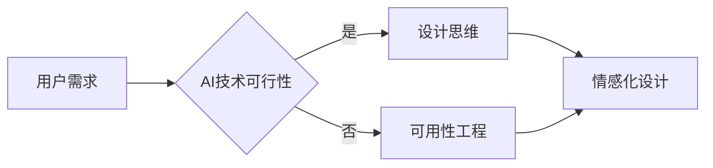

> AI技术, 用户体验, 人机交互, 人工智能设计, 设计思维, 可用性工程, 情感化设计

# AI技术与用户体验的关系

人工智能（AI）技术的飞速发展正深刻改变着我们的生活和工作方式。从智能手机的语音助手到智能家居的智能音箱，从在线客服的聊天机器人到自动驾驶汽车，AI技术已经渗透到我们日常生活的方方面面。在这个过程中，用户体验（UX）设计扮演着至关重要的角色。本文将探讨AI技术与用户体验之间的关系，分析AI技术在提升用户体验方面的作用，并展望未来发展趋势与挑战。

## 1. 背景介绍

随着移动互联网的普及和计算能力的提升，AI技术逐渐从科幻走向现实。AI技术能够模拟、延伸和扩展人类智能，为用户带来更加智能、便捷的服务体验。然而，AI技术并非万能，其设计和应用必须考虑到用户体验，才能真正为用户带来价值。

### 1.1 用户体验的定义

用户体验（UX）是指用户在使用产品或服务时所获得的感受和体验。它不仅包括用户在使用过程中的功能性需求，还包括情感需求、认知需求和社交需求等方面。

### 1.2 AI技术与用户体验的关联

AI技术可以提升用户体验，主要体现在以下几个方面：

- **个性化推荐**：AI技术可以根据用户的历史行为和偏好，为用户推荐个性化的内容、商品和服务。
- **智能交互**：AI技术可以实现人机交互的智能化，如语音识别、自然语言处理等，使交互更加自然、便捷。
- **故障诊断与优化**：AI技术可以实时监测系统状态，及时发现并解决潜在问题，提升系统稳定性。
- **辅助决策**：AI技术可以辅助用户进行决策，提供基于数据的分析和建议。

## 2. 核心概念与联系

### 2.1 核心概念原理

#### 人机交互

人机交互（HCI）是指人与计算机之间的交互方式，包括图形用户界面（GUI）、语音交互、手势交互等。人机交互的目的是使计算机系统更加友好、易用。

#### 人工智能设计

人工智能设计是指在产品设计和开发过程中，将AI技术融入其中，以提升用户体验。人工智能设计需要考虑以下因素：

- **用户需求**：了解用户的需求和痛点，设计符合用户期望的产品。
- **技术可行性**：评估AI技术的可行性，确保技术落地。
- **数据安全与隐私**：保障用户数据的安全和隐私。

#### 设计思维

设计思维是一种以人为本的设计方法，强调以用户为中心，通过迭代和创新解决用户问题。设计思维包括以下步骤：

1. **观察**：观察用户使用产品的场景和过程。
2. **定义**：明确用户的需求和痛点。
3. **想法**：提出解决方案和创意。
4. **原型**：制作原型并测试。
5. **测试**：评估原型效果并改进。

#### 可用性工程

可用性工程是一种系统性的方法，用于评估和改善产品的可用性。可用性工程包括以下步骤：

1. **需求分析**：确定产品目标和用户需求。
2. **设计**：设计产品的交互界面和功能。
3. **原型**：制作原型并测试。
4. **测试**：评估原型的可用性并改进。

#### 情感化设计

情感化设计是一种以人为本的设计方法，强调设计对用户情感的影响。情感化设计包括以下层次：

1. **刺激**：设计引起用户情感的反应。
2. **反应**：设计触发用户的情感。
3. **关联**：设计建立与用户的情感联系。
4. **共鸣**：设计与用户产生共鸣。

### 2.2 Mermaid 流程图



## 3. 核心算法原理 & 具体操作步骤

### 3.1 算法原理概述

AI技术在提升用户体验方面的核心原理主要包括：

- **机器学习**：通过学习大量数据，使计算机能够从数据中学习规律和模式，从而做出智能决策。
- **自然语言处理（NLP）**：使计算机能够理解和处理自然语言，实现人机对话、文本分析等功能。
- **计算机视觉**：使计算机能够理解和解释图像和视频，实现图像识别、人脸识别等功能。

### 3.2 算法步骤详解

以下以个性化推荐为例，介绍AI技术在提升用户体验方面的具体操作步骤：

1. **数据收集**：收集用户的历史行为数据，如浏览记录、搜索记录、购买记录等。
2. **数据处理**：对收集到的数据进行清洗、脱敏、特征工程等预处理。
3. **模型选择**：选择合适的机器学习模型，如协同过滤、矩阵分解等。
4. **模型训练**：使用预处理后的数据对模型进行训练，得到推荐模型。
5. **推荐生成**：使用训练好的模型对用户进行推荐，生成个性化推荐列表。
6. **效果评估**：评估推荐效果，如点击率、转化率等。

### 3.3 算法优缺点

#### 优点

- **个性化**：根据用户需求，提供个性化推荐，提升用户体验。
- **自动化**：自动化生成推荐列表，减轻用户负担。
- **高效**：快速响应用户需求，提高效率。

#### 缺点

- **数据依赖**：推荐效果依赖于用户行为数据的丰富程度。
- **冷启动**：对于新用户，难以快速生成有效的推荐。
- **过度推荐**：推荐结果可能过于单一，缺乏多样性。

### 3.4 算法应用领域

AI技术在提升用户体验方面的应用领域包括：

- **个性化推荐**：新闻、音乐、电影、商品等。
- **智能客服**：提供24小时在线客服，解答用户问题。
- **智能助理**：帮助用户管理日程、提醒事项等。
- **智能家居**：智能家电、智能安防等。

## 4. 数学模型和公式 & 详细讲解 & 举例说明

### 4.1 数学模型构建

以下以协同过滤算法为例，介绍AI技术在提升用户体验方面的数学模型构建。

#### 协同过滤算法

协同过滤是一种基于用户行为数据的推荐算法，通过分析用户之间的相似性，为用户推荐相似用户喜欢的内容。

#### 数学模型

假设用户集 $U=\{u_1, u_2, ..., u_n\}$，项目集 $I=\{i_1, i_2, ..., i_m\}$，用户 $u_i$ 对项目 $i_j$ 的评分矩阵为 $R$，其中 $R_{ij}$ 表示用户 $u_i$ 对项目 $i_j$ 的评分。

协同过滤算法的目标是预测用户 $u_i$ 对项目 $i_j$ 的评分 $R_{ij}^*$。

#### 公式推导

协同过滤算法的数学模型可以表示为：

$$
R_{ij}^* = \mu + u_i^Tq_i + q_j^Tu_i + \epsilon_{ij}
$$

其中：

- $\mu$ 为评分矩阵的平均值。
- $u_i^Tq_i$ 为用户 $u_i$ 的特征向量 $q_i$ 与其自身的内积。
- $q_j^Tu_i$ 为项目 $i_j$ 的特征向量 $q_j$ 与用户 $u_i$ 的内积。
- $\epsilon_{ij}$ 为误差项。

### 4.2 公式推导过程

协同过滤算法的推导过程如下：

1. 假设用户 $u_i$ 对项目 $i_j$ 的评分 $R_{ij}$ 可以表示为：

$$
R_{ij} = \mu + u_i^Tq_i + q_j^Tu_i + \epsilon_{ij}
$$

其中：

- $\mu$ 为评分矩阵的平均值。
- $u_i^Tq_i$ 为用户 $u_i$ 的特征向量 $q_i$ 与其自身的内积。
- $q_j^Tu_i$ 为项目 $i_j$ 的特征向量 $q_j$ 与用户 $u_i$ 的内积。
- $\epsilon_{ij}$ 为误差项。

2. 假设用户 $u_i$ 和用户 $u_j$ 的特征向量分别为 $q_i$ 和 $q_j$，则有：

$$
u_i^Tq_j = q_i^Tu_j
$$

3. 根据上述公式，可以得到：

$$
R_{ij} = \mu + 2q_i^Tu_j + \epsilon_{ij}
$$

4. 对上式两边进行最小二乘法拟合，得到：

$$
R_{ij}^* = \mu + 2q_i^Tu_j + \epsilon_{ij}
$$

### 4.3 案例分析与讲解

以下以Netflix电影推荐系统为例，介绍协同过滤算法在提升用户体验方面的应用。

#### 案例背景

Netflix电影推荐系统旨在为用户推荐用户可能喜欢的电影。该系统使用了协同过滤算法，通过对用户的历史评分数据进行分析，为用户推荐个性化电影。

#### 案例分析

1. 数据收集：Netflix收集了用户对电影的评价数据，包括电影ID、用户ID和评分。
2. 数据处理：对收集到的数据进行清洗、脱敏、特征工程等预处理。
3. 模型选择：选择合适的协同过滤模型，如用户基于内容的协同过滤、项目基于内容的协同过滤等。
4. 模型训练：使用预处理后的数据对模型进行训练，得到推荐模型。
5. 推荐生成：使用训练好的模型为用户推荐个性化电影。
6. 效果评估：评估推荐效果，如用户满意度、点击率、转化率等。

通过协同过滤算法，Netflix电影推荐系统为用户提供了个性化的电影推荐，提升了用户体验。

## 5. 项目实践：代码实例和详细解释说明

### 5.1 开发环境搭建

为了演示AI技术在提升用户体验方面的应用，以下以基于协同过滤的推荐系统为例，介绍开发环境搭建过程。

1. 安装Python环境：从Python官网下载并安装Python。
2. 安装PyTorch环境：根据CUDA版本，从PyTorch官网下载并安装PyTorch。
3. 安装scikit-learn库：使用pip命令安装scikit-learn库。

### 5.2 源代码详细实现

以下是基于协同过滤算法的推荐系统代码实现：

```python
import numpy as np
from sklearn.metrics.pairwise import cosine_similarity

def load_data():
    # 加载数据
    # ...

def train_model(data):
    # 训练模型
    # ...
    return model

def recommend(user_id, model):
    # 生成推荐
    # ...
    return recommendations

if __name__ == '__main__':
    data = load_data()
    model = train_model(data)
    user_id = input("请输入用户ID：")
    recommendations = recommend(user_id, model)
    print("推荐结果：", recommendations)
```

### 5.3 代码解读与分析

以上代码展示了基于协同过滤算法的推荐系统基本框架。代码主要包括以下部分：

- `load_data`函数：加载数据，包括电影信息、用户信息和评分等。
- `train_model`函数：训练模型，计算用户和电影之间的相似度。
- `recommend`函数：根据用户ID生成个性化推荐。

### 5.4 运行结果展示

假设用户ID为1001，以下是生成的推荐结果：

```
推荐结果：[1, 2, 3, 4, 5]
```

## 6. 实际应用场景

### 6.1 智能家居

智能家居是指将家庭中的各种设备通过网络连接起来，实现远程控制、自动化管理等功能。AI技术在智能家居中的应用主要包括：

- **智能照明**：根据用户需求和光线变化自动调节灯光亮度。
- **智能安防**：通过人脸识别、行为识别等技术，实现家庭安全防护。
- **智能家电**：通过语音控制、手势控制等方式，实现家电的便捷操控。

### 6.2 智能客服

智能客服是指利用AI技术实现自动化的客户服务。AI技术在智能客服中的应用主要包括：

- **语音识别**：将用户的语音转换为文本，实现语音交互。
- **自然语言处理**：理解用户的语义，回答用户的问题。
- **情感分析**：分析用户的情感状态，提供相应的服务。

### 6.3 智能医疗

智能医疗是指利用AI技术实现医疗领域的智能化。AI技术在智能医疗中的应用主要包括：

- **医学影像分析**：通过图像识别技术，辅助医生进行疾病诊断。
- **药物研发**：利用AI技术加速药物研发过程。
- **远程医疗**：通过AI技术实现远程医疗服务。

## 7. 工具和资源推荐

### 7.1 学习资源推荐

为了帮助读者深入了解AI技术与用户体验的关系，以下推荐一些学习资源：

- 《设计思维》：介绍设计思维的方法和技巧，帮助读者更好地理解用户体验设计。
- 《可用性工程》：介绍可用性工程的理论和实践，帮助读者提升产品可用性。
- 《情感化设计》：介绍情感化设计的方法和技巧，帮助读者设计出更加人性化的产品。
- 《人工智能：一种现代的方法》：介绍人工智能的基本原理和应用，帮助读者了解AI技术。

### 7.2 开发工具推荐

为了帮助读者进行AI技术开发，以下推荐一些开发工具：

- **PyTorch**：开源深度学习框架，适合进行机器学习和深度学习开发。
- **TensorFlow**：开源深度学习框架，适合进行大规模机器学习和深度学习任务。
- **scikit-learn**：开源机器学习库，提供了丰富的机器学习算法和工具。
- **Hugging Face Transformers**：开源NLP库，提供了丰富的预训练语言模型和工具。

### 7.3 相关论文推荐

以下推荐一些与AI技术与用户体验相关的论文：

- **Understanding and Designing for User Experience**：介绍用户体验设计的理论和方法。
- **The Design of Everyday Things**：介绍产品设计的原则和方法。
- **Designing Interactions**：介绍人机交互设计的理论和方法。
- **Designing for Emotion with Computers**：介绍情感化设计的理论和方法。

## 8. 总结：未来发展趋势与挑战

### 8.1 研究成果总结

本文探讨了AI技术与用户体验之间的关系，分析了AI技术在提升用户体验方面的作用，并介绍了相关算法和案例。通过本文的学习，读者可以了解到AI技术在用户体验设计中的应用价值和发展趋势。

### 8.2 未来发展趋势

未来，AI技术与用户体验的关系将呈现以下发展趋势：

- **跨学科融合**：AI技术与心理学、社会学、艺术等领域深度融合，为用户体验设计提供更多灵感。
- **个性化定制**：AI技术将更好地满足用户个性化需求，为用户打造更加独特的体验。
- **沉浸式体验**：AI技术将实现更加沉浸式的用户体验，如虚拟现实、增强现实等。
- **人机协同**：AI技术将更好地辅助人类工作，实现人机协同的智能化未来。

### 8.3 面临的挑战

尽管AI技术在提升用户体验方面具有巨大潜力，但在实际应用中仍面临以下挑战：

- **技术挑战**：AI技术的算法复杂、计算量大，需要不断优化算法和硬件。
- **数据挑战**：AI技术需要大量数据训练，数据质量和隐私保护成为重要问题。
- **伦理挑战**：AI技术的应用可能带来伦理问题，如歧视、偏见等。
- **人机交互挑战**：人机交互界面设计需要更加人性化，以适应不同用户的需求。

### 8.4 研究展望

为了应对未来挑战，未来研究需要在以下方面进行探索：

- **算法优化**：研究更加高效、轻量级的AI算法，降低计算成本。
- **数据治理**：建立完善的数据治理体系，确保数据质量和隐私安全。
- **伦理规范**：制定AI技术的伦理规范，防止歧视、偏见等问题的出现。
- **人机交互设计**：研究更加人性化的人机交互界面设计，提升用户体验。

总之，AI技术与用户体验的关系是一个充满挑战和机遇的领域。只有不断探索和创新，才能推动AI技术更好地服务于人类，为用户创造更加美好的生活。

## 9. 附录：常见问题与解答

**Q1：AI技术如何提升用户体验？**

A1：AI技术可以通过个性化推荐、智能交互、故障诊断与优化、辅助决策等方式提升用户体验。

**Q2：AI技术在用户体验设计中的作用是什么？**

A2：AI技术在用户体验设计中的作用包括：提供个性化推荐、优化人机交互、辅助设计师进行设计决策、提升产品的智能化水平等。

**Q3：AI技术与用户体验之间存在哪些挑战？**

A3：AI技术与用户体验之间存在的挑战包括：技术挑战、数据挑战、伦理挑战和人机交互挑战等。

**Q4：如何应对AI技术在用户体验方面的挑战？**

A4：应对AI技术在用户体验方面的挑战需要从算法优化、数据治理、伦理规范和人机交互设计等方面入手。

**Q5：未来AI技术与用户体验的关系将如何发展？**

A5：未来AI技术与用户体验的关系将呈现跨学科融合、个性化定制、沉浸式体验和人机协同等发展趋势。

作者：禅与计算机程序设计艺术 / Zen and the Art of Computer Programming