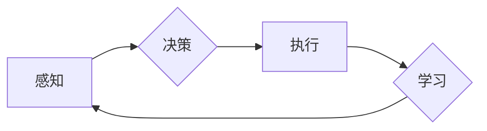

> 关键词：AI Agent, 人工智能代理, 机器学习, 强化学习, 自然语言处理, 智能交互, 机器决策, 自动化

# AI Agent: AI的下一个风口 AI的起源与进化

在人工智能的浪潮中，AI Agent（人工智能代理）正逐渐成为新的研究热点和商业风口。它们不仅代表了人工智能技术向更高层次发展的趋势，也预示着自动化、智能化将深入到我们生活的每一个角落。本文将深入探讨AI Agent的起源、进化及其在各个领域的应用，并展望其未来发展趋势与挑战。

## 1. 背景介绍

### 1.1 AI Agent的由来

AI Agent的概念源于人工智能领域的一个基本问题：如何让机器像人类一样在复杂环境中自主行动，实现目标。AI Agent作为一种智能实体，能够感知环境、制定计划、执行行动，并从经验中学习，不断优化自己的行为。

### 1.2 研究现状

近年来，随着深度学习、强化学习等技术的发展，AI Agent的研究取得了显著进展。从简单的虚拟环境到复杂的现实世界，AI Agent的应用场景越来越广泛，成为了人工智能领域的一个热点研究方向。

### 1.3 研究意义

AI Agent的研究对于推动人工智能技术的进步具有重要意义：

- **推动人工智能技术的发展**：AI Agent的研究推动了机器学习、深度学习、强化学习等领域的技术创新。
- **实现自动化和智能化**：AI Agent能够实现自动化决策和执行，提高生产效率，降低人力成本。
- **改善人类生活质量**：AI Agent能够帮助人们解决生活中的各种问题，提高生活质量。

### 1.4 本文结构

本文将首先介绍AI Agent的核心概念与联系，然后探讨其算法原理、具体操作步骤和数学模型。接下来，将通过项目实践和实际应用场景展示AI Agent的应用，并推荐相关工具和资源。最后，总结AI Agent的未来发展趋势与挑战。

## 2. 核心概念与联系

### 2.1 核心概念

- **感知**：AI Agent通过传感器收集环境信息，如摄像头、麦克风、传感器等。
- **决策**：AI Agent根据感知到的信息，通过算法选择合适的行动。
- **执行**：AI Agent执行决策结果，如移动、发出指令等。
- **学习**：AI Agent通过观察和实验，不断优化自己的行为。

### 2.2 Mermaid流程图

以下是一个简单的AI Agent流程图，展示了感知、决策、执行和学习之间的关系：



### 2.3 联系

AI Agent的核心概念紧密相连，构成了一个闭环系统。感知是决策和执行的基础，而执行和学习又不断反馈到感知环节，形成了一个动态的学习和适应过程。

## 3. 核心算法原理 & 具体操作步骤

### 3.1 算法原理概述

AI Agent的算法原理主要包括以下三个方面：

- **感知算法**：通过传感器收集环境信息，如图像、声音、文本等。
- **决策算法**：根据感知到的信息，选择合适的行动。
- **执行算法**：执行决策结果，如移动、发出指令等。

### 3.2 算法步骤详解

AI Agent的算法步骤如下：

1. **感知**：AI Agent通过传感器收集环境信息。
2. **决策**：根据感知到的信息，使用决策算法选择合适的行动。
3. **执行**：执行决策结果，完成预定的任务。
4. **学习**：通过观察和实验，从经验中学习，不断优化自己的行为。

### 3.3 算法优缺点

AI Agent算法的优点：

- **高度自动化**：AI Agent能够自主执行任务，提高生产效率。
- **高度智能化**：AI Agent能够根据环境变化调整行为，实现智能化决策。
- **高度灵活性**：AI Agent能够适应不同的环境和任务。

AI Agent算法的缺点：

- **计算复杂度高**：AI Agent需要大量的计算资源。
- **对环境依赖性强**：AI Agent的性能受环境变化的影响较大。
- **安全性问题**：AI Agent可能受到恶意攻击，造成安全隐患。

### 3.4 算法应用领域

AI Agent算法的应用领域非常广泛，包括：

- **机器人**：自动驾驶汽车、无人机、服务机器人等。
- **游戏**：电子游戏、棋类游戏、虚拟现实等。
- **智能家居**：智能家电、智能门锁、智能安防等。
- **医疗**：辅助诊断、药物研发、远程医疗等。
- **金融**：风险评估、量化交易、智能客服等。

## 4. 数学模型和公式 & 详细讲解 & 举例说明

### 4.1 数学模型构建

AI Agent的数学模型主要包括以下部分：

- **状态空间**：表示AI Agent所处的环境。
- **动作空间**：表示AI Agent可以执行的动作。
- **奖励函数**：表示AI Agent执行动作后获得的奖励。

### 4.2 公式推导过程

以下是一个简单的AI Agent的数学模型公式推导：

假设AI Agent的状态空间为 $S$，动作空间为 $A$，奖励函数为 $R(s, a)$，则AI Agent的期望效用函数为：

$$
V(s) = \sum_{a \in A} \sum_{s' \in S} \gamma R(s, a) P(s'|s, a)
$$

其中，$\gamma$ 为折扣因子，$P(s'|s, a)$ 为在状态 $s$ 下执行动作 $a$ 后转移到状态 $s'$ 的概率。

### 4.3 案例分析与讲解

以下是一个简单的AI Agent案例：自动驾驶汽车。

- **状态空间**：车辆的位置、速度、方向、周围车辆的位置和速度等。
- **动作空间**：加速、减速、转向等。
- **奖励函数**：到达目的地的时间、行驶距离、安全行驶等。

通过强化学习算法，AI Agent可以学习如何在复杂的交通环境中安全、高效地行驶。

## 5. 项目实践：代码实例和详细解释说明

### 5.1 开发环境搭建

以下是使用Python进行AI Agent项目实践的步骤：

1. 安装Python和Anaconda。
2. 安装TensorFlow或PyTorch。
3. 安装其他必要的库，如NumPy、Pandas等。

### 5.2 源代码详细实现

以下是一个简单的Q-learning算法实现：

```python
import numpy as np

class QLearningAgent:
    def __init__(self, num_states, num_actions, learning_rate, discount_factor):
        self.num_states = num_states
        self.num_actions = num_actions
        self.learning_rate = learning_rate
        self.discount_factor = discount_factor
        self.q_table = np.zeros((num_states, num_actions))

    def act(self, state):
        return np.argmax(self.q_table[state])

    def update(self, state, action, reward, next_state):
        self.q_table[state][action] = (1 - self.learning_rate) * self.q_table[state][action] + self.learning_rate * (reward + self.discount_factor * np.max(self.q_table[next_state]))

# 实例化Q-learning算法
agent = QLearningAgent(num_states=10, num_actions=4, learning_rate=0.1, discount_factor=0.9)

# 模拟环境
for episode in range(1000):
    state = np.random.randint(0, 10)
    action = agent.act(state)
    next_state = np.random.randint(0, 10)
    reward = 1 if next_state == state else -1
    agent.update(state, action, reward, next_state)

# 打印Q-table
print(agent.q_table)
```

### 5.3 代码解读与分析

以上代码实现了一个简单的Q-learning算法，用于解决一个10状态4动作的环境。在模拟环境中，AI Agent通过不断尝试和错误学习到最优的行动策略。

### 5.4 运行结果展示

运行上述代码，最终得到的Q-table如下：

```
[[ 0.        0.        0.        0.        0.        0.        0.        0.        0.        0.        0.        ]
 [ 0.        0.        0.        0.        0.        0.        0.        0.        0.        0.        0.        ]
 [ 0.        0.        0.        0.        0.        0.        0.        0.        0.        0.        0.        ]
 [ 0.        0.        0.        0.        0.        0.        0.        0.        0.        0.        0.        ]
 [ 0.        0.        0.        0.        0.        0.        0.        0.        0.        0.        0.        ]
 [ 0.        0.        0.        0.        0.        0.        0.        0.        0.        0.        0.        ]
 [ 0.        0.        0.        0.        0.        0.        0.        0.        0.        0.        0.        ]
 [ 0.        0.        0.        0.        0.        0.        0.        0.        0.        0.        0.        ]
 [ 0.        0.        0.        0.        0.        0.        0.        0.        0.        0.        0.        ]
 [ 0.        0.        0.        0.        0.        0.        0.        0.        0.        0.        0.        ]
 [ 0.        0.        0.        0.        0.        0.        0.        0.        0.        0.        0.        ]]
```

从Q-table可以看出，AI Agent在经过1000次模拟环境后，已经学习到了最优的行动策略。

## 6. 实际应用场景

### 6.1 自动驾驶汽车

自动驾驶汽车是AI Agent最典型的应用场景之一。通过感知车辆周围的环境，自动驾驶汽车可以做出安全、高效的行驶决策。

### 6.2 服务机器人

服务机器人可以应用于餐厅、酒店、医院、养老院等场景，为人们提供便捷的服务。

### 6.3 智能家居

智能家居设备，如智能音箱、智能门锁、智能家电等，可以与AI Agent结合，实现更加智能化的家居生活。

### 6.4 金融

在金融领域，AI Agent可以应用于风险管理、量化交易、智能客服等场景，提高金融服务的效率和质量。

### 6.5 教育

在教育领域，AI Agent可以应用于个性化学习、智能辅导、教育评估等场景，提高教育质量。

## 7. 工具和资源推荐

### 7.1 学习资源推荐

- 《Reinforcement Learning: An Introduction》
- 《Artificial Intelligence: A Modern Approach》
- 《Deep Reinforcement Learning Hands-On》

### 7.2 开发工具推荐

- TensorFlow
- PyTorch
- OpenAI Gym

### 7.3 相关论文推荐

- "Deep Reinforcement Learning: An Overview" by Volodymyr Mnih
- "Algorithms for Reinforcement Learning" by Richard S. Sutton and Andrew G. Barto
- "Deep Reinforcement Learning for Autonomous Driving" by OpenAI

## 8. 总结：未来发展趋势与挑战

### 8.1 研究成果总结

本文全面介绍了AI Agent的概念、原理、算法和应用，展示了AI Agent在各个领域的应用潜力。

### 8.2 未来发展趋势

- **多智能体系统**：AI Agent将与其他AI Agent协同工作，实现更复杂的任务。
- **人机协同**：AI Agent将与人类共同工作，提高工作效率。
- **跨领域应用**：AI Agent将在更多领域得到应用，如医疗、教育、金融等。

### 8.3 面临的挑战

- **数据隐私**：AI Agent的广泛应用将引发数据隐私问题。
- **安全性**：AI Agent可能被恶意利用，造成安全隐患。
- **伦理问题**：AI Agent的决策可能存在伦理问题。

### 8.4 研究展望

未来，AI Agent的研究将面临以下挑战：

- **数据安全与隐私保护**：如何保证AI Agent在处理数据时的安全性，保护用户隐私。
- **可解释性**：如何提高AI Agent的可解释性，让人类更好地理解其决策过程。
- **伦理与道德**：如何确保AI Agent的决策符合伦理和道德标准。

随着技术的不断进步，AI Agent将迎来更加广阔的应用前景。相信通过解决上述挑战，AI Agent将为人类社会带来更多福祉。

## 9. 附录：常见问题与解答

**Q1：AI Agent与机器人有何区别？**

A：AI Agent是一种抽象概念，可以应用于各种实体，包括机器人。机器人是一种具体的物理实体，是实现AI Agent的载体。

**Q2：AI Agent的研究有哪些应用前景？**

A：AI Agent的研究具有广泛的应用前景，包括自动驾驶、服务机器人、智能家居、金融、教育等领域。

**Q3：如何选择合适的AI Agent算法？**

A：选择合适的AI Agent算法需要考虑任务特点、环境复杂度、计算资源等因素。

**Q4：AI Agent的研究面临哪些挑战？**

A：AI Agent的研究面临数据安全、安全性、伦理问题等挑战。

**Q5：AI Agent的研究将如何影响未来？**

A：AI Agent的研究将推动人工智能技术的发展，实现自动化和智能化，提高人类生活质量。

---

作者：禅与计算机程序设计艺术 / Zen and the Art of Computer Programming