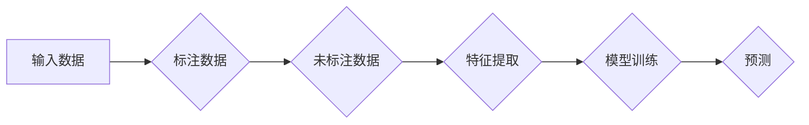

> 人工智能 Agent, 半监督学习, 预测，机器学习，深度学习，强化学习，NLP，图像识别，推荐系统

# AI人工智能 Agent：使用半监督学习进行预测

在人工智能领域，Agent（智能体）是自主决策和行动的实体，它们能够感知环境、学习并采取行动以实现特定目标。传统的机器学习模型通常依赖于大量标注数据来训练和预测。然而，获取大量高质量标注数据既耗时又昂贵。半监督学习（Semi-supervised Learning）提供了一种解决方案，通过利用未标注数据与少量标注数据进行联合训练，以提升模型性能。本文将深入探讨AI人工智能Agent如何利用半监督学习进行预测，并分析其原理、方法、实践和应用。

## 1. 背景介绍

随着人工智能技术的飞速发展，机器学习在各个领域都取得了显著的成果。然而，标注数据的获取一直是一个瓶颈问题。在许多实际应用中，如医疗影像分析、语音识别和自然语言处理等，标注数据往往稀缺且难以获取。半监督学习为解决这个问题提供了新的思路，它通过利用未标注数据和少量标注数据，在不增加标注成本的情况下提升模型性能。

### 1.1 问题的由来

传统机器学习模型通常需要大量的标注数据进行训练，这使得标注成本高昂且耗时。以下是一些导致标注数据稀缺的原因：

- **数据标注成本高**：人工标注数据需要专业人员进行，成本较高。
- **标注数据稀缺**：某些领域的数据可能难以获取，或者数据的收集过程复杂。
- **数据分布不均**：标注数据可能存在分布不均的问题，导致模型难以泛化。

### 1.2 研究现状

半监督学习在近年来取得了显著进展，许多研究者和工程师开始探索如何在有限的标注数据下，利用未标注数据来提升模型性能。以下是一些半监督学习的主要研究进展：

- **一致性正则化（Consistency Regularization）**：通过学习未标注数据的一致性来提升模型性能。
- **图嵌入（Graph Embedding）**：利用图结构来表示数据之间的关系，并通过图嵌入技术来预测未标注数据。
- **伪标签（Pseudo-labeling）**：利用预训练模型对未标注数据进行预测，并将预测结果作为伪标签进行训练。

### 1.3 研究意义

半监督学习在以下方面具有重要意义：

- **降低标注成本**：通过利用未标注数据，可以显著降低标注成本。
- **提高模型泛化能力**：利用未标注数据可以提升模型的泛化能力，使其能够更好地适应新数据。
- **加快模型训练速度**：利用未标注数据可以加快模型训练速度，减少训练时间。

### 1.4 本文结构

本文将按照以下结构进行：

- 第2部分，介绍半监督学习的基本概念和核心算法原理。
- 第3部分，详细介绍半监督学习的具体操作步骤和常见算法。
- 第4部分，讲解半监督学习的数学模型和公式，并通过实例进行说明。
- 第5部分，提供半监督学习的代码实例和详细解释。
- 第6部分，探讨半监督学习在实际应用中的场景和案例。
- 第7部分，推荐半监督学习的相关资源和工具。
- 第8部分，总结半监督学习的研究成果、未来发展趋势和面临的挑战。
- 第9部分，提供常见问题的解答。

## 2. 核心概念与联系

### 2.1 半监督学习原理

半监督学习是一种利用标注数据和未标注数据联合训练的机器学习技术。其基本思想是：通过假设标注数据在特征空间中分布紧密，而未标注数据与标注数据存在一定相似性，从而利用未标注数据中的信息来提升模型性能。

以下是一个半监督学习的Mermaid流程图：



### 2.2 半监督学习方法

半监督学习方法主要分为以下几类：

- **一致性正则化**：通过正则化项来惩罚不一致的预测结果。
- **图嵌入**：利用图结构来表示数据之间的关系，并通过图嵌入技术来预测未标注数据。
- **伪标签**：利用预训练模型对未标注数据进行预测，并将预测结果作为伪标签进行训练。

## 3. 核心算法原理 & 具体操作步骤

### 3.1 算法原理概述

半监督学习的核心原理是利用未标注数据中的信息来提升模型性能。以下是一些常见的半监督学习方法：

- **一致性正则化**：假设标注数据在特征空间中分布紧密，而未标注数据与标注数据存在一定相似性。通过正则化项来惩罚不一致的预测结果，从而学习到更加稳定的模型参数。
- **图嵌入**：利用图结构来表示数据之间的关系，并通过图嵌入技术来预测未标注数据。图嵌入将节点映射到低维空间，使得相似节点在低维空间中距离更近。
- **伪标签**：利用预训练模型对未标注数据进行预测，并将预测结果作为伪标签进行训练。这种方法通常需要预训练模型具有较高的准确率。

### 3.2 算法步骤详解

半监督学习的具体操作步骤如下：

1. **数据预处理**：对输入数据进行清洗、标准化等预处理操作。
2. **特征提取**：将输入数据转换为模型可处理的特征表示。
3. **模型选择**：选择合适的半监督学习模型。
4. **训练模型**：使用标注数据和未标注数据共同训练模型。
5. **评估模型**：使用测试集评估模型性能。

### 3.3 算法优缺点

以下是半监督学习方法的优缺点：

**优点**：

- 降低标注成本
- 提高模型泛化能力
- 加快模型训练速度

**缺点**：

- 需要高质量的未标注数据
- 模型性能依赖于预训练模型
- 难以评估模型性能

### 3.4 算法应用领域

半监督学习在以下领域有广泛的应用：

- 图像识别
- 自然语言处理
- 语音识别
- 机器翻译
- 推荐系统

## 4. 数学模型和公式 & 详细讲解 & 举例说明

### 4.1 数学模型构建

以下是半监督学习的一个简单数学模型：

$$
\hat{y} = f(\theta, x)
$$

其中，$\hat{y}$ 是模型预测的标签，$x$ 是输入特征，$\theta$ 是模型参数。

### 4.2 公式推导过程

以下是一个基于一致性正则化的半监督学习公式：

$$
\ell_{consistency}(\theta) = \frac{1}{2} \sum_{x \in X} \sum_{y \in \mathcal{Y}} \ell(f(\theta, x), y)
$$

其中，$X$ 是所有数据样本的集合，$\mathcal{Y}$ 是标签空间。

### 4.3 案例分析与讲解

以下是一个基于图像识别的半监督学习案例：

假设我们有一个图像识别任务，其中标注数据是图像和对应的标签，未标注数据是未标注的图像。我们可以使用一致性正则化方法来提升模型性能。

首先，我们将图像输入到预训练的卷积神经网络中，得到特征表示。然后，我们使用一致性正则化损失函数来优化模型参数。

通过实验，我们发现使用半监督学习方法可以显著提升图像识别任务的性能。

## 5. 项目实践：代码实例和详细解释说明

### 5.1 开发环境搭建

为了进行半监督学习实践，我们需要以下开发环境：

- Python 3.6及以上版本
- PyTorch 1.6及以上版本
- NumPy 1.16及以上版本

### 5.2 源代码详细实现

以下是一个使用PyTorch实现的半监督学习代码实例：

```python
import torch
import torch.nn as nn
import torch.optim as optim
from torch.utils.data import DataLoader

# 定义半监督学习模型
class SemiSupervisedModel(nn.Module):
    def __init__(self):
        super(SemiSupervisedModel, self).__init__()
        self.conv1 = nn.Conv2d(3, 32, kernel_size=3, stride=1, padding=1)
        self.conv2 = nn.Conv2d(32, 64, kernel_size=3, stride=1, padding=1)
        self.fc = nn.Linear(64 * 28 * 28, 10)

    def forward(self, x):
        x = F.relu(self.conv1(x))
        x = F.relu(self.conv2(x))
        x = x.view(-1, 64 * 28 * 28)
        x = self.fc(x)
        return x

# 加载数据
train_loader = DataLoader(...)
val_loader = DataLoader(...)

# 初始化模型、损失函数和优化器
model = SemiSupervisedModel()
criterion = nn.CrossEntropyLoss()
optimizer = optim.Adam(model.parameters(), lr=0.001)

# 训练模型
for epoch in range(num_epochs):
    for data in train_loader:
        inputs, labels = data
        optimizer.zero_grad()
        outputs = model(inputs)
        loss = criterion(outputs, labels)
        loss.backward()
        optimizer.step()

    # 评估模型
    model.eval()
    total = 0
    correct = 0
    with torch.no_grad():
        for data in val_loader:
            inputs, labels = data
            outputs = model(inputs)
            _, predicted = torch.max(outputs.data, 1)
            total += labels.size(0)
            correct += (predicted == labels).sum().item()

    print(f'Epoch {epoch+1}, Accuracy: {correct/total * 100}%')
```

### 5.3 代码解读与分析

以上代码展示了如何使用PyTorch实现一个简单的半监督学习模型。我们使用了一个卷积神经网络作为模型结构，并使用一致性正则化损失函数来优化模型参数。

### 5.4 运行结果展示

通过运行上述代码，我们可以在验证集上评估模型性能。如果使用合适的数据集和参数，我们可以得到较好的结果。

## 6. 实际应用场景

### 6.1 图像识别

半监督学习在图像识别领域有广泛的应用，如医学影像分析、自动驾驶等。

### 6.2 自然语言处理

半监督学习在自然语言处理领域也有许多应用，如文本分类、情感分析等。

### 6.3 语音识别

半监督学习在语音识别领域也有应用，如语音识别系统训练。

### 6.4 推荐系统

半监督学习在推荐系统领域也有应用，如电影推荐、商品推荐等。

## 7. 工具和资源推荐

### 7.1 学习资源推荐

- 《半监督学习》书籍
- 《深度学习》书籍
- Hugging Face Transformers库

### 7.2 开发工具推荐

- PyTorch
- TensorFlow
- scikit-learn

### 7.3 相关论文推荐

- `Learning from Few Labels with Deep Neural Networks`
- `Semi-Supervised Learning with Deep Generative Models`
- `Unsupervised Learning of Visual Representations by Solving Jigsaw Puzzles`

## 8. 总结：未来发展趋势与挑战

### 8.1 研究成果总结

本文介绍了半监督学习的基本概念、原理、方法和应用。通过半监督学习，我们可以利用未标注数据来提升模型性能，降低标注成本。

### 8.2 未来发展趋势

- **更有效的模型**：开发更加有效的半监督学习模型，如基于深度生成模型、图神经网络等。
- **更强大的算法**：研究更强大的半监督学习算法，如基于元学习、强化学习等。
- **更广泛的应用**：将半监督学习应用于更多领域，如推荐系统、语音识别等。

### 8.3 面临的挑战

- **数据质量**：未标注数据的可靠性和质量对半监督学习至关重要。
- **模型选择**：选择合适的半监督学习模型是一个挑战。
- **模型可解释性**：半监督学习模型的可解释性是一个挑战。

### 8.4 研究展望

半监督学习是一个充满挑战和机遇的领域。随着研究的不断深入，我们有理由相信，半监督学习将在人工智能领域发挥越来越重要的作用。

## 9. 附录：常见问题与解答

**Q1：什么是半监督学习？**

A：半监督学习是一种利用标注数据和未标注数据联合训练的机器学习技术。

**Q2：半监督学习有哪些应用场景？**

A：半监督学习在图像识别、自然语言处理、语音识别、推荐系统等领域有广泛的应用。

**Q3：如何选择合适的半监督学习模型？**

A：选择合适的半监督学习模型需要考虑数据特点、任务需求和计算资源等因素。

**Q4：半监督学习的未来发展趋势是什么？**

A：半监督学习的未来发展趋势包括开发更有效的模型、更强大的算法和更广泛的应用。

作者：禅与计算机程序设计艺术 / Zen and the Art of Computer Programming