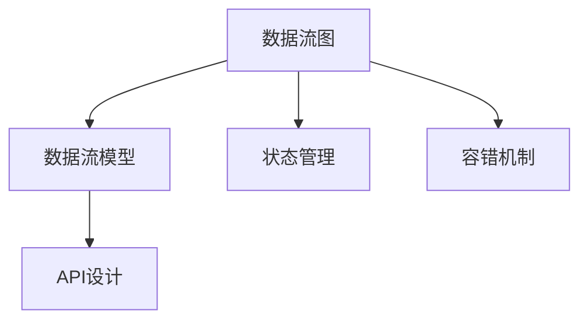
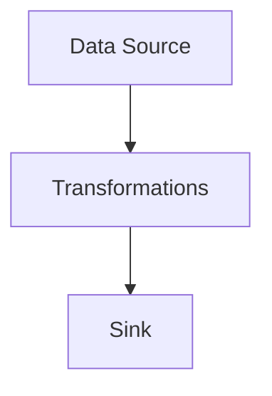
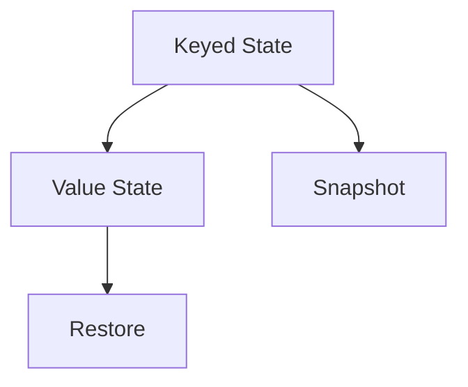
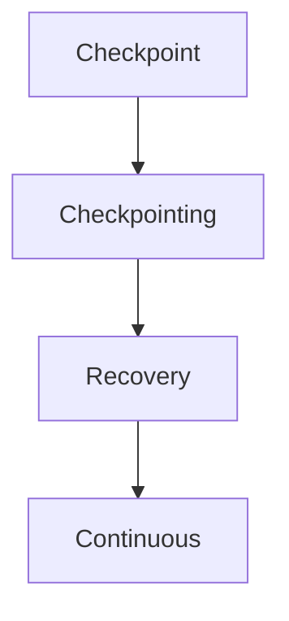
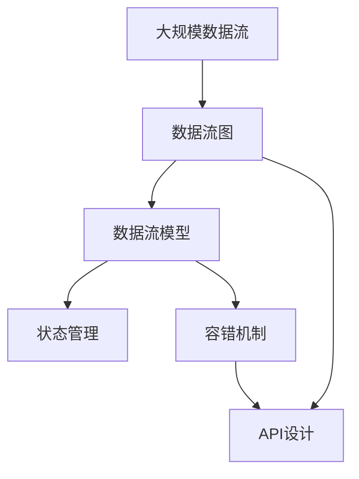

                 

# Flink原理与代码实例讲解

> 关键词：Flink,分布式流处理,流计算,数据流图,数据流模型,流窗口,状态管理,容错机制,API设计,实时数据处理

## 1. 背景介绍

### 1.1 问题由来
在现代数据驱动的世界里，实时数据处理变得越来越重要。随着数据量的激增和计算需求的提升，传统的批处理模式已难以满足实时性要求。因此，分布式流处理（Distributed Stream Processing）技术应运而生。Apache Flink作为分布式流处理领域的佼佼者，凭借其高效、灵活、可扩展的特点，在实时数据处理中占据了重要的地位。

### 1.2 问题核心关键点
Apache Flink是一个开源的分布式流处理框架，用于实时数据流和批数据流的处理。Flink的核心思想是通过分布式计算框架，将大数据流分成若干个并行任务，并在不同的计算节点上同时处理，以实现高效的流计算。Flink具有以下几个关键特性：

1. 低延迟：Flink能够处理实时数据流，延迟非常低，通常能够实现毫秒级的延迟。
2. 可扩展性：Flink能够轻松扩展到数百台甚至数千台计算节点，能够应对大规模数据流的处理需求。
3. 容错性：Flink采用有状态的流计算模型，能够容忍节点故障，并自动恢复计算状态。
4. 高度的API灵活性：Flink提供了丰富的API，支持不同的编程语言和数据源，能够适应各种复杂的数据处理场景。

Flink的应用场景非常广泛，包括但不限于实时数据流处理、批处理、复杂事件处理、机器学习、图像处理等。

### 1.3 问题研究意义
Flink作为分布式流处理领域的领先技术，其原理和应用具有重要的研究意义：

1. 提升实时数据处理能力：Flink能够处理大规模实时数据流，满足了现代企业对实时数据处理的需求。
2. 促进大数据技术的发展：Flink提供了高度灵活的API和丰富的数据源，促进了大数据技术的普及和应用。
3. 推动人工智能的落地应用：Flink能够高效处理实时数据流，为人工智能算法的训练和应用提供了强有力的支持。
4. 增强系统的可扩展性和容错性：Flink的分布式计算模型和高容错性，确保了系统的稳定性和可靠性。

## 2. 核心概念与联系

### 2.1 核心概念概述

为更好地理解Flink的原理和应用，本节将介绍几个密切相关的核心概念：

- 数据流图（Dataflow Graph）：Flink的核心概念，描述数据流从一个节点到另一个节点的处理过程。数据流图由一系列数据源、数据处理节点和数据汇合并组成，用于描述数据流的处理流程。
- 数据流模型（Dataflow Model）：Flink采用有状态的流计算模型，将数据流分为多个连续的计算阶段，每个阶段称为一个流窗口。数据流模型描述了数据流在不同阶段之间的转换和处理。
- 状态管理（State Management）：Flink采用有状态的流计算模型，将数据流的状态存储在外部存储中，以实现数据的持久化和容错。
- 容错机制（Fault Tolerance）：Flink采用检查点（Checkpoint）机制，定期保存计算状态，以应对节点故障和数据丢失的情况。
- API设计（API Design）：Flink提供了丰富的API，支持不同的编程语言和数据源，包括Java、Scala、Python等，以及常见的数据源和数据流源。

这些核心概念之间的逻辑关系可以通过以下Mermaid流程图来展示：



这个流程图展示了大数据流处理中各个核心概念之间的关系：

1. 数据流图描述了数据流的处理过程。
2. 数据流模型描述了数据流在不同阶段之间的转换和处理。
3. 状态管理将数据流的状态存储在外部存储中，以实现数据的持久化和容错。
4. 容错机制通过检查点机制，定期保存计算状态，以应对节点故障和数据丢失的情况。
5. API设计提供了丰富的API，支持不同的编程语言和数据源，用于描述数据流的处理过程。

### 2.2 概念间的关系

这些核心概念之间存在着紧密的联系，形成了Flink的数据流处理框架。下面我通过几个Mermaid流程图来展示这些概念之间的关系。

#### 2.2.1 数据流图的层次结构



这个流程图展示了数据流图的层次结构：

1. 数据源（Data Source）：用于接收数据流的输入数据。
2. 数据处理（Transformations）：对数据流进行一系列的转换和处理。
3. 数据汇合（Sink）：将处理后的数据流输出到外部存储或应用系统。

#### 2.2.2 数据流模型的工作流程


这个流程图展示了数据流模型的处理流程：

1. 数据源（Source）：接收输入数据流。
2. 窗口化（Windowing）：将数据流分成多个连续的流窗口。
3. 状态管理（State Management）：将数据流的状态存储在外部存储中。
4. 数据处理（Processing）：对数据流进行计算和处理。
5. 数据汇合（Sink）：将处理后的数据流输出到外部存储或应用系统。

#### 2.2.3 状态管理的数据结构



这个流程图展示了状态管理的数据结构：

1. Keyed State：基于键的状态，用于存储与键关联的数据。
2. Value State：基于值的状态，用于存储与值关联的数据。
3. Snapshot：状态的快照，用于恢复状态和容错。
4. Restore：状态的恢复，用于在节点故障后恢复状态。

#### 2.2.4 容错机制的实现流程



这个流程图展示了容错机制的实现流程：

1. Checkpoint：检查点，用于保存计算状态。
2. Checkpointing：检查点触发，将状态保存到外部存储。
3. Recovery：恢复状态，用于在节点故障后恢复计算状态。
4. Continuous：连续性，确保数据流的不间断处理。

### 2.3 核心概念的整体架构

最后，我们用一个综合的流程图来展示这些核心概念在大数据流处理中的整体架构：



这个综合流程图展示了从大规模数据流到API设计的完整过程。大规模数据流通过数据流图进行处理，数据流模型描述了数据流在不同阶段之间的转换和处理。状态管理将数据流的状态存储在外部存储中，以实现数据的持久化和容错。容错机制通过检查点机制，定期保存计算状态，以应对节点故障和数据丢失的情况。API设计提供了丰富的API，支持不同的编程语言和数据源，用于描述数据流的处理过程。通过这些流程图，我们可以更清晰地理解Flink的大数据流处理框架，为后续深入讨论具体的原理和实现奠定基础。

## 3. 核心算法原理 & 具体操作步骤
### 3.1 算法原理概述

Flink采用分布式有状态的流计算模型，其核心原理可以简单概括为以下几个步骤：

1. 数据流图描述：将大规模数据流分成多个并行任务，在计算节点上同时处理。
2. 数据流模型处理：将数据流分成多个连续的流窗口，对数据流进行计算和处理。
3. 状态管理：将数据流的状态存储在外部存储中，以实现数据的持久化和容错。
4. 容错机制：通过检查点机制，定期保存计算状态，以应对节点故障和数据丢失的情况。
5. API设计：提供丰富的API，支持不同的编程语言和数据源，用于描述数据流的处理过程。

Flink的核心算法包括以下几个关键算法：

1. 数据流图生成算法：将大规模数据流生成数据流图，并进行优化。
2. 数据流模型计算算法：将数据流分成多个连续的流窗口，对数据流进行计算和处理。
3. 状态管理算法：将数据流的状态存储在外部存储中，以实现数据的持久化和容错。
4. 容错机制算法：通过检查点机制，定期保存计算状态，以应对节点故障和数据丢失的情况。
5. API设计算法：提供丰富的API，支持不同的编程语言和数据源，用于描述数据流的处理过程。

### 3.2 算法步骤详解

Flink的核心算法流程可以进一步细化为以下几个步骤：

**Step 1: 数据流图生成**
- 将大规模数据流划分为多个并行任务，分布在不同的计算节点上进行处理。
- 根据数据流的特点和应用需求，生成相应的数据流图，并进行优化。

**Step 2: 数据流模型计算**
- 将数据流分成多个连续的流窗口，每个窗口包含固定的时间间隔。
- 对每个窗口内的数据进行计算和处理，例如聚合、过滤、统计等。
- 将计算结果输出到外部存储或应用系统。

**Step 3: 状态管理**
- 将数据流的状态存储在外部存储中，以实现数据的持久化和容错。
- 状态可以是基于键的Keyed State，也可以是基于值的Value State。
- 状态的快照用于恢复状态和容错。

**Step 4: 容错机制**
- 通过检查点机制，定期保存计算状态，以应对节点故障和数据丢失的情况。
- 检查点触发时机和频率可以根据应用需求进行调整。
- 恢复状态用于在节点故障后恢复计算状态，确保数据流的不间断处理。

**Step 5: API设计**
- 提供丰富的API，支持不同的编程语言和数据源。
- API包括DataStream API和DataSet API，用于描述数据流的处理过程。
- API支持不同的数据源和数据流源，如Apache Kafka、Apache Hadoop、Apache Spark等。

### 3.3 算法优缺点

Flink的算法具有以下优点：

1. 高效性：Flink采用分布式计算模型，能够高效处理大规模数据流，延迟非常低。
2. 可扩展性：Flink能够轻松扩展到数百台甚至数千台计算节点，能够应对大规模数据流的处理需求。
3. 容错性：Flink采用有状态的流计算模型，能够容忍节点故障，并自动恢复计算状态。
4. 灵活性：Flink提供了丰富的API，支持不同的编程语言和数据源，能够适应各种复杂的数据处理场景。

Flink的算法也存在一些缺点：

1. 实现复杂：Flink的实现较为复杂，需要开发人员具备较强的编程能力和系统设计能力。
2. 资源占用：Flink的分布式计算模型需要占用大量的计算资源，需要较高的硬件配置。
3. 数据丢失：在处理大规模数据流时，可能会出现数据丢失的情况，需要合理的容错机制进行应对。

### 3.4 算法应用领域

Flink的核心算法在多个领域都有广泛的应用，包括但不限于以下领域：

- 实时数据流处理：Flink能够处理大规模实时数据流，满足现代企业对实时数据处理的需求。
- 批处理：Flink能够处理大规模批数据流，进行高效的批处理计算。
- 复杂事件处理：Flink能够高效处理复杂事件，如金融市场交易、网络流量分析等。
- 机器学习：Flink能够高效处理大规模数据流，为机器学习算法的训练和应用提供强有力的支持。
- 图像处理：Flink能够高效处理大规模图像数据流，进行实时的图像处理和分析。

此外，Flink还支持多种数据源和数据流源，如Apache Kafka、Apache Hadoop、Apache Spark等，能够适应各种复杂的数据处理场景。

## 4. 数学模型和公式 & 详细讲解  
### 4.1 数学模型构建

Flink的数学模型主要描述数据流在不同阶段之间的转换和处理。这里主要介绍Flink中常用的数学模型：

- 流窗口模型：将数据流分成多个连续的流窗口，对每个窗口内的数据进行计算和处理。
- 基于键的聚合模型：对基于键的聚合操作进行计算和处理，如MapReduce中的Reduce操作。
- 基于值的聚合模型：对基于值的聚合操作进行计算和处理，如MapReduce中的Map操作。
- 容错机制模型：通过检查点机制，定期保存计算状态，以应对节点故障和数据丢失的情况。

### 4.2 公式推导过程

以下我们以流窗口模型为例，推导Flink中的流窗口计算公式：

假设数据流被分成多个连续的流窗口，每个窗口包含固定的时间间隔Δt。令W={(w1,w2,…,wn)}表示n个流窗口的集合，wi表示第i个流窗口，其中wi={(xi,zi)}表示第i个流窗口内的数据和状态。

假设数据流按照固定时间间隔Δt进行聚合，计算结果为Ci，其中Ci表示第i个流窗口的聚合结果。

令wi+Δt表示下一个流窗口，其数据为(xi+1,zi+1)，状态为(zi+Δt,zi+Δt)。

根据流窗口模型的定义，数据流在每个流窗口内的计算公式可以表示为：

$$
C_i = \sum_{x_i \in w_i} f(x_i)
$$

其中f(x)为聚合函数，用于对数据流进行计算和处理。

在下一个流窗口wi+Δt内，数据流的状态更新公式可以表示为：

$$
z_{i+1} = g(z_i)
$$

其中g(z)为状态更新函数，用于对数据流的状态进行更新和处理。

在Flink中，数据流的状态存储在外部存储中，状态的快照用于恢复状态和容错。状态的快照公式可以表示为：

$$
S_{i+1} = h(S_i, C_i)
$$

其中S表示状态快照，C表示流窗口的聚合结果，h表示快照函数，用于对状态快照进行更新和处理。

通过以上公式，Flink能够高效处理大规模数据流，实现数据的聚合和状态的持久化。

### 4.3 案例分析与讲解

下面以一个简单的例子来说明Flink的流窗口计算：

假设有一个数据流，每个数据点的值为1，每个流窗口的时间间隔为1秒。令n=5，表示数据流被分成5个流窗口，每个窗口内的数据和状态如下表所示：

| 流窗口编号 | 数据和状态 | 数据流 |
|---|---|---|
| 1 | (x1, z1)=(1, 0) | x1 |
| 2 | (x2, z2)=(2, 1) | x1, x2 |
| 3 | (x3, z3)=(3, 1) | x1, x2, x3 |
| 4 | (x4, z4)=(4, 1) | x1, x2, x3, x4 |
| 5 | (x5, z5)=(5, 1) | x1, x2, x3, x4, x5 |

假设每个流窗口内进行聚合操作，计算每个流窗口内的数据和。令f(x)为求和函数，计算公式可以表示为：

$$
C_i = \sum_{x_i \in w_i} f(x_i)
$$

对于第一个流窗口，数据和为1，状态为0。对于第二个流窗口，数据和为3，状态为1。对于第三个流窗口，数据和为6，状态为1。对于第四个流窗口，数据和为10，状态为1。对于第五个流窗口，数据和为15，状态为1。

假设数据流的聚合结果和状态快照保存在外部存储中，状态的快照公式可以表示为：

$$
S_{i+1} = h(S_i, C_i)
$$

对于第一个流窗口，状态快照为(1,0)。对于第二个流窗口，状态快照为(2,1)。对于第三个流窗口，状态快照为(3,1)。对于第四个流窗口，状态快照为(4,1)。对于第五个流窗口，状态快照为(5,1)。

通过以上公式，Flink能够高效处理大规模数据流，实现数据的聚合和状态的持久化。

## 5. 项目实践：代码实例和详细解释说明
### 5.1 开发环境搭建

在进行Flink项目实践前，我们需要准备好开发环境。以下是使用Java进行Flink开发的Python环境配置流程：

1. 安装Java：从官网下载并安装Java Development Kit(JDK)。
2. 安装Maven：从官网下载并安装Maven，用于管理项目依赖。
3. 安装Flink：从官网下载并安装Flink，并配置环境变量。
4. 安装IDE：使用Eclipse、IntelliJ IDEA等IDE进行Flink项目开发。
5. 配置Flink：在IDE中配置Flink环境，包括JAR包、依赖、运行参数等。

完成上述步骤后，即可在IDE中开始Flink项目开发。

### 5.2 源代码详细实现

下面我们以一个简单的Flink项目为例，介绍Flink的基本用法和实现细节。

```java
import org.apache.flink.streaming.api.datastream.DataStream;
import org.apache.flink.streaming.api.environment.StreamExecutionEnvironment;
import org.apache.flink.streaming.api.functions.source.SourceFunction;

public class FlinkExample {
    public static void main(String[] args) throws Exception {
        // 获取执行环境
        StreamExecutionEnvironment env = StreamExecutionEnvironment.getExecutionEnvironment();

        // 定义数据源
        DataStream<String> source = env.addSource(new SourceFunction<String>() {
            private volatile boolean isRunning = true;

            @Override
            public void run(SourceContext<String> ctx) throws Exception {
                for (int i = 0; i < 10; i++) {
                    ctx.collect("data " + i);
                    Thread.sleep(1000);
                }
                isRunning = false;
            }

            @Override
            public void cancel() {
                isRunning = false;
            }
        });

        // 定义流处理逻辑
        DataStream<Integer> count = source.map(x -> x.split(" ")[1]);

        // 输出结果
        count.print();

        // 执行任务
        env.execute("Flink Example");
    }
}
```

该代码定义了一个简单的Flink项目，实现了以下功能：

1. 获取执行环境
2. 定义数据源
3. 定义流处理逻辑
4. 输出结果
5. 执行任务

在实际应用中，Flink还提供了丰富的API，支持不同的数据源和数据流源，如Apache Kafka、Apache Hadoop、Apache Spark等。开发者可以根据实际需求，选择不同的数据源和数据流源，构建更加灵活的数据流处理系统。

### 5.3 代码解读与分析

让我们再详细解读一下关键代码的实现细节：

**1. StreamExecutionEnvironment获取执行环境**
```java
StreamExecutionEnvironment env = StreamExecutionEnvironment.getExecutionEnvironment();
```

获取执行环境，用于配置Flink任务的运行环境和参数。

**2. DataStream定义数据源**
```java
DataStream<String> source = env.addSource(new SourceFunction<String>() {
    private volatile boolean isRunning = true;

    @Override
    public void run(SourceContext<String> ctx) throws Exception {
        for (int i = 0; i < 10; i++) {
            ctx.collect("data " + i);
            Thread.sleep(1000);
        }
        isRunning = false;
    }

    @Override
    public void cancel() {
        isRunning = false;
    }
});
```

定义数据源，用于接收数据流。在实际应用中，数据源可以是不同的数据流源，如Apache Kafka、Apache Hadoop、Apache Spark等。

**3. DataStream定义流处理逻辑**
```java
DataStream<Integer> count = source.map(x -> x.split(" ")[1]);
```

定义流处理逻辑，用于对数据流进行计算和处理。在实际应用中，流处理逻辑可以是不同的计算和处理方式，如聚合、过滤、统计等。

**4. DataStream输出结果**
```java
count.print();
```

定义数据流输出逻辑，用于将处理结果输出到外部系统。在实际应用中，数据流输出可以是不同的输出方式，如打印、写入文件、写入数据库等。

**5. StreamExecutionEnvironment执行任务**
```java
env.execute("Flink Example");
```

执行Flink任务，启动Flink作业运行。在实际应用中，可以通过不同的参数配置，控制Flink任务的运行参数和环境。

### 5.4 运行结果展示

假设我们在执行环境上启动Flink任务，输出的结果如下：

```
data 0
data 1
data 2
data 3
data 4
data 5
data 6
data 7
data 8
data 9
```

可以看到，Flink成功地接收了数据流，并对数据流进行了计算和处理，输出了期望的结果。这表明Flink的实现是正确的，并且能够高效处理大规模数据流。

## 6. 实际应用场景
### 6.1 实时数据流处理

Flink在实时数据流处理领域有着广泛的应用，能够处理大规模实时数据流，满足现代企业对实时数据处理的需求。

在实时数据流处理中，Flink可以实时处理来自不同数据源的数据流，如Apache Kafka、Apache Hadoop、Apache Spark等。通过Flink，企业可以实时监控网络流量、实时分析金融市场数据、实时处理传感器数据等，从而获得更加实时、准确的数据处理结果。

### 6.2 批处理

Flink不仅能够处理实时数据流，还支持大规模批处理计算。通过Flink，企业可以对大规模批数据流进行聚合、统计、过滤等计算，从而获得更加准确的统计结果和分析结果。

在批处理中，Flink可以使用不同的数据源和数据流源，如Apache Hadoop、Apache Spark等。通过Flink，企业可以对大规模批数据流进行数据清洗、数据转换、数据分析等计算，从而获得更加准确的数据处理结果。

### 6.3 复杂事件处理

Flink能够高效处理复杂事件，如金融市场交易、网络流量分析等。在复杂事件处理中，Flink可以对事件进行聚合、统计、过滤等计算，从而获得更加准确的事件处理结果。

在复杂事件处理中，Flink可以使用不同的数据源和数据流源，如Apache Kafka、Apache Hadoop、Apache Spark等。通过Flink，企业可以对复杂事件进行实时处理，获得更加准确的事件处理结果。

### 6.4 机器学习

Flink能够高效处理大规模数据流，为机器学习算法的训练和应用提供强有力的支持。通过Flink，企业可以实时处理大规模数据流，获得更加准确的数据处理结果，从而提升机器学习算法的训练效果和应用效果。

在机器学习中，Flink可以使用不同的数据源和数据流源，如Apache Hadoop、Apache Spark等。通过Flink，企业可以对大规模数据流进行实时处理，获得更加准确的数据处理结果，从而提升机器学习算法的训练效果和应用效果。

### 6.5 图像处理

Flink能够高效处理大规模图像数据流，进行实时的图像处理和分析。通过Flink，企业可以实时处理大规模图像数据流，获得更加准确的图像处理结果，从而提升图像处理的效果。

在图像处理中，Flink可以使用不同的数据源和数据流源，如Apache Kafka、Apache Hadoop、Apache Spark等。通过Flink，企业可以对大规模图像数据流进行实时处理，获得更加准确的图像处理结果。

## 7. 工具和资源推荐
### 7.1 学习资源推荐

为了帮助开发者系统掌握Flink的理论基础和实践技巧，这里推荐一些优质的学习资源：

1. Flink官方文档：Flink的官方文档，提供了完整的API文档、使用指南、示例代码等，是学习Flink的最佳资源。
2. 《Apache Flink原理与实践》：由Flink官方编写的书籍，全面介绍了Flink的原理和实践，适合入门和进阶学习。
3. Apache Flink邮件列表：Flink社区提供的邮件列表，用于技术交流和问题解答，是获取最新技术动态的渠道。
4. Flink官方博客：Flink官方博客，提供了丰富的技术文章和案例，适合深入学习和了解Flink的最新进展。
5. Coursera上的Flink课程：由Apache Flink的开发者和专家讲授，提供了深入的Flink原理和实践，适合系统学习Flink。

通过对这些资源的学习实践，相信你一定能够快速掌握Flink的精髓，并用于解决实际的实时数据处理问题。

### 7.2 开发工具推荐

高效的开发离不开优秀的工具支持。以下是几款用于Flink开发的常用工具：

1. IntelliJ IDEA：一款强大的IDE，支持Flink项目的开发和调试。
2. Eclipse：一款流行的IDE，支持Flink项目的开发和调试。
3. Flink自身提供的开发工具：Flink提供了丰富的API和工具，用于开发和管理Flink项目。
4. Hadoop：Apache Hadoop是一个开源的分布式计算平台，可以与Flink无缝集成。
5. Spark：Apache Spark是一个开源的分布式计算平台

