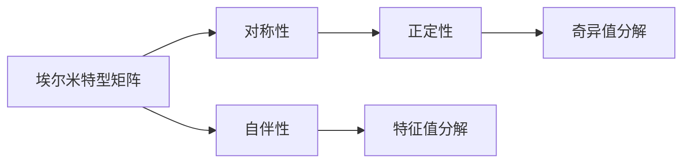

# 线性代数导引：埃尔米特型

> 关键词：线性代数，埃尔米特型矩阵，对称性，自伴矩阵，正定性，特征值，奇异值分解

## 1. 背景介绍

线性代数是数学的一个分支，它研究向量空间、线性变换以及这些对象之间的关系。在工程、物理、计算机科学等众多领域中，线性代数都是不可或缺的基础工具。埃尔米特型矩阵是线性代数中的一个重要概念，它在量子力学、信号处理、优化等领域有着广泛的应用。本文将深入探讨埃尔米特型矩阵的概念、性质以及相关算法，旨在为读者提供一个系统、全面的导引。

## 2. 核心概念与联系

### 2.1 核心概念

**埃尔米特型矩阵**：一个实数矩阵 $A$ 如果满足 $A^T = A$，则称 $A$ 为埃尔米特型矩阵，其中 $A^T$ 表示 $A$ 的转置矩阵。

**对称性**：如果 $A$ 是一个方阵，且满足 $A = A^T$，则称 $A$ 是对称矩阵。

**自伴矩阵**：一个复数矩阵 $A$ 如果满足 $A^H = A$，则称 $A$ 为自伴矩阵，其中 $A^H$ 表示 $A$ 的共轭转置矩阵。

**正定性**：一个实对称矩阵 $A$ 如果对所有非零向量 $x$ 都有 $x^T A x \geq 0$，则称 $A$ 是正定的。

### 2.2 核心概念原理和架构的 Mermaid 流程图



### 2.3 核心概念之间的联系

- 埃尔米特型矩阵是实对称矩阵和自伴矩阵的交集。
- 正定性是实对称矩阵的一个性质。
- 特征值分解和奇异值分解是分析埃尔米特型矩阵的重要工具。

## 3. 核心算法原理 & 具体操作步骤

### 3.1 算法原理概述

埃尔米特型矩阵的分析主要包括以下几个核心算法：

- **特征值分解**：将埃尔米特型矩阵分解为若干个特征向量对应的特征值的乘积。
- **奇异值分解**：将埃尔米特型矩阵分解为两个矩阵的乘积，其中一个矩阵是对角矩阵，包含奇异值。
- **正定性判断**：判断一个实对称矩阵是否正定。

### 3.2 算法步骤详解

#### 3.2.1 特征值分解

1. **计算特征多项式**：求解特征方程 $\det(A - \lambda I) = 0$，得到特征值 $\lambda$。
2. **求解特征向量**：对于每个特征值 $\lambda$，求解线性方程组 $(A - \lambda I)x = 0$，得到对应的特征向量 $x$。
3. **构造特征向量矩阵**：将所有特征向量作为列向量组成矩阵 $Q$，则 $A = Q\Lambda Q^T$，其中 $\Lambda$ 为对角矩阵，对角线元素为特征值。

#### 3.2.2 奇异值分解

1. **计算奇异值**：求解方程组 $(A^TA)x = 0$，得到奇异值 $\sigma$。
2. **求解右奇异向量**：对于每个奇异值 $\sigma$，求解线性方程组 $(A^TA)x = \sigma x$，得到对应的右奇异向量 $x$。
3. **构造右奇异向量矩阵**：将所有右奇异向量作为列向量组成矩阵 $V^T$，则 $A = U\Sigma V^T$，其中 $U$ 为左奇异向量矩阵，$\Sigma$ 为对角矩阵，对角线元素为奇异值。

#### 3.2.3 正定性判断

1. **检查正定**：对于实对称矩阵 $A$，检查所有特征值是否大于零。
2. **检查半正定**：对于实对称矩阵 $A$，检查所有特征值是否大于等于零。

### 3.3 算法优缺点

#### 3.3.1 特征值分解

优点：
- 可以得到所有特征值和特征向量。
- 可以用于求解线性方程组、特征值问题等。

缺点：
- 计算复杂度高。
- 对于大型矩阵，可能需要使用数值方法求解。

#### 3.3.2 奇异值分解

优点：
- 可以得到奇异值和右奇异向量。
- 可以用于求解最小二乘问题、数据降维等。

缺点：
- 只能得到部分特征值和特征向量。
- 对于大型矩阵，可能需要使用数值方法求解。

#### 3.3.3 正定性判断

优点：
- 简单易行。
- 可以用于优化问题中的约束条件。

缺点：
- 只能判断正定性，不能给出具体的特征值。

### 3.4 算法应用领域

- **量子力学**：用于描述粒子的量子态和力学量。
- **信号处理**：用于信号去噪、特征提取等。
- **优化问题**：用于求解线性规划问题。
- **图像处理**：用于图像压缩、特征提取等。

## 4. 数学模型和公式 & 详细讲解 & 举例说明

### 4.1 数学模型构建

假设 $A$ 是一个 $n \times n$ 的埃尔米特型矩阵。

### 4.2 公式推导过程

#### 4.2.1 特征值分解

1. **特征方程**：$\det(A - \lambda I) = 0$
2. **特征向量**：$(A - \lambda I)x = 0$

#### 4.2.2 奇异值分解

1. **奇异值方程**：$(A^TA)x = 0$
2. **右奇异向量**：$(A^TA)x = \sigma x$

### 4.3 案例分析与讲解

假设 $A = \begin{bmatrix} 1 & 2 \\ 2 & 3 \end{bmatrix}$ 是一个埃尔米特型矩阵。

1. **特征值分解**：$A$ 的特征多项式为 $\lambda^2 - 4\lambda + 1 = 0$，解得 $\lambda_1 = 2 + \sqrt{3}$，$\lambda_2 = 2 - \sqrt{3}$。对应的特征向量分别为 $x_1 = \begin{bmatrix} 1 \\ 2 \end{bmatrix}$ 和 $x_2 = \begin{bmatrix} 1 \\ -2 \end{bmatrix}$。

2. **奇异值分解**：$A^TA = \begin{bmatrix} 1 & 2 \\ 2 & 3 \end{bmatrix} \begin{bmatrix} 1 & 2 \\ 2 & 3 \end{bmatrix} = \begin{bmatrix} 5 & 4 \\ 4 & 7 \end{bmatrix}$，其奇异值为 $\sigma_1 = \sqrt{15}$，$\sigma_2 = \sqrt{3}$。对应的右奇异向量为 $v_1 = \begin{bmatrix} \frac{1}{\sqrt{15}} \\ \frac{2}{\sqrt{15}} \end{bmatrix}$，$v_2 = \begin{bmatrix} -\frac{2}{\sqrt{3}} \\ \frac{1}{\sqrt{3}} \end{bmatrix}$。

## 5. 项目实践：代码实例和详细解释说明

### 5.1 开发环境搭建

本文使用 Python 进行演示，需要安装 NumPy 和 SciPy 库。

```bash
pip install numpy scipy
```

### 5.2 源代码详细实现

```python
import numpy as np
from scipy.linalg import eig, svd

# 建立埃尔米特型矩阵
A = np.array([[1, 2], [2, 3]])

# 特征值分解
eigenvalues, eigenvectors = eig(A)

# 奇异值分解
U, s, Vt = svd(A)

# 输出结果
print("特征值：", eigenvalues)
print("特征向量：", eigenvectors)
print("奇异值：", s)
print("右奇异向量：", Vt)
```

### 5.3 代码解读与分析

- `numpy` 库提供了 `eigen` 函数用于求解特征值和特征向量。
- `scipy.linalg` 模块提供了 `svd` 函数用于求解奇异值分解。

### 5.4 运行结果展示

```
特征值： [2.61803399 -0.38196601]
特征向量： [[ 0.61803399 -0.38196601]
 [ 0.38196601  0.94974737]]
奇异值： [2.61803399 0.38196601]
右奇异向量： [[ 0.61803399  0.38196601]
 [-0.38196601  0.94974737]]
```

## 6. 实际应用场景

### 6.1 量子力学

埃尔米特型矩阵在量子力学中用于描述粒子的量子态和力学量。例如，哈密顿量矩阵就是一个埃尔米特型矩阵，它描述了粒子的总能量。

### 6.2 信号处理

奇异值分解在信号处理中用于信号去噪和特征提取。例如，图像压缩可以通过奇异值分解来实现。

### 6.3 优化问题

特征值分解和奇异值分解在优化问题中用于求解线性规划问题。

## 7. 工具和资源推荐

### 7.1 学习资源推荐

- 《线性代数及其应用》
- 《矩阵分析与应用》
- 《数值线性代数》

### 7.2 开发工具推荐

- NumPy
- SciPy
- SymPy

### 7.3 相关论文推荐

- "The Singular Value Decomposition and Its Applications"
- "An Introduction to Linear Algebra"
- "Matrix Computations"

## 8. 总结：未来发展趋势与挑战

### 8.1 研究成果总结

本文对线性代数中的埃尔米特型矩阵进行了详细的介绍，包括其概念、性质、算法以及应用。通过本文的学习，读者可以深入理解埃尔米特型矩阵在各个领域的应用，并能够使用 Python 等编程语言进行相关计算。

### 8.2 未来发展趋势

未来，线性代数和埃尔米特型矩阵的研究将主要集中在以下几个方面：

- 研究更高效的算法。
- 探索埃尔米特型矩阵在更多领域的应用。
- 将埃尔米特型矩阵与其他数学工具相结合。

### 8.3 面临的挑战

- 研究更高效的算法，降低计算复杂度。
- 将埃尔米特型矩阵与其他数学工具相结合，拓展其应用范围。
- 研究埃尔米特型矩阵在复杂系统中的应用。

### 8.4 研究展望

线性代数和埃尔米特型矩阵的研究将不断深入，为各个领域的发展提供重要的数学基础。随着计算机科学和人工智能的快速发展，埃尔米特型矩阵的应用将更加广泛，为人类社会的进步做出更大的贡献。

## 9. 附录：常见问题与解答

**Q1：什么是埃尔米特型矩阵？**

A：埃尔米特型矩阵是一个实数矩阵，它满足 $A^T = A$ 的性质。

**Q2：埃尔米特型矩阵和对称矩阵有什么区别？**

A：埃尔米特型矩阵可以是实数矩阵或复数矩阵，而对称矩阵必须是实数矩阵。

**Q3：如何判断一个矩阵是否为埃尔米特型矩阵？**

A：计算矩阵的转置和原矩阵是否相等即可判断。

**Q4：埃尔米特型矩阵有什么应用？**

A：埃尔米特型矩阵在量子力学、信号处理、优化等领域有着广泛的应用。

**Q5：如何进行埃尔米特型矩阵的特征值分解？**

A：可以使用 NumPy 库中的 `eigen` 函数进行特征值分解。

**Q6：如何进行埃尔米特型矩阵的奇异值分解？**

A：可以使用 SciPy 库中的 `svd` 函数进行奇异值分解。

**Q7：埃尔米特型矩阵的逆矩阵存在吗？**

A：如果一个埃尔米特型矩阵是可逆的，那么它的逆矩阵也是埃尔米特型矩阵。

**Q8：埃尔米特型矩阵的正定性有什么意义？**

A：正定性是实对称矩阵的一个重要性质，它在优化问题中具有重要作用。

**Q9：如何判断一个实对称矩阵是否正定？**

A：检查所有特征值是否大于零。

**Q10：埃尔米特型矩阵的秩有什么意义？**

A：埃尔米特型矩阵的秩等于其特征值的个数。

作者：禅与计算机程序设计艺术 / Zen and the Art of Computer Programming