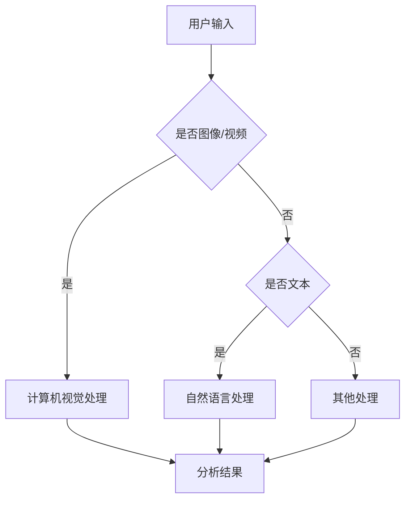

# 苹果与微软在AI领域的最新动态

> 关键词：苹果，微软，人工智能，深度学习，计算机视觉，自然语言处理，机器学习，创新

## 1. 背景介绍

人工智能（AI）已经成为全球科技行业的热点领域，各大科技公司都在积极布局，力求在AI技术的研究和应用上取得领先地位。苹果和微软作为全球知名的科技巨头，在AI领域均有深厚的技术积累和广泛的应用布局。本文将深入探讨苹果和微软在AI领域的最新动态，分析他们的技术优势、创新方向以及未来发展趋势。

## 2. 核心概念与联系

### 2.1 核心概念原理

人工智能（AI）是指使计算机能够模拟、延伸和扩展人的智能的科学和技术。它包括机器学习（ML）、深度学习（DL）、计算机视觉（CV）、自然语言处理（NLP）等多个子领域。

- **机器学习（ML）**：通过算法使计算机能够从数据中学习并做出决策或预测。
- **深度学习（DL）**：一种特殊的机器学习技术，使用具有多层结构的神经网络来学习数据中的特征和模式。
- **计算机视觉（CV）**：使计算机能够从图像和视频中理解和提取信息。
- **自然语言处理（NLP）**：使计算机能够理解和处理自然语言。

### 2.2 架构流程图

以下是基于苹果和微软在AI领域的技术架构的Mermaid流程图：



### 2.3 核心概念联系

苹果和微软在AI领域的创新和发展，涉及上述所有核心概念。例如，他们使用机器学习算法进行数据分析和预测，应用深度学习技术构建复杂的神经网络，利用计算机视觉进行图像识别和处理，以及使用自然语言处理技术实现人机交互。

## 3. 核心算法原理 & 具体操作步骤

### 3.1 算法原理概述

苹果和微软在AI领域的研究涵盖了各种算法，以下是一些常见的算法原理：

- **神经网络**：由大量相互连接的神经元组成，能够模拟人脑的思考过程。
- **卷积神经网络（CNN）**：专门用于图像识别和处理。
- **循环神经网络（RNN）**：能够处理序列数据，如文本和语音。
- **Transformer**：一种基于自注意力机制的神经网络，广泛应用于NLP领域。

### 3.2 算法步骤详解

以苹果的神经网络为例，其基本步骤如下：

1. **数据收集**：从各种来源收集数据，如传感器、相机、麦克风等。
2. **数据预处理**：对收集到的数据进行清洗、标注和格式化。
3. **模型设计**：设计适合特定任务的神经网络结构。
4. **模型训练**：使用标注数据训练神经网络，优化模型参数。
5. **模型评估**：使用测试数据评估模型性能，调整模型参数。
6. **模型部署**：将训练好的模型部署到实际应用中。

### 3.3 算法优缺点

神经网络等AI算法具有以下优点：

- **强大的数据处理能力**：能够处理大量复杂数据。
- **泛化能力**：能够从少量样本中学习到通用规律。

然而，这些算法也存在一些缺点：

- **计算资源需求**：训练和推理需要大量的计算资源。
- **数据标注成本**：需要大量标注数据才能训练出有效的模型。

### 3.4 算法应用领域

苹果和微软的AI算法在以下领域得到广泛应用：

- **智能手机**：图像识别、语音识别、人脸识别等。
- **平板电脑**：手势识别、语音助手等。
- **个人电脑**：智能推荐、语音输入等。
- **云计算**：智能优化、故障预测等。
- **物联网**：智能设备控制、数据分析等。

## 4. 数学模型和公式 & 详细讲解 & 举例说明

### 4.1 数学模型构建

以下是一个简单的神经网络数学模型：

$$
y = f(W \cdot x + b)
$$

其中，$y$ 是输出，$x$ 是输入，$W$ 是权重矩阵，$b$ 是偏置向量，$f$ 是激活函数。

### 4.2 公式推导过程

以苹果的神经网络为例，其推导过程如下：

1. **损失函数**：选择合适的损失函数，如均方误差（MSE）或交叉熵损失（CE）。
2. **梯度下降**：使用梯度下降算法优化模型参数。
3. **反向传播**：计算损失函数对模型参数的梯度，并更新参数。

### 4.3 案例分析与讲解

以苹果的Siri语音助手为例，其工作原理如下：

1. **语音识别**：将用户的语音输入转换为文本。
2. **自然语言理解**：理解用户的意图和问题。
3. **知识库检索**：从知识库中检索相关信息。
4. **自然语言生成**：生成自然语言回答。
5. **语音合成**：将回答转换为语音输出。

## 5. 项目实践：代码实例和详细解释说明

### 5.1 开发环境搭建

以Python为例，搭建开发环境：

1. 安装Anaconda：从官网下载并安装Anaconda。
2. 创建虚拟环境：`conda create -n pytorch-env python=3.8`。
3. 激活虚拟环境：`conda activate pytorch-env`。
4. 安装PyTorch：`conda install pytorch torchvision torchaudio -c pytorch`。

### 5.2 源代码详细实现

以下是一个简单的神经网络代码示例：

```python
import torch
import torch.nn as nn
import torch.optim as optim

class SimpleNN(nn.Module):
    def __init__(self):
        super(SimpleNN, self).__init__()
        self.fc1 = nn.Linear(784, 128)
        self.fc2 = nn.Linear(128, 10)
        self.relu = nn.ReLU()

    def forward(self, x):
        x = self.fc1(x)
        x = self.relu(x)
        x = self.fc2(x)
        return x

model = SimpleNN()
criterion = nn.CrossEntropyLoss()
optimizer = optim.SGD(model.parameters(), lr=0.01)

# 假设已有训练数据和标签
for epoch in range(10):
    for data, target in data_loader:
        optimizer.zero_grad()
        output = model(data)
        loss = criterion(output, target)
        loss.backward()
        optimizer.step()
```

### 5.3 代码解读与分析

上述代码定义了一个简单的全连接神经网络，使用PyTorch框架进行训练。首先，导入必要的库和模块。然后，定义一个`SimpleNN`类，继承自`nn.Module`。在`__init__`方法中，定义两个全连接层和一个ReLU激活函数。在`forward`方法中，实现前向传播过程。最后，创建模型、损失函数和优化器实例，进行模型训练。

### 5.4 运行结果展示

在训练过程中，可以观察到损失函数值逐渐降低，表明模型性能逐渐提高。训练结束后，可以使用测试数据评估模型性能。

## 6. 实际应用场景

苹果和微软的AI技术在以下场景中得到广泛应用：

### 6.1 苹果

- **iPhone**：面部识别、Siri语音助手、Animoji表情。
- **iPad**：手写识别、智能键盘。
- **Mac**：智能搜索、自动纠错。
- **Apple Watch**：健康监测、运动追踪。
- **Apple TV**：推荐电影、语音控制。

### 6.2 微软

- **Windows 10**：Cortana语音助手、智能搜索、自动更新。
- **Azure**：机器学习、深度学习、计算机视觉服务。
- **Office**：智能排版、自动翻译、语音识别。
- **Xbox**：智能推荐、游戏辅助。
- **Bing**：图像搜索、语音搜索。

## 7. 工具和资源推荐

### 7.1 学习资源推荐

- **苹果开发者官网**：提供iOS和macOS开发文档、教程和资源。
- **微软开发者官网**：提供Azure云服务和Office开发文档。
- **PyTorch官网**：提供PyTorch框架文档、教程和示例。
- **TensorFlow官网**：提供TensorFlow框架文档、教程和示例。

### 7.2 开发工具推荐

- **Xcode**：苹果官方的集成开发环境，用于开发iOS和macOS应用。
- **Visual Studio**：微软官方的集成开发环境，用于开发Windows和macOS应用。
- **PyCharm**：JetBrains公司的Python集成开发环境。
- **Jupyter Notebook**：Python交互式计算环境。

### 7.3 相关论文推荐

- **"A Guide to Deep Learning for Computer Vision"**：深度学习在计算机视觉中的应用。
- **"Deep Learning for Natural Language Processing"**：深度学习在自然语言处理中的应用。
- **"Attention Is All You Need"**：Transformer模型论文。
- **"BERT: Pre-training of Deep Bidirectional Transformers for Language Understanding"**：BERT模型论文。

## 8. 总结：未来发展趋势与挑战

### 8.1 研究成果总结

苹果和微软在AI领域取得了丰硕的成果，推动了AI技术的创新和发展。他们的技术优势、创新方向和未来发展趋势如下：

- **技术创新**：持续研发新的算法和模型，如神经网络、卷积神经网络、循环神经网络、Transformer等。
- **生态建设**：构建完善的AI生态系统，包括开发工具、平台和服务。
- **应用落地**：将AI技术应用于各个领域，如智能手机、平板电脑、个人电脑、云计算、物联网等。

### 8.2 未来发展趋势

- **更强大的模型**：研发更强大的AI模型，提高模型性能和效率。
- **更丰富的应用场景**：将AI技术应用于更多领域，如医疗、教育、金融等。
- **更先进的训练方法**：开发更先进的训练方法，降低训练成本和计算资源需求。

### 8.3 面临的挑战

- **数据安全**：如何保护用户数据安全，防止数据泄露和滥用。
- **算法公平性**：如何确保算法的公平性，避免歧视和偏见。
- **模型可解释性**：如何提高模型的可解释性，使模型决策更加透明。

### 8.4 研究展望

苹果和微软在AI领域的创新和研究将继续推动AI技术的发展。未来，他们将继续关注以下方向：

- **跨领域融合**：将AI技术与其他领域（如生物、物理、化学等）相结合。
- **人机协同**：开发人机协同系统，使机器更好地服务于人类。
- **伦理道德**：关注AI伦理道德问题，确保AI技术造福人类。

## 9. 附录：常见问题与解答

### 9.1 苹果和微软在AI领域有哪些共同点？

A: 苹果和微软在AI领域有许多共同点，包括：

- 都在AI领域投入大量研发资源。
- 都拥有强大的AI技术团队。
- 都在多个AI子领域取得突破性进展。
- 都将AI技术应用于多个产品和服务中。

### 9.2 苹果和微软在AI领域有哪些不同点？

A: 苹果和微软在AI领域也有一些不同点，包括：

- 研发重点不同：苹果更注重用户体验，微软更注重企业级应用。
- 技术路线不同：苹果倾向于自主研发，微软更倾向于开源和合作伙伴。
- 产品线不同：苹果产品线主要集中在消费电子领域，微软产品线更广泛。

### 9.3 未来AI技术将如何改变我们的生活？

A: AI技术将改变我们的生活，包括：

- **医疗健康**：辅助医生进行诊断和治疗，提高医疗服务质量。
- **教育**：个性化教育，提高学习效率。
- **交通**：自动驾驶，提高交通效率和安全性。
- **家居**：智能家居，提高生活品质。
- **娱乐**：智能娱乐，提供更加丰富的娱乐体验。

作者：禅与计算机程序设计艺术 / Zen and the Art of Computer Programming