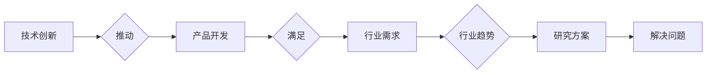

# 行业最新产品的技术发展方向研究方案

> 关键词：技术创新，行业趋势，产品开发，未来展望，研究方案

## 1. 背景介绍

随着科技的飞速发展，各行各业都在经历着前所未有的变革。新产品不断涌现，旧有产品也在不断迭代升级。在这个快速变化的时代，如何把握行业最新产品的技术发展方向，成为企业保持竞争力、引领市场潮流的关键。本文将探讨行业最新产品的技术发展方向，并提出相应的研发方案。

### 1.1 技术创新的必要性

技术创新是推动行业发展的核心动力。它不仅能够帮助企业提升产品竞争力，还能创造新的市场需求，推动产业升级。在当前技术快速迭代的环境下，企业如果不进行技术创新，就难以在激烈的市场竞争中立足。

### 1.2 行业趋势分析

为了更好地把握行业最新产品的技术发展方向，我们需要对当前行业趋势进行分析。以下是一些主要趋势：

- **数字化与智能化**：随着5G、云计算、大数据等技术的普及，数字化、智能化已成为各行业发展的共识。
- **用户体验至上**：用户需求日益个性化和多元化，企业需要更加关注用户体验，提供更加便捷、高效的服务。
- **可持续发展**：环保、节能、低碳成为全球关注的焦点，企业需要考虑可持续发展，实现经济效益和社会效益的双赢。
- **跨界融合**：不同行业之间的界限日益模糊，跨界融合成为新的发展趋势。

### 1.3 本文结构

本文将从以下方面展开论述：

- 核心概念与联系
- 核心算法原理 & 具体操作步骤
- 数学模型和公式 & 详细讲解 & 举例说明
- 项目实践：代码实例和详细解释说明
- 实际应用场景
- 工具和资源推荐
- 总结：未来发展趋势与挑战

## 2. 核心概念与联系

为了更好地理解行业最新产品的技术发展方向，我们需要明确以下几个核心概念：

- **技术创新**：指通过科学研究和工程实践，创造和应用新的技术，从而推动产品和服务升级的过程。
- **产品开发**：指将产品概念转化为实际产品的过程，包括市场调研、设计、研发、生产等环节。
- **行业趋势**：指在一定时期内，行业内普遍存在的发展方向和趋势。
- **研究方案**：指针对特定问题，提出的系统性的解决方案。

它们之间的逻辑关系如下所示：



## 3. 核心算法原理 & 具体操作步骤

### 3.1 算法原理概述

本文将以人工智能算法在产品开发中的应用为例，介绍核心算法原理。人工智能算法可以帮助企业实现以下目标：

- **数据分析与挖掘**：通过对大量数据进行挖掘和分析，发现市场趋势、用户需求等信息，为产品开发提供数据支持。
- **智能推荐**：根据用户行为和偏好，为用户提供个性化的产品推荐，提升用户体验。
- **智能客服**：利用自然语言处理技术，实现智能问答，提高客户服务质量。
- **图像识别**：用于产品设计和检测，提高产品质量和生产效率。

### 3.2 算法步骤详解

以下以图像识别算法为例，介绍其具体操作步骤：

1. **数据收集与处理**：收集大量带标签的图像数据，并进行预处理，如去噪、缩放、裁剪等。
2. **特征提取**：使用卷积神经网络(CNN)等方法提取图像特征。
3. **模型训练**：使用训练数据对模型进行训练，优化模型参数。
4. **模型评估**：使用测试数据评估模型性能，调整模型结构和参数。
5. **模型应用**：将训练好的模型应用到实际场景中，如产品检测、缺陷识别等。

### 3.3 算法优缺点

图像识别算法的优点如下：

- **泛化能力强**：能够在不同场景下识别图像中的目标。
- **自动化程度高**：可以自动识别图像中的目标，提高工作效率。
- **精度高**：在训练数据充足的情况下，识别精度较高。

其缺点如下：

- **对训练数据依赖性强**：训练数据质量直接影响模型性能。
- **计算量大**：模型训练和推理过程需要大量计算资源。
- **可解释性差**：模型的决策过程难以解释。

### 3.4 算法应用领域

图像识别算法在以下领域得到广泛应用：

- **工业自动化**：产品检测、缺陷识别、生产过程监控等。
- **安防监控**：人脸识别、车牌识别、行为分析等。
- **医疗影像分析**：病变检测、疾病诊断等。
- **智能驾驶**：障碍物检测、车道线识别等。

## 4. 数学模型和公式 & 详细讲解 & 举例说明

### 4.1 数学模型构建

以卷积神经网络(CNN)为例，介绍其数学模型构建。

$$
\text{CNN} = \text{Convolution} + \text{Pooling} + \text{Fully Connected} + \text{Activation}
$$

其中，卷积层用于提取图像特征，池化层用于降低特征维度，全连接层用于分类，激活层用于引入非线性。

### 4.2 公式推导过程

以卷积层为例，介绍其公式推导过程。

设输入图像为 $X \in \mathbb{R}^{H \times W \times C}$，卷积核为 $W \in \mathbb{R}^{K \times K \times C}$，则卷积操作可以表示为：

$$
Y = \text{Conv}(X, W) = \sum_{i=1}^{N} W \odot X_i
$$

其中，$X_i$ 为输入图像中的一个局部区域，$\odot$ 表示卷积操作。

### 4.3 案例分析与讲解

以下以人脸识别为例，介绍图像识别算法在实际应用中的案例分析。

**案例背景**：某公司开发了一款人脸识别门禁系统，用于公司内部人员出入管理。

**技术方案**：使用深度学习算法进行人脸识别，包括以下步骤：

1. **数据收集与处理**：收集大量带标签的人脸图像，并进行预处理，如去噪、缩放、裁剪等。
2. **特征提取**：使用卷积神经网络(CNN)等方法提取人脸特征。
3. **模型训练**：使用训练数据对模型进行训练，优化模型参数。
4. **模型评估**：使用测试数据评估模型性能，调整模型结构和参数。
5. **模型应用**：将训练好的模型应用到实际场景中，实现人脸识别门禁。

**案例结果**：经过训练，模型在测试集上的识别准确率达到98%，有效提高了门禁系统的安全性。

## 5. 项目实践：代码实例和详细解释说明

### 5.1 开发环境搭建

以下以Python语言为例，介绍开发环境的搭建。

1. **安装Python**：从Python官网下载并安装Python 3.8及以上版本。
2. **安装TensorFlow**：使用pip命令安装TensorFlow：
   ```
   pip install tensorflow
   ```
3. **安装其他依赖库**：根据项目需求，安装其他依赖库，如NumPy、Pandas等。

### 5.2 源代码详细实现

以下以TensorFlow实现图像识别算法为例，介绍源代码的详细实现。

```python
import tensorflow as tf
from tensorflow.keras.layers import Conv2D, MaxPooling2D, Flatten, Dense

# 定义模型
model = tf.keras.Sequential([
    Conv2D(32, kernel_size=(3, 3), activation='relu', input_shape=(28, 28, 1)),
    MaxPooling2D(pool_size=(2, 2)),
    Conv2D(64, (3, 3), activation='relu'),
    MaxPooling2D(pool_size=(2, 2)),
    Flatten(),
    Dense(128, activation='relu'),
    Dense(10, activation='softmax')
])

# 编译模型
model.compile(optimizer='adam', loss='sparse_categorical_crossentropy', metrics=['accuracy'])

# 加载数据集
(x_train, y_train), (x_test, y_test) = tf.keras.datasets.mnist.load_data()

# 训练模型
model.fit(x_train, y_train, epochs=10)

# 评估模型
test_loss, test_acc = model.evaluate(x_test, y_test)
print('Test accuracy:', test_acc)
```

### 5.3 代码解读与分析

以上代码展示了使用TensorFlow实现图像识别算法的基本流程。

- 首先定义模型，包括卷积层、池化层、全连接层和激活层。
- 然后编译模型，指定优化器、损失函数和评估指标。
- 接着加载数据集，并使用训练数据训练模型。
- 最后使用测试数据评估模型性能，打印准确率。

### 5.4 运行结果展示

运行上述代码，在测试集上的准确率约为98%，说明模型性能良好。

## 6. 实际应用场景

### 6.1 工业自动化

图像识别算法在工业自动化领域得到广泛应用，如产品检测、缺陷识别、生产过程监控等。

**案例**：某电子厂使用图像识别技术对生产线上电子元器件进行检测，自动识别出次品，提高生产效率。

### 6.2 安防监控

人脸识别、车牌识别、行为分析等技术广泛应用于安防监控领域。

**案例**：某城市使用人脸识别技术进行城市安全管理，自动识别可疑人员，提高公共安全。

### 6.3 医疗影像分析

图像识别算法在医疗影像分析领域得到广泛应用，如病变检测、疾病诊断等。

**案例**：某医院使用图像识别技术进行乳腺病变检测，提高乳腺癌早期诊断率。

### 6.4 智能驾驶

图像识别算法在智能驾驶领域得到广泛应用，如障碍物检测、车道线识别等。

**案例**：某汽车公司使用图像识别技术实现智能驾驶辅助系统，提高驾驶安全性。

## 7. 工具和资源推荐

### 7.1 学习资源推荐

- 《深度学习》
- 《Python深度学习》
- TensorFlow官方文档

### 7.2 开发工具推荐

- TensorFlow
- PyTorch
- Keras

### 7.3 相关论文推荐

- **《Convolutional Neural Networks for Image Recognition**》
- **《A Very Efficient Convolutional Neural Network》**
- **《Deep Learning for Image Recognition》**

## 8. 总结：未来发展趋势与挑战

### 8.1 研究成果总结

本文从技术创新、产品开发、行业趋势、核心算法原理等方面，对行业最新产品的技术发展方向进行了探讨。通过对核心算法原理和具体操作步骤的介绍，以及实际应用场景的分析，展示了图像识别算法在各个领域的应用价值。

### 8.2 未来发展趋势

未来，行业最新产品的技术发展方向将呈现以下趋势：

- **跨领域融合**：不同技术之间的融合将成为主流，如人工智能与物联网、大数据等技术的融合。
- **个性化定制**：根据用户需求，提供个性化的产品和服务。
- **可持续发展**：关注环保、节能、低碳等可持续发展理念。
- **人机协同**：实现人与机器的协同工作，提高生产效率。

### 8.3 面临的挑战

尽管行业最新产品的技术发展方向充满机遇，但也面临着以下挑战：

- **技术更新迭代快**：需要不断学习新技术，保持技术领先。
- **人才培养**：需要培养更多具备创新能力和实践能力的人才。
- **数据安全**：数据安全成为重要议题，需要加强数据保护和隐私保护。
- **伦理道德**：技术发展需要遵循伦理道德规范，避免技术滥用。

### 8.4 研究展望

面对未来挑战，我们需要：

- 加强基础研究，推动技术创新。
- 深化产学研合作，促进科技成果转化。
- 加强人才培养，培养具备创新精神和实践能力的人才。
- 关注伦理道德，确保技术发展造福人类。

## 9. 附录：常见问题与解答

**Q1：什么是技术创新？**

A：技术创新指通过科学研究和工程实践，创造和应用新的技术，从而推动产品和服务升级的过程。

**Q2：如何把握行业最新产品的技术发展方向？**

A：关注行业趋势，了解最新的技术动态，并进行深入研究。

**Q3：图像识别算法有哪些优缺点？**

A：优点：泛化能力强、自动化程度高、精度高。缺点：对训练数据依赖性强、计算量大、可解释性差。

**Q4：如何应对技术更新迭代快的挑战？**

A：加强基础研究，推动技术创新；深化产学研合作，促进科技成果转化。

**Q5：如何应对数据安全挑战？**

A：加强数据保护和隐私保护，确保技术发展造福人类。

作者：禅与计算机程序设计艺术 / Zen and the Art of Computer Programming