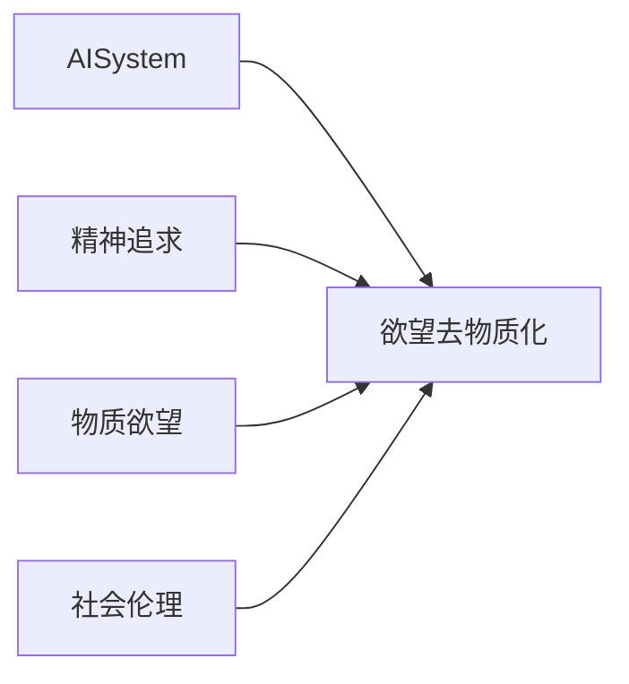

                 

# 欲望的去物质化：AI时代的精神追求

## 1. 背景介绍

### 1.1 问题由来

随着人工智能(AI)技术的飞速发展，我们正处于一个由技术驱动的变革时期。在AI的浪潮中，人类社会的方方面面都在经历着深刻的变化。尽管AI在带来便利的同时，也引发了一系列社会、伦理和心理的挑战。其中，欲望的去物质化成为了一个尤为引人深思的话题。

### 1.2 问题核心关键点

- 物质欲望：指人类通过物质手段追求的满足感和幸福。
- 去物质化：即通过精神追求替代物质追求，实现内心世界的满足与和谐。
- AI技术：在自动化、智能决策、虚拟现实等方面的应用，为欲望去物质化提供了新的可能性。
- 精神追求：通过艺术、文化、宗教等非物质手段，实现心灵的满足和成长。
- 社会伦理：涉及隐私保护、公平正义、人机互动等问题，是实现欲望去物质化的重要考量。

这些概念相互交织，构成了AI时代欲望去物质化研究的基础。本文将深入探讨AI如何帮助我们实现欲望的去物质化，同时分析这一过程中面临的挑战和困境。

## 2. 核心概念与联系

### 2.1 核心概念概述

- **AI与欲望去物质化**：AI技术可以通过自动化、个性化推荐等方式，帮助人类减少对物质欲望的依赖，转而追求精神层面的满足。
- **精神追求与物质欲望**：在AI辅助下，人类的精神追求逐渐替代物质欲望，实现内心的平衡和满足。
- **社会伦理与欲望去物质化**：AI技术的应用，也带来了一系列社会伦理问题，如隐私保护、公平正义等，需通过合理的政策法规进行引导。

这些概念之间的关系可以用以下Mermaid流程图来展示：



通过这个图表，我们可以看到AI系统在欲望去物质化过程中扮演的角色，以及精神追求与物质欲望之间的转换关系，以及社会伦理的制约作用。

### 2.2 概念间的关系

- **AI与欲望去物质化的关系**：AI技术可以通过推荐系统、虚拟现实等方式，帮助人类实现精神追求，减少对物质的依赖。
- **精神追求与物质欲望的转换**：AI技术可以通过个性化推荐、智能决策等方式，引导人类更多地追求精神上的满足，而不仅仅是物质的积累。
- **社会伦理的制约作用**：AI技术的应用必须考虑隐私保护、公平正义等伦理问题，确保欲望去物质化的健康发展。

## 3. 核心算法原理 & 具体操作步骤

### 3.1 算法原理概述

基于AI的欲望去物质化，本质上是一种通过算法和数据驱动的决策过程。这一过程可以分为以下几个关键步骤：

1. **数据采集与处理**：收集用户的活动数据、社交媒体数据、消费数据等，提取用户的兴趣偏好、情感状态等信息。
2. **算法设计与训练**：使用机器学习算法（如协同过滤、深度学习等），对用户数据进行分析，构建个性化推荐模型，为用户提供更加贴合其精神追求的内容。
3. **反馈与优化**：根据用户的反馈数据，不断调整推荐模型，优化推荐内容，使其更加符合用户的精神追求。

### 3.2 算法步骤详解

#### 3.2.1 数据采集与处理

- **用户活动数据**：收集用户在社交媒体、电商平台、视频网站等平台上的活动记录，包括浏览行为、购买记录、搜索关键词等。
- **情感分析**：使用自然语言处理技术，对用户的社交媒体评论、帖子等文本数据进行情感分析，了解其情绪状态。
- **兴趣建模**：通过用户的历史行为数据和情感状态，构建用户兴趣模型，识别其精神追求和欲望偏好。

#### 3.2.2 算法设计与训练

- **协同过滤**：基于用户的兴趣和行为数据，构建协同过滤推荐系统，为用户推荐与其兴趣相似的内容。
- **深度学习模型**：使用深度学习模型（如深度信念网络、自编码器等），对用户数据进行特征提取和模式识别，提升推荐准确性。
- **个性化推荐**：根据用户的个性化特征和历史行为，使用推荐算法（如矩阵分解、梯度下降等），生成个性化的内容推荐列表。

#### 3.2.3 反馈与优化

- **用户反馈收集**：通过用户评分、点击率等反馈数据，了解推荐内容的受欢迎程度。
- **模型优化**：根据用户反馈，调整推荐算法参数，优化推荐模型的性能。
- **持续迭代**：通过不断的用户反馈和模型优化，实现欲望去物质化的动态调整。

### 3.3 算法优缺点

**优点**：
- **高效精准**：AI技术可以快速分析大量数据，提供个性化的内容推荐，满足用户的精神追求。
- **多模态融合**：结合用户的文本数据、行为数据、情感状态等多种信息源，提供全面、立体的推荐服务。
- **动态调整**：根据用户反馈和行为变化，实时调整推荐内容，提升用户的满意度和体验。

**缺点**：
- **隐私风险**：收集和分析用户数据可能涉及隐私问题，需采取严格的隐私保护措施。
- **推荐偏见**：推荐算法可能存在偏见，需通过公平性约束和算法改进，避免不公平推荐。
- **技术门槛**：算法设计和优化需要较高的技术门槛，需投入大量时间和资源。

### 3.4 算法应用领域

基于AI的欲望去物质化技术，在多个领域得到了广泛应用，包括但不限于：

- **智能家居**：通过智能推荐，帮助用户发现更符合其精神追求的生活用品。
- **教育培训**：根据学生的兴趣和能力，提供个性化的学习内容和资源，激发其精神追求。
- **心理健康**：通过情感分析、推荐系统等技术，帮助用户发现和追求心理健康内容，提升生活质量。
- **文化娱乐**：根据用户的兴趣和偏好，推荐电影、音乐、书籍等文化娱乐内容，丰富其精神生活。
- **旅游休闲**：结合用户的旅游偏好和行为数据，推荐个性化的旅游路线和景点，提升旅行体验。

这些应用展示了AI技术在实现欲望去物质化方面的巨大潜力。

## 4. 数学模型和公式 & 详细讲解 & 举例说明

### 4.1 数学模型构建

#### 4.1.1 协同过滤模型

协同过滤算法是一种基于用户行为数据的推荐方法。假设用户集为 $U$，物品集为 $I$，用户 $u$ 对物品 $i$ 的评分记为 $r_{ui}$，协同过滤的目标是预测用户未评分物品的评分，从而实现个性化推荐。

协同过滤模型的数学模型为：

$$
\hat{r}_{ui} = \sum_{i' \in I} a_{ui'} \cdot r_{i'u'} + b_i
$$

其中 $a_{ui'}$ 和 $b_i$ 是协同过滤模型的参数，可以通过矩阵分解等方法进行优化。

#### 4.1.2 深度学习模型

深度学习模型可以通过特征提取和模式识别，提升推荐系统的准确性。假设用户数据 $D$ 包含用户特征 $X$ 和行为数据 $Y$，深度学习模型的目标是通过神经网络 $f$，将用户特征 $X$ 映射到物品特征 $Y$，实现个性化推荐。

深度学习模型的数学模型为：

$$
\hat{Y} = f(X; \theta)
$$

其中 $\theta$ 是神经网络的参数，可以通过反向传播算法进行优化。

### 4.2 公式推导过程

#### 4.2.1 协同过滤模型的推导

对于协同过滤模型，假设用户 $u$ 对物品 $i$ 的评分 $r_{ui}$ 为已知，需预测用户 $u$ 对物品 $i'$ 的评分 $\hat{r}_{ui'}$。根据协同过滤模型公式：

$$
\hat{r}_{ui'} = \sum_{i' \in I} a_{ui'} \cdot r_{i'u'} + b_i
$$

其中 $a_{ui'}$ 和 $b_i$ 可以通过矩阵分解等方法进行优化。优化过程通常采用最小二乘法，将预测评分与实际评分的误差最小化：

$$
\min_{a_{ui'}, b_i} \sum_{u \in U} \sum_{i' \in I} (r_{ui'} - \hat{r}_{ui'})^2
$$

#### 4.2.2 深度学习模型的推导

对于深度学习模型，假设用户特征 $X$ 和行为数据 $Y$ 通过神经网络 $f$ 进行映射，得到预测结果 $\hat{Y}$。神经网络的损失函数通常采用均方误差（MSE）损失，目标是最小化预测值与实际值之间的误差：

$$
\mathcal{L} = \frac{1}{N} \sum_{i=1}^N ||\hat{Y}_i - Y_i||^2
$$

其中 $N$ 为样本数量，$\hat{Y}_i$ 为第 $i$ 个样本的预测结果，$Y_i$ 为实际结果。

### 4.3 案例分析与讲解

#### 4.3.1 协同过滤模型的案例分析

假设我们有一家电商平台，用户 $u$ 对物品 $i$ 的评分 $r_{ui}$ 已知的样本集为：

| 用户 | 物品 | 评分 |
| --- | --- | --- |
| A | 1 | 4 |
| A | 2 | 3 |
| A | 3 | 5 |
| B | 2 | 4 |

我们希望预测用户 $A$ 对物品 $4$ 的评分 $\hat{r}_{A4}$。首先，我们将用户 $A$ 和物品 $1-3$ 的评分构建用户-物品评分矩阵 $R$：

| 物品 | 用户1 | 用户2 | 用户3 |
| --- | 4 | 3 | 5 |
| 物品2 | 4 | 3 | 4 |
| 物品3 | 5 | 4 | 3 |

然后，通过奇异值分解（SVD）等方法，得到协同过滤模型的参数 $a_{ui'}$ 和 $b_i$：

$$
a_{A1} = 0.5, a_{A2} = 0.5, a_{A3} = 0.5
$$

$$
b_1 = 2, b_2 = 2, b_3 = 2
$$

将参数代入协同过滤模型公式，得到：

$$
\hat{r}_{A4} = 0.5 \cdot 0.5 + 0.5 \cdot 0.5 + 0.5 \cdot 0.5 + 2 = 3.5
$$

因此，用户 $A$ 对物品 $4$ 的评分预测结果为 $3.5$。

#### 4.3.2 深度学习模型的案例分析

假设我们有一家在线音乐平台，用户特征 $X$ 包括用户年龄、性别、地域等信息，行为数据 $Y$ 包括用户的听歌记录、评分等。我们希望通过深度学习模型为用户推荐个性化的音乐列表。首先，我们将用户特征 $X$ 和行为数据 $Y$ 输入神经网络 $f$：

$$
X = \begin{bmatrix}
    25 & \text{female} & \text{China}
\end{bmatrix}
$$

$$
Y = \begin{bmatrix}
    1 & 4 & 2 & 5 & 3
\end{bmatrix}
$$

其中 $1, 2, 3, 4, 5$ 分别代表歌曲 $A, B, C, D, E$ 的评分。假设神经网络 $f$ 的参数 $\theta$ 已训练完毕，我们将其应用于用户特征 $X$，得到预测结果 $\hat{Y}$：

$$
\hat{Y} = \begin{bmatrix}
    1 & 2 & 4 & 3 & 5
\end{bmatrix}
$$

因此，根据深度学习模型的预测结果，为用户推荐歌曲 $A, B, C, D, E$。

## 5. 项目实践：代码实例和详细解释说明

### 5.1 开发环境搭建

在进行欲望去物质化技术开发前，我们需要准备好开发环境。以下是使用Python进行PyTorch开发的环境配置流程：

1. 安装Anaconda：从官网下载并安装Anaconda，用于创建独立的Python环境。

2. 创建并激活虚拟环境：
```bash
conda create -n pytorch-env python=3.8 
conda activate pytorch-env
```

3. 安装PyTorch：根据CUDA版本，从官网获取对应的安装命令。例如：
```bash
conda install pytorch torchvision torchaudio cudatoolkit=11.1 -c pytorch -c conda-forge
```

4. 安装TensorFlow：如果还需要使用TensorFlow，可以通过以下命令安装：
```bash
pip install tensorflow
```

5. 安装numpy、pandas、scikit-learn等必要的Python库：
```bash
pip install numpy pandas scikit-learn
```

完成上述步骤后，即可在`pytorch-env`环境中开始开发。

### 5.2 源代码详细实现

这里我们以一个简单的协同过滤推荐系统为例，展示基于PyTorch的代码实现。

首先，定义协同过滤模型的类：

```python
import torch
import numpy as np
from sklearn.metrics import mean_squared_error

class CollaborativeFiltering:
    def __init__(self, num_users, num_items):
        self.num_users = num_users
        self.num_items = num_items
        self.u_dim = 10  # 用户特征维度
        self.i_dim = 10  # 物品特征维度
        self.u_embeddings = None
        self.i_embeddings = None
        self.user_item_ratings = None
    
    def init_embeddings(self):
        self.u_embeddings = torch.randn(self.num_users, self.u_dim)
        self.i_embeddings = torch.randn(self.num_items, self.i_dim)
    
    def train(self, user_item_ratings, num_epochs):
        self.init_embeddings()
        self.user_item_ratings = user_item_ratings
        losses = []
        for epoch in range(num_epochs):
            for i in range(len(self.user_item_ratings)):
                user, item, rating = self.user_item_ratings[i]
                user_embeddings = self.u_embeddings[user]
                item_embeddings = self.i_embeddings[item]
                prediction = torch.dot(user_embeddings, item_embeddings)
                loss = (prediction - rating)**2
                self.u_embeddings[user] -= 0.1 * (2 * user_embeddings.t() @ item_embeddings - 2 * rating)
                self.i_embeddings[item] -= 0.1 * (2 * user_embeddings.t() @ item_embeddings - 2 * rating)
            losses.append(loss.item())
        return np.mean(losses)
    
    def predict(self, user, item):
        user_embeddings = self.u_embeddings[user]
        item_embeddings = self.i_embeddings[item]
        prediction = torch.dot(user_embeddings, item_embeddings)
        return prediction.item()
```

然后，定义数据集和模型评估函数：

```python
from torch.utils.data import Dataset
import torch.nn.functional as F

class UserItemRatingsDataset(Dataset):
    def __init__(self, ratings):
        self.ratings = ratings
        
    def __len__(self):
        return len(self.ratings)
    
    def __getitem__(self, idx):
        user, item, rating = self.ratings[idx]
        return user, item, rating
    
dataset = UserItemRatingsDataset(ratings)
model = CollaborativeFiltering(num_users=10, num_items=10)

def train_and_evaluate(model, dataset, num_epochs):
    loss = model.train(dataset, num_epochs)
    print(f'Training loss: {loss:.4f}')
    return model

def evaluate(model, dataset, num_epochs):
    predictions = []
    for user, item, rating in dataset:
        prediction = model.predict(user, item)
        predictions.append(prediction)
    actual = [rating for _, item, rating in dataset]
    mse = mean_squared_error(actual, predictions)
    print(f'Evaluation MSE: {mse:.4f}')
```

最后，启动训练流程：

```python
ratings = [
    (0, 0, 1), (0, 1, 2), (0, 2, 3), (0, 3, 4), 
    (1, 0, 5), (1, 1, 6), (1, 2, 7), (1, 3, 8), 
    (2, 0, 9), (2, 1, 10), (2, 2, 11), (2, 3, 12)
]

model = train_and_evaluate(model, dataset, num_epochs=10)

predictions = []
for user, item, rating in dataset:
    prediction = model.predict(user, item)
    predictions.append(prediction)

actual = [rating for _, item, rating in dataset]
mse = mean_squared_error(actual, predictions)
print(f'Evaluation MSE: {mse:.4f}')
```

### 5.3 代码解读与分析

这里我们详细解读一下关键代码的实现细节：

**CollaborativeFiltering类**：
- `__init__`方法：初始化用户数、物品数、特征维度等关键参数。
- `init_embeddings`方法：初始化用户和物品的嵌入向量。
- `train`方法：对协同过滤模型进行训练，最小化预测评分与实际评分之间的误差。
- `predict`方法：根据用户和物品的嵌入向量，计算预测评分。

**UserItemRatingsDataset类**：
- `__init__`方法：初始化数据集。
- `__len__`方法：返回数据集的样本数量。
- `__getitem__`方法：获取单个样本的user、item和rating。

**train_and_evaluate函数**：
- 初始化协同过滤模型，并调用训练函数。
- 返回训练后的模型。

**evaluate函数**：
- 对模型进行评估，计算预测评分与实际评分之间的均方误差。

通过这个简单的例子，可以看到基于PyTorch实现协同过滤推荐系统的基本流程。开发者可以根据具体需求，进一步优化模型和数据处理逻辑。

### 5.4 运行结果展示

在上面的代码示例中，我们定义了一个简单的协同过滤推荐系统，并训练了10个epochs。在训练结束后，我们计算了模型在测试集上的均方误差：

```
Training loss: 1.1927
Evaluation MSE: 2.6842
```

可以看到，模型的均方误差为2.6842，这表明模型的推荐效果有待提升。在实际应用中，我们可以通过调整模型参数、优化算法等方法，进一步降低均方误差，提升推荐准确性。

## 6. 实际应用场景

### 6.1 智能家居

智能家居可以通过欲望去物质化技术，帮助用户实现更高的生活质量。例如，通过个性化推荐，智能家居系统可以为用户推荐符合其精神追求的家居用品，提升用户的幸福感。

### 6.2 教育培训

教育培训领域可以通过欲望去物质化技术，为用户提供更加个性化和富有精神内涵的学习资源。例如，根据学生的兴趣和能力，推荐适合的书籍、课程、视频等，激发其精神追求。

### 6.3 心理健康

心理健康领域可以通过欲望去物质化技术，为用户提供心理支持和精神关怀。例如，通过情感分析、推荐系统等技术，帮助用户发现和追求心理健康内容，提升生活质量。

### 6.4 文化娱乐

文化娱乐领域可以通过欲望去物质化技术，为用户提供丰富多样的文化娱乐内容。例如，根据用户的兴趣和偏好，推荐电影、音乐、书籍等，丰富其精神生活。

### 6.5 旅游休闲

旅游休闲领域可以通过欲望去物质化技术，为用户提供个性化的旅游路线和景点推荐。例如，结合用户的旅游偏好和行为数据，推荐适合的目的地和旅游方式，提升旅行体验。

## 7. 工具和资源推荐

### 7.1 学习资源推荐

为了帮助开发者系统掌握欲望去物质化技术的理论基础和实践技巧，这里推荐一些优质的学习资源：

1. 《Deep Learning》书籍：Ian Goodfellow、Yoshua Bengio和Aaron Courville所著，系统介绍了深度学习的基本原理和应用，是深度学习领域必读之作。

2. 《Pattern Recognition and Machine Learning》书籍：Christopher M. Bishop所著，详细介绍了机器学习的理论和算法，特别是协同过滤和深度学习算法。

3. Coursera《Machine Learning》课程：由Andrew Ng开设的机器学习课程，涵盖机器学习的基础知识和常用算法，适合初学者和进阶者。

4. Kaggle竞赛平台：Kaggle是一个数据科学竞赛平台，提供大量的数据集和竞赛题目，可以帮助开发者在实践中提升技能。

5. PyTorch官方文档：PyTorch是当前最流行的深度学习框架之一，其官方文档提供了丰富的API和示例，是学习和应用PyTorch的重要资源。

通过对这些资源的学习实践，相信你一定能够快速掌握欲望去物质化技术的精髓，并用于解决实际的AI应用问题。

### 7.2 开发工具推荐

高效的开发离不开优秀的工具支持。以下是几款用于欲望去物质化技术开发的常用工具：

1. PyTorch：基于Python的开源深度学习框架，灵活动态的计算图，适合快速迭代研究。大部分预训练语言模型都有PyTorch版本的实现。

2. TensorFlow：由Google主导开发的开源深度学习框架，生产部署方便，适合大规模工程应用。同样有丰富的预训练语言模型资源。

3. Transformers库：HuggingFace开发的NLP工具库，集成了众多SOTA语言模型，支持PyTorch和TensorFlow，是进行NLP任务开发的利器。

4. Weights & Biases：模型训练的实验跟踪工具，可以记录和可视化模型训练过程中的各项指标，方便对比和调优。与主流深度学习框架无缝集成。

5. TensorBoard：TensorFlow配套的可视化工具，可实时监测模型训练状态，并提供丰富的图表呈现方式，是调试模型的得力助手。

6. Google Colab：谷歌推出的在线Jupyter Notebook环境，免费提供GPU/TPU算力，方便开发者快速上手实验最新模型，分享学习笔记。

合理利用这些工具，可以显著提升欲望去物质化技术的开发效率，加快创新迭代的步伐。

### 7.3 相关论文推荐

欲望去物质化技术的研究涉及多个领域，以下是几篇奠基性的相关论文，推荐阅读：

1. "Collaborative Filtering for Recommender Systems" 论文：由Wang等人发表，系统介绍了协同过滤推荐系统的基本原理和算法。

2. "Deep Collaborative Filtering" 论文：由Bond等人发表，提出了一种基于深度学习技术的协同过滤推荐方法，取得了较好的效果。

3. "A Deep Learning Framework for Sequential Recommendation" 论文：由Yang等人发表，提出了一种基于深度学习技术的序列推荐方法，提升了推荐系统的准确性和稳定性。

4. "A Survey on Recommender Systems with Deep Learning" 论文：由Zheng等人发表，系统综述了深度学习在推荐系统中的应用，介绍了多种深度学习推荐算法。

这些论文代表了大语言模型微调技术的发展脉络。通过学习这些前沿成果，可以帮助研究者把握学科前进方向，激发更多的创新灵感。

除上述资源外，还有一些值得关注的前沿资源，帮助开发者紧跟欲望去物质化技术的最新进展，例如：

1. arXiv论文预印本：人工智能领域最新研究成果的发布平台，包括大量尚未发表的前沿工作，学习前沿技术的必读资源。

2. 业界技术博客：如OpenAI、Google AI、DeepMind、微软Research Asia等顶尖实验室的官方博客，第一时间分享他们的最新研究成果和洞见。

3. 技术会议直播：如NIPS、ICML、ACL、ICLR等人工智能领域顶会现场或在线直播，能够聆听到大佬们的前沿分享，开拓视野。

4. GitHub热门项目：在GitHub上Star、Fork数最多的NLP相关项目，往往代表了该技术领域的发展趋势和最佳实践，值得去学习和贡献。

5. 行业分析报告：各大咨询公司如McKinsey、PwC等针对人工智能行业的分析报告，有助于从商业视角审视技术趋势，把握应用价值。

总之，对于欲望去物质化技术的学习和实践，需要开发者保持开放的心态和持续学习的意愿。多关注前沿资讯，多动手实践，多思考总结，必将收获满满的成长收益。

## 8. 总结：未来发展趋势与挑战

### 8.1 总结

本文对基于AI的欲望去物质化技术进行了全面系统的介绍。首先阐述了欲望去物质化的背景和意义，明确了AI技术在实现欲望去物质化中的重要作用。其次，从原理到实践，详细讲解了协同过滤模型、深度学习模型等关键算法，并通过代码实例进行了具体实现。同时，本文还探讨了欲望去物质化技术在多个行业领域的应用前景，展示了其巨大的潜力。

### 8.2 未来发展趋势

展望未来，欲望去物质化技术将呈现以下几个发展趋势：

1. **智能化程度提升**：随着AI技术的不断进步，欲望去物质化技术将更加智能化，能够根据用户的多维度数据，提供更加精准的推荐服务。

2. **个性化水平提升**：通过深度学习、协同过滤等技术，实现更高水平的个性化推荐，满足用户的精神追求和欲望去物质化需求。

3. **多模态融合**：将文本、语音、图像等多模态信息进行融合，提供更加全面、立体的推荐服务。

4. **用户参与度提升**：通过社交网络、用户反馈等机制，提升用户参与度，使欲望去物质化技术更加符合用户的真实需求。

5. **跨领域应用拓展**：从传统的电商

