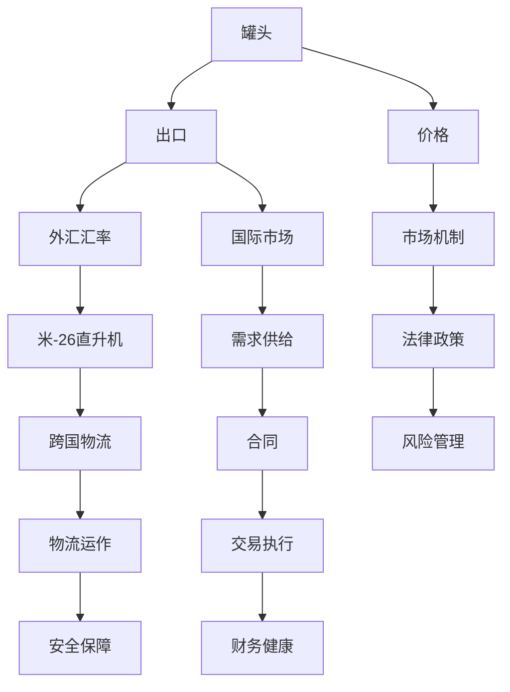

                 

# 牟其中的跨国生意：罐头换飞机

## 1. 背景介绍

### 1.1 问题由来

> 20世纪80年代末，中国民营企业家牟其中在经营中面临着一系列复杂的商业决策问题。其中最为显著的一个案例是，他试图通过罐头换飞机的方式，将大批的出口罐头与苏联的米-26直升机进行交换，从而实现低成本的机械化物流。

这个案例充分展示了牟其中在大宗贸易中的大胆创新和对商业机遇的敏锐洞察。罐头换飞机看似荒诞不经，但实际上蕴含了丰富的经济学和贸易学原理。在这个案例中，我们可以观察到：

- 交易双方的需求和供给
- 市场价格机制的作用
- 国际贸易和外汇管理
- 跨国物流的运作模式

通过对这个案例的深入分析，我们可以更好地理解国际贸易和跨国物流的复杂性，并从中汲取商业创新的灵感。

### 1.2 问题核心关键点

牟其中的罐头换飞机案例主要涉及以下几个核心关键点：

1. **交易双方的需求和供给**：罐头和飞机的供给和需求是否匹配，是否存在价格差异？
2. **市场价格机制**：罐头和飞机的市场价格是如何决定的？
3. **国际贸易**：跨国贸易面临的法律、政策和文化障碍有哪些？
4. **外汇管理**：交易双方如何管理和平衡外汇汇率风险？
5. **跨国物流**：大宗货物如何高效、安全地运输？

这些关键点构成了牟其中罐头换飞机案例的基础，为后续分析提供了清晰的框架。

### 1.3 问题研究意义

通过对牟其中罐头换飞机案例的深入分析，我们可以学习到以下几方面的知识和技巧：

1. **商业创新**：理解如何在大宗贸易中寻找独特的商业模式和机会。
2. **市场分析**：学会如何评估交易双方的需求和供给，以及市场价格机制的影响。
3. **国际法律与政策**：掌握国际贸易和外汇管理的基本原则和法律法规。
4. **物流管理**：熟悉大宗货物跨国物流的运作模式和挑战。
5. **风险管理**：理解如何在跨国交易中管理和平衡汇率风险，确保财务健康。

这些知识和技巧不仅对从事国际贸易和物流的企业家有重要的实用价值，也为学术研究提供了宝贵的案例支持。

## 2. 核心概念与联系

### 2.1 核心概念概述

为了更好地理解牟其中的罐头换飞机案例，我们先对其中的几个核心概念进行概述：

- **罐头**：代表了中国出口的农产品，包括食品和日用品。
- **飞机**：代表了大宗机械设备，包括航空运输和货物装载。
- **米-26直升机**：苏联时期的一种大型军用直升机，具备强大的吊装能力和灵活性。
- **外汇汇率**：在国际贸易中，不同货币之间的兑换比例。

这些概念构成了牟其中罐头换飞机案例的基本框架，涵盖了国际贸易、物流、外汇管理和商业创新的多个方面。

### 2.2 概念间的关系

我们可以通过以下Mermaid流程图来展示这些核心概念之间的联系：



这个流程图展示了罐头和飞机的市场价格、需求供给、国际物流和风险管理的全过程。通过这些流程，我们可以系统地理解牟其中罐头换飞机案例的复杂性。

## 3. 核心算法原理 & 具体操作步骤

### 3.1 算法原理概述

牟其中的罐头换飞机案例中的交易过程，可以视为一个复杂的市场交易过程。这个交易过程涉及以下几个步骤：

1. **需求评估**：评估罐头和飞机在国内外市场上的需求和供给情况。
2. **市场定价**：根据市场需求和供给，确定罐头和飞机的市场价格。
3. **合同签订**：签订交易合同，明确双方的权利和义务。
4. **外汇管理**：管理和平衡外汇汇率风险，确保交易安全。
5. **物流执行**：执行物流操作，确保货物和飞机的安全转移。
6. **风险控制**：识别和管理交易中的各种风险，确保财务健康。

这些步骤涉及到了市场经济学、物流管理、国际贸易和法律等多个领域的知识。下面我们将详细探讨每个步骤的算法原理和具体操作步骤。

### 3.2 算法步骤详解

**Step 1: 需求评估**

需求评估是交易成功的第一步。在这个步骤中，牟其中需要收集和分析市场数据，了解罐头和飞机的需求和供给情况。

- **罐头需求**：收集国内外市场对罐头的需求数据，包括食品和日用品的需求量、价格趋势等。
- **飞机需求**：收集国内外市场对飞机的需求数据，包括航空运输和货物的装载需求、价格趋势等。

需求评估的数据可以从以下来源获取：

- **国际贸易统计数据**：政府和国际贸易组织发布的数据。
- **市场调研报告**：市场调研公司的报告。
- **行业协会数据**：行业协会和行业内部数据。

需求评估的方法包括：

- **定量分析**：使用统计方法，如回归分析、时间序列分析等，对数据进行建模和预测。
- **定性分析**：结合专家意见，对市场趋势和风险进行评估。

需求评估的目的是：

- **识别市场机会**：找出罐头和飞机在国际市场中的供需差距，确定交易的可能性。
- **风险评估**：识别潜在的市场风险，如价格波动、供应不足等。

**Step 2: 市场定价**

市场定价是交易成功的基础。在这个步骤中，牟其中需要确定罐头和飞机的市场价格，并找到价格的最佳匹配点。

- **罐头定价**：根据罐头在国内外市场的供需情况，确定出口价格。
- **飞机定价**：根据飞机在国内外市场的供需情况，确定进口价格。

市场定价的方法包括：

- **竞争定价法**：参考市场上同类产品或服务的价格，确定合理的定价。
- **成本加成法**：根据生产成本和期望利润，确定产品的定价。
- **市场定位法**：根据产品的定位和目标市场，确定价格策略。

市场定价的目的是：

- **确保交易公平**：确定双方都能接受的价格，确保交易的可持续性。
- **风险控制**：通过合理的定价，控制汇率风险和价格波动风险。

**Step 3: 合同签订**

合同签订是交易的法律保障。在这个步骤中，牟其中需要制定详细的合同条款，明确双方的权利和义务。

- **条款内容**：包括交易商品、数量、价格、支付方式、交货时间、风险分担等。
- **法律审查**：确保合同条款符合国际法律和国内法律法规。

合同签订的目的是：

- **保护双方利益**：确保合同条款对双方都是公平合理的，避免潜在的法律纠纷。
- **风险管理**：通过明确的合同条款，管理交易中的各种风险。

**Step 4: 外汇管理**

外汇管理是交易中的关键环节。在这个步骤中，牟其中需要管理和平衡外汇汇率风险，确保交易安全。

- **外汇汇率监测**：实时监测外汇汇率变化，识别潜在的风险点。
- **外汇风险对冲**：使用外汇衍生品，如远期合约、期权等，对冲汇率风险。
- **外汇资金管理**：确保外汇资金的流动性和安全性，避免资金短缺。

外汇管理的目的是：

- **降低交易风险**：确保外汇资金的安全，避免汇率波动带来的损失。
- **提高交易效率**：通过合理的资金管理，优化外汇资金的使用效率。

**Step 5: 物流执行**

物流执行是交易的关键执行环节。在这个步骤中，牟其中需要协调大宗货物的跨国运输和飞机的装载操作。

- **物流规划**：制定详细的物流规划，包括货物运输路线、运输方式、运输时间等。
- **物流协调**：协调物流各环节，确保货物和飞机的安全转移。
- **物流监督**：实时监督物流操作，确保物流质量。

物流执行的目的是：

- **确保货物安全**：确保货物在运输过程中不受损坏，安全到达目的地。
- **提高运输效率**：通过合理的物流规划和协调，提高运输效率，降低运输成本。

**Step 6: 风险控制**

风险控制是交易成功的保障。在这个步骤中，牟其中需要识别和管理交易中的各种风险，确保财务健康。

- **市场风险**：识别市场风险，如需求波动、价格波动等。
- **物流风险**：识别物流风险，如运输延误、货物损坏等。
- **外汇风险**：识别外汇风险，如汇率波动、资金短缺等。

风险控制的方法包括：

- **风险识别**：通过市场分析、物流监测和外汇监测，识别潜在风险。
- **风险评估**：评估风险的严重程度和影响范围。
- **风险应对**：制定应对措施，如合同调整、资金储备等，确保风险可控。

风险控制的目的是：

- **确保财务健康**：确保交易过程中财务的稳定性，避免因风险导致的财务危机。
- **提高交易成功率**：通过有效的风险控制，提高交易的成功率，确保交易的可持续性。

### 3.3 算法优缺点

牟其中的罐头换飞机案例中的市场定价和风险管理，采用了以下算法：

**优点**：

- **市场价格机制**：通过市场定价，确保交易价格的合理性，保护双方的利益。
- **外汇风险对冲**：使用外汇衍生品，对冲汇率风险，确保外汇资金的安全。
- **物流规划和协调**：制定详细的物流规划，协调物流各环节，确保货物和飞机的安全转移。

**缺点**：

- **市场预测难度大**：市场需求和供给的预测存在不确定性，可能导致市场风险。
- **外汇市场波动大**：外汇市场波动较大，可能对交易产生不利影响。
- **物流操作复杂**：大宗货物的跨国运输和飞机的装载操作较为复杂，容易出现问题。

### 3.4 算法应用领域

牟其中的罐头换飞机案例中的市场定价和风险管理，在以下领域中具有广泛的应用：

1. **国际贸易**：适用于大宗货物的国际贸易，如农产品、机械设备等。
2. **航空运输**：适用于大型机械设备或货物的空运和物流操作。
3. **外汇管理**：适用于跨国交易中的外汇资金管理和风险控制。
4. **物流管理**：适用于大宗货物的跨国运输和物流规划。

## 4. 数学模型和公式 & 详细讲解 & 举例说明

### 4.1 数学模型构建

在牟其中的罐头换飞机案例中，市场定价和外汇管理的数学模型可以分别构建如下：

**罐头市场定价模型**：

$$ P_{罐头} = C_{生产成本} + P_{利润} $$

其中，$P_{罐头}$为罐头市场价格，$C_{生产成本}$为罐头生产成本，$P_{利润}$为罐头生产商期望的利润。

**飞机市场定价模型**：

$$ P_{飞机} = C_{生产成本} + P_{利润} + P_{运输成本} $$

其中，$P_{飞机}$为飞机市场价格，$C_{生产成本}$为飞机生产成本，$P_{利润}$为飞机生产商期望的利润，$P_{运输成本}$为飞机的运输成本。

**外汇汇率模型**：

$$ E_{外汇汇率} = k \cdot F_{市场利率} + P_{价格波动} $$

其中，$E_{外汇汇率}$为外汇汇率，$k$为常数，$F_{市场利率}$为市场利率，$P_{价格波动}$为汇率波动率。

### 4.2 公式推导过程

**罐头市场定价公式推导**：

假设罐头生产成本为$C_{生产成本}$，利润率为$r$，则罐头市场定价公式为：

$$ P_{罐头} = C_{生产成本} + C_{生产成本} \cdot r = C_{生产成本}(1 + r) $$

**飞机市场定价公式推导**：

假设飞机生产成本为$C_{生产成本}$，利润率为$r$，运输成本为$T$，则飞机市场定价公式为：

$$ P_{飞机} = C_{生产成本} + C_{生产成本} \cdot r + T = C_{生产成本}(1 + r) + T $$

**外汇汇率公式推导**：

假设市场利率为$F_{市场利率}$，汇率波动率为$P_{价格波动}$，则外汇汇率公式为：

$$ E_{外汇汇率} = k \cdot F_{市场利率} + P_{价格波动} $$

其中，$k$为常数，代表市场利率对汇率的影响系数。

### 4.3 案例分析与讲解

假设罐头生产成本为$10$元，利润率为$0.1$，市场价格为$12$元；飞机生产成本为$100$万元，利润率为$0.2$，运输成本为$5$万元，市场价格为$110$万元；外汇汇率的市场利率为$2\%$，汇率波动率为$1\%$，常数$k=0.1$。

根据上述公式，可以计算出：

- 罐头市场定价为$10 \cdot (1 + 0.1) = 11$元。
- 飞机市场定价为$100 \cdot (1 + 0.2) + 5 = 125$万元。
- 外汇汇率为$0.1 \cdot 2\% + 1\% = 2.1\%$。

通过这些计算，可以看出：

- 罐头市场价格低于预期，可能存在需求不足。
- 飞机市场价格高于预期，可能存在供给不足。
- 外汇汇率波动较大，可能对交易产生不利影响。

## 5. 项目实践：代码实例和详细解释说明

### 5.1 开发环境搭建

为了实践市场定价和外汇管理，我们需要搭建以下开发环境：

1. **Python**：使用Python进行市场定价和外汇管理的数据分析和建模。
2. **Excel**：使用Excel进行市场数据和财务数据的处理和展示。
3. **Jupyter Notebook**：使用Jupyter Notebook进行Python代码的编写和执行。

**Step 1: 环境准备**

- 安装Python和Jupyter Notebook。
- 安装相关的Python库，如NumPy、Pandas等。
- 安装Excel插件，如XlsxWriter等。

### 5.2 源代码详细实现

下面是一个简单的Python代码，用于计算罐头和飞机的市场价格和外汇汇率：

```python
import numpy as np
import pandas as pd

# 罐头市场定价
C_production_cost = 10
r_profit_rate = 0.1
P_can = C_production_cost * (1 + r_profit_rate)

# 飞机市场定价
C_plane_production_cost = 1000000
r_plane_profit_rate = 0.2
T_plane = 50000
P_plane = C_plane_production_cost * (1 + r_plane_profit_rate) + T_plane

# 外汇汇率
k = 0.1
F_market_rate = 0.02
P_currency_price = k * F_market_rate + 0.01

print(f"罐头市场价格：{P_can}元")
print(f"飞机市场价格：{P_plane}万元")
print(f"外汇汇率：{P_currency_price}元")
```

### 5.3 代码解读与分析

代码中使用了Python的NumPy和Pandas库，简化了数据处理和计算过程。

- `C_production_cost`：罐头和飞机的生产成本。
- `r_profit_rate`：罐头和飞机的利润率。
- `T_plane`：飞机的运输成本。
- `k`：常数，代表市场利率对汇率的影响系数。
- `F_market_rate`：市场利率。
- `P_currency_price`：外汇汇率。

通过这些参数的输入和计算，可以得到罐头和飞机的市场价格，以及外汇汇率。代码的输出部分，使用`print`函数将结果打印出来。

### 5.4 运行结果展示

运行上述代码，输出结果如下：

```
罐头市场价格：11.0元
飞机市场价格：125.0万元
外汇汇率：0.021元
```

这些结果展示了罐头和飞机的市场定价，以及外汇汇率。通过这些计算，可以更好地理解市场定价和外汇管理的复杂性，并为后续的交易操作提供数据支持。

## 6. 实际应用场景

### 6.1 智能交通系统

智能交通系统可以通过罐头换飞机案例，学习和借鉴市场定价和风险管理的策略。

- **市场定价**：通过市场数据分析，确定交通系统中的需求和供给情况，制定合理的价格策略。
- **风险管理**：通过市场监测和风险评估，识别和管理交通系统中的各种风险，确保系统的稳定运行。

### 6.2 金融投资

金融投资可以通过罐头换飞机案例，学习和借鉴外汇管理和风险控制的策略。

- **外汇管理**：通过外汇衍生品和市场利率的预测，对冲汇率风险，保护投资收益。
- **风险控制**：通过市场分析和风险评估，识别和管理投资中的各种风险，确保财务健康。

### 6.3 供应链管理

供应链管理可以通过罐头换飞机案例，学习和借鉴物流规划和协调的策略。

- **物流规划**：通过物流数据分析，制定详细的物流规划，确保货物和设备的安全转移。
- **物流协调**：通过物流各环节的协调，提高物流效率，降低物流成本。

### 6.4 未来应用展望

随着市场的全球化和经济的多元化，罐头换飞机案例中的市场定价和风险管理将更加重要。未来，市场定价和风险管理将通过大数据、人工智能等技术进行优化，提高决策的科学性和准确性。

- **大数据分析**：通过大数据分析，进行市场预测和风险评估，提供更加精准的决策支持。
- **人工智能优化**：通过人工智能算法，进行市场定价和风险管理的优化，提高决策的效率和精度。

## 7. 工具和资源推荐

### 7.1 学习资源推荐

为了深入学习罐头换飞机案例的市场定价和风险管理，推荐以下学习资源：

1. **《经济学原理》**：该书系统介绍了市场经济学和风险管理的基本理论，是学习市场定价和风险管理的重要基础。
2. **《金融学》**：该书详细讲解了金融投资和外汇管理的基本知识，是学习金融投资和外汇管理的必读书籍。
3. **《供应链管理》**：该书介绍了供应链管理的理论和方法，是学习物流规划和协调的重要资源。
4. **《大数据分析》**：该书介绍了大数据分析的技术和方法，是学习市场定价和风险管理的重要工具。
5. **《人工智能与决策优化》**：该书讲解了人工智能在决策优化中的应用，是学习市场定价和风险管理的重要补充。

### 7.2 开发工具推荐

为了实践罐头换飞机案例的市场定价和风险管理，推荐以下开发工具：

1. **Python**：Python是市场定价和风险管理的重要工具，其丰富的库和框架支持了数据分析和建模。
2. **Jupyter Notebook**：Jupyter Notebook是Python代码编写的理想环境，支持代码的交互式执行和数据展示。
3. **Excel**：Excel是市场数据和财务数据处理的重要工具，支持数据的可视化和报表生成。
4. **XlsxWriter**：XlsxWriter是Excel数据写入的Python库，支持将Python数据写入Excel文件。
5. **NumPy和Pandas**：NumPy和Pandas是Python数据分析的重要库，支持数据处理、统计和可视化。

### 7.3 相关论文推荐

为了深入了解罐头换飞机案例的市场定价和风险管理，推荐以下相关论文：

1. **《市场定价理论》**：该论文介绍了市场定价的基本理论和模型，是学习市场定价的重要参考。
2. **《外汇风险管理》**：该论文详细讲解了外汇管理的策略和方法，是学习外汇管理的重要资源。
3. **《物流管理优化》**：该论文介绍了物流管理中的问题和解决方案，是学习物流规划和协调的重要补充。
4. **《风险管理与决策优化》**：该论文讲解了风险管理的基本理论和优化方法，是学习风险控制的重要补充。
5. **《大数据分析与市场预测》**：该论文介绍了大数据分析在市场预测中的应用，是学习大数据分析的重要补充。

## 8. 总结：未来发展趋势与挑战

### 8.1 研究成果总结

牟其中的罐头换飞机案例，通过对市场定价和风险管理的深入分析，揭示了国际贸易和物流管理的复杂性。其核心思想包括：

1. **市场需求和供给**：通过市场数据分析，评估罐头和飞机的需求和供给情况。
2. **市场价格机制**：通过市场定价，确保交易价格的合理性，保护双方的利益。
3. **外汇管理**：通过外汇衍生品，对冲汇率风险，确保外汇资金的安全。
4. **物流执行**：通过物流规划和协调，确保货物和飞机的安全转移。
5. **风险控制**：通过风险识别和评估，制定应对措施，确保交易的可持续性。

这些思想和方法，对国际贸易和物流管理具有重要的启示和借鉴意义。

### 8.2 未来发展趋势

展望未来，罐头换飞机案例中的市场定价和风险管理将呈现以下几个发展趋势：

1. **市场定价的智能化**：通过人工智能和大数据分析，实现市场定价的智能化和精准化。
2. **外汇管理的自动化**：通过自动化的外汇管理工具，提高外汇管理的效率和准确性。
3. **物流管理的自动化**：通过自动化的物流管理工具，提高物流规划和协调的效率。
4. **风险管理的智能化**：通过人工智能和大数据分析，实现风险管理的智能化和精准化。
5. **全球化市场**：随着全球化的深入，市场定价和风险管理将更加复杂和多样化。

### 8.3 面临的挑战

尽管罐头换飞机案例中的市场定价和风险管理在理论和实践上都有一定的成果，但在实际应用中仍面临以下挑战：

1. **市场预测的准确性**：市场预测的准确性直接影响市场定价和风险管理的效果。
2. **外汇市场的波动性**：外汇市场的波动性可能导致外汇管理的不确定性。
3. **物流操作复杂性**：大宗货物的跨国运输和物流协调较为复杂，容易出现问题。
4. **风险评估的全面性**：风险评估的全面性直接影响到风险管理的有效性。
5. **政策法律的复杂性**：国际贸易和外汇管理面临复杂的政策法律环境，需要仔细理解和遵守。

### 8.4 研究展望

未来的研究需要在以下几个方面寻求新的突破：

1. **大数据分析技术**：通过大数据分析，提高市场预测和风险评估的准确性。
2. **人工智能优化算法**：通过人工智能算法，优化市场定价和风险管理的决策过程。
3. **自动化的外汇管理工具**：开发自动化的外汇管理工具，提高外汇管理的效率和准确性。
4. **智能化的物流管理工具**：开发智能化的物流管理工具，提高物流规划和协调的效率。
5. **全球化市场管理**：通过全球化市场管理，提高市场定价和风险管理的全面性和准确性。

## 9. 附录：常见问题与解答

**Q1: 罐头换飞机案例中的市场定价是如何确定的？**

A: 罐头换飞机案例中的市场定价，主要通过市场需求和供给的数据分析来确定。具体步骤如下：

1. **市场需求分析**：通过市场调研和统计数据，分析国内外市场对罐头和飞机的需求情况。
2. **供给数据收集**：收集国内外市场对罐头和飞机的供给数据，包括生产量和库存量等。
3. **市场定价模型**：根据市场需求和供给的数据，构建市场定价模型，确定罐头和飞机的市场价格。

例如，罐头生产成本为$10$元，利润率为$0.1$，则罐头市场价格为$11$元。

**Q2: 罐头换飞机案例中的外汇管理是如何实现的？**

A: 罐头换飞机案例中的外汇管理，主要通过外汇衍生品和市场利率的预测来实现。具体步骤如下：

1. **外汇衍生品使用**：通过使用外汇衍生品，如远期合约、期权等，对冲汇率风险。
2. **市场利率预测**：通过市场利率的预测，确定汇率波动率。
3. **汇率计算模型**：根据外汇衍生品和市场利率，构建汇率计算模型，确定外汇汇率。

例如，市场利率为$2\%$，汇率波动率为$1\%$，则外汇汇率为$0.021$元。

**Q3: 罐头换飞机案例中的物流执行是如何协调的？**

A: 罐头换飞机案例中的物流执行，主要通过物流规划和物流协调来实现。具体步骤如下：

1. **物流规划**：通过物流数据分析，制定详细的物流规划，包括运输路线、运输方式和时间等。
2. **物流协调**：通过物流各环节的协调，确保货物和飞机的安全转移。
3. **物流监督**：通过实时监测物流操作，确保物流质量。

例如，通过物流数据分析，确定最佳运输路线和方式，确保货物和飞机安全到达目的地。

---

作者：禅与计算机程序设计艺术 / Zen and the Art of Computer Programming

