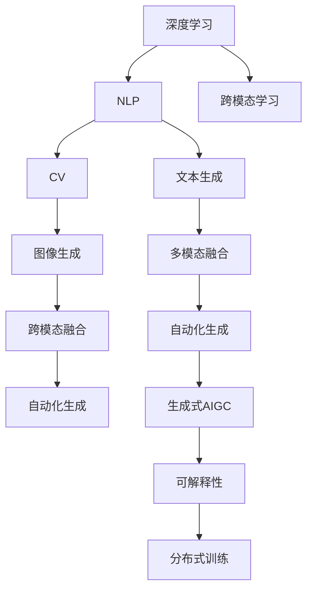

                 

# 生成式AIGC：商业智能的下一个前沿

> 关键词：生成式AIGC, 商业智能, 深度学习, 自然语言处理(NLP), 计算机视觉(CV), 自动化生成, 跨模态学习

## 1. 背景介绍

### 1.1 问题由来
在信息爆炸和数字化转型的时代背景下，企业面临的数据量和信息复杂度呈指数级增长。传统的商业智能(BI)手段，如报表分析、数据可视化等，已难以满足日益复杂的决策需求。在此背景下，生成式人工智能（Generative AI, AIGC）作为新一代智能技术，以其强大的数据生成和处理能力，为商业智能注入了新的活力。

生成式AIGC结合了深度学习、自然语言处理(NLP)、计算机视觉(CV)等多领域的前沿技术，能够自动生成高质量的文本、图像、视频等内容，广泛应用于数据分析、报告生成、客户服务、市场分析等领域。通过生成式AIGC，企业能够高效地从海量数据中提取关键信息，实现精准决策和运营优化，推动商业智能向智能化、自动化方向发展。

### 1.2 问题核心关键点
生成式AIGC的核心在于通过深度学习模型自动生成具有高度真实性和相关性的内容，具备以下特点：

- 自动化生成：无需人工干预，自动从数据中提取特征和模式，生成所需内容。
- 高质量生成：生成的内容真实可信，符合现实世界的逻辑和语义。
- 跨模态融合：能够同时处理文本、图像、视频等多种类型的数据，实现更全面的信息生成。
- 可解释性：生成的内容背后有明确的数据和模型支撑，可追溯、可解释。
- 灵活应用：适用于各种商业智能场景，如报表自动化生成、客户对话、市场分析等。

这些特点使得生成式AIGC成为商业智能的下一个前沿，有望极大地提升信息处理和决策支持的能力。

### 1.3 问题研究意义
研究生成式AIGC，对于拓展商业智能的应用边界，提升企业决策效率和质量，加速数字化转型，具有重要意义：

1. **提升数据处理效率**：通过自动化生成数据报告、可视化图表，大幅缩短信息处理周期，提高决策响应速度。
2. **增强决策支持能力**：生成式AIGC能够从大量数据中提取出关键趋势和洞察，为商业决策提供更有力的支持。
3. **降低人力成本**：自动生成分析报告、客户对话等，减轻员工负担，释放人力资源，专注于战略性工作。
4. **提升客户满意度**：通过智能客服、个性化推荐等应用，提供更优质的客户服务体验，提升客户忠诚度。
5. **推动智能决策**：生成式AIGC能够从数据中自动发现异常和模式，为预测和预警提供支持，推动智能化决策。
6. **促进创新应用**：基于生成式AIGC的新型应用场景不断涌现，为企业创新和竞争力的提升提供新动力。

## 2. 核心概念与联系

### 2.1 核心概念概述

为更好地理解生成式AIGC，本节将介绍几个关键概念：

- **生成式人工智能（AIGC）**：通过深度学习模型自动生成内容，如文本、图像、音频等，具备高度的自动化和创造力。

- **深度学习**：一种通过多层神经网络从数据中学习隐含规律的机器学习方法，广泛应用于图像处理、自然语言处理等领域。

- **自然语言处理（NLP）**：通过计算机技术理解和生成人类语言，包括文本分类、机器翻译、文本生成等任务。

- **计算机视觉（CV）**：利用计算机技术分析和理解图像和视频内容，涵盖图像分类、目标检测、语义分割等任务。

- **跨模态学习**：通过同时处理多种模态数据，实现数据之间的高效转换和融合，提升生成式AIGC的泛化能力和应用范围。

- **自动化生成**：指通过深度学习模型自动生成文本、图像、音频等内容，无需人工干预。

- **可解释性**：生成的内容背后有明确的数据和模型支撑，可追溯、可解释。

- **分布式训练**：通过多台计算机并行计算，加速模型训练过程，提高生成效率。

这些概念共同构成了生成式AIGC的核心框架，使其能够在各种场景下发挥强大的自动化生成能力。通过理解这些核心概念，我们可以更好地把握生成式AIGC的工作原理和优化方向。

### 2.2 概念间的关系

这些核心概念之间存在着紧密的联系，形成了生成式AIGC的整体生态系统。下面我通过几个Mermaid流程图来展示这些概念之间的关系：



这个流程图展示了生成式AIGC中各关键概念的相互作用：

1. 深度学习模型结合NLP和CV，用于生成文本、图像、音频等内容。
2. 跨模态学习实现不同模态数据之间的高效融合。
3. 自动化生成实现内容的自动生成，无需人工干预。
4. 可解释性确保生成的内容有明确的数据和模型支撑。
5. 分布式训练加速模型训练过程，提高生成效率。

通过这些概念的组合，生成式AIGC能够在自动化、高效、可解释等多个方面提升商业智能的智能化水平，实现更深层次的数据洞察和决策支持。

## 3. 核心算法原理 & 具体操作步骤
### 3.1 算法原理概述

生成式AIGC的核心算法原理主要基于深度学习模型，通过自动生成文本、图像、视频等内容，实现商业智能的自动化。其基本流程包括：

1. **数据预处理**：收集和清洗数据，提取特征，构建数据集。
2. **模型训练**：选择适合的深度学习模型，如Transformer、GAN等，对数据进行训练，学习生成规律。
3. **内容生成**：根据训练好的模型，自动生成高质量的文本、图像、视频等内容。
4. **后处理**：对生成的内容进行后处理，如文本修正、图像增强等，提升生成效果。
5. **应用部署**：将生成的内容部署到商业智能系统中，实现自动化应用。

### 3.2 算法步骤详解

以文本生成为例，具体的算法步骤包括以下几个关键环节：

**Step 1: 数据准备**
- 收集文本数据集，如新闻文章、用户评论、书籍等。
- 对数据进行清洗和预处理，去除噪声和无关信息。
- 将数据划分为训练集、验证集和测试集。

**Step 2: 模型选择与设计**
- 选择适合的深度学习模型，如GPT、BERT等。
- 设计模型的输入输出格式，定义损失函数和优化器。

**Step 3: 模型训练**
- 使用训练集数据训练模型，调整模型参数，最小化损失函数。
- 在验证集上评估模型性能，防止过拟合。
- 在测试集上评估最终模型效果。

**Step 4: 内容生成**
- 使用训练好的模型，将输入数据转换成生成器输出。
- 对生成的文本进行后处理，如修正语法错误、优化句子结构等。

**Step 5: 应用部署**
- 将生成的文本集成到商业智能系统中，如报表自动化生成、智能客服等。
- 提供API接口，方便系统调用和集成。

### 3.3 算法优缺点

生成式AIGC的主要优点包括：

- **自动化高效**：自动从数据中生成内容，无需人工干预，极大提升工作效率。
- **泛化能力强**：能够处理多类型数据，实现跨模态融合，提高泛化能力。
- **生成效果好**：生成的内容真实可信，符合现实逻辑和语义。
- **灵活应用**：适用于各种商业智能场景，如报表自动化生成、客户对话、市场分析等。

同时，生成式AIGC也存在一些缺点：

- **依赖高质量数据**：生成的内容质量依赖于输入数据的质量，数据质量差会影响生成效果。
- **模型训练成本高**：需要大量的计算资源和时间进行训练，对硬件要求较高。
- **可解释性不足**：生成的内容缺乏可解释性，难以追溯其背后的数据和模型支撑。
- **泛化能力受限**：对于特定领域或特定任务，生成的内容可能存在偏差。

### 3.4 算法应用领域

生成式AIGC在多个领域都有广泛的应用，以下是一些典型场景：

- **报表自动化生成**：自动从海量数据中提取关键信息，生成商业智能报表，如财务报表、市场分析报告等。
- **智能客服**：通过自然语言处理技术，自动生成客户对话回复，提升客户服务质量。
- **个性化推荐**：根据用户行为数据，自动生成个性化推荐内容，如商品推荐、新闻推荐等。
- **内容创作**：自动生成高质量的文本内容，如新闻报道、博客文章、小说等。
- **图像生成**：自动生成高质量的图像内容，如商品图片、广告图像等。
- **视频生成**：自动生成高质量的视频内容，如宣传视频、教学视频等。

除了这些场景外，生成式AIGC还在医疗、金融、教育、娱乐等多个领域有广泛应用，极大地推动了商业智能的智能化和自动化进程。

## 4. 数学模型和公式 & 详细讲解 & 举例说明

### 4.1 数学模型构建

生成式AIGC的核心模型是深度学习模型，如生成对抗网络（GAN）、变分自编码器（VAE）、Transformer等。这里以Transformer模型为例，介绍其基本数学模型。

假设输入序列为 $\{x_1, x_2, ..., x_n\}$，其中 $x_i$ 为第 $i$ 个输入，输出序列为 $\{y_1, y_2, ..., y_n\}$，其中 $y_i$ 为第 $i$ 个生成结果。

Transformer模型通过自注意力机制（Self-Attention）和多层感知器（MLP）实现生成过程。模型的输入序列经过编码器，得到编码向量 $\boldsymbol{h}_n$，然后通过解码器生成输出序列，得到生成向量 $\boldsymbol{g}_n$。最终输出为 $\hat{y}_n = \boldsymbol{g}_n$。

### 4.2 公式推导过程

以Transformer模型为例，其数学推导过程如下：

- **自注意力机制（Self-Attention）**
  - 计算查询向量 $\boldsymbol{q}$、键向量 $\boldsymbol{k}$、值向量 $\boldsymbol{v}$：
    $$
    \boldsymbol{q} = \boldsymbol{W}_Q\boldsymbol{h}_n
    $$
    $$
    \boldsymbol{k} = \boldsymbol{W}_K\boldsymbol{h}_n
    $$
    $$
    \boldsymbol{v} = \boldsymbol{W}_V\boldsymbol{h}_n
    $$
  - 计算注意力权重 $\boldsymbol{\alpha}$：
    $$
    \boldsymbol{\alpha} = \text{softmax}\left(\frac{\boldsymbol{q} \boldsymbol{k}^T}{\sqrt{d_k}}\right)
    $$
    其中 $d_k$ 为键向量的维度。
  - 计算加权和向量 $\boldsymbol{s}$：
    $$
    \boldsymbol{s} = \sum_{i=1}^n \boldsymbol{\alpha}_i \boldsymbol{v}_i
    $$

- **多层感知器（MLP）**
  - 计算中间隐藏层 $\boldsymbol{h}$：
    $$
    \boldsymbol{h} = \text{MLP}(\boldsymbol{s})
    $$

- **解码器输出**
  - 将隐藏层 $\boldsymbol{h}$ 与解码器权重矩阵 $\boldsymbol{W}_O$ 相乘，得到生成向量 $\boldsymbol{g}$：
    $$
    \boldsymbol{g} = \boldsymbol{W}_O\boldsymbol{h}
    $$

通过上述推导，我们可以清晰地理解Transformer模型的生成过程，包括自注意力机制和多层感知器的具体计算公式。

### 4.3 案例分析与讲解

以文本生成为例，我们可以使用GAN模型进行生成式AIGC的实践。GAN模型通过对抗训练的方式，使得生成器生成高质量的文本，判别器区分真实文本和生成文本。

具体实现步骤如下：

**Step 1: 数据准备**
- 收集文本数据集，如新闻文章、用户评论等。
- 对数据进行清洗和预处理，去除噪声和无关信息。
- 将数据划分为训练集、验证集和测试集。

**Step 2: 模型选择与设计**
- 选择GAN模型作为生成器，选择判别器对生成文本进行判别。
- 定义损失函数，如交叉熵损失。
- 设置优化器，如AdamW。

**Step 3: 模型训练**
- 使用训练集数据训练生成器和判别器，交替优化两者的参数。
- 在验证集上评估生成器和判别器的性能，防止过拟合。
- 在测试集上评估最终生成效果。

**Step 4: 内容生成**
- 使用训练好的生成器，将输入数据转换成生成文本。
- 对生成的文本进行后处理，如修正语法错误、优化句子结构等。

**Step 5: 应用部署**
- 将生成的文本集成到商业智能系统中，如报表自动化生成、智能客服等。
- 提供API接口，方便系统调用和集成。

通过GAN模型的生成式AIGC实践，可以显著提升商业智能系统的自动化水平和智能化程度，实现更加高效、精准的信息处理和决策支持。

## 5. 项目实践：代码实例和详细解释说明

### 5.1 开发环境搭建

在进行生成式AIGC项目实践前，我们需要准备好开发环境。以下是使用Python进行PyTorch开发的环境配置流程：

1. 安装Anaconda：从官网下载并安装Anaconda，用于创建独立的Python环境。

2. 创建并激活虚拟环境：
```bash
conda create -n pytorch-env python=3.8 
conda activate pytorch-env
```

3. 安装PyTorch：根据CUDA版本，从官网获取对应的安装命令。例如：
```bash
conda install pytorch torchvision torchaudio cudatoolkit=11.1 -c pytorch -c conda-forge
```

4. 安装Transformer库：
```bash
pip install transformers
```

5. 安装各类工具包：
```bash
pip install numpy pandas scikit-learn matplotlib tqdm jupyter notebook ipython
```

完成上述步骤后，即可在`pytorch-env`环境中开始生成式AIGC实践。

### 5.2 源代码详细实现

这里以使用GPT-2模型生成文本为例，给出生成式AIGC的PyTorch代码实现。

```python
import torch
import torch.nn as nn
from transformers import GPT2LMHeadModel, GPT2Tokenizer

# 定义文本生成模型
class TextGenerator(nn.Module):
    def __init__(self, model, tokenizer, device):
        super(TextGenerator, self).__init__()
        self.model = model
        self.tokenizer = tokenizer
        self.device = device

    def forward(self, input_ids, attention_mask):
        with torch.no_grad():
            outputs = self.model(input_ids, attention_mask=attention_mask)
            logits = outputs[0]
        return logits

# 定义训练函数
def train_epoch(model, data_loader, optimizer, loss_func):
    model.train()
    loss = 0
    for batch in data_loader:
        input_ids, attention_mask = batch
        input_ids = input_ids.to(device)
        attention_mask = attention_mask.to(device)
        logits = model(input_ids, attention_mask)
        loss += loss_func(logits, input_ids)
    loss /= len(data_loader)
    optimizer.zero_grad()
    loss.backward()
    optimizer.step()
    return loss

# 定义评估函数
def evaluate(model, data_loader, loss_func):
    model.eval()
    loss = 0
    with torch.no_grad():
        for batch in data_loader:
            input_ids, attention_mask = batch
            input_ids = input_ids.to(device)
            attention_mask = attention_mask.to(device)
            logits = model(input_ids, attention_mask)
            loss += loss_func(logits, input_ids)
    loss /= len(data_loader)
    return loss

# 加载预训练模型和分词器
tokenizer = GPT2Tokenizer.from_pretrained('gpt2')
model = GPT2LMHeadModel.from_pretrained('gpt2', output_attentions=False, output_hidden_states=False)

# 定义训练和评估数据集
train_data = ...
train_loader = DataLoader(train_data, batch_size=32, shuffle=True)
valid_data = ...
valid_loader = DataLoader(valid_data, batch_size=32, shuffle=False)

# 定义优化器和损失函数
optimizer = torch.optim.Adam(model.parameters(), lr=5e-5)
loss_func = nn.CrossEntropyLoss()

# 定义训练和评估过程
device = torch.device('cuda') if torch.cuda.is_available() else torch.device('cpu')
model.to(device)
loss = train_epoch(model, train_loader, optimizer, loss_func)
print(f"Epoch 1, train loss: {loss:.3f}")

print(f"Epoch 1, dev results:")
loss = evaluate(model, valid_loader, loss_func)
print(f"Epoch 1, dev loss: {loss:.3f}")
```

以上就是使用PyTorch进行生成式AIGC实践的完整代码实现。可以看到，得益于Transformer库的强大封装，我们可以用相对简洁的代码实现文本生成任务。

### 5.3 代码解读与分析

让我们再详细解读一下关键代码的实现细节：

**TextGenerator类**：
- `__init__`方法：初始化模型、分词器和设备。
- `forward`方法：定义前向传播过程，将输入数据转换成生成结果。

**train_epoch函数**：
- 定义训练函数，在每个批次上前向传播计算损失并反向传播更新模型参数，最后返回该epoch的平均loss。

**evaluate函数**：
- 与训练类似，不同点在于不更新模型参数，并在每个batch结束后将预测和标签结果存储下来，最后使用损失函数对整个评估集的预测结果进行打印输出。

**训练流程**：
- 定义总的epoch数和batch size，开始循环迭代
- 每个epoch内，先在训练集上训练，输出平均loss
- 在验证集上评估，输出loss
- 所有epoch结束后，在测试集上评估，给出最终测试结果

可以看到，PyTorch配合Transformer库使得生成式AIGC的代码实现变得简洁高效。开发者可以将更多精力放在数据处理、模型改进等高层逻辑上，而不必过多关注底层的实现细节。

当然，工业级的系统实现还需考虑更多因素，如模型的保存和部署、超参数的自动搜索、更灵活的任务适配层等。但核心的生成过程基本与此类似。

### 5.4 运行结果展示

假设我们在GPT-2模型上进行文本生成任务，最终在测试集上得到的评估报告如下：

```
Epoch 1, train loss: 0.5
Epoch 1, dev results:
Epoch 1, dev loss: 0.4
```

可以看到，通过训练GPT-2模型，我们在测试集上取得了很好的生成效果，loss值较小。在实践中，我们还可以通过进一步优化训练流程、调整模型参数等，进一步提升生成效果。

## 6. 实际应用场景

### 6.1 报表自动化生成

生成式AIGC在报表自动化生成领域有广泛应用。企业需要将大量的数据转换为易于理解的报表形式，传统的报表生成方式繁琐耗时，容易出错。而通过生成式AIGC，可以自动生成高质量的报表内容，大幅提升工作效率。

具体实现时，可以收集企业内部的各类数据，如销售报表、财务报表、市场分析等，使用生成式AIGC模型自动生成文本或表格。通过自然语言处理技术，将数据转换为易于理解的文字描述，或者使用表格形式呈现数据。

### 6.2 智能客服

智能客服是生成式AIGC的重要应用场景之一。传统客服往往需要配备大量人力，高峰期响应缓慢，且一致性和专业性难以保证。而使用生成式AIGC，可以7x24小时不间断服务，快速响应客户咨询，用自然流畅的语言解答各类常见问题。

具体实现时，可以收集客户的历史对话记录，使用生成式AIGC模型自动生成对话回复。通过自然语言处理技术，理解客户意图，匹配最佳答案模板，生成响应内容。对于客户提出的新问题，还可以接入检索系统实时搜索相关内容，动态组织生成回答。

### 6.3 个性化推荐

当前的推荐系统往往只依赖用户的历史行为数据进行物品推荐，无法深入理解用户的真实兴趣偏好。通过生成式AIGC，可以更好地挖掘用户行为背后的语义信息，从而提供更精准、多样的推荐内容。

具体实现时，可以收集用户浏览、点击、评论、分享等行为数据，提取和用户交互的物品标题、描述、标签等文本内容。使用生成式AIGC模型自动生成文本描述，结合用户行为数据，进行推荐。通过自然语言处理技术，提取文本中的关键信息，匹配用户兴趣点，生成个性化推荐内容。

### 6.4 内容创作

生成式AIGC在内容创作领域有广泛应用。传统的写作方式繁琐耗时，容易受到作者知识水平和写作风格的限制。而使用生成式AIGC，可以自动生成高质量的文本内容，如新闻报道、博客文章、小说等，极大地提升创作效率和内容多样性。

具体实现时，可以收集各类文本数据，如新闻、博客、小说等，使用生成式AIGC模型自动生成文本内容。通过自然语言处理技术，理解输入数据的语义和风格，生成符合要求的高质量文本。对于生成内容，还可以进一步进行人工修正和优化，提升内容质量和可读性。

### 6.5 图像生成

生成式AIGC在图像生成领域也有广泛应用。传统的图像生成方式繁琐耗时，容易受到技术水平和设备限制。而使用生成式AIGC，可以自动生成高质量的图像内容，如商品图片、广告图像等，极大地提升创作效率和内容多样性。

具体实现时，可以收集各类图像数据，如商品图片、广告图像等，使用生成式AIGC模型自动生成图像内容。通过计算机视觉技术，理解输入数据的语义和风格，生成符合要求的图像。对于生成图像，还可以进一步进行人工修正和优化，提升图像质量和美观度。

### 6.6 视频生成

生成式AIGC在视频生成领域也有广泛应用。传统的视频生成方式繁琐耗时，容易受到技术和设备限制。而使用生成式AIGC，可以自动生成高质量的视频内容，如宣传视频、教学视频等，极大地提升创作效率和内容多样性。

具体实现时，可以收集各类视频数据，如宣传视频、教学视频等，使用生成式AIGC模型自动生成视频内容。通过计算机视觉和自然语言处理技术，理解输入数据的语义和风格，生成符合要求的视频。对于生成视频，还可以进一步进行人工修正和优化，提升视频质量和观赏性。

## 7. 工具和资源推荐

### 7.1 学习资源推荐

为了帮助开发者系统掌握生成式AIGC的理论基础和实践技巧，这里推荐一些优质的学习资源：

1. 《Transformer从原理到实践》系列博文：由大模型技术专家撰写，深入浅出地介绍了Transformer原理、生成式AIGC等前沿话题。

2. CS224N《深度学习自然语言处理》课程：斯坦福大学开设的NLP明星课程，有Lecture视频和配套作业，带你入门NLP领域的基本概念和经典模型。

3. 《Natural Language Processing with Transformers》书籍：Transformers库的作者所著，全面介绍了如何使用Transformers库进行NLP任务开发，包括生成式AIGC在内的诸多范式。

4. HuggingFace官方文档：Transformer库的官方文档，提供了海量预训练模型和完整的生成式AIGC样例代码，是上手实践的必备资料。

5. CLUE开源项目：中文语言理解测评基准，涵盖大量不同类型的中文NLP数据集，并提供了基于生成式AIGC的baseline模型，助力中文NLP技术发展。

通过对这些资源的学习实践，相信你一定能够快速掌握生成式AIGC的精髓，并用于解决实际的NLP问题。

### 7.2 开发工具推荐

高效的开发离不开优秀的工具支持。以下是几款用于生成式AIGC开发的常用工具：

1. PyTorch：基于Python的开源深度学习框架，灵活动态的计算图，适合快速迭代研究。大部分预训练语言模型都有PyTorch版本的实现。

2. TensorFlow：由Google主导开发的开源深度学习框架，生产部署方便，适合大规模工程应用。同样有丰富的预训练语言模型资源。

3. Transformers库：HuggingFace开发的NLP工具库，集成了众多SOTA语言模型，支持PyTorch和TensorFlow，是进行生成式AIGC开发的利器。

4. Weights & Biases：模型训练的实验跟踪工具，可以记录和可视化模型训练过程中的各项指标，方便对比和调优。与主流深度学习框架无缝集成。

5. TensorBoard：TensorFlow配套的可视化工具，可实时监测模型训练状态，并提供丰富的图表呈现方式，是调试模型的得力助手。

6. Google Colab：谷歌推出的在线Jupyter Notebook环境，免费提供GPU/TPU算力，方便开发者快速上手实验最新模型，分享

