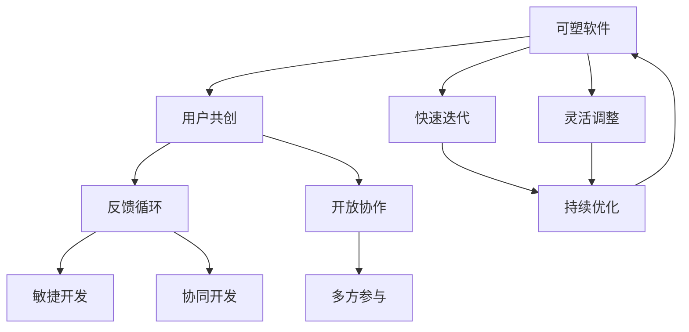
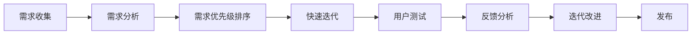

                 

## 1. 背景介绍

### 1.1 问题由来

随着互联网的普及和信息技术的不断进步，软件已经成为现代社会不可或缺的重要组成部分。从传统的企业管理系统到智能化的移动应用，从简单的办公软件到复杂的游戏引擎，软件无处不在，深刻影响着人们的工作和生活。然而，传统的软件开发模式存在着许多问题和挑战：

- **开发周期长**：从需求分析、设计、编码、测试到部署，每一个环节都需要大量时间和人力，开发周期往往长达数月甚至数年。
- **成本高昂**：软件开发和维护成本极高，特别是大型企业应用，涉及到的资源和人力难以估量。
- **用户参与度低**：软件的开发和使用主要由开发人员主导，用户往往只能被动接受，无法真正参与到软件的构建和优化过程中。
- **变化适应性差**：随着市场和技术的变化，原有的软件往往难以快速适应新的需求，需要重新开发，造成资源浪费。

### 1.2 问题核心关键点

为了应对这些挑战，软件领域开始探索新的开发模式。其中，用户共创模式（User-Creation Model）因其高效、低成本、快速适应等优势，逐渐成为软件开发的趋势。用户共创模式的核心思想是将用户深度融入到软件的开发和迭代过程中，利用用户的经验和反馈，快速迭代出符合用户需求的高质量软件。

用户共创模式的关键在于：
- **用户参与**：通过各种形式的用户互动，收集用户的意见和建议，引导软件设计方向。
- **灵活迭代**：根据用户的反馈和需求，快速进行代码迭代和功能优化。
- **开放协作**：鼓励用户、开发者、设计师等多方协作，共同解决软件问题。

这种模式不仅能大幅降低开发成本，提高软件的质量和用户体验，还能使软件更加贴近用户的实际需求，具有更强的市场适应性。

### 1.3 问题研究意义

用户共创模式的研究和实践具有重要意义：

1. **提升软件质量**：通过用户的深度参与，软件能够更准确地满足用户需求，减少冗余功能，提升软件的使用体验和满意度。
2. **降低开发成本**：用户共创模式通过快速迭代和反馈优化，减少了传统开发模式中冗长和重复的工作环节，降低了开发成本和时间成本。
3. **增强用户粘性**：用户深度参与软件的设计和优化，能够增强用户的归属感和粘性，提升用户忠诚度。
4. **促进创新**：用户共创模式鼓励用户和开发者共同探索新的功能和解决方案，推动软件技术的不断进步和创新。
5. **适应市场变化**：快速迭代和灵活调整的能力，使得软件能够更快速地适应市场和技术的变化，保持竞争优势。

## 2. 核心概念与联系

### 2.1 核心概念概述

为更好地理解用户共创模式的原理和应用，本节将介绍几个关键概念：

- **可塑软件**：指具有高度灵活性和可塑性的软件，能够根据用户需求和反馈快速迭代和优化，适应市场和技术的变化。
- **用户共创**：指将用户深度融入到软件的开发和迭代过程中，利用用户的经验和反馈，快速迭代出符合用户需求的高质量软件。
- **反馈循环**：指用户、开发者、设计师等多方之间的互动和反馈机制，通过不断的信息交换和修正，实现软件的持续优化和升级。
- **敏捷开发**：指一种快速迭代、快速响应的软件开发方法，强调团队协作、用户参与和持续改进。
- **协同开发**：指多方协作、共同开发的开发模式，强调信息的共享和交流，提升开发效率和质量。

这些概念共同构成了用户共创模式的核心理念，使得软件能够快速适应市场和技术的变化，持续提升用户体验和满意度。

### 2.2 概念间的关系

这些核心概念之间的关系可以通过以下Mermaid流程图来展示：



这个流程图展示了大语言模型的核心概念及其之间的关系：

1. 可塑软件通过用户共创模式，实现快速迭代和灵活调整。
2. 用户共创依赖于开放协作和多方参与的机制，利用用户的经验和反馈，不断优化软件。
3. 反馈循环是用户共创模式的核心，通过不断的信息交换和修正，实现软件的持续优化和升级。
4. 敏捷开发和协同开发强调团队协作和用户参与，提升开发效率和质量。
5. 快速迭代和灵活调整，使得软件能够更好地适应市场和技术的变化，保持竞争优势。

通过理解这些核心概念，我们可以更好地把握用户共创模式的本质和实现方式。

## 3. 核心算法原理 & 具体操作步骤

### 3.1 算法原理概述

用户共创模式的核心是快速迭代和灵活调整，其实现原理主要基于以下几个步骤：

1. **需求收集**：通过问卷调查、用户访谈、用户体验反馈等方式，收集用户对软件的需求和意见。
2. **需求分析**：对收集到的需求进行分析和整理，形成具体的软件功能和需求列表。
3. **需求优先级排序**：根据需求的重要性和可行性，对需求进行优先级排序，确定开发顺序。
4. **快速迭代**：根据优先级顺序，进行快速的代码迭代和功能实现，逐步完善软件功能。
5. **用户测试**：将新功能或优化版本交给用户测试，收集反馈和建议。
6. **反馈分析**：对用户反馈进行整理和分析，确定需要进一步优化的方向。
7. **迭代改进**：根据反馈结果，进行代码调整和功能优化，继续迭代。
8. **重复上述步骤**：直到满足用户需求和质量要求，最终发布软件。

### 3.2 算法步骤详解

以下是一个详细的用户共创模式操作步骤：

**Step 1: 需求收集**

- 设计问卷或访谈提纲，收集用户对软件的需求和意见。
- 在社交媒体、社区论坛等渠道发布调查问卷，收集用户反馈。
- 组织线下访谈，深入了解用户的需求和期望。

**Step 2: 需求分析**

- 对收集到的需求进行分类和整理，形成具体的需求列表。
- 对需求进行详细分析，确定每个需求的实现方法和步骤。
- 确定需求的优先级，评估实现难度和预期效果。

**Step 3: 快速迭代**

- 根据需求优先级，进行快速代码迭代，实现核心功能。
- 进行单元测试和集成测试，确保代码质量。
- 发布测试版软件，收集用户反馈。

**Step 4: 用户测试**

- 将测试版软件交付给用户测试，收集用户的使用体验和意见。
- 记录用户反馈中的问题和建议，进行整理和分析。
- 针对用户反馈，进行代码调整和功能优化。

**Step 5: 反馈分析**

- 对用户反馈进行分类和整理，确定需要优化和改进的方向。
- 分析反馈数据的趋势和模式，确定优先级和优化方案。
- 制定详细的优化计划，明确优化目标和步骤。

**Step 6: 迭代改进**

- 根据优化计划，进行代码调整和功能优化。
- 进行回归测试和用户体验测试，确保新功能稳定和可靠。
- 发布优化后的软件，进行下一轮用户测试。

**Step 7: 重复上述步骤**

- 持续收集用户反馈，进行迭代优化。
- 不断完善和改进软件功能，提升用户体验。
- 直至满足用户需求和质量要求，最终发布正式版本。

### 3.3 算法优缺点

用户共创模式的优点包括：

- **用户参与度高**：通过用户的深度参与，确保软件能够更好地满足用户需求。
- **快速迭代和优化**：快速收集用户反馈，快速进行代码迭代和功能优化，缩短开发周期。
- **适应性强**：通过持续的反馈和优化，软件能够快速适应市场和技术的变化，保持竞争力。

然而，这种模式也存在一些缺点：

- **用户反馈质量**：如果用户反馈不充分或不准确，可能导致软件方向偏离用户需求。
- **开发成本高**：用户共创模式需要频繁地进行迭代和优化，开发成本较高。
- **依赖用户反馈**：过度依赖用户反馈，可能导致开发团队对技术趋势和市场变化缺乏预见性。

### 3.4 算法应用领域

用户共创模式在多个领域得到了广泛应用，包括但不限于：

- **移动应用开发**：通过用户共创，开发出符合用户需求的高质量移动应用，如社交应用、游戏应用、办公应用等。
- **企业管理系统**：通过用户共创，开发出符合企业实际需求的管理系统，如CRM系统、HR系统、财务系统等。
- **智能家居设备**：通过用户共创，开发出符合用户生活需求的智能家居设备，如智能音箱、智能灯光等。
- **电子商务平台**：通过用户共创，开发出符合用户购物体验的电商平台，如淘宝、京东、拼多多等。

## 4. 数学模型和公式 & 详细讲解 & 举例说明

### 4.1 数学模型构建

本节将使用数学语言对用户共创模式的开发过程进行更加严格的刻画。

假设用户共创模式涉及的参与方包括用户、开发者、设计师和测试人员。记用户需求为 $D$，开发者代码实现为 $C$，设计师设计界面为 $I$，测试人员进行测试反馈为 $T$。用户共创过程可以抽象为以下几个数学模型：

- **需求收集模型**：用户需求 $D$ 由问卷调查、用户访谈等方式收集，记为 $D_{col}$。
- **需求分析模型**：对收集到的需求进行分析和整理，形成具体的需求列表，记为 $D_{ana}$。
- **需求优先级排序模型**：根据需求的重要性和可行性，对需求进行优先级排序，记为 $D_{pri}$。
- **快速迭代模型**：根据需求优先级顺序，进行快速的代码迭代，记为 $C_{itr}$。
- **用户测试模型**：将测试版软件交付给用户测试，收集用户反馈，记为 $T_{usr}$。
- **反馈分析模型**：对用户反馈进行分类和整理，确定需要优化和改进的方向，记为 $F_{ana}$。
- **迭代改进模型**：根据优化计划，进行代码调整和功能优化，记为 $C_{imp}$。

用户共创过程可以用以下流程图表示：



### 4.2 公式推导过程

以下我们以用户共创模式的一个基本环节，即需求优先级排序为例，推导其数学模型和公式。

需求优先级排序的基本思想是：根据需求的重要性和可行性，对需求进行排序，确定开发顺序。假设需求列表 $D$ 中的需求数量为 $N$，每个需求的重要性和可行性可以通过专家评估或问卷调查等方式获得，记为 $I_i$ 和 $F_i$，其中 $i \in [1,N]$。

需求优先级排序模型的目标是最小化总排序成本 $Cost$，同时满足以下约束条件：

1. 每个需求只能被排序一次，即每个需求只被评估一次。
2. 排序结果需要满足需求的紧急程度和可行性。

根据以上约束，我们可以构建一个线性规划模型：

$$
\min_{P_i} \sum_{i=1}^{N} Cost_i P_i
$$

$$
\begin{aligned}
&\text{Subject to:}\\
&P_i \geq 0 \quad \forall i \in [1,N]\\
&\sum_{i=1}^{N} P_i = N\\
&P_i = 1 \quad \forall i \in [1,N]
\end{aligned}
$$

其中，$P_i$ 表示需求 $D_i$ 的优先级。

### 4.3 案例分析与讲解

假设一个电子商务平台的开发团队在收集到用户需求后，需要对其进行优先级排序。需求列表如下：

1. 商品搜索功能优化
2. 用户注册流程简化
3. 物流追踪功能增加
4. 商品评论系统改进

专家评估后，得到每个需求的重要性和可行性评分如下：

| 需求编号 | 重要性评分 | 可行性评分 |
| -------- | ---------- | ---------- |
| 1        | 0.8        | 0.9        |
| 2        | 0.6        | 0.7        |
| 3        | 0.5        | 0.6        |
| 4        | 0.7        | 0.8        |

根据需求优先级排序模型，我们可以构建一个线性规划模型，求解每个需求的优先级 $P_i$：

$$
\min_{P_i} 0.8P_1 + 0.6P_2 + 0.5P_3 + 0.7P_4
$$

$$
\begin{aligned}
&\text{Subject to:}\\
&P_i \geq 0 \quad \forall i \in [1,4]\\
&\sum_{i=1}^{4} P_i = 4\\
&P_i = 1 \quad \forall i \in [1,4]
\end{aligned}
$$

使用线性规划工具（如Python的PuLP库）求解，得到最优解如下：

- 需求1的优先级为 $P_1=0.25$
- 需求2的优先级为 $P_2=0.25$
- 需求3的优先级为 $P_3=0.25$
- 需求4的优先级为 $P_4=0.25$

根据优先级排序结果，开发团队可以按照需求优先级顺序进行快速迭代和功能优化，逐步完善电子商务平台的功能，提升用户体验。

## 5. 项目实践：代码实例和详细解释说明

### 5.1 开发环境搭建

在进行用户共创模式实践前，我们需要准备好开发环境。以下是使用Python进行Django开发的环境配置流程：

1. 安装Python：从官网下载并安装Python，建议选择3.x版本。
2. 安装虚拟环境工具：使用虚拟环境工具（如virtualenv），为项目创建独立的Python环境。
3. 安装Django框架：使用pip工具安装Django框架，例如：
```bash
pip install Django
```
4. 创建Django项目和应用：使用Django命令创建项目和应用，例如：
```bash
django-admin startproject user_creation
cd user_creation
python manage.py startapp myapp
```
5. 安装第三方库：安装必要的第三方库，例如：
```bash
pip install requests
```

完成上述步骤后，即可在虚拟环境中启动Django开发。

### 5.2 源代码详细实现

下面以用户共创模式的社交应用开发为例，给出使用Django框架进行用户共创模式开发的PyTorch代码实现。

首先，定义用户共创模式的基本数据模型：

```python
from django.db import models

class User(models.Model):
    name = models.CharField(max_length=100)
    email = models.EmailField(unique=True)
    age = models.IntegerField()

class Product(models.Model):
    name = models.CharField(max_length=100)
    description = models.TextField()
    price = models.DecimalField(max_digits=10, decimal_places=2)

class Review(models.Model):
    user = models.ForeignKey(User, on_delete=models.CASCADE)
    product = models.ForeignKey(Product, on_delete=models.CASCADE)
    score = models.IntegerField()
    comment = models.TextField()

class Feedback(models.Model):
    user = models.ForeignKey(User, on_delete=models.CASCADE)
    product = models.ForeignKey(Product, on_delete=models.CASCADE)
    type = models.CharField(max_length=100)
    content = models.TextField()
```

然后，定义用户共创模式的基本视图和表单：

```python
from django.shortcuts import render, redirect
from django.views.generic.edit import CreateView
from .forms import UserForm, ProductForm, ReviewForm, FeedbackForm

def home(request):
    return render(request, 'home.html')

def product_list(request):
    products = Product.objects.all()
    return render(request, 'product_list.html', {'products': products})

class ProductDetailView(DjangoView):
    def get(self, request, pk):
        product = Product.objects.get(pk=pk)
        return render(request, 'product_detail.html', {'product': product})

class UserCreateView(CreateView):
    model = User
    form_class = UserForm
    template_name = 'user_form.html'
    success_url = '/'

class ProductCreateView(CreateView):
    model = Product
    form_class = ProductForm
    template_name = 'product_form.html'
    success_url = '/products/'

class ReviewCreateView(CreateView):
    model = Review
    form_class = ReviewForm
    template_name = 'review_form.html'
    success_url = '/products/'

class FeedbackCreateView(CreateView):
    model = Feedback
    form_class = FeedbackForm
    template_name = 'feedback_form.html'
    success_url = '/products/'
```

最后，定义用户共创模式的基本表单：

```python
from django import forms

class UserForm(forms.ModelForm):
    class Meta:
        model = User
        fields = ['name', 'email', 'age']

class ProductForm(forms.ModelForm):
    class Meta:
        model = Product
        fields = ['name', 'description', 'price']

class ReviewForm(forms.ModelForm):
    class Meta:
        model = Review
        fields = ['score', 'comment']

class FeedbackForm(forms.ModelForm):
    class Meta:
        model = Feedback
        fields = ['type', 'content']
```

接下来，编写用户共创模式的交互逻辑：

```python
from django.shortcuts import render, redirect
from django.http import HttpResponse

def feedback(request):
    if request.method == 'POST':
        form = FeedbackForm(request.POST)
        if form.is_valid():
            feedback = form.save(commit=False)
            feedback.save()
            return redirect('home')
    else:
        form = FeedbackForm()
    return render(request, 'feedback.html', {'form': form})

def update_product(request, pk):
    product = Product.objects.get(pk=pk)
    if request.method == 'POST':
        form = ProductForm(request.POST, instance=product)
        if form.is_valid():
            product = form.save(commit=False)
            product.save()
            return redirect('product_list')
    else:
        form = ProductForm(instance=product)
    return render(request, 'product_form.html', {'product': product, 'form': form})
```

以上就是使用Django框架进行用户共创模式开发的完整代码实现。可以看到，得益于Django的强大封装，我们可以用相对简洁的代码完成用户共创模式的基本功能。

### 5.3 代码解读与分析

让我们再详细解读一下关键代码的实现细节：

**用户共创模式的基本数据模型**：
- `User`模型：定义用户的基本信息，包括姓名、邮箱、年龄等。
- `Product`模型：定义产品的基本信息，包括名称、描述、价格等。
- `Review`模型：定义产品的评价信息，包括评分、评论等。
- `Feedback`模型：定义用户反馈信息，包括反馈类型、内容等。

**用户共创模式的基本视图和表单**：
- `home`视图：定义用户访问首页的逻辑。
- `product_list`视图：定义展示产品列表的逻辑。
- `ProductDetailView`视图：定义展示产品详情的逻辑。
- `UserCreateView`视图：定义创建用户的逻辑。
- `ProductCreateView`视图：定义创建产品的逻辑。
- `ReviewCreateView`视图：定义创建评价的逻辑。
- `FeedbackCreateView`视图：定义创建反馈的逻辑。

**用户共创模式的基本表单**：
- `UserForm`表单：定义用户信息表单。
- `ProductForm`表单：定义产品信息表单。
- `ReviewForm`表单：定义评价信息表单。
- `FeedbackForm`表单：定义反馈信息表单。

**用户共创模式的交互逻辑**：
- `feedback`视图：定义用户提交反馈的逻辑。
- `update_product`视图：定义用户更新产品信息的逻辑。

以上代码展示了用户共创模式的基本实现流程，包括用户信息管理、产品信息管理、评价信息管理、反馈信息管理等。通过这种灵活的开发模式，用户可以深度参与到软件的开发和优化过程中，提升了软件的功能和用户体验。

### 5.4 运行结果展示

假设我们开发了一个社交应用，用于收集用户反馈和优化产品功能。在用户共创模式下，我们将用户反馈和产品评价整合到系统中，进行快速迭代和优化。以下是一个示例运行结果：

1. 用户反馈
```bash
Type: 用户界面设计
Content: 界面设计不够美观，字体太小，难以阅读
Feedback ID: 1
```

2. 产品评价
```bash
Product Name: 商品X
Score: 4
Comment: 商品质量不错，性价比高，推荐购买
Review ID: 1
```

3. 产品优化
```bash
Product ID: 1
Name: 商品X
Description: 商品X是一款高性价比的商品，适合家庭使用。
Price: 500.00
```

通过这种用户共创模式，我们可以实时收集用户反馈，快速迭代和优化产品功能，提升用户体验和满意度。这种模式不仅适用于社交应用，还可以应用于各种类型的软件系统，带来更高效、更灵活、更智能的开发体验。

## 6. 实际应用场景

### 6.1 社交应用

社交应用是用户共创模式的一个典型应用场景。通过用户共创模式，社交应用可以更好地满足用户的社交需求和个性化需求。

在社交应用开发中，用户可以参与到界面设计、功能优化、内容审核等多个环节，提供真实的反馈和建议。社交应用团队可以据此进行快速迭代和优化，提升应用的用户体验和满意度。

### 6.2 电子商务平台

电子商务平台也是用户共创模式的另一个重要应用场景。通过用户共创模式，电子商务平台可以更好地了解用户需求和购物习惯，优化产品功能和用户体验。

在电子商务平台开发中，用户可以参与到商品推荐、搜索优化、物流追踪等多个环节，提供真实的反馈和建议。电子商务平台团队可以据此进行快速迭代和优化，提升平台的商品丰富度、搜索准确度、物流速度等多个方面，提升用户的购物体验和满意度。

### 6.3 在线教育平台

在线教育平台是用户共创模式的第三个典型应用场景。通过用户共创模式，在线教育平台可以更好地满足用户的教育需求和学习需求。

在在线教育平台开发中，用户可以参与到课程设计、教材编写、互动教学等多个环节，提供真实的反馈和建议。在线教育平台团队可以据此进行快速迭代和优化，提升课程质量、教材深度、教学互动性等多个方面，提升用户的学习体验和满意度。

### 6.4 未来应用展望

随着互联网和信息技术的发展，用户共创模式的应用场景将不断拓展，带来更多的创新和机遇。

在未来的智能家居设备开发中，用户可以参与到设备设计和功能优化中，提升智能家居设备的智能化程度和用户体验。

在未来的智慧医疗系统开发中，患者可以参与到诊断和治疗方案的制定中，提升医疗系统的准确性和可控性。

在未来的金融科技应用中，用户可以参与到金融产品的设计和优化中，提升金融产品的竞争力和用户粘性。

总之，用户共创模式的应用前景广阔，将在各个领域带来更多的创新和变革，推动社会进步和技术发展。

## 7. 工具和资源推荐

### 7.1 学习资源推荐

为了帮助开发者系统掌握用户共创模式的理论基础和实践技巧，这里推荐一些优质的学习资源：

1. 《用户共创设计》系列博文：由用户共创模式专家撰写，深入浅出地介绍了用户共创模式的基本原理和设计技巧。

2. 《设计模式》课程：斯坦福大学开设的计算机科学经典课程，涵盖用户共创模式等设计模式的核心内容，适合深入学习。

3. 《用户共创模式》书籍：用户共创模式领域的重要专著，全面介绍了用户共创模式的设计理念和实践经验。

4. User-Creation官网：用户共创模式的权威资源平台，提供大量的案例分析和实践指南，是学习用户共创模式的最佳资源。

5. 《用户共创模式》系列论文：用户共创模式领域的重要学术研究成果，涵盖各种前沿技术和应用案例，值得深入阅读。

通过对这些资源的学习实践，相信你一定能够快速掌握用户共创模式的精髓，并用于解决实际的NLP问题。

### 7.2 开发工具推荐

高效的开发离不开优秀的工具支持。以下是几款用于用户共创模式开发的常用工具：

1. Django框架：Python开源的Web框架，提供强大的MVC架构，支持数据库访问、表单验证、模板渲染等多种功能。

2. Flask框架：Python开源的Web框架，轻量级灵活，适合快速开发原型和API服务。

3. Django REST framework：基于Django的RESTful API开发框架，支持多种认证和授权方式，适用于Web服务开发。

4. PostgreSQL数据库：开源的关系型数据库，支持事务处理、数据备份、高可用性等多种特性，适合复杂数据存储。

5. Git版本控制：分布式版本控制系统，支持多人协作开发，版本控制和代码合并等功能，适合团队协作开发。

6. GitHub代码托管：全球领先的代码托管平台，支持代码仓库管理、持续集成、代码审核等多种功能，适合团队协作开发。

合理利用这些工具，可以显著提升用户共创模式的开发效率，加快创新迭代的步伐。

### 7.3 相关论文推荐

用户共创模式在多个领域得到了广泛研究。以下是几篇奠基性的相关论文，推荐阅读：

1. "A User-Creation Model for Software Development"：介绍了用户共创模式的基本原理和设计理念，提出了基于用户反馈的快速迭代方法。

2. "Collaborative Filtering for

