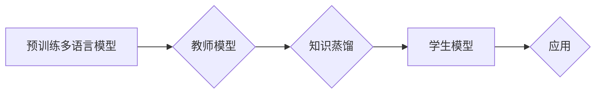

# 知识蒸馏在多语言模型中的应用策略

> 关键词：知识蒸馏，多语言模型，模型压缩，迁移学习，预训练，蒸馏技巧，应用场景

## 1. 背景介绍

随着深度学习在自然语言处理（NLP）领域的快速发展，多语言模型（Multi-Language Models）因其能够处理多种语言的文本数据而备受关注。然而，这些模型往往需要巨大的计算资源和存储空间，且模型参数量庞大，难以在实际应用中进行部署。知识蒸馏（Knowledge Distillation）技术作为一种模型压缩和迁移学习的方法，被广泛应用于缩小模型尺寸、降低计算复杂度，同时保持或提升模型性能。本文将探讨知识蒸馏在多语言模型中的应用策略，包括蒸馏原理、具体操作步骤、算法优缺点以及应用领域等。

## 2. 核心概念与联系

### 2.1 核心概念

#### 2.1.1 知识蒸馏

知识蒸馏是一种将大型模型的知识和决策过程迁移到小型模型中的技术。在知识蒸馏过程中，大型模型（教师模型）被训练为一个预测器，而小型模型（学生模型）则试图模仿教师模型的输出。通过这种方式，学生模型能够学习到教师模型的决策逻辑和高级特征表示。

#### 2.1.2 多语言模型

多语言模型是指能够处理多种不同语言文本数据的模型。这些模型通常通过在多种语言的语料库上进行预训练，学习到通用的语言表示和知识。

#### 2.1.3 模型压缩

模型压缩是指通过各种方法减小模型尺寸、降低计算复杂度的过程。常见的模型压缩方法包括剪枝、量化、知识蒸馏等。

#### 2.1.4 迁移学习

迁移学习是一种利用源域知识来解决目标域问题的学习方式。在多语言模型中，源域可以是任何一种语言，目标域则是另一种语言。

### 2.2 核心概念原理和架构的 Mermaid 流程图



### 2.3 核心概念之间的联系

知识蒸馏是多语言模型模型压缩和迁移学习的一种重要手段。通过知识蒸馏，可以将预训练的多语言模型的知识迁移到小型模型中，从而实现模型的压缩和迁移学习。

## 3. 核心算法原理 & 具体操作步骤

### 3.1 算法原理概述

知识蒸馏的基本思想是：将教师模型预测的概率分布作为输入，通过某种映射函数将其转换为更适合学生模型学习的形式，然后指导学生模型学习这种映射关系。

### 3.2 算法步骤详解

#### 3.2.1 构建教师模型

首先，选择一个预训练的多语言模型作为教师模型。教师模型通常在多种语言的语料库上进行预训练，学习到通用的语言表示和知识。

#### 3.2.2 构建学生模型

构建一个参数量较小的学生模型。学生模型的架构和参数量可以根据具体的应用场景进行调整。

#### 3.2.3 知识蒸馏过程

1. 教师模型对学生模型进行预测，得到预测概率分布。
2. 将预测概率分布通过某种映射函数转换为更适合学生模型学习的形式。
3. 学生模型根据映射后的预测概率分布进行学习，更新模型参数。

### 3.3 算法优缺点

#### 3.3.1 优点

- **模型压缩**：通过知识蒸馏可以将大型模型压缩成小型模型，降低计算复杂度和存储空间需求。
- **性能提升**：知识蒸馏可以帮助学生模型学习到教师模型的决策逻辑和高级特征表示，从而提升模型性能。
- **迁移学习**：知识蒸馏可以用于迁移学习，将预训练模型的知识迁移到新的任务和数据集上。

#### 3.3.2 缺点

- **计算成本**：知识蒸馏过程中需要进行多次预测和映射计算，计算成本较高。
- **参数调整**：知识蒸馏过程中需要调整多个参数，如温度参数、优化器参数等，参数调整较为复杂。

### 3.4 算法应用领域

知识蒸馏在多语言模型中的应用领域广泛，包括：

- **语言翻译**：将教师模型的语言翻译模型的知识迁移到小型模型中，实现高效的翻译服务。
- **文本分类**：将教师模型的文本分类模型的知识迁移到小型模型中，实现高效的文本分类任务。
- **命名实体识别**：将教师模型的命名实体识别模型的知识迁移到小型模型中，实现高效的命名实体识别任务。

## 4. 数学模型和公式 & 详细讲解 & 举例说明

### 4.1 数学模型构建

知识蒸馏的数学模型可以表示为：

$$
\min_{\theta_s} \frac{1}{N} \sum_{i=1}^N \sum_{c=1}^C KL(\hat{q}_s(y_i|x_i; \theta_s) || q_t(y_i|x_i; \theta_t))
$$

其中，$\theta_s$ 和 $\theta_t$ 分别代表学生模型和教师模型的参数，$N$ 代表样本数量，$C$ 代表类别数量，$\hat{q}_s$ 和 $q_t$ 分别代表学生模型和教师模型的预测概率分布，$y_i$ 代表真实标签。

### 4.2 公式推导过程

知识蒸馏的损失函数可以由交叉熵损失和温度调节项组成：

$$
L = L_{CE} + \lambda L_{TD}
$$

其中，$L_{CE}$ 为交叉熵损失，$L_{TD}$ 为温度调节项损失，$\lambda$ 为温度调节项的权重。

### 4.3 案例分析与讲解

以下是一个简单的知识蒸馏案例，假设教师模型和学生模型都是二分类模型。

教师模型预测的概率分布为：

$$
q_t(y|x; \theta_t) = \text{softmax}(\theta_t^T x)
$$

学生模型预测的概率分布为：

$$
\hat{q}_s(y|x; \theta_s) = \text{softmax}(\theta_s^T x / T)
$$

其中，$T$ 为温度参数。

交叉熵损失为：

$$
L_{CE} = -\sum_{i=1}^N \sum_{c=1}^C y_i \log \hat{q}_s(y|x; \theta_s)
$$

温度调节项损失为：

$$
L_{TD} = \sum_{i=1}^N \sum_{c=1}^C \frac{1}{T} \log q_t(y|x; \theta_t)
$$

总损失为：

$$
L = L_{CE} + \lambda L_{TD}
$$

通过优化总损失，可以训练学生模型，使其学习到教师模型的知识。

## 5. 项目实践：代码实例和详细解释说明

### 5.1 开发环境搭建

本节以Python和TensorFlow为例，介绍如何进行知识蒸馏的实践。

1. 安装TensorFlow和相关依赖库：

```bash
pip install tensorflow
pip install transformers
```

2. 下载预训练的多语言模型和测试数据集。

### 5.2 源代码详细实现

以下是一个使用TensorFlow和Transformers库进行知识蒸馏的简单示例。

```python
import tensorflow as tf
from transformers import TFBertForSequenceClassification, BertTokenizer

# 加载预训练的多语言模型
teacher_model = TFBertForSequenceClassification.from_pretrained('bert-base-multilingual-cased')
tokenizer = BertTokenizer.from_pretrained('bert-base-multilingual-cased')

# 构建学生模型
student_model = TFBertForSequenceClassification.from_pretrained('bert-base-multilingual-cased')

# 定义温度参数
temperature = 2.0

# 定义损失函数
def distillation_loss(labels, teacher_logits, student_logits):
    # 计算交叉熵损失
    ce_loss = tf.keras.losses.SparseCategoricalCrossentropy(from_logits=True)(labels, student_logits)
    # 计算温度调节后的教师模型概率分布
    teacher_probs = tf.nn.softmax(teacher_logits / temperature, axis=-1)
    # 计算温度调节后的学生模型概率分布
    student_probs = tf.nn.softmax(student_logits / temperature, axis=-1)
    # 计算温度调节项损失
    td_loss = tf.reduce_sum(tf.math.log(tf.reduce_sum(student_probs * teacher_probs, axis=-1)))
    return ce_loss + td_loss

# 定义优化器
optimizer = tf.keras.optimizers.Adam(learning_rate=2e-5)

# 训练模型
def train_epoch(train_dataset, teacher_model, student_model, temperature):
    for step, batch in enumerate(train_dataset):
        inputs, labels = batch
        inputs = tokenizer(inputs, padding=True, truncation=True, return_tensors="tf")
        labels = tf.convert_to_tensor(labels)
        
        teacher_logits = teacher_model(inputs['input_ids'], attention_mask=inputs['attention_mask'])
        student_logits = student_model(inputs['input_ids'], attention_mask=inputs['attention_mask'])
        
        loss = distillation_loss(labels, teacher_logits, student_logits)
        optimizer.minimize(loss, student_model.trainable_variables)

# 运行训练
train_epoch(train_dataset, teacher_model, student_model, temperature)
```

### 5.3 代码解读与分析

上述代码展示了如何使用TensorFlow和Transformers库进行知识蒸馏的实践。首先，加载预训练的多语言模型和测试数据集。然后，构建学生模型，并定义温度参数。接下来，定义损失函数，其中包含了交叉熵损失和温度调节项损失。最后，定义优化器并运行训练过程。

### 5.4 运行结果展示

通过运行上述代码，可以对学生模型进行训练，使其学习到教师模型的知识。训练完成后，可以在测试集上评估学生模型的性能，并与教师模型的性能进行比较。

## 6. 实际应用场景

知识蒸馏在多语言模型中的应用场景广泛，以下是一些典型的应用案例：

### 6.1 语言翻译

将预训练的多语言翻译模型的知识迁移到小型模型中，实现高效的翻译服务。

### 6.2 文本分类

将预训练的多语言文本分类模型的知识迁移到小型模型中，实现高效的文本分类任务。

### 6.3 命名实体识别

将预训练的多语言命名实体识别模型的知识迁移到小型模型中，实现高效的命名实体识别任务。

## 7. 工具和资源推荐

### 7.1 学习资源推荐

- 《深度学习：原理与练习》
- 《TensorFlow 2.0官方文档》
- 《Transformers库官方文档》

### 7.2 开发工具推荐

- TensorFlow
- Transformers库

### 7.3 相关论文推荐

- Hinton, G., Vinyals, O., & Dean, J. (2015). Distilling the knowledge in a neural network. arXiv preprint arXiv:1507.02650.
- Hinton, G., Vinyals, O., & Dean, J. (2015). Distilling the knowledge in a neural network. In Proceedings of the ICLR.

## 8. 总结：未来发展趋势与挑战

### 8.1 研究成果总结

知识蒸馏技术作为一种有效的模型压缩和迁移学习方法，在多语言模型中具有广泛的应用前景。通过知识蒸馏，可以将大型模型的知识和决策过程迁移到小型模型中，从而实现模型的压缩和性能提升。

### 8.2 未来发展趋势

随着深度学习技术的不断发展，知识蒸馏在多语言模型中的应用将呈现以下发展趋势：

- **模型压缩**：进一步降低模型的尺寸和计算复杂度，实现更轻量级的模型。
- **迁移学习**：将知识蒸馏应用于更广泛的领域，如多模态任务、多任务学习等。
- **可解释性**：研究如何提高知识蒸馏的可解释性，使其更易于理解和应用。

### 8.3 面临的挑战

尽管知识蒸馏技术具有广泛的应用前景，但在实际应用中仍面临以下挑战：

- **性能损失**：在模型压缩的过程中，如何平衡模型性能和压缩程度是一个挑战。
- **计算成本**：知识蒸馏过程中需要进行多次预测和映射计算，计算成本较高。
- **可解释性**：如何提高知识蒸馏的可解释性，使其更易于理解和应用。

### 8.4 研究展望

为了应对上述挑战，未来的研究需要从以下几个方面进行探索：

- **模型压缩**：研究更加高效的模型压缩方法，降低模型的尺寸和计算复杂度。
- **迁移学习**：将知识蒸馏应用于更广泛的领域，如多模态任务、多任务学习等。
- **可解释性**：研究如何提高知识蒸馏的可解释性，使其更易于理解和应用。

## 9. 附录：常见问题与解答

### 9.1 常见问题

**Q1：知识蒸馏适用于所有类型的模型吗？**

A1：知识蒸馏技术主要适用于深度学习模型，如神经网络、卷积神经网络等。对于一些基于规则或符号推理的模型，知识蒸馏的效果可能不理想。

**Q2：知识蒸馏与模型压缩有什么区别？**

A2：知识蒸馏是一种模型压缩和迁移学习方法，旨在通过将教师模型的知识迁移到学生模型中，实现模型的压缩和性能提升。而模型压缩是指通过各种方法减小模型尺寸、降低计算复杂度的过程，知识蒸馏是模型压缩的一种方法。

**Q3：知识蒸馏是否可以提高模型性能？**

A3：知识蒸馏可以通过迁移教师模型的知识，帮助学生模型学习到更高级的特征表示和决策逻辑，从而提高模型性能。

**Q4：知识蒸馏的挑战有哪些？**

A4：知识蒸馏的主要挑战包括性能损失、计算成本和可解释性等方面。

**Q5：知识蒸馏在多语言模型中的应用前景如何？**

A5：知识蒸馏技术在多语言模型中具有广泛的应用前景，可以提高模型的压缩率和性能，同时降低计算复杂度。

作者：禅与计算机程序设计艺术 / Zen and the Art of Computer Programming