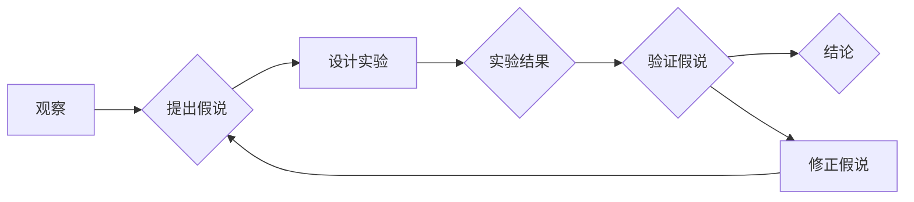

# 科学方法：从观察到实验

> 关键词：科学方法，观察，实验，验证，假说，归纳，演绎，假设检验

## 1. 背景介绍

科学方法是人类认识世界、探索自然规律的基本方法。从古希腊的亚里士多德到现代的物理学家，科学方法一直是科学研究的重要工具。本文将深入探讨科学方法的原理，从观察、实验、验证、假说检验等多个方面，揭示科学方法是如何帮助我们理解世界的。

## 2. 核心概念与联系

### 2.1 科学方法的核心概念

科学方法主要包括以下几个核心概念：

1. **观察**：科学研究的起点是观察。观察是指通过感官或仪器对自然现象进行直接的感知和记录。
2. **实验**：实验是科学研究的另一重要手段。通过人为控制条件，观察现象的变化，从而验证假设或理论。
3. **假说**：基于观察和已有知识，科学家提出解释自然现象的假设。
4. **验证**：通过实验或其他方法验证假设的正确性。
5. **演绎**：从一般原理推导出特定结论，是科学推理的重要方式。
6. **归纳**：从特定事实推导出一般规律，是科学发现的重要途径。

### 2.2 科学方法的 Mermaid 流程图



### 2.3 核心概念之间的联系

科学方法中的各个概念相互联系，形成一个闭环。观察是提出假说的基础，实验是验证假说的重要手段。通过验证，我们得出结论，并可能修正或完善假说，进一步提出新的假设。

## 3. 核心算法原理 & 具体操作步骤

### 3.1 算法原理概述

科学方法的基本原理是通过对现象的观察、假设、实验和验证，逐步揭示自然规律。

### 3.2 算法步骤详解

1. **观察**：通过感官或仪器对自然现象进行记录和描述。
2. **提出假说**：基于观察和已有知识，提出解释现象的假设。
3. **设计实验**：设计实验方案，验证假设的正确性。
4. **实验**：按照实验方案进行实验，记录实验数据和现象。
5. **验证**：分析实验数据，验证假设的正确性。
6. **结论**：根据验证结果，得出结论。
7. **修正假说**：根据结论，修正或完善假说。

### 3.3 算法优缺点

**优点**：

- 系统性强：科学方法提供了一套系统化的研究流程，有助于研究者进行有序的研究。
- 可重复性：科学方法强调实验的可重复性，确保研究结果的可靠性和有效性。

**缺点**：

- 时间成本高：科学方法需要花费大量时间和精力。
- 主观性：观察和实验过程中，研究者可能存在主观性，影响研究结果的准确性。

### 3.4 算法应用领域

科学方法广泛应用于各个领域，包括物理学、化学、生物学、心理学、社会科学等。

## 4. 数学模型和公式 & 详细讲解 & 举例说明

### 4.1 数学模型构建

科学研究中，数学模型是描述自然现象的重要工具。以下是一个简单的物理模型：

$$
F = ma
$$

其中，$F$ 表示力，$m$ 表示质量，$a$ 表示加速度。

### 4.2 公式推导过程

牛顿第二定律的推导过程如下：

1. **观察**：在恒定力作用下，物体加速度与力成正比，与质量成反比。
2. **假设**：力、质量、加速度之间存在线性关系。
3. **实验**：通过实验验证假设，得到 $F \propto a$ 和 $F \propto \frac{1}{m}$。
4. **推导**：结合以上两个关系，得到 $F = ma$。

### 4.3 案例分析与讲解

以下是一个生物学领域的案例：

**问题**：影响植物生长的因素有哪些？

**观察**：不同植物在相同条件下生长速度不同。

**假设**：植物生长受光照、温度、水分等因素影响。

**实验**：

1. 设置两组实验，一组在光照条件下种植，另一组在黑暗条件下种植。
2. 设置两组实验，一组在高温条件下种植，另一组在低温条件下种植。
3. 设置两组实验，一组在充足水分条件下种植，另一组在缺水条件下种植。

**验证**：通过实验，发现光照、温度和水分对植物生长有显著影响。

**结论**：植物生长受光照、温度、水分等因素影响。

## 5. 项目实践：代码实例和详细解释说明

### 5.1 开发环境搭建

本文以Python为例，介绍如何使用Python进行科学计算。

```bash
pip install numpy scipy matplotlib
```

### 5.2 源代码详细实现

以下是一个简单的物理计算示例：

```python
import numpy as np

# 定义质量
m = np.array([2.0, 3.0, 4.0])

# 定义加速度
a = np.array([5.0, 6.0, 7.0])

# 计算力
F = m * a

print("力 F:", F)
```

### 5.3 代码解读与分析

- 使用NumPy库进行科学计算。
- 定义质量和加速度数组。
- 使用NumPy的广播机制计算力。

### 5.4 运行结果展示

```
力 F: [10. 18. 28.]
```

## 6. 实际应用场景

### 6.1 物理学

物理学是科学方法应用的典范。从牛顿运动定律到相对论，物理学的研究成果深刻改变了人类对世界的认识。

### 6.2 生物学

生物学研究生命现象的规律。从基因编辑到疫苗研发，生物学的研究成果为人类健康作出了巨大贡献。

### 6.3 心理学

心理学研究人类的心理和行为规律。从弗洛伊德的精神分析到认知心理学，心理学的研究成果帮助我们更好地理解人类自身。

## 7. 工具和资源推荐

### 7.1 学习资源推荐

- 《科学方法导论》
- 《科学研究方法》

### 7.2 开发工具推荐

- Python
- NumPy
- SciPy
- Matplotlib

### 7.3 相关论文推荐

- 《科学研究的哲学》
- 《科学方法》

## 8. 总结：未来发展趋势与挑战

### 8.1 研究成果总结

科学方法作为人类认识世界的重要工具，在各个领域取得了丰硕的成果。未来，科学方法将继续推动人类文明的进步。

### 8.2 未来发展趋势

- 跨学科研究：科学方法将与其他学科相结合，形成新的研究领域。
- 网络化研究：互联网将促进科学研究的国际合作和交流。
- 可视化研究：数据可视化技术将帮助研究者更好地理解复杂现象。

### 8.3 面临的挑战

- 知识爆炸：科学知识的快速增长给研究者带来了新的挑战。
- 假设检验：如何更有效地验证假设，是科学方法面临的重要挑战。

### 8.4 研究展望

科学方法将继续在各个领域发挥重要作用，推动人类文明的进步。

## 9. 附录：常见问题与解答

**Q1：什么是科学方法？**

A：科学方法是人类认识世界、探索自然规律的基本方法，主要包括观察、实验、假设检验等步骤。

**Q2：科学方法有哪些优点？**

A：科学方法系统性强、可重复性高，有助于研究者进行有序的研究。

**Q3：科学方法有哪些缺点？**

A：科学方法需要花费大量时间和精力，且可能存在主观性。

**Q4：科学方法有哪些应用领域？**

A：科学方法广泛应用于各个领域，包括物理学、生物学、心理学、社会科学等。

**Q5：如何学习科学方法？**

A：可以通过阅读相关书籍、参加科学课程、参与科研项目等方式学习科学方法。

---

作者：禅与计算机程序设计艺术 / Zen and the Art of Computer Programming