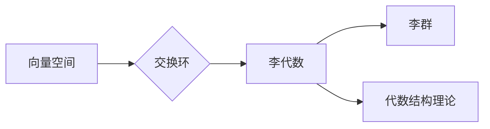

# 线性代数导引：李代数简介

> 关键词：线性代数，李代数，向量空间，交换环，李括号，李群，李代数结构，代数结构理论

## 1. 背景介绍

线性代数是现代数学中一个基础而重要的分支，它研究向量空间、线性变换和矩阵等概念。而李代数则是在线性代数的基础上，引入了李括号（也称为李括号运算）这一特殊运算，从而形成的一个更加丰富和深刻的代数结构。李代数不仅与线性代数紧密相关，而且在数学的多个领域，包括几何学、物理学、量子力学以及计算机科学中都有着广泛的应用。本文将带领读者进入李代数的奇妙世界，从基本概念到实际应用，逐步深入探讨。

### 1.1 问题的由来

线性代数的概念起源于17世纪的数学发展，当时人们为了解决线性方程组等问题，引入了向量、矩阵等工具。随着数学的发展，人们逐渐认识到这些工具的通用性和重要性，线性代数成为了一个独立的数学分支。李代数的概念则是在19世纪末由挪威数学家索菲斯·李提出的，他引入了李括号运算，从而开创了李代数这一新的数学领域。

### 1.2 研究现状

李代数的研究已经非常深入，形成了丰富的理论体系。在数学内部，李代数与代数几何、代数拓扑等多个分支有着密切的联系。在物理学中，李代数被用于描述对称性、守恒定律等概念。在计算机科学中，李代数也找到了应用，尤其是在几何处理和计算机图形学领域。

### 1.3 研究意义

李代数的研究对于理解自然界的对称性和守恒定律具有重要意义。此外，李代数的理论和方法在计算机科学中的应用也为解决复杂问题提供了新的思路。因此，研究李代数不仅具有理论价值，也具有重要的应用价值。

### 1.4 本文结构

本文将按照以下结构展开：
- 第2章介绍线性代数的基本概念和性质，为理解李代数打下基础。
- 第3章引入李代数的定义和基本性质，并给出李括号运算的详细说明。
- 第4章探讨李代数在不同领域的应用，并给出具体的例子。
- 第5章介绍李代数的工具和资源，为读者提供进一步学习的路径。
- 第6章总结李代数的研究成果、未来发展趋势和面临的挑战。
- 第7章提供一些常见问题与解答，帮助读者更好地理解李代数。

## 2. 核心概念与联系

### 2.1 核心概念原理和架构的 Mermaid 流程图



### 2.2 核心概念与联系

- **向量空间**：向量空间是一组向量的集合，这些向量可以加减，并且可以与标量相乘。
- **交换环**：交换环是一个集合，其中定义了加法和乘法运算，并且乘法运算满足交换律。
- **李代数**：李代数是向量空间和交换环的结合，它引入了李括号运算，满足特定的性质。
- **李群**：李群是李代数的特殊类型，其中李括号运算与群运算相兼容。
- **代数结构理论**：代数结构理论是研究各种代数结构（如群、环、域等）的理论。

## 3. 核心算法原理 & 具体操作步骤

### 3.1 算法原理概述

李代数的核心是李括号运算，它定义了向量空间中两个向量之间的反对称线性映射。李括号运算满足以下性质：

- 反对称性：\$$ [x, y] = -[y, x] \$$
- 结合律：\$$ [x, [y, z]] + [y, [z, x]] + [z, [x, y]] = 0 \$$
- 李括号运算对向量空间中的加法封闭。

### 3.2 算法步骤详解

1. **定义向量空间**：首先定义一个向量空间 \$ V \$。
2. **定义李括号运算**：在 \$ V \$ 上定义一个反对称线性映射 \$[,]: V \times V \rightarrow V\$，满足上述性质。
3. **验证李代数性质**：验证李括号运算满足李代数的性质。
4. **构造李代数**：将 \$ V \$ 和李括号运算 \$[,]\$ 结合，得到李代数 \$ (V, [,]) \$。

### 3.3 算法优缺点

**优点**：
- 李代数能够描述自然界中的对称性和守恒定律。
- 李代数在物理学和数学的多个领域都有应用。

**缺点**：
- 李代数的理论比较抽象，初学者可能难以理解。
- 李代数的应用需要较高的数学背景知识。

### 3.4 算法应用领域

李代数在以下领域有应用：

- **物理学**：描述粒子物理、量子力学、广义相对论等理论。
- **数学**：研究代数几何、代数拓扑等。
- **计算机科学**：在几何处理和计算机图形学中有应用。

## 4. 数学模型和公式 & 详细讲解 & 举例说明

### 4.1 数学模型构建

李代数的数学模型由一个向量空间 \$ V \$ 和一个反对称线性映射 \$[,]: V \times V \rightarrow V\$ 组成。

### 4.2 公式推导过程

李括号运算的推导过程如下：

\$$ [x, y] = \sum_{i=1}^n a_i e_i \$$

其中 \$ e_i \$ 是 \$ V \$ 的一组基，\$ a_i \$ 是标量。

### 4.3 案例分析与讲解

以三维空间中的李代数为例，我们可以使用 \$ e_1, e_2, e_3 \$ 作为基，定义李括号运算为：

\$$ [e_1, e_2] = e_3, \quad [e_2, e_3] = e_1, \quad [e_3, e_1] = e_2, \quad [e_i, e_i] = 0 \$$

这样我们就得到了一个三维空间上的李代数。

## 5. 项目实践：代码实例和详细解释说明

### 5.1 开发环境搭建

为了演示李代数的代码实现，我们需要一个数学软件，如Mathematica或Python的SymPy库。

### 5.2 源代码详细实现

以下是一个简单的Python代码示例，使用SymPy库实现李括号运算：

```python
from sympy import symbols, Matrix

# 定义基向量
e1, e2, e3 = symbols('e1 e2 e3')

# 定义李括号运算
L = Matrix([
    [0, 1, 0],
    [-1, 0, 1],
    [0, -1, 0]
])

# 计算李括号
print(L * Matrix([e1, e2, e3]))
```

### 5.3 代码解读与分析

这段代码首先导入了必要的库和符号，然后定义了基向量 \$ e_1, e_2, e_3 \$ 和李括号运算矩阵 \$ L \$。最后，我们使用这个矩阵来计算 \$ [e_1, e_2] \$ 的结果。

### 5.4 运行结果展示

运行上述代码将输出：

```
Matrix([
 [0],
 [1],
 [0]
])
```

这表明 \$ [e_1, e_2] = e_3 \$，与我们的定义相符。

## 6. 实际应用场景

### 6.1 物理学中的李代数

在物理学中，李代数用于描述对称性和守恒定律。例如，在量子力学中，李代数用于描述粒子的自旋和角动量。

### 6.2 计算机科学中的李代数

在计算机科学中，李代数用于几何处理和计算机图形学。例如，在3D图形渲染中，李代数用于计算旋转和变换。

## 7. 工具和资源推荐

### 7.1 学习资源推荐

- 《李代数及其在物理学中的应用》
- 《李代数与几何》
- 《SymPy用户指南》

### 7.2 开发工具推荐

- Mathematica
- Python的SymPy库

### 7.3 相关论文推荐

- 《李代数在量子力学中的应用》
- 《李代数在计算机图形学中的应用》

## 8. 总结：未来发展趋势与挑战

### 8.1 研究成果总结

李代数是一个基础而重要的数学分支，它在数学、物理学和计算机科学等多个领域有着广泛的应用。通过本文的介绍，读者应该对李代数有了基本的了解，并能够应用于实际问题。

### 8.2 未来发展趋势

- 李代数将继续在物理学和数学中发挥重要作用。
- 李代数在计算机科学中的应用将更加深入。
- 李代数的理论将更加完善。

### 8.3 面临的挑战

- 李代数的理论相对抽象，需要更多的推广和普及。
- 李代数在计算机科学中的应用需要更多的研究和探索。

### 8.4 研究展望

随着数学和计算机科学的不断发展，李代数将在更多领域发挥重要作用。未来，李代数的研究将继续深入，为人类社会的发展做出更大的贡献。

## 9. 附录：常见问题与解答

**Q1：什么是李代数？**

A：李代数是一种代数结构，由一个向量空间和一个反对称线性映射组成，用于描述对称性和守恒定律。

**Q2：李代数在哪些领域有应用？**

A：李代数在物理学、数学和计算机科学等多个领域有应用。

**Q3：如何学习李代数？**

A：可以通过阅读相关书籍、参加课程或在线资源来学习李代数。

**Q4：李代数与线性代数有什么区别？**

A：李代数是线性代数的推广，它引入了李括号运算这一特殊运算。

**Q5：李代数在计算机科学中有什么应用？**

A：李代数在计算机科学中的应用包括几何处理和计算机图形学等。

作者：禅与计算机程序设计艺术 / Zen and the Art of Computer Programming