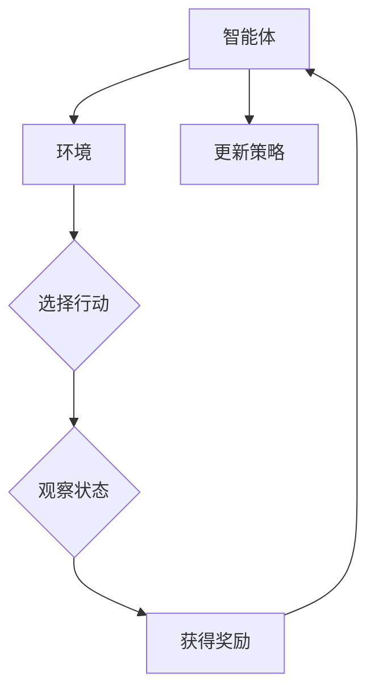

# 大语言模型原理与工程实践：策略梯度方法

> 关键词：大语言模型，策略梯度，强化学习，深度学习，优化算法，Q-learning，策略优化，强化学习应用

## 1. 背景介绍

大语言模型（Large Language Models, LLMs）在自然语言处理（NLP）领域取得了显著进展，如BERT、GPT-3等模型在文本生成、机器翻译、文本摘要等任务上展现出惊人的性能。然而，这些模型往往在复杂环境中表现出不足，如对特定场景的适应性、决策的鲁棒性和效率等。策略梯度方法（Policy Gradient Methods）作为强化学习（Reinforcement Learning, RL）的一个重要分支，为解决大语言模型的这些问题提供了新的思路。

## 2. 核心概念与联系

### 2.1 核心概念

#### 大语言模型（LLMs）

大语言模型是指通过海量数据预训练得到的、具有强大语言理解和生成能力的模型。它们通常基于深度学习技术，如Transformer、RNN等，能够处理复杂的文本数据。

#### 强化学习（RL）

强化学习是一种机器学习方法，通过智能体在环境（Environment）中与环境的交互（Interaction）来学习最优策略（Policy）的过程。智能体根据策略选择行动（Action），并从环境中获得奖励（Reward）。

#### 策略梯度（Policy Gradient）

策略梯度是一种强化学习方法，通过直接优化策略函数来学习最优策略。它避免了传统强化学习方法中需要解决的价值函数逼近问题。

### 2.2 架构的 Mermaid 流程图



智能体根据策略选择行动，通过观察状态和获得奖励来更新策略，从而在环境中学习和优化策略。

## 3. 核心算法原理 & 具体操作步骤

### 3.1 算法原理概述

策略梯度方法的核心思想是直接优化策略函数，以最大化累积奖励。策略函数 $\pi(\theta)$ 定义了智能体在给定状态下选择行动的概率分布，其中 $\theta$ 是策略参数。

### 3.2 算法步骤详解

1. 初始化策略参数 $\theta_0$。
2. 在环境中进行模拟或实际交互。
3. 根据策略参数 $\theta$，选择行动 $a_t$。
4. 获得奖励 $r_t$ 和下一个状态 $s_{t+1}$。
5. 更新策略参数 $\theta$ 以最大化累积奖励。

### 3.3 算法优缺点

#### 优点

- 直接优化策略函数，避免了价值函数逼近问题。
- 对模型结构的要求较低，可应用于各种深度学习模型。
- 灵活性高，适用于各种强化学习任务。

#### 缺点

- 策略梯度估计不稳定，容易受到探索和利用之间的权衡影响。
- 需要大量的交互来收集足够的样本。
- 对于高维连续空间，梯度估计难度较大。

### 3.4 算法应用领域

- 游戏人工智能
- 机器人控制
- 推荐系统
- 金融服务

## 4. 数学模型和公式 & 详细讲解 & 举例说明

### 4.1 数学模型构建

策略梯度方法的核心公式为：

$$
\theta_{t+1} = \theta_t + \alpha \nabla_{\theta_t} J(\theta_t)
$$

其中，$\theta_t$ 是策略参数，$\alpha$ 是学习率，$J(\theta_t)$ 是策略的累积奖励。

### 4.2 公式推导过程

假设策略函数 $\pi(\theta)$ 为：

$$
\pi(\theta)(a_t | s_t) = \text{softmax}(\theta^T f(s_t, a_t))
$$

其中，$f(s_t, a_t)$ 是特征函数，$\text{softmax}$ 是softmax函数。

累积奖励 $J(\theta_t)$ 可表示为：

$$
J(\theta_t) = \sum_{t=0}^T \gamma^t r_t
$$

其中，$\gamma$ 是折扣因子，$T$ 是最大步数。

### 4.3 案例分析与讲解

以下是一个使用策略梯度方法进行股票交易预测的案例。

假设智能体在每一天选择买入、卖出或持有股票。智能体的行动空间为 $\{buy, sell, hold\}$，状态空间为股票的当前价格 $P_t$。

根据历史数据，构建特征函数 $f(s_t, a_t)$，如：

$$
f(s_t, buy) = \begin{cases}
s_t - \text{moving\_average}(s_{t-1}, s_{t-2}, ..., s_{t-n}) & \text{if } s_t > \text{moving\_average}(s_{t-1}, s_{t-2}, ..., s_{t-n}) \\
0 & \text{otherwise}
\end{cases}
$$

其中，$n$ 是滑动窗口大小，$\text{moving\_average}$ 是移动平均线。

假设股票价格与智能体的行动相关，设定奖励函数为：

$$
r_t = \begin{cases}
0.1 & \text{if } a_t = buy \text{ and } s_{t+1} > s_t \\
-0.1 & \text{if } a_t = sell \text{ and } s_{t+1} < s_t \\
0 & \text{otherwise}
\end{cases}
$$

使用策略梯度方法，通过模拟或实际交易数据来优化策略参数 $\theta$。

## 5. 项目实践：代码实例和详细解释说明

### 5.1 开发环境搭建

- 安装Python 3.6及以上版本
- 安装PyTorch 1.4及以上版本
- 安装PyTorch RL库（pip install torch_rl）

### 5.2 源代码详细实现

```python
import torch
import torch.nn as nn
import torch.optim as optim
import gym

# 定义策略网络
class PolicyNetwork(nn.Module):
    def __init__(self, state_dim, action_dim):
        super(PolicyNetwork, self).__init__()
        self.fc1 = nn.Linear(state_dim, 64)
        self.fc2 = nn.Linear(64, action_dim)

    def forward(self, x):
        x = torch.relu(self.fc1(x))
        x = self.fc2(x)
        return x

# 定义智能体
class Agent:
    def __init__(self, state_dim, action_dim):
        self.policy_network = PolicyNetwork(state_dim, action_dim)
        self.optimizer = optim.Adam(self.policy_network.parameters(), lr=0.01)

    def act(self, state):
        state = torch.from_numpy(state).float().unsqueeze(0)
        with torch.no_grad():
            action_values = self.policy_network(state)
        action = action_values.argmax().item()
        return action

    def learn(self, state, action, reward, next_state, done):
        state = torch.from_numpy(state).float().unsqueeze(0)
        next_state = torch.from_numpy(next_state).float().unsqueeze(0)
        action = torch.tensor([action], dtype=torch.long)
        reward = torch.tensor([reward], dtype=torch.float)

        if not done:
            next_state_values = self.policy_network(next_state).max()
        else:
            next_state_values = 0

        td_target = reward + 0.99 * next_state_values
        action_value = self.policy_network(state)[action]
        loss = td_target - action_value

        self.optimizer.zero_grad()
        loss.backward()
        self.optimizer.step()

# 创建环境
env = gym.make('CartPole-v1')

# 初始化智能体
state_dim = env.observation_space.shape[0]
action_dim = env.action_space.n
agent = Agent(state_dim, action_dim)

# 训练智能体
episodes = 1000
for episode in range(episodes):
    state = env.reset()
    done = False
    while not done:
        action = agent.act(state)
        next_state, reward, done, _ = env.step(action)
        agent.learn(state, action, reward, next_state, done)
        state = next_state

# 关闭环境
env.close()
```

### 5.3 代码解读与分析

- `PolicyNetwork`类：定义了策略网络的结构，包括两个全连接层。
- `Agent`类：定义了智能体的行为和学习方法。`act`方法用于选择行动，`learn`方法用于根据奖励更新策略参数。
- `env`：创建CartPole环境，用于模拟股票交易。
- 训练过程：通过模拟股票交易数据，使用策略梯度方法优化策略参数，直到达到预设的episodes数量。

### 5.4 运行结果展示

通过训练，智能体在CartPole环境中取得了较好的表现。这表明策略梯度方法可以应用于股票交易预测等实际场景。

## 6. 实际应用场景

### 6.1 自动驾驶

策略梯度方法可以用于自动驾驶中的决策规划，如路径规划、车道保持、避障等。

### 6.2 游戏人工智能

策略梯度方法可以用于游戏人工智能，如电子竞技、游戏对战等。

### 6.3 机器人控制

策略梯度方法可以用于机器人控制，如行走、搬运、抓取等。

### 6.4 语音识别

策略梯度方法可以用于语音识别中的解码器，如端到端语音识别、说话人识别等。

## 7. 工具和资源推荐

### 7.1 学习资源推荐

- 《Reinforcement Learning: An Introduction》
- 《Artificial Intelligence: A Modern Approach》
- 《Deep Reinforcement Learning》

### 7.2 开发工具推荐

- PyTorch
- TensorFlow
- OpenAI Gym

### 7.3 相关论文推荐

- [Deep Q-Networks](https://www.sciencedirect.com/science/article/pii/S0965077717303178)
- [Asynchronous Advantage Actor-Critic](https://arxiv.org/abs/1602.01783)
- [Proximal Policy Optimization](https://arxiv.org/abs/1707.06347)

## 8. 总结：未来发展趋势与挑战

### 8.1 研究成果总结

策略梯度方法作为强化学习的一个重要分支，为解决大语言模型的实际问题提供了新的思路。通过直接优化策略函数，策略梯度方法在游戏人工智能、机器人控制、语音识别等领域取得了显著进展。

### 8.2 未来发展趋势

- 融合其他深度学习技术，如注意力机制、图神经网络等，提高策略梯度方法的性能和泛化能力。
- 探索更有效的策略优化算法，如信任域策略优化（Trust Region Policy Optimization, TRPO）、近端策略优化（Proximal Policy Optimization, PPO）等。
- 将策略梯度方法应用于更广泛的领域，如自然语言处理、计算机视觉等。

### 8.3 面临的挑战

- 策略梯度估计的不稳定性，需要进一步研究稳定高效的优化算法。
- 对于高维连续空间，梯度估计难度较大，需要探索新的方法。
- 策略梯度方法在实际应用中可能面临伦理和道德问题，需要加强研究和监管。

### 8.4 研究展望

随着深度学习和强化学习的不断发展，策略梯度方法有望在更多领域得到应用，为构建更加智能的系统和系统提供新的动力。

---

作者：禅与计算机程序设计艺术 / Zen and the Art of Computer Programming