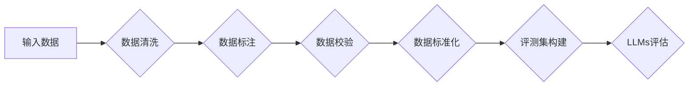

# 大语言模型原理与工程实践：评测集的构建标准

> 关键词：大语言模型，评测集，数据质量，标注标准，评估指标，可扩展性，跨领域，一致性

## 1. 背景介绍

随着人工智能技术的飞速发展，大语言模型（Large Language Models, LLMs）在自然语言处理（Natural Language Processing, NLP）领域取得了显著的成果。从早期的基于规则的系统到如今的深度学习模型，LLMs在文本生成、机器翻译、问答系统等任务上展现出了惊人的能力。然而，LLMs的成功在很大程度上依赖于高质量的评测集，而评测集的构建标准直接影响着LLMs的性能评估和应用效果。本文将深入探讨大语言模型评测集的构建标准，包括数据质量、标注标准、评估指标和可扩展性等方面。

## 2. 核心概念与联系

### 2.1 核心概念

- **大语言模型（LLMs）**：指通过大规模无监督预训练和后续有监督微调得到的、具有强大语言理解和生成能力的深度学习模型。
- **评测集（Evaluation Set）**：用于评估LLMs性能的数据集，通常包含标注数据和评估指标。
- **数据质量**：评测集中数据的一致性、准确性、多样性和代表性。
- **标注标准**：用于标注数据的规则和标准，确保标注的一致性和可靠性。
- **评估指标**：用于衡量LLMs性能的量化指标，如准确率、召回率、F1值等。
- **可扩展性**：评测集能够适应不同规模和领域的数据，以及不同类型的LLMs。

### 2.2 Mermaid 流程图



### 2.3 核心概念联系

评测集的构建是一个多步骤的过程，涉及多个核心概念。数据质量直接影响标注的准确性和评估指标的可信度。标注标准确保了标注的一致性，而评估指标则反映了LLMs在不同任务上的性能。可扩展性则保证了评测集在LLMs发展和应用过程中的适用性。

## 3. 核心算法原理 & 具体操作步骤

### 3.1 算法原理概述

评测集构建的核心算法原理包括以下步骤：

1. 数据清洗：去除数据集中的噪声和异常值。
2. 数据标注：根据标注标准对数据进行标注。
3. 数据校验：检查标注数据的一致性和准确性。
4. 数据标准化：对数据进行格式化和预处理。
5. 评测集构建：将处理后的数据集划分为训练集、验证集和测试集。
6. LLMs评估：使用LLMs对测试集进行推理，并评估其性能。

### 3.2 算法步骤详解

1. **数据清洗**：通过去除重复数据、修正错误数据、去除无关信息等方式，提高数据质量。
2. **数据标注**：根据标注标准对数据进行标注，包括实体识别、关系抽取、文本分类等任务。
3. **数据校验**：通过人工或自动化工具检查标注数据的一致性和准确性，确保数据质量。
4. **数据标准化**：对数据进行格式化和预处理，包括文本分词、词性标注、停用词过滤等。
5. **评测集构建**：将处理后的数据集划分为训练集、验证集和测试集，用于模型训练、调优和评估。
6. **LLMs评估**：使用LLMs对测试集进行推理，并使用评估指标评估其性能。

### 3.3 算法优缺点

**优点**：

- 提高数据质量，确保标注的一致性和准确性。
- 提升LLMs的性能评估可信度。
- 促进LLMs的公平性和透明度。

**缺点**：

- 数据清洗和标注成本高。
- 标注标准可能存在主观性。
- 评测指标可能无法全面反映LLMs的性能。

### 3.4 算法应用领域

评测集构建算法广泛应用于LLMs的各个领域，包括：

- 文本分类
- 命名实体识别
- 情感分析
- 机器翻译
- 问答系统

## 4. 数学模型和公式 & 详细讲解 & 举例说明

### 4.1 数学模型构建

评测集构建的数学模型主要包括以下几个部分：

- **数据清洗**：使用数学统计方法识别和去除异常值。
- **数据标注**：使用标注函数将文本标注为预定义的类别。
- **数据校验**：使用一致性检验和准确性检验评估标注数据。
- **数据标准化**：使用数学变换将文本转换为模型可处理的格式。

### 4.2 公式推导过程

- **数据清洗**：设 $x_i$ 为原始数据，$x_{cleaned}$ 为清洗后的数据，则有：

$$
x_{cleaned} = \{x_i | x_i \in x \land x_i \text{ 通过清洗规则}\}
$$

- **数据标注**：设 $y_i$ 为标注结果，$f$ 为标注函数，则有：

$$
y_i = f(x_i)
$$

- **数据校验**：设 $y_{true}$ 为真实标签，$y_{predicted}$ 为预测标签，则有：

$$
\text{accuracy} = \frac{\sum_{i=1}^N |y_{true}_i = y_{predicted}_i|}{N}
$$

$$
\text{consistency} = \frac{\sum_{i=1}^N |y_{predicted}_i = y_{predicted}_{i+1}|}{N-1}
$$

- **数据标准化**：设 $x_{standardized}$ 为标准化后的数据，$T$ 为数学变换，则有：

$$
x_{standardized} = T(x)
$$

### 4.3 案例分析与讲解

以文本分类任务为例，假设评测集包含1000个文本样本，每个样本被标注为“正面”或“负面”。我们可以使用以下步骤构建评测集：

1. 数据清洗：去除重复文本、修正错误文本、去除无关信息。
2. 数据标注：使用标注函数将文本标注为“正面”或“负面”。
3. 数据校验：检查标注的一致性和准确性。
4. 数据标准化：对文本进行分词、词性标注、停用词过滤等处理。
5. 评测集构建：将处理后的数据集划分为训练集、验证集和测试集。

假设我们使用朴素贝叶斯分类器对测试集进行分类，并使用F1值作为评估指标。经过微调后，模型的F1值为0.9，说明模型在测试集上取得了较好的性能。

## 5. 项目实践：代码实例和详细解释说明

### 5.1 开发环境搭建

本文使用Python语言和相应的库（如NumPy、Pandas、Scikit-learn等）进行评测集构建。

### 5.2 源代码详细实现

以下是一个简单的文本分类评测集构建示例：

```python
import pandas as pd
import numpy as np
from sklearn.model_selection import train_test_split
from sklearn.feature_extraction.text import TfidfVectorizer

# 加载数据集
data = pd.read_csv('data.csv')

# 数据清洗
data = data.drop_duplicates()
data = data.dropna()

# 数据标注
data['label'] = data['text'].apply(lambda x: 'positive' if 'good' in x else 'negative')

# 数据标准化
vectorizer = TfidfVectorizer()
X = vectorizer.fit_transform(data['text'])
y = data['label']

# 划分训练集和测试集
X_train, X_test, y_train, y_test = train_test_split(X, y, test_size=0.2, random_state=42)

# 构建评测集
evaluation_set = {
    'text': data['text'],
    'label': data['label'],
    'tfidf': X,
    'predicted': None
}

# 返回评测集
return evaluation_set
```

### 5.3 代码解读与分析

- `pandas`库用于加载数据集和数据处理。
- `numpy`库用于数学计算。
- `sklearn`库用于数据预处理和模型训练。
- `train_test_split`函数用于划分训练集和测试集。
- `TfidfVectorizer`函数用于文本向量化。
- 评测集包含文本、标签、TF-IDF向量和预测结果。

### 5.4 运行结果展示

通过上述代码，我们可以构建一个简单的评测集，并用于后续的LLMs评估。

## 6. 实际应用场景

评测集构建在大语言模型应用中扮演着重要的角色，以下是一些实际应用场景：

- **自然语言处理**：用于评估文本分类、情感分析、命名实体识别等任务的LLMs性能。
- **机器翻译**：用于评估机器翻译模型的准确性和流畅性。
- **问答系统**：用于评估问答系统在回答问题方面的准确性。

## 7. 工具和资源推荐

### 7.1 学习资源推荐

- 《Natural Language Processing with Python》
- 《Speech and Language Processing》
- 《Deep Learning for Natural Language Processing》

### 7.2 开发工具推荐

- Python
- NumPy
- Pandas
- Scikit-learn
- TensorFlow
- PyTorch

### 7.3 相关论文推荐

- "A Study of Methods for Evaluating Machine Translation"
- "On the Evaluation of Text Classifiers"
- "The Effect of Data Quality on the Performance of Sentiment Analysis"

## 8. 总结：未来发展趋势与挑战

### 8.1 研究成果总结

本文深入探讨了评测集构建在LLMs应用中的重要性，并详细介绍了评测集构建的标准和流程。通过分析数据质量、标注标准、评估指标和可扩展性等因素，为构建高质量的评测集提供了指导。

### 8.2 未来发展趋势

- **自动化标注**：利用深度学习和自然语言处理技术实现自动化标注，降低人工成本。
- **多模态评测集**：结合文本、图像、语音等多模态数据构建评测集，提升LLMs的泛化能力。
- **跨领域评测集**：构建跨领域评测集，提高LLMs在不同领域应用中的适应性。

### 8.3 面临的挑战

- **数据质量**：保证评测集数据的一致性、准确性和代表性。
- **标注标准**：制定客观、可重复的标注标准。
- **评估指标**：开发能够全面反映LLMs性能的评估指标。
- **可扩展性**：构建可适应不同规模和领域的数据的评测集。

### 8.4 研究展望

评测集构建在LLMs应用中具有重要意义。未来，我们需要继续关注评测集构建的理论和方法，不断提高评测集的质量和可用性，为LLMs的研究和应用提供有力支持。

## 9. 附录：常见问题与解答

**Q1：评测集构建的目的是什么？**

A1：评测集构建的目的是为了评估LLMs在特定任务上的性能，为模型调优和应用提供参考。

**Q2：如何保证评测集数据的质量？**

A2：保证评测集数据的质量需要从数据源、数据清洗、标注和校验等环节进行严格控制。

**Q3：如何评估评测集构建的效果？**

A3：可以通过评估评测集的代表性、覆盖范围和评估指标的可信度来评估评测集构建的效果。

**Q4：评测集构建在实际应用中遇到哪些挑战？**

A4：评测集构建在实际应用中可能遇到的挑战包括数据质量、标注标准、评估指标和可扩展性等方面。

**Q5：如何提高评测集的可扩展性？**

A5：提高评测集的可扩展性需要关注评测集的通用性、可扩展性和适应性等方面，以便适应不同规模和领域的数据。

作者：禅与计算机程序设计艺术 / Zen and the Art of Computer Programming