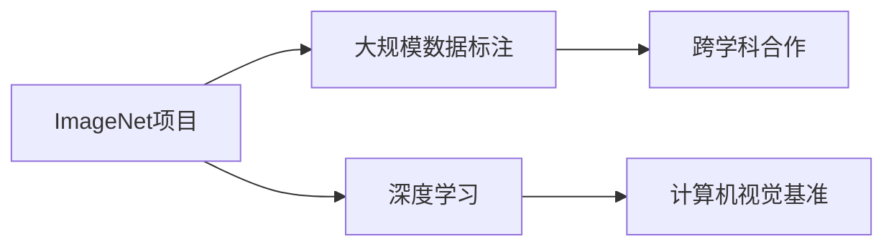

                 

# 李飞飞与ImageNet的贡献

## 1. 背景介绍

李飞飞（Fei-Fei Li）是一位在计算机视觉领域具有巨大影响力的女性科学家，现任斯坦福大学计算机科学教授，ImageNet项目的创始人之一，同时也是AI2的首席科学家。她的研究主要集中在计算机视觉、机器学习和深度学习等领域，尤其是在图像分类、语义分割、目标检测等方面取得了显著成果。

ImageNet作为全球最大的视觉识别数据库，拥有超过一百万张标注图像，涵盖了超过两万个类别。自2009年首次发布以来，ImageNet极大地推动了计算机视觉领域的进步，成为深度学习和视觉理解技术的基准。

本文将详细探讨李飞飞与ImageNet对计算机视觉和深度学习领域的贡献，以及这些工作如何塑造了当前人工智能的研究方向。

## 2. 核心概念与联系

### 2.1 核心概念概述

李飞飞与ImageNet的核心贡献可以归纳为以下几个方面：

1. **ImageNet项目**：创建并维护ImageNet数据库，推动了计算机视觉领域的快速发展。
2. **深度学习**：推动了深度学习在图像分类、语义分割等视觉任务中的广泛应用。
3. **大规模数据标注**：通过ImageNet项目，展示了大规模标注数据在提升模型性能方面的重要性。
4. **计算机视觉基准**：为计算机视觉研究提供了广泛而标准化的数据集和任务基准。
5. **跨学科合作**：促进了计算机视觉与自然语言处理、语音识别等多学科的融合。

### 2.2 核心概念间的关系

这些核心概念之间的关系可以通过以下Mermaid流程图来展示：



这个流程图展示了ImageNet项目对计算机视觉领域的影响，以及它如何通过推动深度学习的发展，提升大规模数据标注的重要性，促进跨学科合作，最终成为计算机视觉研究的基石。

## 3. 核心算法原理 & 具体操作步骤
### 3.1 算法原理概述

ImageNet项目的关键在于通过大规模的图像数据和精细的标注，训练出高质量的图像分类模型。其核心算法原理包括：

1. **大规模数据集**：ImageNet包含了超过一百万张图像，涵盖了2000多个类别，是当前世界上最大的图像数据库。
2. **精细标注**：每张图像都需要经过多个专家标注，确保标注的准确性和一致性。
3. **深度学习模型**：通过深度学习技术，在ImageNet上训练出高性能的图像分类模型。
4. **迁移学习**：利用预训练模型在ImageNet上学习的知识，对其他数据集和任务进行微调。

### 3.2 算法步骤详解

ImageNet项目的实施步骤主要包括以下几个方面：

1. **数据收集**：从互联网上收集各种类型的图像，确保数据的多样性和代表性。
2. **标注审核**：通过多个标注员对图像进行标注，确保标注的准确性。
3. **模型训练**：使用深度学习技术，在ImageNet上进行大规模模型训练。
4. **模型评估**：通过ImageNet上的验证集，评估模型的性能。
5. **数据发布**：将数据和模型公开，供全球研究者使用。

### 3.3 算法优缺点

ImageNet项目和基于ImageNet的深度学习算法具有以下优点：

1. **性能提升**：ImageNet上的大规模数据和精细标注，使得模型能够学习到更丰富的特征，提升分类精度。
2. **普适性**：ImageNet训练的模型可以迁移到其他数据集和任务，提高泛化能力。
3. **可扩展性**：ImageNet提供了广泛的类别，可以用于多种视觉任务的开发和测试。

同时，这些方法也存在一些局限性：

1. **标注成本高**：大规模数据和精细标注需要大量人力和时间，成本较高。
2. **模型泛化问题**：ImageNet上的模型在特定领域或小样本数据上的性能可能不如在ImageNet上训练的模型。
3. **数据分布问题**：ImageNet上的数据分布可能与实际应用场景不同，需要进一步调整。

### 3.4 算法应用领域

ImageNet项目和基于ImageNet的深度学习算法在以下几个领域得到了广泛应用：

1. **图像分类**：用于识别各种物体和场景，如人脸识别、车辆识别、动物识别等。
2. **语义分割**：用于对图像中的每个像素进行分类，如医学图像分割、城市景观分割等。
3. **目标检测**：用于在图像中定位和识别特定物体，如行人检测、交通标志检测等。
4. **图像生成**：用于生成逼真的图像，如GANs在图像生成中的应用。
5. **视觉问答**：用于回答基于图像的问题，如Visual Question Answering (VQA)。

## 4. 数学模型和公式 & 详细讲解 & 举例说明

### 4.1 数学模型构建

ImageNet上的图像分类任务可以表示为一个分类问题，即给定一个图像，预测它属于哪个类别。假设输入图像为 $x$，输出类别为 $y$，模型为 $f$，则分类任务可以表示为：

$$ y = f(x) $$

其中 $f$ 为模型参数，$x$ 为输入图像，$y$ 为分类结果。

ImageNet项目通过大规模数据集和深度学习模型，对 $f$ 进行训练，使得模型能够准确预测图像的类别。训练过程可以通过最小化损失函数 $L$ 来实现：

$$ \theta = \mathop{\arg\min}_{\theta} L(\theta) $$

其中 $\theta$ 为模型参数，$L$ 为损失函数。

### 4.2 公式推导过程

假设我们使用的是卷积神经网络（CNN）作为模型，损失函数通常为交叉熵损失函数，可以表示为：

$$ L = -\frac{1}{N} \sum_{i=1}^N \sum_{c=1}^C y_{i,c} \log p_{i,c} $$

其中 $N$ 为样本数量，$C$ 为类别数量，$y_{i,c}$ 为样本 $i$ 属于类别 $c$ 的标签，$p_{i,c}$ 为模型预测样本 $i$ 属于类别 $c$ 的概率。

### 4.3 案例分析与讲解

以AlexNet为例，AlexNet是一个经典的卷积神经网络模型，用于在ImageNet上进行图像分类。它的主要组成部分包括卷积层、池化层、全连接层等。下面简要介绍AlexNet的结构和训练过程。

#### 4.3.1 模型结构

AlexNet的模型结构如下：

```
- Input: 224x224x3 RGB图像
- Conv1: 11x11, 96个卷积核，步幅4，填充0
- MaxPooling: 2x2, 2x2
- Conv2: 5x5, 256个卷积核，步幅1，填充0
- MaxPooling: 2x2, 2x2
- Conv3: 3x3, 384个卷积核，步幅1，填充0
- MaxPooling: 2x2, 2x2
- Conv4: 3x3, 256个卷积核，步幅1，填充0
- MaxPooling: 2x2, 2x2
- Conv5: 3x3, 256个卷积核，步幅1，填充0
- MaxPooling: 2x2, 2x2
- Flatten: 将特征图展平为一维向量
- FC1: 4096个神经元，dropout
- FC2: 4096个神经元，dropout
- FC3: 1000个神经元，softmax
```

#### 4.3.2 训练过程

AlexNet的训练过程包括以下几个步骤：

1. **数据预处理**：对输入图像进行预处理，包括随机裁剪、归一化等。
2. **前向传播**：将图像输入模型，计算每个类别的概率。
3. **损失计算**：计算交叉熵损失，衡量预测结果与真实标签的差异。
4. **反向传播**：根据损失函数计算梯度，更新模型参数。
5. **优化器**：使用SGD等优化器，最小化损失函数。
6. **验证集评估**：在验证集上评估模型性能，避免过拟合。

## 5. 项目实践：代码实例和详细解释说明

### 5.1 开发环境搭建

在ImageNet上进行深度学习训练，需要安装一些必要的库和工具。以下是基本的开发环境搭建步骤：

1. **安装Python**：使用Anaconda安装Python 3.7或以上版本。
2. **安装TensorFlow**：使用pip安装TensorFlow 1.x或2.x版本。
3. **安装Keras**：使用pip安装Keras，作为TensorFlow的高级API。
4. **安装ImageNet数据集**：从ImageNet官网下载数据集，并进行本地解压。

### 5.2 源代码详细实现

以下是一个使用TensorFlow和Keras进行ImageNet图像分类的示例代码。

```python
import tensorflow as tf
from tensorflow.keras import layers
from tensorflow.keras.preprocessing.image import ImageDataGenerator

# 定义模型结构
model = tf.keras.Sequential([
    layers.Conv2D(96, (11, 11), strides=4, padding='same', activation='relu', input_shape=(224, 224, 3)),
    layers.MaxPooling2D((2, 2)),
    layers.Conv2D(256, (5, 5), strides=1, padding='same', activation='relu'),
    layers.MaxPooling2D((2, 2)),
    layers.Conv2D(384, (3, 3), strides=1, padding='same', activation='relu'),
    layers.MaxPooling2D((2, 2)),
    layers.Conv2D(256, (3, 3), strides=1, padding='same', activation='relu'),
    layers.MaxPooling2D((2, 2)),
    layers.Conv2D(256, (3, 3), strides=1, padding='same', activation='relu'),
    layers.MaxPooling2D((2, 2)),
    layers.Flatten(),
    layers.Dense(4096, activation='relu'),
    layers.Dropout(0.5),
    layers.Dense(4096, activation='relu'),
    layers.Dropout(0.5),
    layers.Dense(1000, activation='softmax')
])

# 加载数据集
train_datagen = ImageDataGenerator(
    rescale=1./255,
    shear_range=0.2,
    zoom_range=0.2,
    horizontal_flip=True)

test_datagen = ImageDataGenerator(rescale=1./255)

train_generator = train_datagen.flow_from_directory(
    'train/',
    target_size=(224, 224),
    batch_size=32,
    class_mode='categorical')

test_generator = test_datagen.flow_from_directory(
    'test/',
    target_size=(224, 224),
    batch_size=32,
    class_mode='categorical')

# 训练模型
model.compile(
    optimizer=tf.keras.optimizers.SGD(learning_rate=0.01),
    loss='categorical_crossentropy',
    metrics=['accuracy'])

model.fit(
    train_generator,
    epochs=10,
    validation_data=test_generator)
```

### 5.3 代码解读与分析

这段代码实现了AlexNet的基本结构，并使用ImageDataGenerator加载和预处理ImageNet数据集。具体步骤如下：

1. **模型定义**：使用Sequential模型定义卷积层、池化层、全连接层等，并指定激活函数、dropout等超参数。
2. **数据预处理**：使用ImageDataGenerator对图像进行预处理，包括归一化、随机裁剪等。
3. **模型编译**：指定损失函数、优化器、评估指标等，准备训练模型。
4. **模型训练**：使用fit方法对模型进行训练，并在验证集上评估性能。

### 5.4 运行结果展示

训练结束后，可以计算模型在测试集上的准确率：

```python
test_loss, test_acc = model.evaluate(test_generator)
print('Test accuracy:', test_acc)
```

## 6. 实际应用场景

ImageNet项目和基于ImageNet的深度学习算法在多个领域得到了广泛应用。以下是几个典型应用场景：

### 6.1 图像分类

在医疗影像分析中，医生可以使用ImageNet训练的图像分类模型，自动识别和分类各种类型的病变。例如，使用ImageNet上的皮肤病变图像数据集，训练出皮肤癌分类模型，帮助医生快速诊断皮肤癌病变。

### 6.2 语义分割

在自动驾驶中，需要实时对道路场景进行语义分割，以识别各种道路标志、行人、车辆等。ImageNet训练的语义分割模型可以用于识别和分割道路上的各种物体，提高自动驾驶系统的安全性。

### 6.3 目标检测

在视频监控中，需要实时检测和识别各种物体，如行人、车辆、危险品等。ImageNet训练的目标检测模型可以用于实时检测和识别视频中的物体，提高监控系统的效率和精度。

## 7. 工具和资源推荐

### 7.1 学习资源推荐

以下是一些推荐的学习资源：

1. **Coursera《机器学习》课程**：由斯坦福大学Andrew Ng教授主讲，介绍机器学习的基本概念和算法。
2. **深度学习基础**：由CS231n深度视觉学习课程提供，介绍了深度学习在计算机视觉中的应用。
3. **Python深度学习**：由François Chollet（Keras作者）撰写，介绍深度学习的Python实现。
4. **ImageNet数据集**：ImageNet官网提供了大量标注数据和预训练模型，方便研究者下载和使用。
5. **Deep Learning Specialization**：由Coursera提供，Andrew Ng教授主讲的深度学习系列课程，涵盖从基础到高级的内容。

### 7.2 开发工具推荐

以下是一些推荐的开发工具：

1. **TensorFlow**：由Google开发，支持分布式计算和GPU加速，适合大规模深度学习模型的训练。
2. **Keras**：作为TensorFlow的高级API，提供了更简洁的接口，方便模型开发和训练。
3. **PyTorch**：由Facebook开发，支持动态计算图和GPU加速，适合快速迭代研究。
4. **Caffe**：由伯克利大学开发，支持GPU加速，适合图像识别和分类任务。
5. **MXNet**：由Apache开发，支持多种编程语言和分布式计算，适合大规模深度学习模型的训练和推理。

### 7.3 相关论文推荐

以下是一些推荐的相关论文：

1. **ImageNet Classification with Deep Convolutional Neural Networks**：由AlexNet论文作者提出，展示了深度卷积神经网络在图像分类任务上的显著性能提升。
2. **Very Deep Convolutional Networks for Large-Scale Image Recognition**：由VGGNet提出，展示了深层卷积神经网络在图像分类任务上的强大性能。
3. **Inception-Net and the Inception Blocks**：由InceptionNet提出，展示了多尺度卷积和并行网络在图像分类任务上的出色表现。
4. **Rethinking the Inception Architecture for Computer Vision**：由Google Inception团队提出，展示了GoogleNet在图像分类任务上的优异性能。

## 8. 总结：未来发展趋势与挑战

### 8.1 研究成果总结

ImageNet项目和基于ImageNet的深度学习算法在计算机视觉和深度学习领域取得了重要进展，推动了人工智能技术的快速发展。这些研究成果主要包括以下几个方面：

1. **大规模数据集**：ImageNet数据库的创建，为深度学习模型的训练提供了丰富的数据资源。
2. **深度学习模型**：通过在ImageNet上训练的深度学习模型，推动了图像分类、语义分割、目标检测等视觉任务的突破。
3. **迁移学习**：ImageNet上训练的模型可以迁移到其他数据集和任务，提高了模型的泛化能力和应用范围。

### 8.2 未来发展趋势

ImageNet项目和深度学习算法的未来发展趋势包括：

1. **更大规模数据集**：随着计算资源和数据收集技术的进步，更大规模的数据集将成为深度学习模型训练的基础。
2. **更高级模型结构**：通过更复杂的模型结构（如Transformer），提升深度学习模型的性能和效率。
3. **跨学科融合**：计算机视觉与自然语言处理、语音识别等多学科的融合，将带来更广泛的应用场景和更强大的建模能力。
4. **实时性要求**：在实时性要求更高的场景中，如何优化模型结构和算法，提高推理速度和计算效率，是未来重要的研究方向。
5. **可解释性要求**：随着人工智能技术在更多领域的应用，可解释性将成为重要需求，需要通过改进模型结构和算法，提升模型的可解释性和透明性。

### 8.3 面临的挑战

尽管ImageNet项目和深度学习算法取得了重要进展，但在实际应用中仍然面临一些挑战：

1. **标注成本高**：大规模数据和精细标注需要大量人力和时间，成本较高。
2. **数据分布问题**：ImageNet上的数据分布可能与实际应用场景不同，需要进一步调整。
3. **模型泛化问题**：ImageNet上的模型在特定领域或小样本数据上的性能可能不如在ImageNet上训练的模型。
4. **计算资源需求高**：深度学习模型需要大量的计算资源，对硬件设备的要求较高。
5. **可解释性问题**：深度学习模型的决策过程难以解释，需要进一步提高模型的透明性和可解释性。

### 8.4 研究展望

未来，ImageNet项目和深度学习算法的研究方向将包括以下几个方面：

1. **无监督学习和自监督学习**：探索无监督学习和自监督学习的方法，降低对标注数据的依赖，提高模型的鲁棒性和泛化能力。
2. **跨模态学习**：探索跨模态学习的方法，结合视觉、语音、文本等多种模态数据，提升模型的表达能力和泛化能力。
3. **可解释性和透明性**：提高深度学习模型的透明性和可解释性，通过改进模型结构和算法，提升模型的可信度和可用性。
4. **实时性和计算效率**：优化深度学习模型的计算图和推理过程，提高模型的实时性和计算效率，满足实际应用需求。
5. **跨学科合作**：推动计算机视觉与自然语言处理、语音识别等多学科的融合，拓展深度学习的应用场景和建模能力。

总之，ImageNet项目和深度学习算法的研究，将继续引领计算机视觉和深度学习技术的发展，为人工智能技术的广泛应用提供坚实的基础。

## 9. 附录：常见问题与解答

### Q1: 什么是ImageNet项目？

A: ImageNet项目是一个大规模的图像识别数据库，由斯坦福大学计算机视觉实验室创建，包含超过一百万张图像，涵盖了超过两万个类别。它已经成为深度学习和计算机视觉领域的基准，被广泛应用于各种视觉任务的训练和评估。

### Q2: 为什么ImageNet项目对计算机视觉和深度学习如此重要？

A: ImageNet项目对计算机视觉和深度学习的重要贡献包括以下几个方面：

1. **大规模数据集**：ImageNet数据库提供了大规模的标注数据，为深度学习模型的训练提供了丰富的资源。
2. **精细标注**：ImageNet上的图像经过多个标注员标注，确保标注的准确性和一致性，提高了模型的泛化能力。
3. **高性能模型**：在ImageNet上训练的深度学习模型，取得了多项SOTA性能，推动了计算机视觉技术的发展。
4. **迁移学习**：ImageNet上训练的模型可以迁移到其他数据集和任务，提高了模型的泛化能力和应用范围。

### Q3: ImageNet项目在实际应用中遇到了哪些挑战？

A: ImageNet项目在实际应用中面临以下挑战：

1. **标注成本高**：大规模数据和精细标注需要大量人力和时间，成本较高。
2. **数据分布问题**：ImageNet上的数据分布可能与实际应用场景不同，需要进一步调整。
3. **模型泛化问题**：ImageNet上的模型在特定领域或小样本数据上的性能可能不如在ImageNet上训练的模型。
4. **计算资源需求高**：深度学习模型需要大量的计算资源，对硬件设备的要求较高。
5. **可解释性问题**：深度学习模型的决策过程难以解释，需要进一步提高模型的透明性和可解释性。

### Q4: 未来，ImageNet项目和深度学习算法的方向有哪些？

A: 未来，ImageNet项目和深度学习算法的方向包括：

1. **更大规模数据集**：随着计算资源和数据收集技术的进步，更大规模的数据集将成为深度学习模型训练的基础。
2. **更高级模型结构**：通过更复杂的模型结构（如Transformer），提升深度学习模型的性能和效率。
3. **跨学科融合**：计算机视觉与自然语言处理、语音识别等多学科的融合，将带来更广泛的应用场景和更强大的建模能力。
4. **实时性要求**：在实时性要求更高的场景中，如何优化模型结构和算法，提高推理速度和计算效率，是未来重要的研究方向。
5. **可解释性和透明性**：提高深度学习模型的透明性和可解释性，通过改进模型结构和算法，提升模型的可信度和可用性。

---

作者：禅与计算机程序设计艺术 / Zen and the Art of Computer Programming

