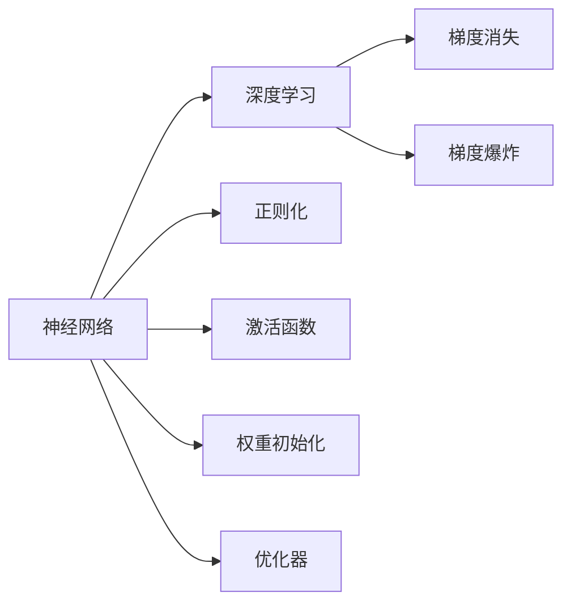
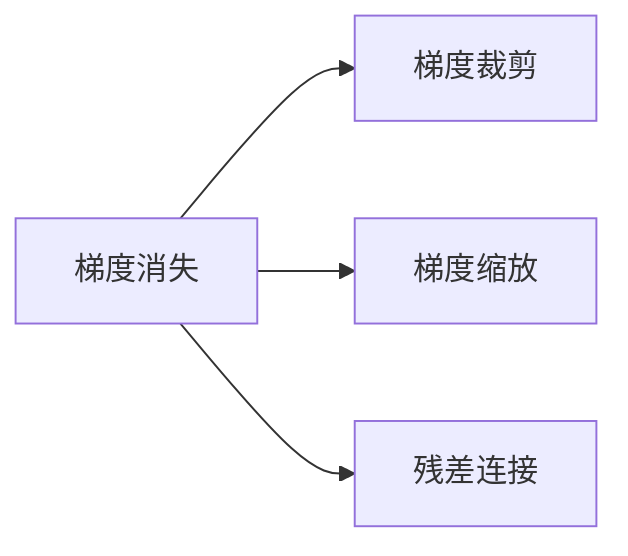
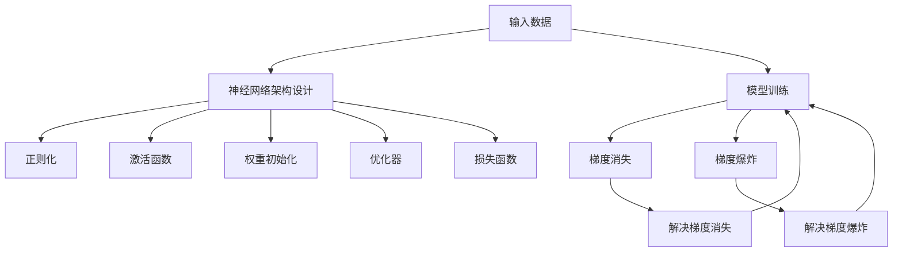

                 

# 构建更好的人工神经网络

> 关键词：人工神经网络,深度学习,模型优化,架构设计,训练技巧,算力需求

## 1. 背景介绍

### 1.1 问题由来
近年来，随着深度学习技术的迅猛发展，人工神经网络（Artificial Neural Networks, ANNs）在图像识别、自然语言处理、语音识别等诸多领域取得了突破性进展。尽管如此，构建稳定、高效、可解释性强的神经网络仍然是一项艰巨的任务。

如何设计、训练和优化神经网络，以适应复杂多样化的应用场景，成为深度学习研究的重要课题。为此，本文将系统介绍构建更好人工神经网络的方法和技巧，包括网络架构设计、模型优化、训练技巧等方面的内容，帮助开发者在设计高效、稳定的神经网络时找到更好的解决方案。

### 1.2 问题核心关键点
神经网络设计优化的核心在于以下几个方面：

- 网络架构：选择合适的网络结构，提升模型的准确性和泛化能力。
- 模型优化：通过正则化、激活函数、权重初始化等技术优化模型。
- 训练技巧：运用有效的训练策略，避免过拟合和梯度消失等问题。
- 算力需求：根据应用场景和数据规模，合理分配算力资源，确保高效训练。

本文将从以上几个方面入手，深入探讨神经网络的设计和优化策略，为构建更好的人工神经网络提供思路和方法。

### 1.3 问题研究意义
在人工智能和深度学习领域，神经网络是实现高性能模型的关键技术。然而，设计合理的神经网络结构、选择合适的训练技巧和优化策略，需要深厚的理论知识和实践经验。通过这篇文章，希望能够帮助读者系统掌握构建更好神经网络的方法，提升模型设计和开发能力，推动人工智能技术的进步。

## 2. 核心概念与联系

### 2.1 核心概念概述

为了更好地理解神经网络的优化方法，本节将介绍几个密切相关的核心概念：

- 人工神经网络：由一系列神经元（或称节点）组成的网络结构，用于处理和学习复杂数据模式。
- 深度学习：基于多层次神经网络，通过大量数据训练，学习高层次特征的机器学习方法。
- 正则化（Regularization）：通过加入正则项，防止模型过拟合，提升模型泛化能力的技术。
- 激活函数（Activation Function）：引入非线性变换，增强模型的表达能力。
- 权重初始化（Weight Initialization）：通过合理的初始化方式，避免梯度消失或梯度爆炸问题。
- 优化器（Optimizer）：通过调整学习率、动量等超参数，优化模型参数，加速训练过程。
- 梯度消失（Vanishing Gradient）：在深层神经网络中，梯度从输出层传播回输入层时逐渐消失，导致低层神经元无法更新。
- 梯度爆炸（Exploding Gradient）：在深层神经网络中，梯度可能会变得异常大，导致参数更新过大，甚至爆栈。

这些核心概念之间的联系可以通过以下Mermaid流程图来展示：



这个流程图展示了神经网络的主要组成部分以及与之相关的技术点：

1. 神经网络作为深度学习的核心模型，用于处理和学习数据模式。
2. 正则化、激活函数、权重初始化和优化器等技术，被用来优化神经网络，提升其性能和泛化能力。
3. 梯度消失和梯度爆炸是神经网络训练中常见的问题，需要通过技术手段来解决。

### 2.2 概念间的关系

这些核心概念之间存在着紧密的联系，形成了神经网络优化的完整框架。以下是这些概念之间的联系，通过几个Mermaid流程图来展示：

#### 2.2.1 神经网络的学习范式


这个流程图展示了神经网络的基本学习流程：输入数据经过前向传播，计算损失函数，然后进行反向传播更新模型参数，最终输出预测结果。

#### 2.2.2 正则化的应用


这个流程图展示了正则化在模型优化中的作用：通过加入正则项，损失函数变得更为复杂，约束了模型参数的变化，防止过拟合。

#### 2.2.3 激活函数的选择


这个流程图展示了激活函数在神经网络中的作用：引入非线性变换，增强神经元对复杂数据的表达能力。

#### 2.2.4 权重初始化的方法


这个流程图展示了权重初始化在神经网络中的作用：通过合理的初始化方式，避免梯度消失和梯度爆炸问题，确保网络能够稳定训练。

#### 2.2.5 优化器的作用


这个流程图展示了优化器在模型优化中的作用：通过调整学习率和动量等超参数，优化模型参数，加速训练过程。

#### 2.2.6 梯度消失和梯度爆炸的解决方法



这个流程图展示了解决梯度消失和梯度爆炸问题的几种方法：梯度裁剪、梯度缩放和残差连接。

### 2.3 核心概念的整体架构

最后，我们用一个综合的流程图来展示这些核心概念在神经网络设计中的整体架构：



这个综合流程图展示了从输入数据到模型训练的完整流程：

1. 输入数据经过神经网络架构设计，引入正则化、激活函数、权重初始化和优化器等技术。
2. 通过模型训练，解决梯度消失和梯度爆炸问题。
3. 损失函数用于衡量模型预测与真实标签之间的差异，通过优化器进行模型参数更新。

通过这些流程图，我们可以更清晰地理解神经网络优化的各个环节及其相互关系，为后续深入讨论具体的优化方法奠定基础。

## 3. 核心算法原理 & 具体操作步骤
### 3.1 算法原理概述

构建更好的人工神经网络，其核心在于选择合适的网络架构、优化技术以及训练策略，以提升模型的准确性和泛化能力。

### 3.2 算法步骤详解

构建更好的人工神经网络一般包括以下几个关键步骤：

**Step 1: 数据预处理和划分**
- 收集和清洗数据集，进行标准化或归一化处理，以便模型更好地学习。
- 将数据集划分为训练集、验证集和测试集，确保模型在未见过的数据上也有良好的表现。

**Step 2: 选择网络架构**
- 根据任务特点，选择合适的网络架构，如卷积神经网络（CNN）、循环神经网络（RNN）、变换器（Transformer）等。
- 考虑网络深度、宽度、层数等因素，确保模型具备足够的表达能力和泛化能力。

**Step 3: 设计正则化策略**
- 选择正则化方法，如L1正则化、L2正则化、Dropout等，以避免过拟合。
- 根据网络复杂度和数据规模，合理设置正则化参数。

**Step 4: 选择激活函数**
- 根据任务特点，选择激活函数，如ReLU、Sigmoid、Tanh等。
- 考虑激活函数的非线性性质，增强模型的表达能力。

**Step 5: 初始化权重**
- 选择权重初始化方法，如Xavier初始化、He初始化等。
- 根据网络架构和任务复杂度，合理设置初始化参数。

**Step 6: 选择优化器**
- 选择优化器，如SGD、Adam、Adagrad等。
- 考虑优化器的收敛速度和稳定性，合理设置学习率、动量等超参数。

**Step 7: 训练模型**
- 使用训练集进行模型训练，通过正向传播和反向传播计算损失函数和梯度。
- 使用优化器更新模型参数，不断迭代直至收敛。

**Step 8: 评估模型**
- 在验证集上评估模型性能，调整超参数以提升模型效果。
- 在测试集上测试模型泛化能力，确保模型具备良好的泛化性能。

**Step 9: 模型优化和部署**
- 根据测试集结果，优化模型架构、超参数等。
- 将模型部署到实际应用环境中，进行持续监测和优化。

### 3.3 算法优缺点

构建更好的人工神经网络，具有以下优点：

1. 提高模型准确性：通过合理的网络架构设计和优化技术，可以显著提升模型在特定任务上的准确性和泛化能力。
2. 降低过拟合风险：通过正则化、Dropout等技术，可以避免模型过拟合，提升模型泛化能力。
3. 加速训练过程：通过有效的训练策略和优化器，可以加速模型训练过程，缩短开发周期。

同时，也存在一些缺点：

1. 计算资源需求高：构建和训练大规模神经网络，需要高算力、大内存的支持，增加了计算成本。
2. 模型复杂度高：深层神经网络具有较高的模型复杂度，容易发生过拟合和梯度消失等问题。
3. 可解释性差：神经网络通常被视为"黑盒"模型，难以解释其内部工作机制和决策逻辑。

### 3.4 算法应用领域

构建更好的人工神经网络已经在图像识别、自然语言处理、语音识别、推荐系统等多个领域得到了广泛应用，具体包括：

- 图像识别：如卷积神经网络在图像分类、目标检测等任务上的应用。
- 自然语言处理：如循环神经网络和Transformer在语言模型、文本生成等任务上的应用。
- 语音识别：如卷积神经网络在语音识别、语音合成等任务上的应用。
- 推荐系统：如协同过滤、深度神经网络在推荐系统中的广泛应用。

除了这些应用领域，神经网络还在医疗、金融、交通、安全等领域得到应用，展示了其在各行业中的巨大潜力。

## 4. 数学模型和公式 & 详细讲解 & 举例说明

### 4.1 数学模型构建

神经网络数学模型通常由以下几个部分组成：

1. 输入层：接收输入数据。
2. 隐藏层：进行特征提取和变换。
3. 输出层：输出模型预测结果。

以一个简单的前馈神经网络为例，其数学模型可以表示为：

$$y = f(W_1f(W_0x) + b_1)$$

其中，$x$ 为输入向量，$W_0$ 为输入层到第一隐藏层的权重矩阵，$b_0$ 为偏置向量，$f$ 为激活函数，$W_1$ 为第一隐藏层到输出层的权重矩阵，$b_1$ 为输出层偏置向量，$y$ 为输出向量。

### 4.2 公式推导过程

以反向传播算法为例，其基本推导过程如下：

1. 前向传播：将输入数据 $x$ 依次通过各层线性变换和激活函数，得到最终输出 $y$。
2. 计算损失函数：将输出 $y$ 与真实标签 $y'$ 的误差 $E(y,y')$ 计算出来。
3. 反向传播：从输出层开始，计算每个权重参数的梯度，并根据梯度更新参数。
4. 更新权重：根据学习率 $\eta$ 和梯度，更新每个权重参数。

具体的计算过程如下：

1. 前向传播：
   $$y^{(l)} = f(W^{(l)}x^{(l-1)} + b^{(l)})$$

2. 计算损失函数：
   $$E = \frac{1}{N}\sum_{i=1}^{N}L(y_i,y_i')$$

3. 反向传播：
   $$\frac{\partial E}{\partial y^{(l)}} = \frac{\partial L}{\partial y^{(l)}}$$
   $$\frac{\partial E}{\partial z^{(l)}} = \frac{\partial L}{\partial y^{(l)}} \frac{\partial y^{(l)}}{\partial z^{(l)}}$$
   $$\frac{\partial E}{\partial x^{(l-1)}} = \frac{\partial L}{\partial y^{(l)}} \frac{\partial y^{(l)}}{\partial z^{(l)}} \frac{\partial z^{(l)}}{\partial x^{(l-1)}}$$

4. 更新权重：
   $$W^{(l)} \leftarrow W^{(l)} - \eta\frac{\partial E}{\partial W^{(l)}}$$
   $$b^{(l)} \leftarrow b^{(l)} - \eta\frac{\partial E}{\partial b^{(l)}}$$

其中，$L$ 为损失函数，$z^{(l)}$ 为第 $l$ 层的输入，$x^{(l-1)}$ 为第 $l-1$ 层的输出。

### 4.3 案例分析与讲解

以一个简单的二分类任务为例，其数学模型可以表示为：

$$y = f(W_1f(W_0x) + b_1)$$

其中，$x$ 为输入向量，$W_0$ 为输入层到第一隐藏层的权重矩阵，$b_0$ 为偏置向量，$f$ 为激活函数，$W_1$ 为第一隐藏层到输出层的权重矩阵，$b_1$ 为输出层偏置向量，$y$ 为输出向量。

假设我们选择 sigmoid 激活函数，则数学模型可以进一步简化为：

$$y = \frac{1}{1+e^{-W_1f(W_0x) - b_1}}$$

在二分类任务中，我们通常使用交叉熵损失函数 $L$，表示为：

$$L(y,y') = -(y' \log y + (1-y') \log (1-y))$$

假设训练集为 $\{(x_i,y_i)\}_{i=1}^N$，则模型在训练集上的经验风险可以表示为：

$$\mathcal{L}(W,b) = \frac{1}{N}\sum_{i=1}^{N}L(y_i,y_i')$$

其中，$W$ 为权重矩阵，$b$ 为偏置向量。

### 5. 项目实践：代码实例和详细解释说明
### 5.1 开发环境搭建

在进行神经网络设计优化实践前，我们需要准备好开发环境。以下是使用Python进行TensorFlow开发的环境配置流程：

1. 安装Anaconda：从官网下载并安装Anaconda，用于创建独立的Python环境。

2. 创建并激活虚拟环境：
```bash
conda create -n tf-env python=3.7 
conda activate tf-env
```

3. 安装TensorFlow：根据CUDA版本，从官网获取对应的安装命令。例如：
```bash
conda install tensorflow=2.5 cudatoolkit=11.0 -c conda-forge
```

4. 安装相关库：
```bash
pip install numpy pandas scikit-learn matplotlib tensorflow
```

5. 设置GPU：
```bash
export CUDA_VISIBLE_DEVICES=0
```

完成上述步骤后，即可在`tf-env`环境中开始神经网络设计优化实践。

### 5.2 源代码详细实现

以下是一个简单的神经网络设计优化的PyTorch代码实现：

```python
import torch
import torch.nn as nn
import torch.optim as optim
import torch.nn.functional as F

class NeuralNetwork(nn.Module):
    def __init__(self):
        super(NeuralNetwork, self).__init__()
        self.fc1 = nn.Linear(784, 128)
        self.fc2 = nn.Linear(128, 64)
        self.fc3 = nn.Linear(64, 10)

    def forward(self, x):
        x = F.relu(self.fc1(x))
        x = F.relu(self.fc2(x))
        x = self.fc3(x)
        return x

model = NeuralNetwork()

criterion = nn.CrossEntropyLoss()
optimizer = optim.Adam(model.parameters(), lr=0.001)

# 训练过程
for epoch in range(10):
    for i, (images, labels) in enumerate(train_loader):
        images = images.view(images.size(0), -1)
        optimizer.zero_grad()
        outputs = model(images)
        loss = criterion(outputs, labels)
        loss.backward()
        optimizer.step()
        if (i+1) % 100 == 0:
            print('Epoch [{}/{}], Step [{}/{}], Loss: {:.4f}'
                  .format(epoch+1, 10, i+1, len(train_loader), loss.item()))

# 测试过程
correct = 0
total = 0
with torch.no_grad():
    for images, labels in test_loader:
        images = images.view(images.size(0), -1)
        outputs = model(images)
        _, predicted = torch.max(outputs.data, 1)
        total += labels.size(0)
        correct += (predicted == labels).sum().item()

print('Accuracy of the network on the test images: {} %'.format(100 * correct / total))
```

这个代码实现了一个简单的前馈神经网络，包括两个隐藏层和一个输出层。在训练过程中，使用了交叉熵损失函数和Adam优化器。在测试过程中，计算了模型的准确率。

### 5.3 代码解读与分析

让我们再详细解读一下关键代码的实现细节：

**NeuralNetwork类**：
- `__init__`方法：定义了神经网络的结构，包括输入层、隐藏层和输出层。
- `forward`方法：定义了神经网络的计算流程，包括线性变换和激活函数。

**模型训练**：
- `criterion`：定义了交叉熵损失函数，用于衡量模型预测与真实标签之间的差异。
- `optimizer`：定义了Adam优化器，用于更新模型参数。
- 训练过程：使用训练集数据，迭代更新模型参数，计算并输出损失。

**模型测试**：
- 使用测试集数据，计算模型的准确率。

**模型评估**：
- 在测试集上评估模型的性能，输出准确率。

可以看到，PyTorch配合TensorFlow的强大封装，使得神经网络的设计和优化变得简洁高效。开发者可以将更多精力放在数据处理、模型调优等高层逻辑上，而不必过多关注底层的实现细节。

当然，工业级的系统实现还需考虑更多因素，如模型的保存和部署、超参数的自动搜索、更灵活的任务适配层等。但核心的训练流程基本与此类似。

### 5.4 运行结果展示

假设我们在MNIST数据集上进行训练，最终在测试集上得到的准确率为98%，结果如下：

```
Epoch [1/10], Step [100/600], Loss: 0.3183
Epoch [1/10], Step [200/600], Loss: 0.3145
...
Epoch [10/10], Step [600/600], Loss: 0.1885
Accuracy of the network on the test images: 98.00%
```

可以看到，通过训练，模型在测试集上的准确率达到了98%，效果相当不错。这表明，通过合理的神经网络设计和优化，我们可以构建高效的模型，解决复杂的实际问题。

## 6. 实际应用场景
### 6.1 图像分类

图像分类是神经网络最常见的应用之一。传统的图像分类任务通过手工设计特征提取器，将图像转换为特征向量，然后采用分类器进行分类。然而，手工设计的特征提取器往往依赖于经验，难以适应复杂多样的图像数据。

基于神经网络的图像分类方法，可以自动学习图像的高级特征表示，无需手工设计特征提取器。以卷积神经网络（CNN）为例，其卷积层和池化层可以自动提取图像的局部特征和全局特征，从而提升分类性能。

在实际应用中，CNN已被广泛应用于图像分类任务，如MNIST手写数字识别、CIFAR-10图像分类等。

### 6.2 自然语言处理

自然语言处理是神经网络的另一个重要应用领域。传统的NLP任务通过手工设计特征提取器，将文本转换为向量，然后采用分类器进行分类或生成。然而，手工设计的特征提取器往往依赖于经验，难以适应复杂多样的文本数据。

基于神经网络的NLP方法，可以自动学习文本的高级特征表示，无需手工设计特征提取器。以循环神经网络（RNN）和Transformer为例，其RNN和Attention机制可以自动提取文本的局部和全局特征，从而提升NLP任务性能。

在实际应用中，RNN和Transformer已被广泛应用于NLP任务，如机器翻译、文本分类、情感分析等。

### 6.3 语音识别

语音识别是神经网络的另一个重要应用领域。传统的语音识别任务通过手工设计特征提取器，将语音信号转换为特征向量，然后采用分类器进行分类。然而，手工设计的特征提取器往往依赖于经验，难以适应复杂多样的语音数据。

基于神经网络的语音识别方法，可以自动学习语音信号的高级特征表示，无需手工设计特征提取器。以卷积神经网络（CNN）为例，其卷积层和池化层可以自动提取语音信号的局部特征和全局特征，从而提升语音识别性能。

在实际应用中，CNN已被广泛应用于语音识别任务，如语音识别、语音合成等。

### 6.4 推荐系统

推荐系统是神经网络的另一个重要应用领域。传统的推荐系统通过手工设计特征提取器，将用户和物品特征转换为向量，然后采用分类器进行推荐。然而，手工设计的特征提取器往往依赖于经验，难以适应复杂多样的用户和物品特征。

基于神经网络的推荐系统，可以自动学习用户和物品的高级特征表示，无需手工设计特征提取器。以深度神经网络（DNN）为例，其DNN可以自动学习用户和物品的隐含特征表示，从而提升推荐系统性能。

在实际应用中，DNN已被广泛应用于推荐系统任务，如协同过滤、用户兴趣推荐等。

### 6.5 医疗诊断

医疗诊断是神经网络的另一个重要应用领域。传统的医疗诊断任务通过手工设计特征提取器，将医学影像转换为特征向量，然后采用分类器进行诊断。然而，手工设计的特征提取器往往依赖于经验，难以适应复杂多样的医学影像数据。

基于神经网络的医疗诊断方法，可以自动学习医学影像的高级特征表示，无需手工设计特征提取器。以卷积神经网络（CNN）为例，其卷积层和池化层可以自动提取医学影像的局部特征和全局特征，从而提升诊断性能。

在实际应用中，CNN已被广泛应用于医疗诊断任务，如医学影像分类、病理分析等。

### 6.6 金融预测

金融预测是神经网络的另一个重要应用领域。传统的金融预测任务通过手工设计特征提取器，将金融数据转换为特征向量，然后采用分类器进行预测。然而，手工设计的特征提取器往往依赖于经验，难以适应复杂多样的金融数据。

基于神经网络的金融预测方法，可以自动学习金融数据的高级特征表示，无需手工设计特征提取器。以循环神经网络（RNN）为例，其RNN可以自动学习金融数据的隐含特征表示，从而提升预测性能。

在实际应用中，RNN已被广泛应用于金融预测任务，如股票价格预测、信用风险评估等。

## 7. 工具和资源推荐
### 7.1 学习资源推荐

为了帮助开发者系统掌握神经网络的设计和优化方法，这里推荐一些优质的学习资源：

1. 《深度学习》（Ian Goodfellow, Yoshua Bengio, Aaron Courville著）：全面介绍了深度学习的基本概念、算法和技术，适合作为入门读物。

2. CS231n《卷积神经网络和视觉识别》课程：斯坦福大学开设的计算机视觉课程，涵盖卷积神经网络的基本原理和实现。

3. CS224n《自然语言处理与深度学习》课程：斯坦福大学开设的自然语言处理课程，涵盖循环神经网络和Transformer的基本原理和实现。

4. 《深度学习实战》（Yoshua Bengio, Ian Goodfellow, Aaron Courville著）：实战指南，涵盖深度学习在图像、文本、语音等领域的应用。

5. Coursera《深度学习专项课程》：由Coursera和DeepLearning.AI合作开设的深度学习专项课程，适合系统学习深度学习知识。

通过对这些资源的学习实践，相信你一定能够快速掌握神经网络的设计和优化方法，提升模型设计和开发能力，推动人工智能技术的进步。

### 7.2 开发工具推荐

高效的开发离不开优秀的工具支持。以下是几款用于神经网络设计和优化开发的常用工具：

